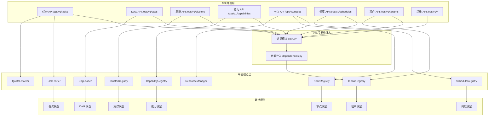

# API 参考

```cite
- [src/api/routes/tasks.py](src/api/routes/tasks.py)
- [src/api/routes/dags.py](src/api/routes/dags.py)
- [src/api/routes/clusters.py](src/api/routes/clusters.py)
- [src/api/routes/capabilities.py](src/api/routes/capabilities.py)
- [src/api/routes/nodes.py](src/api/routes/nodes.py)
- [src/api/routes/schedules.py](src/api/routes/schedules.py)
- [src/api/routes/tenants.py](src/api/routes/tenants.py)
- [src/api/routes/ops.py](src/api/routes/ops.py)
- [src/api/auth.py](src/api/auth.py)
- [src/api/dependencies.py](src/api/dependencies.py)
- [src/models/task.py](src/models/task.py)
- [src/models/dag.py](src/models/dag.py)
- [src/models/cluster.py](src/models/cluster.py)
- [src/models/capability.py](src/models/capability.py)
- [src/models/node.py](src/models/node.py)
- [src/models/schedule.py](src/models/schedule.py)
- [src/models/tenant.py](src/models/tenant.py)
```

## 引言

本文档详细说明了 Ray AMU 平台的 RESTful API 接口规范，涵盖任务管理、DAG 编排、集群管理、能力注册、节点调度、定时调度、租户管理以及运维操作等核心功能。所有 API 均遵循 REST 设计原则，使用 JSON 格式进行数据交换，并通过 HTTP 头部进行身份认证和租户上下文传递。

## 认证方式

API 使用基于 API Key 的认证机制，通过 HTTP 头部传递认证信息：

- `X-API-Key`: 租户的 API 密钥（必填，多租户模式下）
- `X-Tenant-Id`: 租户标识符（可选，用于验证 Key 归属）

在单租户模式下，系统使用环境变量 `RAY_AMU_API_KEY` 配置的全局 Key 进行认证。多租户模式下，每个租户拥有独立的 API Key，系统通过 `TenantRegistry` 验证 Key 的有效性并解析对应的租户上下文。超级管理员可使用 `super_admin_api_key` 执行跨租户管理操作。

认证失败时返回以下错误码：
- `401 Unauthorized`: API Key 无效或租户不存在
- `403 Forbidden`: API Key 与声明的租户不匹配，或租户状态非活跃

## 通用响应格式

所有 API 响应均采用 JSON 格式，成功响应返回对应的数据结构，错误响应包含以下标准字段：

```json
{
  "detail": "错误描述",
  "detail_cn": "中文错误描述",
  "detail_en": "英文错误描述",
  "errors": [
    {
      "field": "字段路径",
      "message": "字段错误消息",
      "type": "错误类型"
    }
  ],
  "path": "/api/v1/xxx"
}
```

参数校验失败（HTTP 422）时，`errors` 数组会详细列出每个字段的校验错误。

## 错误码说明

系统使用标准 HTTP 状态码表示请求结果：

- `200 OK`: 请求成功
- `201 Created`: 资源创建成功
- `204 No Content`: 删除或更新成功，无返回内容
- `400 Bad Request`: 请求参数错误或业务逻辑校验失败
- `401 Unauthorized`: 认证失败
- `403 Forbidden`: 权限不足或租户状态异常
- `404 Not Found`: 资源不存在
- `409 Conflict`: 资源冲突（如重复创建、状态不允许操作）
- `422 Unprocessable Entity`: 请求参数格式校验失败
- `423 Locked`: 资源被锁定（如任务正在执行中）
- `429 Too Many Requests`: 超出配额限制或速率限制
- `500 Internal Server Error`: 服务器内部错误
- `503 Service Unavailable`: 服务不可用（如资源不足、依赖服务异常）

## 速率限制与版本信息

API 当前版本为 `v1`，所有业务 API 路径前缀为 `/api/v1`，运维 API 路径前缀为 `/ops/v1`。速率限制通过租户配额机制实现，包括：
- 任务提交配额（`max_concurrent_tasks`）
- GPU 分配套额（`max_gpus`）
- 队列深度配额（`max_queue_depth`）
- Actor 数量配额（`max_actor_count`）

超出配额时返回 `429 Too Many Requests` 错误。

## 架构概览

API 层采用分层架构，通过依赖注入机制解耦路由逻辑与平台核心组件。路由层负责请求验证、参数解析和响应封装，业务逻辑委托给平台层的注册表和执行器。认证和租户上下文通过 FastAPI 依赖注入统一处理。



**图表来源**
- [src/api/routes/tasks.py](src/api/routes/tasks.py#l1-l50)
- [src/api/routes/dags.py](src/api/routes/dags.py#l1-l50)
- [src/api/routes/clusters.py](src/api/routes/clusters.py#l1-l50)
- [src/api/routes/capabilities.py](src/api/routes/capabilities.py#l1-l50)
- [src/api/routes/nodes.py](src/api/routes/nodes.py#l1-l50)
- [src/api/routes/schedules.py](src/api/routes/schedules.py#l1-l50)
- [src/api/routes/tenants.py](src/api/routes/tenants.py#l1-l50)
- [src/api/routes/ops.py](src/api/routes/ops.py#l1-l50)
- [src/api/auth.py](src/api/auth.py#l1-l50)
- [src/api/dependencies.py](src/api/dependencies.py#l1-l50)

## 任务 API

### 创建任务

提交一个新的异步任务，支持幂等键去重和配额预占。

**请求**

```
POST /api/v1/tasks
```

**请求头**

```
X-API-Key: <tenant-api-key>
X-Tenant-Id: <tenant-id>
X-Idempotency-Key: <idempotency-key> (可选)
```

**请求体**

```json
{
  "task_type": "string (必填, 1-128字符)",
  "input_data": {},
  "priority": "normal | very_high | high | low | tide",
  "dispatch_mode": "dag_orchestrated | raydata_native",
  "callback_url": "http://example.com/callback (可选, http/https协议)",
  "idempotency_key": "string (可选, 客户端显式提供)",
  "metadata": {},
  "timeout_seconds": 3600,
  "max_retries": 3,
  "scheduled_at": "2026-04-05T10:00:00Z (可选, ISO 8601 UTC)",
  "delay_seconds": 60 (可选, 延迟秒数)",
  "cron_expr": "* * * * * (可选, cron表达式)",
  "artifact_url": "http://example.com/code.tar.gz (可选, 远程代码包)",
  "artifact_sha256": "0123456789abcdef... (64位hex字符串, artifact_url时必填)"
}
```

**响应体**

```json
{
  "task_id": "task-abc123...",
  "tenant_id": "tenant-xyz",
  "status": "pending | scheduled | queued | running | completed | failed | cancelled",
  "dispatch_mode": "dag_orchestrated | raydata_native",
  "cluster_id": "cluster-001",
  "estimated_wait_seconds": 0,
  "queue_position": 0,
  "scheduled_at": "2026-04-05T10:00:00Z",
  "idempotent_reused": false
}
```

**错误码**

- `400 Bad Request`: 参数校验失败（如 task_type 为空、timeout_seconds 超出范围）
- `422 Unprocessable Entity`: 请求体格式错误
- `429 Too Many Requests`: 超出任务提交配额
- `500 Internal Server Error`: 服务器内部错误

**注意事项**

- 幂等键可通过 `X-Idempotency-Key` 头部或请求体中的 `idempotency_key` 字段传递，优先使用请求体字段
- 客户端未提供幂等键时，服务端会基于租户 ID 和请求载荷自动派生一个稳定键
- 配额预占采用原子操作，避免并发提交导致的超发
- `input_data` 和 `metadata` 的序列化大小限制为 256KB，嵌套深度限制为 16 层

### 查询任务列表

按游标分页查询当前租户的任务列表，支持状态和类型过滤。

**请求**

```
GET /api/v1/tasks?status=pending&task_type=video_gen&limit=50&cursor=abc123
```

**请求头**

```
X-API-Key: <tenant-api-key>
X-Tenant-Id: <tenant-id>
```

**查询参数**

- `status`: 任务状态过滤（可选）
- `task_type`: 任务类型过滤（可选）
- `limit`: 返回数量限制（1-200，默认 50）
- `cursor`: 分页游标（可选）

**响应体**

```json
{
  "items": [
    {
      "task_id": "task-abc123",
      "tenant_id": "tenant-xyz",
      "task_type": "video_gen",
      "status": "pending",
      "cluster_id": "cluster-001",
      "dispatch_mode": "dag_orchestrated",
      "created_at": "2026-04-05T10:00:00Z",
      "updated_at": "2026-04-05T10:00:00Z"
    }
  ],
  "next_cursor": "def456"
}
```

### 查询任务详情

获取指定任务的完整状态信息。

**请求**

```
GET /api/v1/tasks/{task_id}
```

**请求头**

```
X-API-Key: <tenant-api-key>
X-Tenant-Id: <tenant-id>
```

**路径参数**

- `task_id`: 任务 ID

**响应体**

```json
{
  "task_id": "task-abc123",
  "tenant_id": "tenant-xyz",
  "task_type": "video_gen",
  "dag_id": "dag-video-pipeline",
  "status": "running",
  "priority": "normal",
  "dispatch_mode": "dag_orchestrated",
  "input_data": {},
  "output_data": {},
  "current_step": "step1",
  "cluster_id": "cluster-001",
  "created_at": "2026-04-05T10:00:00Z",
  "updated_at": "2026-04-05T10:05:00Z",
  "timeout_seconds": 3600,
  "max_retries": 3,
  "attempt": 1,
  "callback_url": "http://example.com/callback",
  "idempotency_key": "key-abc123",
  "metadata": {},
  "scheduled_at": "2026-04-05T10:00:00Z",
  "cron_expr": "",
  "artifact_url": "",
  "artifact_sha256": ""
}
```

**错误码**

- `404 Not Found`: 任务不存在或无权访问

### 获取任务结果

获取指定任务的执行结果，仅返回状态和输出数据。

**请求**

```
GET /api/v1/tasks/{task_id}/result
```

**请求头**

```
X-API-Key: <tenant-api-key>
X-Tenant-Id: <tenant-id>
```

**路径参数**

- `task_id`: 任务 ID

**响应体**

```json
{
  "task_id": "task-abc123",
  "status": "completed",
  "output_data": {
    "result": "success",
    "data": {}
  }
}
```

**错误码**

- `404 Not Found`: 任务不存在或无权访问

### 取消任务

取消指定任务的执行。

**请求**

```
DELETE /api/v1/tasks/{task_id}
```

**请求头**

```
X-API-Key: <tenant-api-key>
X-Tenant-Id: <tenant-id>
```

**路径参数**

- `task_id`: 任务 ID

**响应体**

```json
{
  "task_id": "task-abc123",
  "cancelled": true,
  "prior_status": "running"
}
```

**错误码**

- `404 Not Found`: 任务不存在或无权访问
- `400 Bad Request`: 任务无法取消（如已处于终态）

**注意事项**

- 终态任务（`completed`、`failed`、`cancelled`）取消操作视为幂等成功，`cancelled` 字段为 `false`，`prior_status` 字段告知调用方无需再次取消

## DAG API

### 列出 DAG

列出所有已加载的 DAG 定义。

**请求**

```
GET /ops/v1/dags
```

**请求头**

```
X-API-Key: <tenant-api-key>
X-Tenant-Id: <tenant-id>
```

**响应体**

```json
[
  {
    "dag_id": "dag-video-pipeline",
    "name": "Video Generation Pipeline",
    "version": "1.0",
    "enabled": true,
    "timeout_seconds": 3600,
    "steps": ["step1", "step2", "step3"],
    "task_types": ["video_gen", "video_process"]
  }
]
```

### 获取 DAG 详情

获取指定 DAG 的完整定义。

**请求**

```
GET /ops/v1/dags/{dag_id}
```

**请求头**

```
X-API-Key: <tenant-api-key>
X-Tenant-Id: <tenant-id>
```

**路径参数**

- `dag_id`: DAG ID

**响应体**

```json
{
  "dag_id": "dag-video-pipeline",
  "name": "Video Generation Pipeline",
  "version": "1.0",
  "enabled": true,
  "timeout_seconds": 3600,
  "task_types": ["video_gen", "video_process"],
  "steps": [
    {
      "step_name": "step1",
      "capability": "video_encoder",
      "step_kind": "task",
      "depends_on": [],
      "collect_from": [],
      "execution_mode": "sync",
      "timeout_seconds": 60,
      "retry_policy": {
        "max_retries": 0,
        "retry_delay_seconds": 1.0
      },
      "input_mapping": {},
      "output_mapping": {},
      "condition": null,
      "on_failure": "abort",
      "fallback": null,
      "checkpoint": null,
      "polling": null,
      "flask": null,
      "queue": null,
      "map_over": null,
      "max_concurrency": 0,
      "map_error_policy": "abort_all",
      "artifact_output_fields": {},
      "streaming_trigger": null
    }
  ]
}
```

**错误码**

- `404 Not Found`: DAG 不存在

### 注册 DAG

远程注册 DAG 定义，持久化到 Redis 并跨实例同步。

**请求**

```
POST /ops/v1/dags
```

**请求头**

```
X-API-Key: <tenant-api-key>
X-Tenant-Id: <tenant-id>
```

**请求体**

```json
{
  "yaml_content": "dag_id: dag-video-pipeline\nname: Video Pipeline\nsteps:\n  - step_name: step1\n    capability: video_encoder",
  "definition": {},
  "task_types": ["video_gen", "video_process"]
}
```

**请求体字段说明**

- `yaml_content`: YAML 格式的 DAG 定义字符串（与 `definition` 二选一）
- `definition`: JSON 格式的 DAG 定义对象（与 `yaml_content` 二选一）
- `task_types`: 关联的任务类型列表（可选）

**响应体**

```json
{
  "message": "registered",
  "dag_id": "dag-video-pipeline",
  "version": "1.0",
  "steps": 3,
  "task_types": ["video_gen", "video_process"]
}
```

**错误码**

- `400 Bad Request`: YAML 解析失败或 DAG 定义无效
- `422 Unprocessable Entity`: 请求体格式错误

**注意事项**

- DAG 会经过完整的结构校验，包括步骤名唯一性、依赖合法性、无环检测等
- 校验通过后缓存到内存并持久化到 Redis

### 删除 DAG

删除远程注册的 DAG 定义，同时从内存缓存和 Redis 中移除。

**请求**

```
DELETE /ops/v1/dags/{dag_id}
```

**请求头**

```
X-API-Key: <tenant-api-key>
X-Tenant-Id: <tenant-id>
```

**路径参数**

- `dag_id`: DAG ID

**响应体**

```json
{
  "message": "deleted",
  "dag_id": "dag-video-pipeline"
}
```

**错误码**

- `404 Not Found`: DAG 不存在

### 校验 DAG

校验 DAG YAML 定义的合法性，不实际注册。

**请求**

```
POST /ops/v1/dags/validate
```

**请求头**

```
X-API-Key: <tenant-api-key>
X-Tenant-Id: <tenant-id>
```

**请求体**

```json
{
  "yaml_content": "dag_id: dag-video-pipeline\nname: Video Pipeline\nsteps:\n  - step_name: step1\n    capability: video_encoder"
}
```

**响应体**

```json
{
  "valid": true,
  "dag_id": "dag-video-pipeline",
  "errors": [],
  "warnings": ["step 'step1' references unregistered capability 'video_encoder'"]
}
```

**校验内容**

- 步骤名唯一性
- 依赖存在性
- `collect_from` 合法性
- MAP 约束
- 环检测
- 各步骤引用的 capability 是否已注册
- `task_types` 映射冲突检查

### 热重载 DAG

重新从磁盘扫描并加载所有 DAG YAML 文件。

**请求**

```
POST /ops/v1/dags/reload
```

**请求头**

```
X-API-Key: <tenant-api-key>
X-Tenant-Id: <tenant-id>
```

**响应体**

```json
{
  "message": "reloaded",
  "total": 5,
  "added": ["dag-new"],
  "removed": ["dag-old"],
  "retained": ["dag-video-pipeline", "dag-audio-pipeline", "dag-image-pipeline"]
}
```

## 集群 API

### 注册集群

注册一个新的工作负载集群。

**请求**

```
POST /ops/v1/clusters
```

**请求头**

```
X-API-Key: <tenant-api-key>
X-Tenant-Id: <tenant-id>
```

**请求体**

```json
{
  "cluster_id": "cluster-001",
  "tenant_id": "tenant-xyz",
  "cluster_type": "online_inference | offline_generation | training | data_processing",
  "ray_head_address": "ray://head-node:6379 (必填)",
  "resources": {
    "fixed_gpus": 8,
    "tidal_gpus": 4,
    "gpu_types": {
      "A100_80G": 8,
      "V100_32G": 4
    },
    "total_cpus": 128,
    "total_memory_gb": 512
  },
  "capabilities": [],
  "status": "active | draining | offline",
  "labels": {
    "region": "us-east-1",
    "environment": "production"
  }
}
```

**响应体**

```json
{
  "message": "ok",
  "cluster": "cluster-001"
}
```

**错误码**

- `422 Unprocessable Entity`: `ray_head_address` 为空或 `capabilities` 不为空（能力需通过 `/ops/v1/capabilities` 独立注册）

**注意事项**

- `capabilities` 字段在集群注册时必须为空，能力通过 `/ops/v1/capabilities` 独立注册并自动挂载到集群

### 列出集群

列出所有已注册的集群。

**请求**

```
GET /ops/v1/clusters
```

**请求头**

```
X-API-Key: <tenant-api-key>
X-Tenant-Id: <tenant-id>
```

**响应体**

```json
[
  {
    "cluster_id": "cluster-001",
    "tenant_id": "tenant-xyz",
    "cluster_type": "offline_generation",
    "ray_head_address": "ray://head-node:6379",
    "resources": {
      "fixed_gpus": 8,
      "tidal_gpus": 4,
      "gpu_types": {
        "A100_80G": 8,
        "V100_32G": 4
      },
      "total_cpus": 128,
      "total_memory_gb": 512,
      "total_gpus": 12,
      "available_gpus": 10,
      "available_cpus": 100,
      "available_memory_gb": 400
    },
    "capabilities": ["video_encoder", "video_decoder"],
    "status": "active",
    "labels": {
      "region": "us-east-1"
    }
  }
]
```

### 获取集群详情

获取指定集群的详细信息。

**请求**

```
GET /ops/v1/clusters/{cluster_id}
```

**请求头**

```
X-API-Key: <tenant-api-key>
X-Tenant-Id: <tenant-id>
```

**路径参数**

- `cluster_id`: 集群 ID

**响应体**

```json
{
  "cluster_id": "cluster-001",
  "tenant_id": "tenant-xyz",
  "cluster_type": "offline_generation",
  "ray_head_address": "ray://head-node:6379",
  "resources": {
    "fixed_gpus": 8,
    "tidal_gpus": 4,
    "gpu_types": {
      "A100_80G": 8
    },
    "total_cpus": 128,
    "total_memory_gb": 512,
    "total_gpus": 12,
    "available_gpus": 10,
    "available_cpus": 100,
    "available_memory_gb": 400
  },
  "capabilities": ["video_encoder"],
  "status": "active",
  "labels": {
    "region": "us-east-1"
  }
}
```

**错误码**

- `404 Not Found`: 集群不存在

### 更新集群状态

更新指定集群的状态。

**请求**

```
PUT /ops/v1/clusters/{cluster_id}/status
```

**请求头**

```
X-API-Key: <tenant-api-key>
X-Tenant-Id: <tenant-id>
```

**路径参数**

- `cluster_id`: 集群 ID

**请求体**

```json
{
  "status": "active | draining | offline"
}
```

**响应体**

```json
{
  "message": "updated",
  "cluster": "cluster-001",
  "status": "draining"
}
```

**错误码**

- `404 Not Found`: 集群不存在

### 查询调度器状态

查询指定集群的调度器 Actor 状态。

**请求**

```
GET /ops/v1/clusters/{cluster_id}/scheduler
```

**请求头**

```
X-API-Key: <tenant-api-key>
X-Tenant-Id: <tenant-id>
```

**路径参数**

- `cluster_id`: 集群 ID

**响应体**

```json
{
  "cluster_id": "cluster-001",
  "active_actor": "scheduler-cluster-001-v1",
  "current_release_actor": "scheduler-cluster-001-v2",
  "releases": {
    "v1": {
      "actor_name": "scheduler-cluster-001-v1",
      "status": "active"
    },
    "v2": {
      "actor_name": "scheduler-cluster-001-v2",
      "status": "ready"
    }
  }
}
```

**错误码**

- `404 Not Found`: 集群不存在

### 引导调度器

为指定集群创建调度器 Actor。

**请求**

```
POST /ops/v1/clusters/{cluster_id}/scheduler/bootstrap
```

**请求头**

```
X-API-Key: <tenant-api-key>
X-Tenant-Id: <tenant-id>
```

**路径参数**

- `cluster_id`: 集群 ID

**请求体**

```json
{
  "release": "v1 (可选)",
  "activate": true
}
```

**响应体**

```json
{
  "message": "bootstrapped",
  "cluster_id": "cluster-001",
  "actor_name": "scheduler-cluster-001-v1",
  "activated": true,
  "actor": "<ActorRef>"
}
```

**错误码**

- `404 Not Found`: 集群不存在
- `500 Internal Server Error`: 创建调度器 Actor 失败

### 激活调度器

切换指定集群的活跃调度器版本。

**请求**

```
PUT /ops/v1/clusters/{cluster_id}/scheduler/activate
```

**请求头**

```
X-API-Key: <tenant-api-key>
X-Tenant-Id: <tenant-id>
```

**路径参数**

- `cluster_id`: 集群 ID

**请求体**

```json
{
  "release": "v2"
}
```

**响应体**

```json
{
  "message": "activated",
  "cluster_id": "cluster-001",
  "actor_name": "scheduler-cluster-001-v2"
}
```

**错误码**

- `404 Not Found`: 集群或调度器版本不存在

### 移除调度器版本

移除指定集群的某个调度器版本。

**请求**

```
DELETE /ops/v1/clusters/{cluster_id}/scheduler/releases/{release}
```

**请求头**

```
X-API-Key: <tenant-api-key>
X-Tenant-Id: <tenant-id>
```

**路径参数**

- `cluster_id`: 集群 ID
- `release`: 版本号

**请求体**

```json
{
  "allow_active": false
}
```

**响应体**

```json
{
  "message": "removed",
  "cluster_id": "cluster-001",
  "release": "v1",
  "actor_name": "scheduler-cluster-001-v1"
}
```

**错误码**

- `404 Not Found`: 集群或调度器版本不存在
- `409 Conflict`: 尝试移除活跃版本且 `allow_active` 为 `false`

## 能力 API

### 注册能力

注册一个新的 AI 能力。

**请求**

```
POST /ops/v1/capabilities
```

**请求头**

```
X-API-Key: <tenant-api-key>
X-Tenant-Id: <tenant-id>
```

**查询参数**

- `auto_bootstrap_pool`: 是否自动引导 Actor 池（默认 `true`）

**请求体**

```json
{
  "capability_name": "video_encoder",
  "capability_type": "ray_actor | ray_serve | flask_http | ray_task",
  "cluster_id": "cluster-001",
  "version": "1.0.0",
  "actor_config": {
    "module_path": "src.workload.video_worker",
    "artifact_url": "http://example.com/code.tar.gz",
    "artifact_sha256": "0123456789abcdef... (64位hex字符串)",
    "entrypoint": "package.module:ClassName",
    "num_actors": 2,
    "auto_create_pool": true,
    "elastic_enabled": true,
    "warmup_enabled": false,
    "warmup_payload": {"_warmup": true},
    "warmup_timeout_seconds": 120,
    "resources_per_actor": {"GPU": 1},
    "actor_options": {},
    "worker_init_config": {},
    "qps_limit": 10.0,
    "max_concurrent": 4,
    "runtime_env": {},
    "scheduling_resources": {},
    "preemptible": false,
    "preemptible_min_size": 0
  },
  "flask_config": {
    "base_url": "http://flask-server:8080",
    "generate_endpoint": "/generate"
  },
  "health_check": {
    "interval_seconds": 30,
    "timeout_seconds": 10,
    "unhealthy_threshold": 3,
    "healthy_threshold": 2
  },
  "health_status": "healthy | degraded | unhealthy",
  "tags": ["video", "encoding"],
  "tenant_id": "tenant-xyz",
  "description": "Video encoding capability"
}
```

**响应体**

```json
{
  "message": "ok",
  "capability": "video_encoder",
  "pool_bootstrap": {
    "status": "ready",
    "mode": "auto_bootstrap"
  },
  "warnings": []
}
```

**错误码**

- `400 Bad Request`: `artifact_url` 模式下缺少 `entrypoint` 或 `artifact_sha256` 无效

**注意事项**

- 对 `ray_actor` 类型默认执行"保温池自动引导"，自动确保调度器 Actor 存在并创建/绑定 capability actor pool
- 注册完成后自动将 capability 反向挂载到集群的 capabilities 列表
- 如果 `cluster_id` 为空，能力将不可路由，直到分配到集群

### 更新能力

更新指定能力的配置信息。

**请求**

```
PUT /ops/v1/capabilities/{name}
```

**请求头**

```
X-API-Key: <tenant-api-key>
X-Tenant-Id: <tenant-id>
```

**路径参数**

- `name`: 能力名称

**查询参数**

- `auto_bootstrap_pool`: 是否自动引导 Actor 池（默认 `true`）

**请求体**

```json
{
  "capability_name": "video_encoder",
  "capability_type": "ray_actor",
  "cluster_id": "cluster-001",
  "version": "1.0.1",
  "actor_config": {},
  "flask_config": null,
  "health_check": {},
  "health_status": "healthy",
  "tags": ["video", "encoding"],
  "tenant_id": "tenant-xyz",
  "description": "Updated video encoding capability"
}
```

**响应体**

```json
{
  "message": "updated",
  "capability": "video_encoder",
  "pool_bootstrap": {
    "status": "ready",
    "mode": "auto_bootstrap"
  },
  "warnings": []
}
```

**错误码**

- `400 Bad Request`: 能力名称不匹配

### 列出能力

列出所有已注册的能力。

**请求**

```
GET /ops/v1/capabilities
```

**请求头**

```
X-API-Key: <tenant-api-key>
X-Tenant-Id: <tenant-id>
```

**响应体**

```json
[
  {
    "capability_name": "video_encoder",
    "capability_type": "ray_actor",
    "cluster_id": "cluster-001",
    "version": "1.0.0",
    "actor_config": {},
    "flask_config": null,
    "health_check": {},
    "health_status": "healthy",
    "tags": ["video", "encoding"],
    "tenant_id": "tenant-xyz",
    "description": "Video encoding capability"
  }
]
```

### 获取能力详情

获取指定能力的详细信息。

**请求**

```
GET /ops/v1/capabilities/{name}
```

**请求头**

```
X-API-Key: <tenant-api-key>
X-Tenant-Id: <tenant-id>
```

**路径参数**

- `name`: 能力名称

**响应体**

```json
{
  "capability_name": "video_encoder",
  "capability_type": "ray_actor",
  "cluster_id": "cluster-001",
  "version": "1.0.0",
  "actor_config": {},
  "flask_config": null,
  "health_check": {},
  "health_status": "healthy",
  "tags": ["video", "encoding"],
  "tenant_id": "tenant-xyz",
  "description": "Video encoding capability"
}
```

**错误码**

- `404 Not Found`: 能力不存在

### 删除能力

删除指定能力。

**请求**

```
DELETE /ops/v1/capabilities/{name}
```

**请求头**

```
X-API-Key: <tenant-api-key>
X-Tenant-Id: <tenant-id>
```

**路径参数**

- `name`: 能力名称

**响应体**

```json
{
  "message": "deleted",
  "capability": "video_encoder",
  "queue_keys_cleaned": ["queue:video_encoder", "queue:video_encoder:pending"]
}
```

**错误码**

- `404 Not Found`: 能力不存在

### 查询能力健康状态

查询指定能力的健康状态。

**请求**

```
GET /ops/v1/capabilities/{name}/health
```

**请求头**

```
X-API-Key: <tenant-api-key>
X-Tenant-Id: <tenant-id>
```

**路径参数**

- `name`: 能力名称

**响应体**

```json
{
  "capability_name": "video_encoder",
  "health_status": "healthy",
  "pool_size": 2,
  "active_actors": 2,
  "last_check_time": "2026-04-05T10:00:00Z"
}
```

**错误码**

- `404 Not Found`: 能力不存在

## 节点 API

### 列出节点

列出节点列表，可按状态过滤。

**请求**

```
GET /ops/v1/nodes?state=idle
```

**请求头**

```
X-API-Key: <tenant-api-key>
X-Tenant-Id: <tenant-id>
```

**查询参数**

- `state`: 节点状态过滤（可选，`idle | reserved | joining | joined | draining | offline`）

**响应体**

```json
[
  {
    "node_id": "node-001",
    "host": "192.168.1.100",
    "agent_port": 9100,
    "state": "idle",
    "resources": {
      "total_cpus": 32,
      "available_cpus": 32,
      "total_memory_mb": 131072,
      "available_memory_mb": 131072,
      "total_gpus": 8,
      "available_gpus": 8,
      "gpu_list": [
        {
          "gpu_index": 0,
          "gpu_type": "A100_80G",
          "memory_total_mb": 81920,
          "memory_used_mb": 0
        }
      ],
      "ray_node_id": "",
      "ray_resources_total": {},
      "ray_resources_available": {},
      "ray_sync_time": 0.0,
      "ray_sync_time_iso": ""
    },
    "labels": {
      "region": "us-east-1",
      "rack": "rack-1"
    },
    "custom_resources": {},
    "cluster_id": "",
    "ray_head_address": "",
    "last_heartbeat": 1712296800.0,
    "last_heartbeat_iso": "2026-04-05T10:00:00Z",
    "registered_at": 1712296800.0,
    "registered_at_iso": "2026-04-05T10:00:00Z",
    "tenant_id": "tenant-xyz"
  }
]
```

### 获取节点汇总

获取节点资源汇总信息。

**请求**

```
GET /ops/v1/nodes/summary
```

**请求头**

```
X-API-Key: <tenant-api-key>
X-Tenant-Id: <tenant-id>
```

**响应体**

```json
{
  "total_nodes": 10,
  "total_gpus": 80,
  "available_gpus": 60,
  "total_cpus": 320,
  "available_cpus": 280,
  "total_memory_gb": 2560,
  "available_memory_gb": 2240,
  "by_state": {
    "idle": 6,
    "reserved": 2,
    "joined": 2,
    "draining": 0,
    "offline": 0
  }
}
```

### 获取节点详情

获取指定节点的详细信息。

**请求**

```
GET /ops/v1/nodes/{node_id}
```

**请求头**

```
X-API-Key: <tenant-api-key>
X-Tenant-Id: <tenant-id>
```

**路径参数**

- `node_id`: 节点 ID

**响应体**

```json
{
  "node_id": "node-001",
  "host": "192.168.1.100",
  "agent_port": 9100,
  "state": "joined",
  "resources": {},
  "labels": {},
  "custom_resources": {},
  "cluster_id": "cluster-001",
  "ray_head_address": "ray://head-node:6379",
  "last_heartbeat": 1712296800.0,
  "last_heartbeat_iso": "2026-04-05T10:00:00Z",
  "registered_at": 1712296800.0,
  "registered_at_iso": "2026-04-05T10:00:00Z",
  "tenant_id": "tenant-xyz"
}
```

**错误码**

- `404 Not Found`: 节点不存在

### 分配节点

为集群分配满足 GPU 需求的节点。

**请求**

```
POST /ops/v1/nodes/allocate
```

**请求头**

```
X-API-Key: <tenant-api-key>
X-Tenant-Id: <tenant-id>
```

**请求体**

```json
{
  "cluster_id": "cluster-001",
  "required_gpus": 4,
  "gpu_type": "A100_80G",
  "labels": {
    "region": "us-east-1"
  },
  "scheduling_resources": {}
}
```

**响应体**

```json
{
  "cluster_id": "cluster-001",
  "requested_gpus": 4,
  "allocated_nodes": ["node-001", "node-002"],
  "allocated_gpus": 4,
  "allocated_cpus": 64,
  "allocated_memory_mb": 262144
}
```

**错误码**

- `404 Not Found`: 集群不存在
- `503 Service Unavailable`: 节点资源不足或分配失败

**注意事项**

- 先按上限原子占用 GPU 配额，避免与并发调用产生超发
- 按整节点实际占用量校准配额，`required_gpus` 是选点门槛，不是 GPU 切片预留量

### 释放节点

释放集群中的节点，使其回到空闲池。

**请求**

```
POST /ops/v1/nodes/release
```

**请求头**

```
X-API-Key: <tenant-api-key>
X-Tenant-Id: <tenant-id>
```

**请求体**

```json
{
  "cluster_id": "cluster-001",
  "node_ids": ["node-001", "node-002"],
  "graceful": true
}
```

**响应体**

```json
{
  "released_nodes": ["node-001", "node-002"],
  "count": 2
}
```

### 排空节点

排空指定节点，等待其上任务完成后释放。

**请求**

```
POST /ops/v1/nodes/drain
```

**请求头**

```
X-API-Key: <tenant-api-key>
X-Tenant-Id: <tenant-id>
```

**请求体**

```json
{
  "cluster_id": "cluster-001",
  "node_ids": ["node-001"],
  "deadline_seconds": 300
}
```

**响应体**

```json
{
  "drained_nodes": ["node-001"],
  "count": 1
}
```

### 更新节点租户

管理员变更节点所属租户（仅 super_admin 可调用）。

**请求**

```
PUT /ops/v1/nodes/{node_id}/tenant
```

**请求头**

```
X-API-Key: <super-admin-api-key>
X-Tenant-Id: <tenant-id>
```

**路径参数**

- `node_id`: 节点 ID

**请求体**

```json
{
  "tenant_id": "tenant-abc"
}
```

**响应体**

```json
{
  "node_id": "node-001",
  "tenant_id": "tenant-abc"
}
```

**错误码**

- `403 Forbidden`: 非超级管理员
- `404 Not Found`: 节点不存在
- `409 Conflict`: 节点状态不允许变更（非 IDLE 或 OFFLINE）

## 调度 API

### 创建调度

创建一个 Cron 循环调度。

**请求**

```
POST /ops/v1/schedules
```

**请求头**

```
X-API-Key: <tenant-api-key>
X-Tenant-Id: <tenant-id>
```

**请求体**

```json
{
  "tenant_id": "tenant-xyz",
  "cron_expr": "* * * * *",
  "task_type": "video_gen",
  "input_data": {},
  "priority": "normal | very_high | high | low | tide",
  "callback_url": "http://example.com/callback",
  "metadata": {},
  "timeout_seconds": 3600,
  "max_retries": 3,
  "enabled": true
}
```

**响应体**

```json
{
  "schedule_id": "sched-abc123def456",
  "tenant_id": "tenant-xyz",
  "cron_expr": "* * * * *",
  "task_type": "video_gen",
  "input_data": {},
  "priority": "normal",
  "callback_url": "http://example.com/callback",
  "metadata": {},
  "timeout_seconds": 3600,
  "max_retries": 3,
  "enabled": true,
  "last_triggered_at": "",
  "next_fire_at": "2026-04-05T10:01:00Z",
  "created_at": "2026-04-05T10:00:00Z",
  "updated_at": "2026-04-05T10:00:00Z"
}
```

**错误码**

- `400 Bad Request`: cron 表达式无效
- `429 Too Many Requests`: 超出每个租户的调度数量限制

### 列出调度

列出所有 Cron 调度。

**请求**

```
GET /ops/v1/schedules
```

**请求头**

```
X-API-Key: <tenant-api-key>
X-Tenant-Id: <tenant-id>
```

**响应体**

```json
[
  {
    "schedule_id": "sched-abc123def456",
    "tenant_id": "tenant-xyz",
    "cron_expr": "* * * * *",
    "task_type": "video_gen",
    "input_data": {},
    "priority": "normal",
    "callback_url": "http://example.com/callback",
    "metadata": {},
    "timeout_seconds": 3600,
    "max_retries": 3,
    "enabled": true,
    "last_triggered_at": "2026-04-05T10:00:00Z",
    "next_fire_at": "2026-04-05T10:01:00Z",
    "created_at": "2026-04-05T09:00:00Z",
    "updated_at": "2026-04-05T09:00:00Z"
  }
]
```

### 获取调度详情

获取指定调度的详细信息。

**请求**

```
GET /ops/v1/schedules/{schedule_id}
```

**请求头**

```
X-API-Key: <tenant-api-key>
X-Tenant-Id: <tenant-id>
```

**路径参数**

- `schedule_id`: 调度 ID

**响应体**

```json
{
  "schedule_id": "sched-abc123def456",
  "tenant_id": "tenant-xyz",
  "cron_expr": "* * * * *",
  "task_type": "video_gen",
  "input_data": {},
  "priority": "normal",
  "callback_url": "http://example.com/callback",
  "metadata": {},
  "timeout_seconds": 3600,
  "max_retries": 3,
  "enabled": true,
  "last_triggered_at": "2026-04-05T10:00:00Z",
  "next_fire_at": "2026-04-05T10:01:00Z",
  "created_at": "2026-04-05T09:00:00Z",
  "updated_at": "2026-04-05T09:00:00Z"
}
```

**错误码**

- `404 Not Found`: 调度不存在

### 删除调度

删除指定调度。

**请求**

```
DELETE /ops/v1/schedules/{schedule_id}
```

**请求头**

```
X-API-Key: <tenant-api-key>
X-Tenant-Id: <tenant-id>
```

**路径参数**

- `schedule_id`: 调度 ID

**响应体**

```json
{
  "message": "deleted",
  "schedule_id": "sched-abc123def456"
}
```

**错误码**

- `404 Not Found`: 调度不存在

### 切换调度状态

启用或禁用指定调度。

**请求**

```
PUT /ops/v1/schedules/{schedule_id}/toggle
```

**请求头**

```
X-API-Key: <tenant-api-key>
X-Tenant-Id: <tenant-id>
```

**路径参数**

- `schedule_id`: 调度 ID

**请求体**

```json
{
  "enabled": true
}
```

**响应体**

```json
{
  "message": "toggled",
  "schedule_id": "sched-abc123def456",
  "enabled": true
}
```

**错误码**

- `404 Not Found`: 调度不存在

## 租户 API

### 创建租户

创建租户（仅超级管理员可操作）。

**请求**

```
POST /ops/v1/tenants
```

**请求头**

```
X-API-Key: <super-admin-api-key>
X-Tenant-Id: <tenant-id>
```

**请求体**

```json
{
  "tenant_id": "tenant-xyz",
  "tenant_name": "Example Tenant",
  "status": "active | suspended | deleted",
  "quota": {
    "max_gpus": 100,
    "max_queue_depth": 1000,
    "max_concurrent_tasks": 50,
    "max_actor_count": 20
  },
  "description": "Example tenant description"
}
```

**响应体**

```json
{
  "message": "created",
  "tenant_id": "tenant-xyz"
}
```

**错误码**

- `403 Forbidden`: 非超级管理员
- `409 Conflict`: 租户已存在

### 列出租户

列出租户：超级管理员看全部，普通租户只看自己。

**请求**

```
GET /ops/v1/tenants
```

**请求头**

```
X-API-Key: <tenant-api-key>
X-Tenant-Id: <tenant-id>
```

**响应体**

```json
[
  {
    "tenant_id": "tenant-xyz",
    "tenant_name": "Example Tenant",
    "status": "active",
    "quota": {
      "max_gpus": 100,
      "max_queue_depth": 1000,
      "max_concurrent_tasks": 50,
      "max_actor_count": 20
    },
    "description": "Example tenant description",
    "created_at": "2026-04-05T09:00:00Z",
    "updated_at": "2026-04-05T09:00:00Z"
  }
]
```

### 获取租户详情

获取指定租户的详细信息（需归属权或超级管理员）。

**请求**

```
GET /ops/v1/tenants/{tenant_id}
```

**请求头**

```
X-API-Key: <tenant-api-key>
X-Tenant-Id: <tenant-id>
```

**路径参数**

- `tenant_id`: 租户 ID

**响应体**

```json
{
  "tenant_id": "tenant-xyz",
  "tenant_name": "Example Tenant",
  "status": "active",
  "quota": {
    "max_gpus": 100,
    "max_queue_depth": 1000,
    "max_concurrent_tasks": 50,
    "max_actor_count": 20
  },
  "description": "Example tenant description",
  "created_at": "2026-04-05T09:00:00Z",
  "updated_at": "2026-04-05T09:00:00Z"
}
```

**错误码**

- `403 Forbidden`: 无权限访问
- `404 Not Found`: 租户不存在

### 更新租户

更新租户信息（需归属权或超级管理员）。

**请求**

```
PUT /ops/v1/tenants/{tenant_id}
```

**请求头**

```
X-API-Key: <tenant-api-key>
X-Tenant-Id: <tenant-id>
```

**路径参数**

- `tenant_id`: 租户 ID

**请求体**

```json
{
  "tenant_id": "tenant-xyz",
  "tenant_name": "Updated Tenant Name",
  "status": "active",
  "quota": {
    "max_gpus": 200,
    "max_queue_depth": 2000,
    "max_concurrent_tasks": 100,
    "max_actor_count": 40
  },
  "description": "Updated description"
}
```

**响应体**

```json
{
  "message": "updated",
  "tenant_id": "tenant-xyz"
}
```

**错误码**

- `403 Forbidden`: 无权限访问
- `404 Not Found`: 租户不存在

### 删除租户

删除租户（仅超级管理员可操作）。

**请求**

```
DELETE /ops/v1/tenants/{tenant_id}
```

**请求头**

```
X-API-Key: <super-admin-api-key>
X-Tenant-Id: <tenant-id>
```

**路径参数**

- `tenant_id`: 租户 ID

**响应体**

```json
{
  "message": "deleted",
  "tenant_id": "tenant-xyz"
}
```

**错误码**

- `403 Forbidden`: 非超级管理员
- `404 Not Found`: 租户不存在

### 生成 API Key

为租户生成新的 API Key（需归属权或超级管理员）。

**请求**

```
POST /ops/v1/tenants/{tenant_id}/keys
```

**请求头**

```
X-API-Key: <tenant-api-key>
X-Tenant-Id: <tenant-id>
```

**路径参数**

- `tenant_id`: 租户 ID

**响应体**

```json
{
  "tenant_id": "tenant-xyz",
  "api_key": "sk-abc123def456..."
}
```

**错误码**

- `403 Forbidden`: 无权限访问
- `404 Not Found`: 租户不存在

### 查询资源用量

获取租户当前资源使用量（需归属权或超级管理员）。

**请求**

```
GET /ops/v1/tenants/{tenant_id}/usage
```

**请求头**

```
X-API-Key: <tenant-api-key>
X-Tenant-Id: <tenant-id>
```

**路径参数**

- `tenant_id`: 租户 ID

**响应体**

```json
{
  "tenant_id": "tenant-xyz",
  "gpus_used": 50,
  "gpus_limit": 100,
  "queue_depth": 200,
  "queue_depth_limit": 1000,
  "concurrent_tasks": 25,
  "concurrent_tasks_limit": 50,
  "actor_count": 10,
  "actor_count_limit": 20
}
```

**错误码**

- `403 Forbidden`: 无权限访问
- `404 Not Found`: 租户不存在

## 运维 API

### 获取资源概览

获取全局资源概览。

**请求**

```
GET /ops/v1/resources/summary
```

**请求头**

```
X-API-Key: <tenant-api-key>
X-Tenant-Id: <tenant-id>
```

**响应体**

```json
[
  {
    "cluster_id": "cluster-001",
    "cluster_type": "offline_generation",
    "total_gpus": 12,
    "available_gpus": 10,
    "total_cpus": 128,
    "available_cpus": 100,
    "total_memory_gb": 512,
    "available_memory_gb": 400,
    "node_count": 3
  }
]
```

### 手动执行任务

手动触发执行指定任务（调试用途）。

**请求**

```
POST /ops/v1/tasks/{task_id}/execute
```

**请求头**

```
X-API-Key: <tenant-api-key>
X-Tenant-Id: <tenant-id>
```

**路径参数**

- `task_id`: 任务 ID

**响应体**

```json
{
  "task_id": "task-abc123",
  "status": "completed",
  "output_data": {
    "result": "success",
    "data": {}
  }
}
```

**错误码**

- `404 Not Found`: 任务或 DAG 不存在
- `409 Conflict`: 任务已执行、已取消或状态无效
- `423 Locked`: 任务被锁定
- `500 Internal Server Error`: 执行失败

### 查询队列状态

查看所有活跃队列的深度信息。

**请求**

```
GET /ops/v1/queues/status
```

**请求头**

```
X-API-Key: <tenant-api-key>
X-Tenant-Id: <tenant-id>
```

**响应体**

```json
{
  "video_encoder": {
    "pending": 10,
    "running": 2,
    "total": 12
  },
  "video_decoder": {
    "pending": 5,
    "running": 1,
    "total": 6
  }
}
```

### 查询回调重试状态

查看回调重试队列的待处理数量。

**请求**

```
GET /ops/v1/callbacks/retry/status
```

**请求头**

```
X-API-Key: <tenant-api-key>
X-Tenant-Id: <tenant-id>
```

**响应体**

```json
{
  "pending_total": 15,
  "due_now": 5,
  "timestamp_ms": 1712296800000,
  "timestamp_iso": "2026-04-05T10:00:00Z"
}
```

### 运行资源维护

手动触发资源维护（清理过期租约等）。

**请求**

```
POST /ops/v1/resources/maintenance
```

**请求头**

```
X-API-Key: <tenant-api-key>
X-Tenant-Id: <tenant-id>
```

**响应体**

```json
{
  "expired_leases_cleaned": 3,
  "stale_nodes_recovered": 1,
  "maintenance_time": "2026-04-05T10:00:00Z"
}
```

## 客户端调用示例

### Python 客户端示例

```python
import requests
import json

# 配置
BASE_URL = "http://api-server:8000"
API_KEY = "your-tenant-api-key"
TENANT_ID = "tenant-xyz"

headers = {
    "X-API-Key": API_KEY,
    "X-Tenant-Id": TENANT_ID,
    "Content-Type": "application/json"
}

# 创建任务
task_request = {
    "task_type": "video_gen",
    "input_data": {"prompt": "Generate a video"},
    "priority": "normal",
    "timeout_seconds": 3600
}

response = requests.post(
    f"{BASE_URL}/api/v1/tasks",
    headers=headers,
    json=task_request
)

if response.status_code == 200:
    task_result = response.json()
    task_id = task_result["task_id"]
    print(f"任务创建成功: {task_id}")
    
    # 查询任务状态
    status_response = requests.get(
        f"{BASE_URL}/api/v1/tasks/{task_id}",
        headers=headers
    )
    
    if status_response.status_code == 200:
        task_info = status_response.json()
        print(f"任务状态: {task_info['status']}")
        
        # 获取任务结果
        if task_info['status'] == 'completed':
            result_response = requests.get(
                f"{BASE_URL}/api/v1/tasks/{task_id}/result",
                headers=headers
            )
            
            if result_response.status_code == 200:
                result = result_response.json()
                print(f"任务结果: {result['output_data']}")
else:
    print(f"请求失败: {response.status_code} - {response.text}")
```

### cURL 示例

```bash
# 创建任务
curl -X POST http://api-server:8000/api/v1/tasks \
  -H "X-API-Key: your-tenant-api-key" \
  -H "X-Tenant-Id: tenant-xyz" \
  -H "Content-Type: application/json" \
  -d '{
    "task_type": "video_gen",
    "input_data": {"prompt": "Generate a video"},
    "priority": "normal",
    "timeout_seconds": 3600
  }'

# 查询任务列表
curl -X GET "http://api-server:8000/api/v1/tasks?status=pending&limit=10" \
  -H "X-API-Key: your-tenant-api-key" \
  -H "X-Tenant-Id: tenant-xyz"

# 查询任务详情
curl -X GET http://api-server:8000/api/v1/tasks/task-abc123 \
  -H "X-API-Key: your-tenant-api-key" \
  -H "X-Tenant-Id: tenant-xyz"

# 获取任务结果
curl -X GET http://api-server:8000/api/v1/tasks/task-abc123/result \
  -H "X-API-Key: your-tenant-api-key" \
  -H "X-Tenant-Id: tenant-xyz"

# 取消任务
curl -X DELETE http://api-server:8000/api/v1/tasks/task-abc123 \
  -H "X-API-Key: your-tenant-api-key" \
  -H "X-Tenant-Id: tenant-xyz"

# 注册能力
curl -X POST http://api-server:8000/ops/v1/capabilities \
  -H "X-API-Key: your-admin-api-key" \
  -H "X-Tenant-Id: tenant-xyz" \
  -H "Content-Type: application/json" \
  -d '{
    "capability_name": "video_encoder",
    "capability_type": "ray_actor",
    "cluster_id": "cluster-001",
    "actor_config": {
      "module_path": "src.workload.video_worker",
      "num_actors": 2,
      "resources_per_actor": {"GPU": 1}
    }
  }'

# 查询队列状态
curl -X GET http://api-server:8000/ops/v1/queues/status \
  -H "X-API-Key: your-tenant-api-key" \
  -H "X-Tenant-Id: tenant-xyz"
```

### JavaScript/TypeScript 客户端示例

```typescript
interface TaskCreate {
  task_type: string;
  input_data: Record<string, any>;
  priority?: 'normal' | 'very_high' | 'high' | 'low' | 'tide';
  timeout_seconds?: number;
}

interface TaskCreateResponse {
  task_id: string;
  status: string;
  estimated_wait_seconds: number;
}

class RayAmuClient {
  private baseUrl: string;
  private apiKey: string;
  private tenantId: string;

  constructor(baseUrl: string, apiKey: string, tenantId: string) {
    this.baseUrl = baseUrl;
    this.apiKey = apiKey;
    this.tenantId = tenantId;
  }

  private get headers() {
    return {
      'X-API-Key': this.apiKey,
      'X-Tenant-Id': this.tenantId,
      'Content-Type': 'application/json'
    };
  }

  async createTask(request: TaskCreate): Promise<TaskCreateResponse> {
    const response = await fetch(`${this.baseUrl}/api/v1/tasks`, {
      method: 'POST',
      headers: this.headers,
      body: JSON.stringify(request)
    });

    if (!response.ok) {
      const error = await response.json();
      throw new Error(`创建任务失败: ${error.detail}`);
    }

    return response.json();
  }

  async getTask(taskId: string) {
    const response = await fetch(`${this.baseUrl}/api/v1/tasks/${taskId}`, {
      method: 'GET',
      headers: this.headers
    });

    if (!response.ok) {
      throw new Error(`查询任务失败: ${response.status}`);
    }

    return response.json();
  }

  async getTaskResult(taskId: string) {
    const response = await fetch(`${this.baseUrl}/api/v1/tasks/${taskId}/result`, {
      method: 'GET',
      headers: this.headers
    });

    if (!response.ok) {
      throw new Error(`获取任务结果失败: ${response.status}`);
    }

    return response.json();
  }

  async cancelTask(taskId: string) {
    const response = await fetch(`${this.baseUrl}/api/v1/tasks/${taskId}`, {
      method: 'DELETE',
      headers: this.headers
    });

    if (!response.ok) {
      throw new Error(`取消任务失败: ${response.status}`);
    }

    return response.json();
  }
}

// 使用示例
const client = new RayAmuClient(
  'http://api-server:8000',
  'your-tenant-api-key',
  'tenant-xyz'
);

async function main() {
  try {
    // 创建任务
    const task = await client.createTask({
      task_type: 'video_gen',
      input_data: { prompt: 'Generate a video' },
      priority: 'normal',
      timeout_seconds: 3600
    });

    console.log(`任务创建成功: ${task.task_id}`);

    // 轮询任务状态
    let taskInfo = await client.getTask(task.task_id);
    while (taskInfo.status !== 'completed' && taskInfo.status !== 'failed') {
      await new Promise(resolve => setTimeout(resolve, 1000));
      taskInfo = await client.getTask(task.task_id);
    }

    // 获取任务结果
    const result = await client.getTaskResult(task.task_id);
    console.log(`任务结果:`, result.output_data);
  } catch (error) {
    console.error('错误:', error);
  }
}

main();
```

## 安全注意事项

1. **API Key 保护**: API Key 是敏感信息，应妥善保管，不要在代码中硬编码，建议使用环境变量或密钥管理服务

2. **HTTPS 传输**: 生产环境必须使用 HTTPS 协议，避免 API Key 在传输过程中被窃取

3. **租户隔离**: 多租户模式下，确保每个租户使用独立的 API Key，避免跨租户访问

4. **配额限制**: 合理设置租户配额，防止单个租户耗尽系统资源

5. **输入验证**: 所有用户输入都经过严格校验，防止注入攻击和数据溢出

6. **幂等性设计**: 关键操作（如创建任务）支持幂等键，避免网络重试导致重复执行

7. **错误信息**: 错误响应不包含敏感系统信息，仅返回必要的错误描述

8. **日志审计**: 所有 API 请求都会记录审计日志，便于安全事件追踪