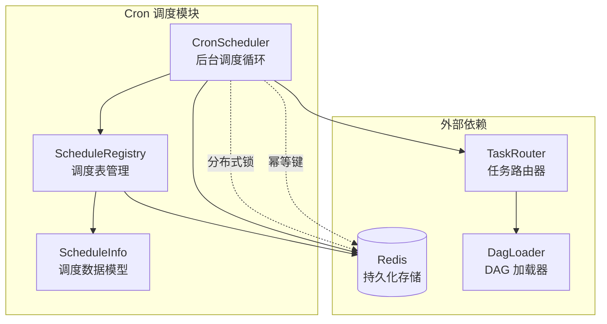
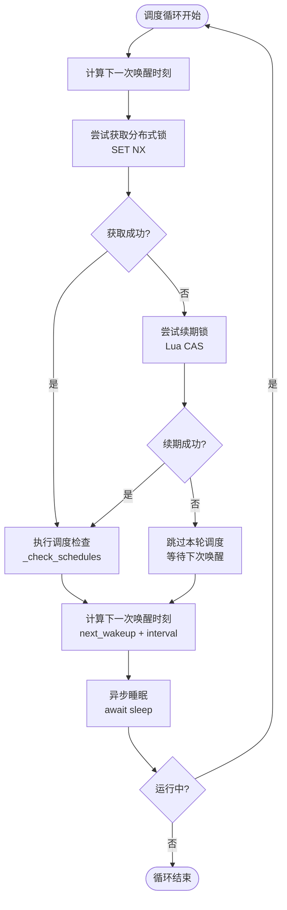
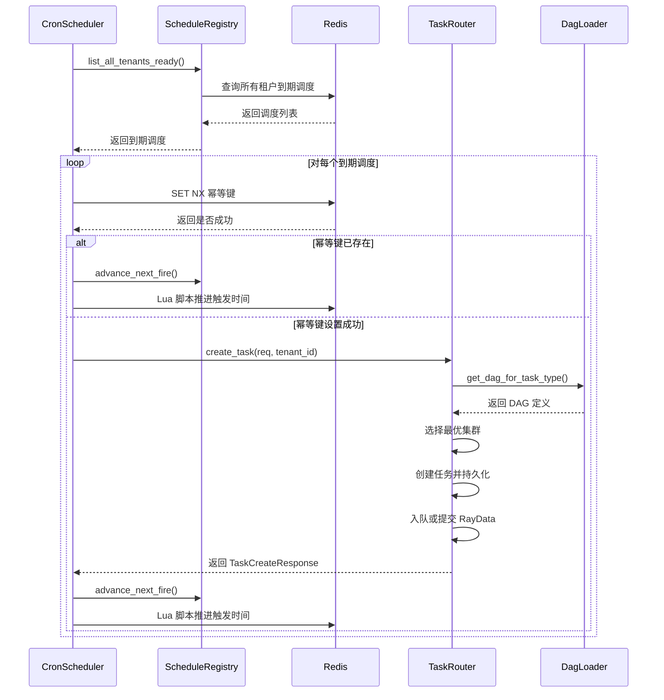

# Cron 调度

```cite
- [src/platform/cron_scheduler.py](src/platform/cron_scheduler.py)
- [src/platform/schedule_registry.py](src/platform/schedule_registry.py)
- [src/models/schedule.py](src/models/schedule.py)
- [src/platform/base_registry.py](src/platform/base_registry.py)
- [config/_background.py](config/_background.py)
- [config/service_defaults.yaml](config/service_defaults.yaml)
```

## 引言

Cron 调度模块是系统的后台任务调度引擎，负责按照预定义的时间规则（Cron 表达式）周期性地创建和触发任务。该模块通过分布式 Leader 选举机制确保多实例部署时只有一个实例执行调度，同时利用 Redis 幂等键防止同一调度在同一触发窗口内重复创建任务。调度数据持久化存储在 Redis 中，通过 `ScheduleRegistry` 进行统一管理，支持调度的创建、查询、删除和启停切换等完整生命周期操作。

## 架构概述

Cron 调度模块由三个核心组件构成：`CronScheduler` 负责后台循环调度和 Leader 选举，`ScheduleRegistry` 负责调度表的增删改查管理，`ScheduleInfo` 数据模型定义了调度记录的结构。模块采用 Redis 作为持久化存储，通过 Lua 脚本保证并发操作的原子性，并通过分布式锁机制实现多实例环境下的 Leader 选举。`CronScheduler` 通过 `TaskRouter` 创建任务实例，但不直接管理任务的生命周期，仅负责触发创建。



**图表来源**
- [src/platform/cron_scheduler.py](src/platform/cron_scheduler.py#l1-l250)
- [src/platform/schedule_registry.py](src/platform/schedule_registry.py#l1-l200)
- [src/models/schedule.py](src/models/schedule.py#l1-l80)

## 核心组件分析

### CronScheduler 调度器

`CronScheduler` 是后台循环调度器的核心实现，采用 asyncio 异步循环机制，每分钟（可配置）检查一次调度表中到期的任务并触发创建。该组件通过 Redis 分布式锁实现 Leader 选举，确保多实例部署时只有一个实例执行调度逻辑，同时通过 Redis 幂等键机制防止同一调度在同一触发窗口内重复创建任务。

调度器的主循环采用固定周期唤醒策略，使用 monotonic 时钟防止系统时间跳变影响，每次循环开始时尝试获取或续期分布式锁，只有持锁实例才执行调度检查。锁的 TTL 设置为检查周期的 2 倍（默认 120 秒），确保在正常情况下锁不会过期，同时让 Leader 崩溃后 follower 能更快接管。



**图表来源**
- [src/platform/cron_scheduler.py](src/platform/cron_scheduler.py#l100-l250)

#### Leader 选举机制

Leader 选举通过 Redis `SET NX` 命令实现，键名为 `cron_scheduler:leader_lock`，值为实例的唯一标识符（`_instance_id`）。每个实例在每次循环开始时尝试抢占锁，只有成功获取锁的实例才能执行调度检查。已持锁的实例通过 Lua CAS（Compare-And-Swap）脚本原子续期锁，确保锁不会过期。续期逻辑会验证当前持锁者是否为自己，只有匹配时才执行 `EXPIRE` 操作，防止误续期其他实例的锁。

锁的 TTL 动态计算为 `max(check_interval * 2, 30)` 秒，确保在正常情况下锁不会过期，同时设置最小值 30 秒防止过短的 TTL 导致慢 tick 内掉锁。当实例停止时，会通过另一个 Lua CAS 脚本释放锁，仅当自己是持锁者时才删除锁键，避免误释放其他实例的锁。

#### 幂等触发机制

为防止同一调度在同一触发窗口内重复创建任务，`CronScheduler` 实现了基于 Redis 的幂等键机制。每次触发前，会以 `cron_dedup:{schedule_id}:{next_fire_at}` 为键执行 `SET NX` 操作，TTL 设置为 300 秒（5 分钟），覆盖同一触发窗口。如果键已存在，说明该调度已被触发过，跳过本次创建并直接推进 `next_fire_at`。

幂等键机制配合分布式锁，确保即使在多实例部署、网络分区、实例重启等异常情况下，也不会出现重复任务创建。当任务创建失败时，幂等键会阻止下一轮 tick 重试，避免重复创建，只有在明确为永久性配置错误（如无效 cron 表达式、无 DAG 定义）时才会推进 `next_fire_at`，避免死循环。

#### 并发任务创建控制

每次调度检查可能触发多个到期任务，为防止突发流量导致系统过载，`CronScheduler` 使用信号量（`Semaphore`）限制并发创建任务的数量上限（默认 16）。所有到期调度的处理任务通过 `asyncio.gather` 并发执行，但受信号量控制，确保同时最多只有 16 个任务创建操作在进行。

为避免 `gather` 被取消时出现"任务已创建但 next_fire 未推进"的半成品状态，使用 `asyncio.shield` 保护 gather 操作，确保只有在所有任务处理完成或明确失败后才继续。业务异常通过 `return_exceptions=True` 捕获并记录，`CancelledError` 由外层 `_check_loop` 捕获并向上传递，实现优雅关闭。

### ScheduleRegistry 调度表管理

`ScheduleRegistry` 继承自 `BaseRedisRegistry` 泛型基类，负责 Cron 调度定义的完整生命周期管理，包括创建、查询、删除和启停切换等操作。调度数据存储在 Redis 中，采用 `{prefix}:{tenant_id}:{schedule_id}` 的键布局，支持租户隔离。索引集合 `schedules:index:{tenant_id}` 维护每个租户的所有调度 ID，`schedules:tenants` 集合维护所有出现过的租户 ID，供跨租户查询使用。

`ScheduleRegistry` 通过 Lua 脚本实现调度状态的原子修改，避免并发竞态。`toggle` 操作原子切换调度的启用/禁用状态，启用时会重新计算 `next_fire_at`；`advance_next_fire` 操作在触发后原子推进 `next_fire_at` 到下一个 cron 时间点，同时更新 `last_triggered_at`。这些操作通过 Lua 脚本的读-改-写原子性保证，避免了多实例并发触发导致的状态不一致。

```mermaid
flowchart TD
    start([创建调度]) --> validate_cron["验证 cron 表达式<br/>croniter.is_valid"]
    validate_cron --> valid{有效?}
    valid -->|否| raise_error["抛出 ValueError"]
    valid -->|是| calc_next["计算 next_fire_at<br/>croniter.get_next"]
    calc_next --> build_info["构建 ScheduleInfo"]
    build_info --> save["保存到 Redis<br/>SET + SADD"]
    save --> update_index["更新租户索引<br/>SADD schedules:tenants"]
    update_index --> return_info["返回 ScheduleInfo"]
    
    toggle([启停调度]) --> get_info["获取调度信息"]
    get_info --> check_enabled{"启用?"}
    check_enabled -->|是| calc_next_fire["重新计算 next_fire_at"}
    check_enabled -->|否| skip_calc["跳过计算"]
    calc_next_fire --> lua_toggle["Lua 脚本原子更新<br/>enabled + next_fire_at"]
    skip_calc --> lua_toggle
    lua_toggle --> finish_toggle([完成])
    
    advance([推进触发时间]) --> get_schedule["获取调度信息"]
    get_schedule --> calc_next_fire2["计算下一个触发时间"]
    calc_next_fire2 --> lua_advance["Lua 脚本原子更新<br/>last_triggered_at + next_fire_at"]
    lua_advance --> finish_advance([完成])
```

**图表来源**
- [src/platform/schedule_registry.py](src/platform/schedule_registry.py#l60-l200)
- [src/platform/base_registry.py](src/platform/base_registry.py#l1-l150)

#### 查询到期调度

`list_ready` 方法返回所有已到触发时间且已启用的调度，遍历全量调度列表，筛选 `enabled=True` 且 `next_fire_at <= now` 的条目。对于未带时区信息的 `next_fire_at`，默认按 UTC 处理。该方法支持按租户过滤，默认租户使用空字符串标识。

`list_all_tenants_ready` 方法扫描所有租户的到期调度，优先从 `schedules:tenants` 集合获取所有已知租户 ID，避免 SCAN 开销。如果集合为空（例如首次运行或升级未刷盘），会回退到一次 SCAN 做兼容，并将发现的租户 ID 回填到集合中。该方法会同时查询默认租户和非默认租户的到期调度，返回合并后的结果列表。

#### 数据持久化与 TTL

调度数据通过 `_save` 方法持久化到 Redis，使用 pipeline 保证数据、索引和租户集合的原子性。每条调度数据设置 TTL（默认 31536000 秒，约 1 年），过期后自动清除。索引集合通过 `list_all` 方法自动清理过期条目，当数据键已过期但索引中仍存在时，会批量清理这些 stale 索引条目，保持索引与实际数据的一致性。

TTL 配置通过 `BackgroundConfig.registry_schedule_ttl_seconds` 参数控制，可在配置文件中设置。较长的 TTL 确保调度定义在系统重启或短暂故障后仍然可用，同时避免长期积累过期数据。

### ScheduleInfo 数据模型

`ScheduleInfo` 是调度完整信息的 Pydantic 模型，定义了调度记录的所有字段。核心字段包括：

- `schedule_id`：调度唯一标识符，格式为 `sched-{12位随机hex}`
- `tenant_id`：租户 ID，支持多租户隔离
- `cron_expr`：5 字段 cron 表达式，定义调度触发规则
- `task_type`：任务类型，用于关联 DAG 定义
- `input_data`：任务输入数据，字典类型
- `priority`：任务优先级，支持 `normal`、`high`、`low`
- `callback_url`：回调 URL，任务完成后调用
- `metadata`：元数据字典，存储自定义信息
- `timeout_seconds`：任务超时时间（秒）
- `max_retries`：最大重试次数
- `enabled`：是否启用调度
- `last_triggered_at`：上次触发时间（ISO 8601 格式）
- `next_fire_at`：下次触发时间（ISO 8601 格式）
- `created_at`：创建时间（ISO 8601 格式）
- `updated_at`：更新时间（ISO 8601 格式）

`ScheduleInfo` 包含一个 `@model_validator` 装饰器，用于修复 Lua cjson 空表序列化问题。当 `input_data` 或 `metadata` 为空列表时，会自动转换为空字典，避免反序列化失败。

`ScheduleCreate` 是创建调度的请求体模型，字段与 `ScheduleInfo` 类似但不包含自动生成的字段（如 `schedule_id`、时间戳等），用于 API 请求参数。

### Cron 表达式格式

Cron 表达式采用标准的 5 字段格式，从左到右依次表示：分钟、小时、日、月、星期。每个字段支持以下特殊符号：

- `*`：匹配任意值
- `,`：枚举值，如 `1,3,5` 表示第 1、3、5 分钟
- `-`：范围，如 `1-5` 表示第 1 到 5 分钟
- `/`：步长，如 `*/5` 表示每 5 分钟
- `?`：仅用于日和星期字段，表示不指定值（与 `*` 互斥）

常用 Cron 表达式示例：

| 表达式 | 说明 |
|--------|------|
| `* * * * *` | 每分钟执行 |
| `*/5 * * * *` | 每 5 分钟执行 |
| `0 * * * *` | 每小时整点执行 |
| `0 9 * * *` | 每天 9:00 执行 |
| `0 9 * * 1` | 每周一 9:00 执行 |
| `0 0 1 * *` | 每月 1 日 0:00 执行 |
| `0 9-17 * * 1-5` | 工作日 9:00-17:00 每小时执行 |

Cron 表达式的有效性通过 `croniter.is_valid` 方法验证，无效表达式会在创建调度时抛出 `ValueError` 异常。下一个触发时间通过 `croniter.get_next(datetime)` 计算，基于 UTC 时区。

## 与 TaskRouter 的交互

`CronScheduler` 通过 `TaskRouter.create_task` 方法创建任务实例，传入 `TaskCreate` 请求对象和租户 ID。`TaskCreate` 对象包含任务类型、输入数据、优先级、回调 URL、元数据、超时时间和最大重试次数等字段。`CronScheduler` 会将调度相关的元数据（`_schedule_id`、`_cron_expr`）添加到任务的 `metadata` 字段中，便于追踪任务的调度来源。

`TaskRouter` 负责任务的完整创建流程，包括 DAG 定义加载、集群选择、幂等性检查、任务持久化和入队等操作。`CronScheduler` 不关心任务的具体执行逻辑，仅负责触发创建，任务的生命周期由 `TaskRouter` 和其他组件管理。



**图表来源**
- [src/platform/cron_scheduler.py](src/platform/cron_scheduler.py#l180-l250)
- [src/platform/schedule_registry.py](src/platform/schedule_registry.py#l140-l200)
- [src/platform/task_router.py](src/platform/task_router.py#l210-l280)
- [src/platform/dag_loader.py](src/platform/dag_loader.py#l201-l230)

## 配置说明

Cron 调度模块的配置通过 `BackgroundConfig` 管理，主要配置项包括：

- `background.cron.enabled`：是否启用 Cron 调度器，默认 `true`
- `background.cron.check_interval`：调度检查周期（秒），默认 `60.0`
- `background.registry_ttl.schedule_seconds`：调度数据 TTL（秒），默认 `31536000`（约 1 年）
- `background.max_schedules_per_tenant`：每租户调度数量上限，默认 `100`

配置项支持通过环境变量覆盖，环境变量优先级高于配置文件。例如，可通过 `CRON_SCHEDULER_ENABLED` 环境变量控制调度器启用状态，通过 `CRON_SCHEDULER_CHECK_INTERVAL` 环境变量调整检查周期。

调度器的检查周期直接影响锁的 TTL 计算，TTL 设置为 `check_interval * 2`，确保在正常情况下锁不会过期。较短的检查周期可以提高调度精度，但会增加系统负载；较长的检查周期可以降低系统负载，但会降低调度精度，需要根据实际业务需求权衡。

## 错误处理与容错机制

Cron 调度模块实现了多层容错机制，确保在异常情况下仍能正常运行：

1. **分布式锁容错**：Leader 崩溃后，锁会在 TTL 过期后自动释放，其他实例可以抢占锁成为新的 Leader，避免调度中断。

2. **幂等触发保护**：通过幂等键机制防止重复创建任务，即使出现网络分区、实例重启等异常情况，也不会产生重复任务。

3. **任务创建失败重试**：当任务创建失败时，幂等键会阻止下一轮 tick 重试，避免重复创建。只有在明确为永久性配置错误时才会推进 `next_fire_at`，避免死循环。

4. **并发控制保护**：通过信号量限制并发创建任务的数量，防止突发流量导致系统过载。

5. **指数退避机制**：调度循环出现异常时，采用指数退避策略重试，初始退避时间 1 秒，最大退避时间 30 秒，避免频繁重试加剧系统负载。

6. **优雅关闭**：通过 `asyncio.shield` 保护 gather 操作，确保只有在所有任务处理完成或明确失败后才继续关闭，避免半成品状态。

7. **索引自动清理**：`BaseRedisRegistry` 的 `list_all` 方法会自动清理过期或损坏的索引条目，保持索引与实际数据的一致性。

这些容错机制共同确保了 Cron 调度模块在多实例部署、网络异常、实例故障等复杂场景下的稳定性和可靠性。