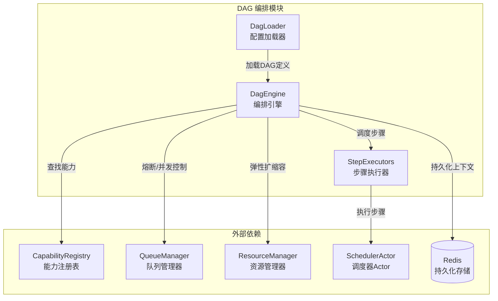

# DAG 编排

```cite
- [src/platform/dag_engine.py](src/platform/dag_engine.py)
- [src/platform/dag_loader.py](src/platform/dag_loader.py)
- [src/platform/step_executors.py](src/platform/step_executors.py)
- [src/models/dag.py](src/models/dag.py)
- [config/dags/01_pipeline_linear.yaml](config/dags/01_pipeline_linear.yaml)
- [config/dags/02_pipeline_branch.yaml](config/dags/02_pipeline_branch.yaml)
- [config/dags/03_pipeline_map.yaml](config/dags/03_pipeline_map.yaml)
- [config/dags/04_pipeline_streaming.yaml](config/dags/04_pipeline_streaming.yaml)
- [config/dags/99_video_generation_kitchen_sink.yaml](config/dags/99_video_generation_kitchen_sink.yaml)
- [config/_dag.py](config/_dag.py)
```

## 引言

DAG 编排模块是整个系统的核心工作流引擎，负责将声明式的 DAG（有向无环图）定义转化为实际的分布式步骤执行。该模块通过拓扑排序调度、并行执行、条件表达式求值、步骤级容错和增量持久化等机制，为复杂业务流程提供了可靠的编排能力。DAG 引擎与 SchedulerActor 和 ActorPoolManager 协作完成实际的步骤执行，但本节仅关注 DAG 编排层面的逻辑，不深入底层 Actor 实现细节。

## 架构概述

DAG 编排模块由三个核心组件构成：DagEngine（编排引擎）、DagLoader（配置加载器）和 StepExecutors（步骤执行器）。DagEngine 负责整个 DAG 的生命周期管理，包括依赖解析、并行调度、状态持久化和错误处理；DagLoader 从 YAML 文件和 Redis 加载并校验 DAG 定义；StepExecutors 封装了三种执行模式的具体实现。DagEngine 通过 CapabilityRegistry 查找步骤对应的服务端点，通过 QueueManager 实现熔断和并发控制，并可选地与 ResourceManager 协作实现弹性扩缩容。



**图表来源**
- [src/platform/dag_engine.py](src/platform/dag_engine.py#l1-l200)
- [src/platform/dag_loader.py](src/platform/dag_loader.py#l1-l100)
- [src/platform/step_executors.py](src/platform/step_executors.py#l1-l100)

## DAG 编排引擎功能说明

### 拓扑排序调度

DAG 引擎使用 Kahn 算法进行拓扑排序，确保步骤按依赖关系正确执行。引擎在初始化时预计算每个步骤的依赖集合（dep_sets），并在执行循环中动态收集所有依赖已满足的就绪步骤。通过维护一个待处理步骤列表（remaining）和已完成步骤集合（completed_set），引擎能够高效地扫描就绪步骤，避免重复计算。当没有就绪步骤但仍有未完成步骤时，引擎会触发死锁检测，报错指出未解析的步骤名称。

### 并行执行

引擎使用 `asyncio.gather()` 实现真正的并行执行。每轮循环中，所有依赖已满足的步骤会被收集到一个批次中，然后并行执行。这种扇出模式显著提高了 DAG 的执行效率，特别是对于无依赖的并行分支。引擎使用 `FIRST_EXCEPTION` 返回策略，当批次中任何步骤失败或触发 ABORT 策略时，会立即取消同批中尚未完成的任务，避免落后的长耗时步骤拖长失败反馈。

### 条件表达式求值

DAG 引擎内置了一个强大的条件表达式求值器，支持多种比较运算符和逻辑组合。支持的比较运算符包括 `==`、`!=`、`>`、`<`、`>=`、`<=`、`in`、`not_in`，支持的特殊值包括 `null`、`true`、`false`。逻辑运算符支持 `&&`（AND）和 `||`（OR），求值优先级为 `||` 最低、`&&` 其次、单个条件最高。求值器使用正则表达式拆分逻辑运算符，避免值中包含 `||` 或 `&&` 时导致的误切。条件表达式可以引用 `input_data`、`metadata` 和 `context` 中的任意字段，通过 JSONPath 路径访问。

### 步骤级容错

每个步骤都配置了重试策略和失败处理策略。重试策略通过 `RetryPolicy` 定义，包含 `max_retries`（最大重试次数）和 `retry_delay_seconds`（重试间隔）。失败处理策略通过 `OnFailureAction` 枚举定义，包括三种模式：`ABORT`（中止整个 DAG）、`SKIP`（跳过当前步骤，继续执行后续步骤）、`FALLBACK`（应用降级输出，继续执行）。当步骤执行失败时，引擎会根据配置的策略采取相应动作。对于 `FALLBACK` 策略，步骤必须配置完整的 `fallback.output_mapping`，否则会降级为 `ABORT` 以避免下游依赖永不满足导致死等。

### 增量持久化

DAG 引擎实现了增量持久化机制，确保每个步骤完成后立即将上下文保存到 Redis。这种设计保证了即使 Worker 被意外终止，已完成步骤的结果也不会丢失。持久化操作通过节流机制优化，相邻两次保存间隔不低于 `context_save_throttle_ms` 毫秒（默认 500ms），避免 N 步 DAG 产生 O(N²) 序列化开销。引擎还支持 checkpoint 快照功能，可以按间隔保存中间状态，支持从任意 checkpoint 步骤恢复执行。持久化的上下文包含任务 ID、DAG ID、租户 ID、输入数据、元数据、上下文数据、步骤结果、已完成步骤列表和执行状态。

## 步骤执行模式

DAG 引擎支持三种步骤执行模式，每种模式适用于不同的场景：

### SYNC 同步调用

SYNC 模式通过 Ray Actor 同步调用执行步骤，适用于低延迟的短任务。执行流程为：查找能力 → 获取/创建 Actor 池 → 远程同步调用 → 记录结果。SYNC 模式使用 `async_retry` 封装重试逻辑，失败时记录熔断器计数。该模式需要 Ray 环境支持，通过 `SchedulerActor.ensure_actor_pool_registered()` 确保 Actor 池已注册，然后通过 `submit_to_pool.remote()` 提交任务并等待结果。

### ASYNC 异步提交 + Pub/Sub 通知

ASYNC 模式适用于长时间运行的任务，执行流程为：提交任务到 Ray Actor（submit_async）→ 订阅 Redis Pub/Sub 通知频道 → 在超时范围内循环等待 Pub/Sub 消息 → 查询结果键 → 结果就绪时返回数据。ASYNC 模式使用独立的 invocation_id（uuid4 短码）和 attempt 编号构成 `attempt_step_name`，避免 result_key 冲突。轮询间隔由 `PollingConfig.interval_seconds` 控制（默认 5 秒），Pub/Sub 通知提供实时性，轮询作为兜底机制。

### FLASK_WRAPPED HTTP 调用

FLASK_WRAPPED 模式用于调用外部 Flask 服务，适用于非 Ray 环境。执行流程为：解析 Flask URL（步骤配置优先，否则从能力注册表获取）→ HTTP POST 调用 → 处理响应。该模式对 HTTP 状态码 429 和 503 进行特殊处理，触发反压降级（`adjust_concurrent(-1)`）。Flask URL 可以在步骤的 `flask.url` 中配置，也可以从能力的 `flask_config.base_url` 和 `flask_config.generate_endpoint` 组合获取。

## DAG 定义结构

### DagDefinition

`DagDefinition` 是完整的 DAG 定义，包含以下核心字段：

- `dag_id`：DAG 唯一标识符
- `tenant_id`：租户 ID，用于多租户隔离
- `name`：DAG 显示名称
- `version`：版本号
- `timeout_seconds`：DAG 级别超时时间（秒），默认 3600
- `enabled`：是否启用
- `steps`：步骤列表
- `max_queue_depth`：任务队列深度限制（可选）
- `max_concurrent`：任务队列并发限制（可选）

### DagStep

`DagStep` 是 DAG 中的单个步骤定义，包含丰富的配置选项：

- `step_name`：步骤名称（在 DAG 内唯一）
- `capability`：绑定的能力名称
- `step_kind`：步骤类型（TASK/DISPATCH/COLLECTOR/MAP/STREAMING）
- `depends_on`：依赖的步骤名称列表
- `collect_from`：收集输出的步骤名称列表（必须是 depends_on 的子集）
- `execution_mode`：执行模式（SYNC/ASYNC/FLASK_WRAPPED）
- `timeout_seconds`：步骤超时时间（秒），默认 60
- `retry_policy`：重试策略配置
- `input_mapping`：输入映射，从上下文中提取输入数据
- `output_mapping`：输出映射，将结果写入上下文
- `condition`：条件表达式，决定是否执行该步骤
- `on_failure`：失败处理策略（ABORT/SKIP/FALLBACK）
- `fallback`：降级输出映射配置
- `checkpoint`：检查点配置
- `polling`：轮询配置（ASYNC 模式使用）
- `flask`：Flask HTTP 配置
- `queue`：队列配置（并发与 QPS 限制）
- `map_over`：MAP 步骤的迭代路径
- `max_concurrency`：MAP 步骤的最大并发数
- `map_error_policy`：MAP 步骤的错误策略（ABORT_ALL/CONTINUE）
- `artifact_output_fields`：需要上传到 ArtifactStore 的字段
- `streaming_trigger`：流式步骤触发配置

### DagContext

`DagContext` 是 DAG 执行上下文，存储在 Redis 中，包含以下字段：

- `task_id`：任务 ID
- `dag_id`：DAG ID
- `tenant_id`：租户 ID
- `input_data`：输入数据
- `metadata`：元数据
- `context`：上下文数据（步骤间共享）
- `step_results`：步骤执行结果字典
- `completed_steps`：已完成步骤名称列表
- `status`：执行状态（PENDING/RUNNING/COMPLETED/FAILED/CANCELLED）

## 步骤类型

### TASK

TASK 是最基础的步骤类型，表示单个任务执行。适用于大多数常规处理场景，如数据提取、转换、推理等。TASK 步骤可以配置重试策略、失败处理策略、条件表达式等所有标准选项。

### DISPATCH

DISPATCH 步骤用于数据分发，将输入数据分发给多个下游步骤。DISPATCH 步骤会在输入中自动注入 `dispatch_from` 字段（包含依赖步骤名列表），方便下游步骤了解数据来源。DISPATCH 步骤通常与 COLLECTOR 步骤配合使用，实现扇出-扇入模式。

### COLLECTOR

COLLECTOR 步骤用于聚合多个上游步骤的输出。COLLECTOR 步骤会在输入中自动注入 `collected` 字段，包含所有 `collect_from` 指定步骤的输出数据字典。COLLECTOR 步骤必须配置 `collect_from` 字段，且这些步骤必须包含在 `depends_on` 中。

### MAP

MAP 步骤实现 scatter-gather 模式，将列表拆分为多个分片并行执行，然后聚合有序结果。MAP 步骤通过 `map_over` 字段指定 JSONPath 路径，从上下文中获取待迭代列表。每个分片会获得额外的输入字段 `_map_item`（当前项）和 `_map_index`（索引）。MAP 步骤支持两种错误策略：`ABORT_ALL`（第一个分片失败后取消所有剩余分片）和 `CONTINUE`（失败分片输出 None，其余分片继续执行）。MAP 步骤通过 `max_concurrency` 控制并发度，0 表示不限制。MAP 步骤不支持 `collect_from` 字段。

### STREAMING

STREAMING 步骤用于流式处理场景，如 ASR、流式 TTS、大模型流式解码、视频切片编码等。STREAMING 步骤通过 `streaming_trigger` 配置触发行为，包含以下字段：

- `buffer_key`：Redis List key 模板，运行时替换 `{task_id}`
- `trigger_condition`：触发条件（目前仅支持 `chunk_ready`）
- `flush_on_complete`：步骤完成后是否冲刷剩余缓冲
- `downstream_steps`：增量触发的下游步骤名列表

STREAMING 步骤执行时，Worker 边执行边往 Redis buffer 推送 chunk，每个 chunk 会独立触发下游步骤。步骤完成后会推送 sentinel 消息触发最终聚合。下游步骤的执行结果会累加到 `context._streaming_results_<downstream_step_name>` 中。

## 重试策略和失败处理

### RetryPolicy

`RetryPolicy` 定义了步骤的重试行为：

- `max_retries`：最大重试次数，默认 0
- `retry_delay_seconds`：重试间隔（秒），默认 1.0

重试逻辑由 `async_retry` 工具函数实现，每次重试前会记录警告日志。重试次数耗尽后抛出异常，由失败处理策略接管。

### OnFailureAction

`OnFailureAction` 定义了步骤失败时的处理策略：

- `ABORT`：中止整个 DAG，将 DAG 状态标记为 FAILED，后续步骤将被跳过
- `SKIP`：跳过当前步骤，将步骤状态标记为 skipped，继续执行后续步骤
- `FALLBACK`：应用降级输出，将步骤状态标记为 fallback，继续执行后续步骤

对于 `FALLBACK` 策略，必须配置完整的 `fallback.output_mapping`，否则引擎会记录告警并降级为 `ABORT`，避免下游依赖永不满足导致死等 DAG timeout。

## MAP 并行执行

MAP 步骤实现了高效的 scatter-gather 并行执行模式。引擎首先解析 `map_over` JSONPath 获取待迭代列表，如果列表为空则立即完成。对于非空列表，引擎构建基础输入（所有分片共享），然后使用 JSON 序列化进行快速拷贝（比 `copy.deepcopy` 快 2-5 倍）。每个分片会获得额外的输入字段 `_map_item` 和 `_map_index`。

MAP 步骤支持崩溃恢复，从 `context._map_state_<step_name>` 中恢复已完成分片的结果。分片状态使用哨兵包装 `{"__shard_done": True, "value": ...}` 区分"完成但结果为 None"和"从未执行"。

并发控制通过 `asyncio.Semaphore` 实现，`max_concurrency` 参数控制同时运行的分片数。错误策略通过 `abort_event` 实现，`ABORT_ALL` 策略在第一个分片失败时设置事件，取消所有剩余分片；`CONTINUE` 策略则让失败分片输出 None，其余分片继续执行。

引擎按原始索引组装有序结果，应用 `output_mapping`，然后清理临时状态。批量持久化机制每处理 N 个分片保存一次上下文（由 `map_shard_save_interval` 控制，默认 10），减少 Redis 写入次数。

## 流式处理

STREAMING 步骤通过 `StreamingTrigger` 配置实现增量触发机制。引擎在执行前将 `buffer_key` 注入到输入数据中（`_streaming_buffer_key` 字段），供 Worker 写入。步骤提交后，引擎通过 `blpop` 从 Redis buffer 消费 chunk 流，每个 chunk 会独立触发 `downstream_steps` 中配置的下游步骤。

每个 chunk 的处理结果会累加到 `context._streaming_results_<downstream_step_name>` 中。当 Worker 推送 sentinel 消息（`{"__done__": true}`）时，引擎会读取 `summary` 字段作为最终结果，应用 `output_mapping`，然后标记步骤为完成。如果 sentinel 包含 `__error__` 字段，引擎会抛出异常。

STREAMING 步骤使用专用的线程池（`_dag_streaming_executor`）执行 `blpop` 操作，避免长时间占用通用 IO 线程池。线程池大小由 `streaming_executor_max_workers` 配置（默认 64）。失败时引擎会清理 Redis buffer，防止 checkpoint 恢复时消费到脏 chunk。

## DAG 示例

### 线性 Pipeline

线性 Pipeline 是最朴素的 DAG，多个步骤首尾相连、顺序执行。适用于经典 ETL、日志清洗、请求 → 推理 → 后处理等无分支业务。

```yaml
steps:
  - step_name: extract
    capability: demo_extract
    execution_mode: sync
    timeout_seconds: 30
    input_mapping:
      source: "$.input_data.source"
    output_mapping:
      raw: "$.result"

  - step_name: transform
    capability: demo_transform
    depends_on: [extract]
    execution_mode: sync
    timeout_seconds: 30
    retry_policy:
      max_retries: 2
      retry_delay_seconds: 1
    input_mapping:
      raw: "$.context.raw"
    output_mapping:
      transformed: "$.result"

  - step_name: load
    capability: demo_load
    depends_on: [transform]
    execution_mode: sync
    timeout_seconds: 30
    input_mapping:
      transformed: "$.context.transformed"
    output_mapping:
      final_uri: "$.result.capability"
```

### 条件分支

条件分支 DAG 通过步骤的 `condition` 表达式实现动态跳过。适用于高危流量需要 risk_check、VIP 用户触发额外上报、可选的 post-process 等场景。

```yaml
steps:
  - step_name: prepare
    capability: demo_extract
    execution_mode: sync
    timeout_seconds: 10
    input_mapping:
      payload: "$.input_data.payload"
    output_mapping:
      prepared: "$.result"

  - step_name: dispatch
    capability: demo_transform
    step_kind: dispatch
    depends_on: [prepare]
    execution_mode: sync
    timeout_seconds: 10
    input_mapping:
      data: "$.context.prepared"
    output_mapping:
      fanout.main: "$.result"
      fanout.risk: "$.result"

  - step_name: risk_check
    capability: demo_risk
    depends_on: [dispatch]
    execution_mode: sync
    timeout_seconds: 10
    condition: "$.input_data.need_risk_check == true"
    input_mapping:
      payload: "$.context.fanout.risk"
    output_mapping:
      branches.risk: "$.result"
    on_failure: skip

  - step_name: main_infer
    capability: demo_infer
    depends_on: [dispatch]
    execution_mode: sync
    timeout_seconds: 30
    input_mapping:
      payload: "$.context.fanout.main"
    output_mapping:
      branches.main: "$.result"

  - step_name: collector
    capability: demo_load
    step_kind: collector
    depends_on: [risk_check, main_infer]
    collect_from: [risk_check, main_infer]
    execution_mode: sync
    timeout_seconds: 30
    output_mapping:
      final: "$.result"
    on_failure: fallback
    fallback:
      output_mapping:
        final: "$.context.branches.main"
```

当 `need_risk_check=false` 时，`risk_check` 步骤会被 condition 跳过，`collector` 步骤的 `collect_from` 仍会包含 `risk_check`，但由于其状态为 skipped，依赖会被视为满足。

### MAP 并行

MAP DAG 实现 scatter-gather 模式，上游输出一个列表 → 动态 fan-out N 个分片并行处理 → collector 合并。

```yaml
steps:
  - step_name: split
    capability: demo_split
    execution_mode: sync
    timeout_seconds: 30
    input_mapping:
      document: "$.input_data.document"
      shard_size: "$.input_data.shard_size"
    output_mapping:
      shards: "$.result.result.document"

  - step_name: process_shard
    capability: demo_map_shard
    step_kind: map
    depends_on: [split]
    execution_mode: sync
    timeout_seconds: 60
    map_over: "$.context.shards"
    max_concurrency: 4
    map_error_policy: continue
    output_mapping:
      processed: "$.result.items"

  - step_name: reduce
    capability: demo_reduce
    step_kind: collector
    depends_on: [process_shard]
    collect_from: [process_shard]
    execution_mode: sync
    timeout_seconds: 30
    output_mapping:
      final: "$.result"
```

`process_shard` 步骤会对 `context.shards` 中的每个元素 fan-out 一个分片任务，最多 4 个并发。`map_error_policy: continue` 表示某个分片失败不影响其他分片继续，失败项被 collector 忽略。

### 流式处理

流式 DAG 适用于长耗时内容生成，Worker 边执行边往 Redis buffer 推 chunk，下游 step 被逐块增量触发。

```yaml
steps:
  - step_name: stream_producer
    capability: demo_stream_producer
    step_kind: streaming
    execution_mode: sync
    timeout_seconds: 300
    input_mapping:
      source: "$.input_data.source"
      language: "$.input_data.language"
    output_mapping:
      summary: "$.result"
    streaming_trigger:
      buffer_key: "streaming:{task_id}:stream_producer"
      trigger_condition: chunk_ready
      flush_on_complete: true
      downstream_steps:
        - chunk_handler

  - step_name: chunk_handler
    capability: demo_stream_chunk
    depends_on: [stream_producer]
    execution_mode: sync
    timeout_seconds: 20
    input_mapping:
      chunk_text: "$.chunk_text"
      chunk_index: "$.chunk_index"
    output_mapping:
      chunk_result: "$.result"
    on_failure: skip

  - step_name: finalize
    capability: demo_stream_finalizer
    step_kind: task
    depends_on: [stream_producer]
    execution_mode: sync
    timeout_seconds: 60
    input_mapping:
      summary: "$.context.summary"
      chunks: "$.context._streaming_results_chunk_handler"
    output_mapping:
      final_uri: "$.result.capability"
    on_failure: abort
```

`stream_producer` 步骤执行时，Worker 会将 chunk 写入 Redis buffer（rpush 语义），完成后写 sentinel 触发下游 barrier。每个 chunk 会独立触发 `chunk_handler` 一次，`chunk_handler` 的执行结果会累加到 `context._streaming_results_chunk_handler` 中。`finalize` 步骤在 `stream_producer` 完成后执行，聚合所有 chunk 的输出。

## 配置选项

DAG 编排模块通过 `DagConfig` 类提供丰富的配置选项：

- `config_dir`：YAML 配置文件目录路径
- `context_ttl_seconds`：上下文 Redis TTL（秒），默认 259200（3 天）
- `http_timeout_seconds`：HTTP 超时时间（秒），默认 300
- `ctx_locks_eviction_threshold`：上下文锁淘汰阈值，默认 1000
- `io_executor_max_workers`：IO 线程池大小，默认 128
- `context_save_throttle_ms`：上下文保存节流间隔（毫秒），默认 500
- `map_shard_save_interval`：MAP 分片批量持久化间隔，默认 10
- `qps_limiter_cache_size`：QPS 限流器 LRU 容量，默认 1024
- `qps_limiter_backend`：QPS 限流后端（"redis" 或 "memory"），默认 "redis"
- `streaming_executor_max_workers`：流式处理专用线程池大小，默认 64

这些配置可以通过环境变量覆盖，格式为 `DAG_<配置名>`（如 `DAG_CONTEXT_TTL_SECONDS`）或 `dag.<配置名>`（如 `dag.context_ttl_seconds`）。