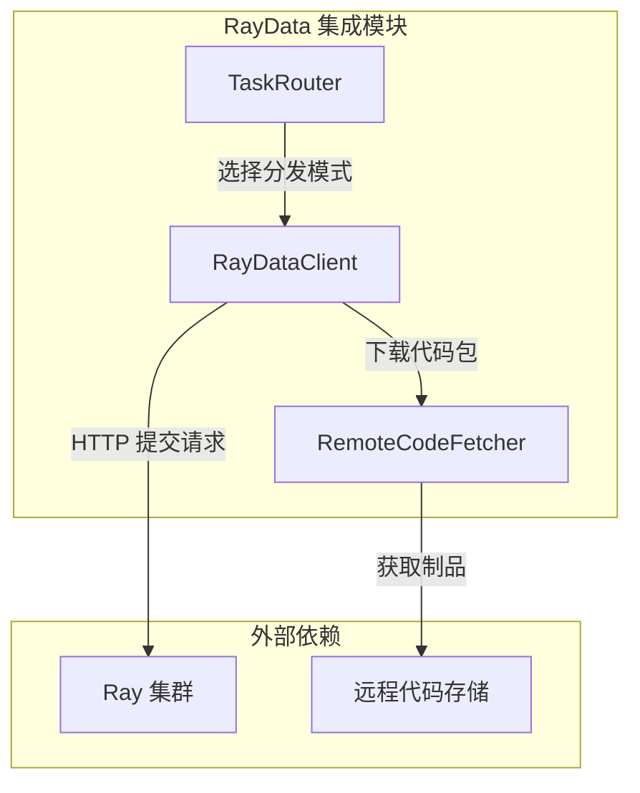
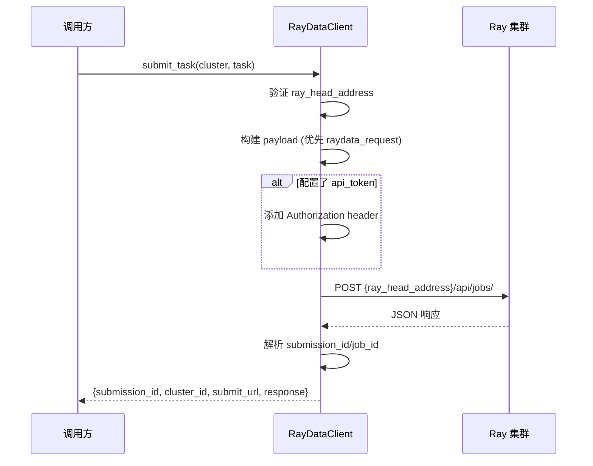
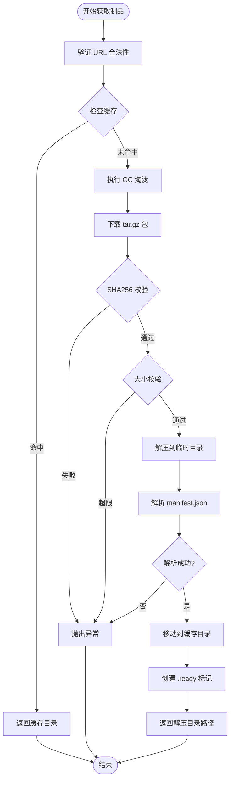
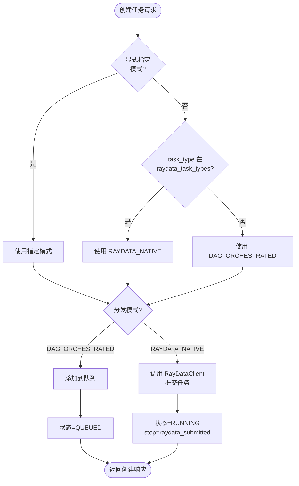
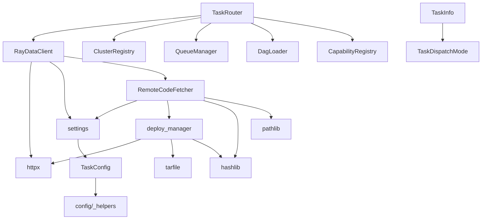

# RayData 集成

```cite
- [src/platform/raydata_client.py](src/platform/raydata_client.py)
- [src/platform/remote_code_fetcher.py](src/platform/remote_code_fetcher.py)
- [src/models/task.py](src/models/task.py)
- [src/platform/task_router.py](src/platform/task_router.py)
- [config/_task.py](config/_task.py)
- [config/service_defaults.yaml](config/service_defaults.yaml)
- [config/_tenant.py](config/_tenant.py)
- [src/agent/deploy_manager.py](src/agent/deploy_manager.py)
```

## 引言

RayData 集成模块提供了将任务直接提交到 Ray 集群的原生执行能力。与基于 DAG 编排的执行模式不同，RayData 原生模式允许任务绕过平台的队列管理和步骤编排机制，直接调用 Ray 集群的 API 进行提交和执行。这种模式适用于需要直接控制 Ray 任务提交流程的场景，例如数据处理任务、批量推理任务等。

该模块的核心职责包括：封装向目标 Ray 集群提交原生任务的 HTTP 请求、构建符合 RayData 规范的请求体、管理 Token 鉴权、解析响应并提取关键信息（如 `submission_id`、`cluster_id`、`submit_url`）、处理远程代码包的下载与校验、以及配置 `runtime_env` 的 `working_dir`。

## 架构概述

RayData 集成模块采用分层架构设计，主要包含三个核心组件：`RayDataClient` 负责与 Ray 集群的 HTTP 交互，`RemoteCodeFetcher` 处理远程代码包的获取和缓存，`TaskRouter` 中的分发逻辑决定任务是否采用 RayData 原生模式。模块通过配置化的方式支持多种任务类型的分发模式选择，同时提供了完整的错误处理和回滚机制。

下图展示了 RayData 集成模块的核心组件及其交互关系。虚线框表示外部依赖（Ray 集群和远程代码存储），实线框表示模块内部组件。任务创建时，`TaskRouter` 根据任务类型或显式配置决定分发模式；对于 RayData 原生任务，通过 `RayDataClient` 提交到目标集群，并在需要时通过 `RemoteCodeFetcher` 下载远程代码包。



**图表来源**
- [src/platform/raydata_client.py](src/platform/raydata_client.py#l21-l27)
- [src/platform/remote_code_fetcher.py](src/platform/remote_code_fetcher.py#l125-l158)
- [src/platform/task_router.py](src/platform/task_router.py#l227-l234)

## 详细组件分析

### RayData 客户端

`RayDataClient` 是与 Ray 集群交互的核心组件，封装了所有 HTTP 请求的细节。该客户端使用 `httpx.Client` 作为底层 HTTP 库，支持上下文管理器模式以确保连接资源的正确释放。客户端在初始化时配置了请求超时时间，该超时值可通过配置项 `task.raydata.submit_timeout_seconds` 进行调整，默认值为 15 秒。

客户端的核心方法是 `submit_task`，该方法接收 `ClusterInfo` 和 `TaskInfo` 作为参数，构建并向目标 Ray 集群发送提交请求。方法首先验证集群的 `ray_head_address` 是否为空，如果为空则抛出 `RuntimeError`。请求 URL 由集群地址和配置的 `raydata_submit_path`（默认为 `/api/jobs/`）拼接而成。

请求体的构建逻辑优先使用任务 `input_data` 中的自定义 `raydata_request` 字段。如果该字段存在且为非空字典，则直接使用该字典作为请求体；否则，客户端会构建一个包含 `task_id`、`task_type`、`input_data`、`metadata` 和 `callback_url` 的标准请求体。这种设计允许高级用户完全自定义 RayData 请求格式，同时为普通用户提供合理的默认行为。

Token 鉴权通过 HTTP 的 `Authorization` header 实现。如果配置了 `task.raydata.api_token`，客户端会自动添加 `Bearer {token}` 格式的鉴权头。这种机制确保了只有持有有效 Token 的请求才能提交任务到 Ray 集群。

响应解析逻辑处理了 Ray 集群可能返回的不同响应格式。客户端尝试从响应 JSON 中提取 `submission_id` 或 `job_id` 字段，如果两者都不存在，则使用任务的 `task_id` 作为回退值。最终返回的字典包含 `submission_id`、`cluster_id`、`submit_url` 和原始响应 `response` 四个字段，为上层调用者提供完整的信息。

下图展示了 `RayDataClient` 提交任务的完整流程，包括请求构建、鉴权、发送和响应解析的各个步骤。



**图表来源**
- [src/platform/raydata_client.py](src/platform/raydata_client.py#l42-l89)

### 请求构建与转换

请求构建逻辑封装在 `RayDataClient._build_payload` 静态方法中。该方法实现了从 `TaskInfo` 到 RayData 提交请求的转换，支持两种模式：自定义请求模式和标准请求模式。

自定义请求模式下，任务创建者可以在 `input_data` 中提供 `raydata_request` 字段，该字段应为一个完整的、符合 RayData API 规范的字典。当检测到此字段存在且非空时，客户端直接使用该字典作为请求体，不进行任何额外处理。这种模式为需要精细控制 RayData 提交参数的场景提供了灵活性。

标准请求模式下，客户端构建一个包含以下字段的字典：
- `task_id`：任务的唯一标识符
- `task_type`：任务类型标识
- `input_data`：任务的输入数据
- `metadata`：任务的元数据
- `callback_url`：任务完成后的回调地址

当任务配置了 `artifact_url` 时，客户端会调用 `RemoteCodeFetcher.fetch_artifact` 方法下载远程代码包，并将下载后的本地路径配置到 `runtime_env.working_dir` 字段中。这样 Ray 集群在执行任务时能够正确加载用户提供的代码包。

### Token 鉴权机制

RayData 集成模块支持通过 Bearer Token 进行 API 鉴权。鉴权配置通过 `task.raydata.api_token` 配置项设置，支持从环境变量 `RAYDATA_API_TOKEN` 或配置文件 `task.raydata.api_token` 中读取。

当配置了有效的 Token 时，`RayDataClient` 会在每次提交请求时自动添加 `Authorization: Bearer {token}` HTTP header。该 Token 会随请求一起发送到 Ray 集群，由 Ray 集群验证其有效性。如果 Token 无效或过期，Ray 集群会返回相应的 HTTP 错误响应（如 401 Unauthorized），客户端会抛出异常并将任务标记为失败。

这种鉴权机制确保了只有授权的客户端才能向 Ray 集群提交任务，提高了系统的安全性。在多租户环境中，不同租户可以配置不同的 Token，实现任务级别的访问控制。

### 响应解析与字段提取

RayData 集成模块需要处理来自 Ray 集群的不同响应格式。响应解析逻辑在 `RayDataClient.submit_task` 方法中实现，采用灵活的字段提取策略。

首先，客户端检查响应内容是否为空。如果响应为空，则构造一个仅包含默认字段的字典。对于非空响应，客户端尝试将其解析为 JSON 对象。如果解析失败或结果不是字典类型，则将原始响应存储在 `raw_response` 字段中。

`submission_id` 的提取遵循以下优先级：优先使用响应中的 `submission_id` 字段；如果不存在，则尝试使用 `job_id` 字段；如果两者都不存在，则使用任务的 `task_id` 作为回退值。这种设计兼容了不同版本的 RayData API 可能使用不同字段名的情况。

最终返回的字典包含以下字段：
- `submission_id`：提交任务的唯一标识符
- `cluster_id`：目标集群的标识符
- `submit_url`：实际提交请求的完整 URL
- `response`：Ray 集群的原始响应内容

这些字段被存储在任务的 `output_data.raydata_submission` 中，并同步到 Redis 和 MySQL，便于后续查询和排障。

### 远程代码获取与校验

远程代码获取功能由 `RemoteCodeFetcher` 模块提供，该模块实现了完整的代码包下载、校验、解压和缓存管理流程。该模块被 `RayDataClient` 和 `SchedulerActor` 共同使用，是平台中处理远程代码包的通用组件。

代码获取流程包含多个关键步骤。首先，`validate_artifact_url` 方法验证制品 URL 的合法性，防止 SSRF（服务端请求伪造）攻击。验证规则包括：仅允许 `http` 和 `https` 协议、禁止内网和回环地址（除非环境变量 `CALLBACK_ALLOW_PRIVATE_IP` 设置为允许）、禁止 `localhost` 等受限主机名。

下载过程使用 `deploy_manager.download_package` 函数，该函数基于 `httpx` 实现流式下载，避免大文件占用过多内存。下载过程中同时计算 SHA256 校验和，下载完成后与任务提供的 `artifact_sha256` 进行比对。如果校验失败，会删除已下载的文件并返回错误。

代码包大小限制通过 `enforce_artifact_size_limit` 方法实现，该配置项 `tenant.worker_artifact_max_size_mb` 默认值为 1024 MB，可通过环境变量 `WORKER_ARTIFACT_MAX_SIZE_MB` 调整。超过限制的制品会导致任务提交失败。

解压过程使用 `deploy_manager.extract_package` 函数，该函数基于 Python 的 `tarfile` 模块实现，包含多项安全措施：拒绝绝对路径和包含 `..` 的路径（防止路径穿越攻击）、剥离危险文件属性（如 setuid/setgid）、验证符号链接不指向解压目录外部。

缓存管理采用 LRU（最近最少使用）策略，基于目录的修改时间进行淘汰。`gc_artifact_cache` 方法在每次下载新制品前执行，检查缓存目录中的条目数量，如果超过配置的 `tenant.worker_artifact_cache_max_entries`（默认 50），则删除最旧的条目。缓存键由 URL 和 SHA256 的组合计算得出，确保相同内容的制品只存储一份。

缓存命中检测通过检查 `.ready` 标记文件和 `package` 目录是否存在来实现。如果缓存命中，直接返回缓存的解压目录路径；否则，执行完整的下载、校验、解压流程，并在成功后创建 `.ready` 标记文件。

下图展示了远程代码获取的完整流程，包括缓存查找、下载、校验、解压和缓存管理的各个环节。



**图表来源**
- [src/platform/remote_code_fetcher.py](src/platform/remote_code_fetcher.py#l125-l158)
- [src/agent/deploy_manager.py](src/agent/deploy_manager.py#l32-l74)

### runtime_env 配置

`runtime_env` 是 Ray 框架用于配置任务执行环境的机制。RayData 集成模块通过 `runtime_env.working_dir` 字段指定任务的工作目录，该目录包含了任务执行所需的代码和依赖。

当任务配置了 `artifact_url` 时，`RayDataClient._build_payload` 方法会调用 `fetch_artifact` 下载代码包，并将解压后的本地路径配置到 `runtime_env.working_dir` 中。Ray 集群在执行任务时，会将该目录上传或挂载到工作节点，确保任务能够访问到正确的代码版本。

这种机制支持以下使用场景：
- 动态代码更新：无需重新部署平台即可更新任务代码
- 多版本并存：不同任务可以使用不同版本的代码包
- 依赖隔离：每个任务使用独立的工作目录，避免依赖冲突

`runtime_env` 配置是可选的。如果任务未提供 `artifact_url`，则请求体中不会包含 `runtime_env` 字段，Ray 集群会使用其默认的执行环境。

### 任务分发模式

任务分发模式由 `TaskDispatchMode` 枚举定义，包含两个选项：`DAG_ORCHESTRATED`（DAG 编排模式）和 `RAYDATA_NATIVE`（RayData 原生模式）。分发模式的解析逻辑在 `TaskRouter._resolve_dispatch_mode` 方法中实现，遵循以下优先级：

1. **显式指定**：如果任务创建请求中明确指定了 `dispatch_mode`，则使用该值
2. **配置映射**：如果任务的 `task_type` 在配置项 `task.raydata.task_types` 列表中，则自动使用 `RAYDATA_NATIVE` 模式
3. **默认值**：如果以上条件都不满足，则使用 `DAG_ORCHESTRATED` 模式

这种设计允许灵活的任务分发策略。对于需要直接提交到 Ray 集群的任务类型，可以在配置中将其添加到 `raydata_task_types` 列表；对于需要平台编排的任务，则使用默认的 DAG 模式。同时，创建任务时也可以通过显式指定 `dispatch_mode` 来覆盖默认行为。

RayData 原生模式在任务创建流程中的处理逻辑与 DAG 编排模式有显著区别。对于 DAG 编排模式，任务会被添加到队列中，由平台的任务消费者按步骤执行；对于 RayData 原生模式，任务会立即通过 `RayDataClient` 提交到目标集群，状态直接更新为 `RUNNING`，并将 `current_step` 设置为 `raydata_submitted`。

下图展示了任务分发模式的选择逻辑和不同模式的处理流程。



**图表来源**
- [src/models/task.py](src/models/task.py#l38-l42)
- [src/platform/task_router.py](src/platform/task_router.py#l663-l668)
- [src/platform/task_router.py](src/platform/task_router.py#l390-l403)

### 配置说明

RayData 集成相关的配置项集中在 `task.raydata` 命名空间下，主要包括：

- `task.raydata.task_types`：指定哪些任务类型应自动使用 RayData 原生模式。该配置项是一个字符串列表，可通过环境变量 `RAYDATA_TASK_TYPES` 或配置文件 `task.raydata.task_types` 设置，默认为空列表。

- `task.raydata.task_type_cluster_map`：任务类型到集群的静态映射。该配置项是一个字典，键为任务类型，值为集群 ID。如果任务类型在此映射中存在，则优先使用指定的集群，忽略能力匹配和负载均衡逻辑。可通过环境变量 `TASK_TYPE_CLUSTER_MAP` 或配置文件 `task.raydata.task_type_cluster_map` 设置，默认为空字典。

- `task.raydata.submit_path`：RayData 提交 API 的路径。该配置项会被拼接到集群的 `ray_head_address` 后面构成完整的提交 URL。默认值为 `/api/jobs/`，可通过环境变量 `RAYDATA_SUBMIT_PATH` 调整。

- `task.raydata.submit_timeout_seconds`：提交请求的超时时间（秒）。该配置项控制 `RayDataClient` 等待 Ray 集群响应的最长时间。默认值为 15 秒，可通过环境变量 `RAYDATA_SUBMIT_TIMEOUT_SECONDS` 调整。

- `task.raydata.api_token`：RayData API 的鉴权 Token。该配置项用于设置 HTTP `Authorization` header 的值。默认为空字符串，表示不使用 Token 鉴权，可通过环境变量 `RAYDATA_API_TOKEN` 设置。

此外，远程代码获取相关的配置项位于 `tenant.worker_artifact` 命名空间：

- `tenant.worker_artifact.max_size_mb`：代码包的最大允许大小（MB）。超过此限制的制品会导致任务提交失败。默认值为 1024 MB，可通过环境变量 `WORKER_ARTIFACT_MAX_SIZE_MB` 调整。

- `tenant.worker_artifact.cache_max_entries`：代码包缓存的最大条目数。超过此数量时会触发 LRU 淘汰。默认值为 50，可通过环境变量 `WORKER_ARTIFACT_CACHE_MAX_ENTRIES` 调整。

### 错误处理与回滚

RayData 集成模块在任务创建流程中实现了完善的错误处理和回滚机制。当任务提交失败时，系统会执行多级回滚操作，确保数据一致性。

如果 RayData 提交请求失败（例如网络错误、HTTP 4xx/5xx 响应、超时等），`RayDataClient.submit_task` 会捕获异常并抛出 `RuntimeError`。该异常会向上传播到 `TaskRouter.create_task` 方法的异常处理块中。

在异常处理块中，系统首先检查是否设置了幂等键。如果设置了幂等键，则调用 `_release_idempotency` 方法释放幂等键，允许后续重试创建任务。然后，检查任务是否已成功入队或提交。如果未成功入队且任务状态不是 `FAILED`（即未通过显式回滚路径标记为失败），则从 Redis 中删除任务记录，避免残留僵尸任务占用租户额度。

对于 RayData 原生模式，由于任务在提交成功后立即更新状态为 `RUNNING` 并持久化到 Redis 和 MySQL，因此如果提交失败，任务不会被持久化，系统处于一致状态。如果提交成功但后续出现其他异常，任务状态已为 `RUNNING`，不会被清理，便于排障。

这种错误处理策略确保了系统的最终一致性：要么任务成功创建并提交，要么所有相关资源（幂等键、Redis 记录）都被清理，不会出现中间状态。

### 使用场景

RayData 原生模式适用于以下典型场景：

1. **批量数据处理任务**：对于需要大规模数据处理的任务，如数据清洗、特征提取、批量推理等，直接提交到 Ray 集群可以充分利用 Ray 的分布式执行能力，避免平台编排层的额外开销。

2. **自定义执行逻辑**：当任务需要特殊的 RayData API 参数或执行逻辑时，可以通过 `input_data.raydata_request` 提供自定义请求体，完全控制提交参数。

3. **代码动态更新**：通过 `artifact_url` 和 `artifact_sha256` 配置，可以实现任务代码的动态更新，无需重新部署平台即可支持新的业务逻辑。

4. **多集群部署**：通过 `task_type_cluster_map` 配置，可以将不同类型的任务路由到专门的 Ray 集群，实现资源的隔离和优化。

需要注意的是，RayData 原生模式绕过了平台的队列管理和步骤编排机制，因此不支持 DAG 的步骤依赖、条件分支、循环映射等高级特性。如果任务需要这些编排能力，应使用 DAG 编排模式。

## 依赖分析

RayData 集成模块依赖多个内部和外部组件，形成清晰的依赖关系。下图展示了模块间的依赖结构，箭头方向表示依赖关系（A → B 表示 A 依赖 B）。



**图表来源**
- [src/platform/raydata_client.py](src/platform/raydata_client.py#l1-l19)
- [src/platform/remote_code_fetcher.py](src/platform/remote_code_fetcher.py#l1-l28)
- [src/platform/task_router.py](src/platform/task_router.py#l1-l60)
- [src/models/task.py](src/models/task.py#l38-l42)
- [config/_task.py](config/_task.py#l1-l95)
- [src/agent/deploy_manager.py](src/agent/deploy_manager.py#l1-30)

核心依赖包括：

- **httpx**：用于 HTTP 请求的异步客户端库，`RayDataClient` 和 `deploy_manager` 都依赖它实现网络通信。

- **settings**：全局配置中心，`RayDataClient`、`RemoteCodeFetcher` 和 `TaskRouter` 都从中读取相关配置。

- **deploy_manager**：部署包管理模块，`RemoteCodeFetcher` 调用其 `download_package` 和 `extract_package` 方法实现代码包的下载和解压。

- **ClusterRegistry**、**QueueManager**、**DagLoader**、**CapabilityRegistry**：这些是任务路由器的核心依赖，用于集群选择、队列管理、DAG 加载和能力匹配。

- **TaskInfo**、**TaskDispatchMode**：任务数据模型，定义了任务的状态结构和分发模式枚举。

依赖关系设计遵循单一职责原则，每个组件专注于特定功能，通过清晰的接口进行交互。这种设计使得模块易于测试和维护，也便于未来扩展新功能。