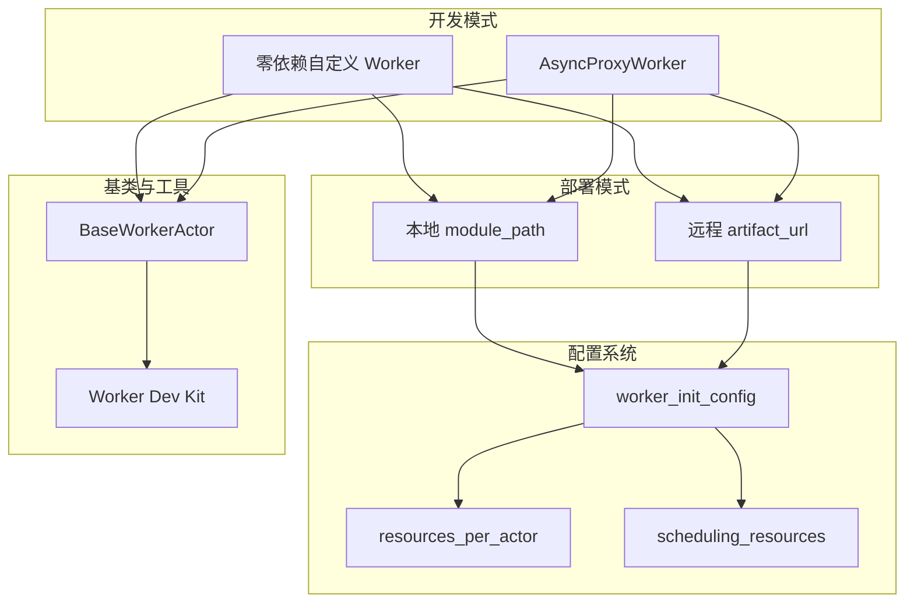
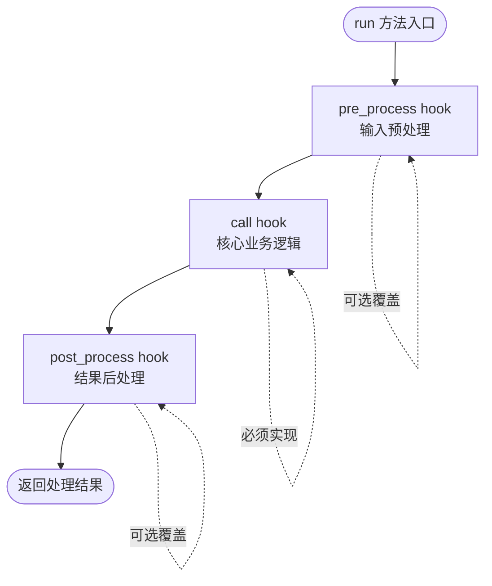
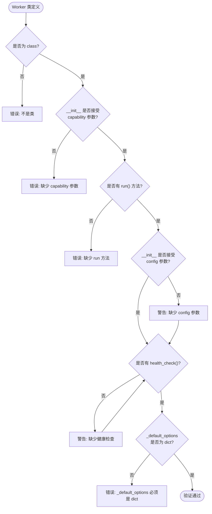
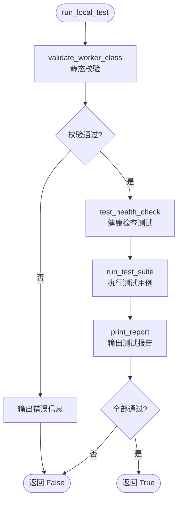
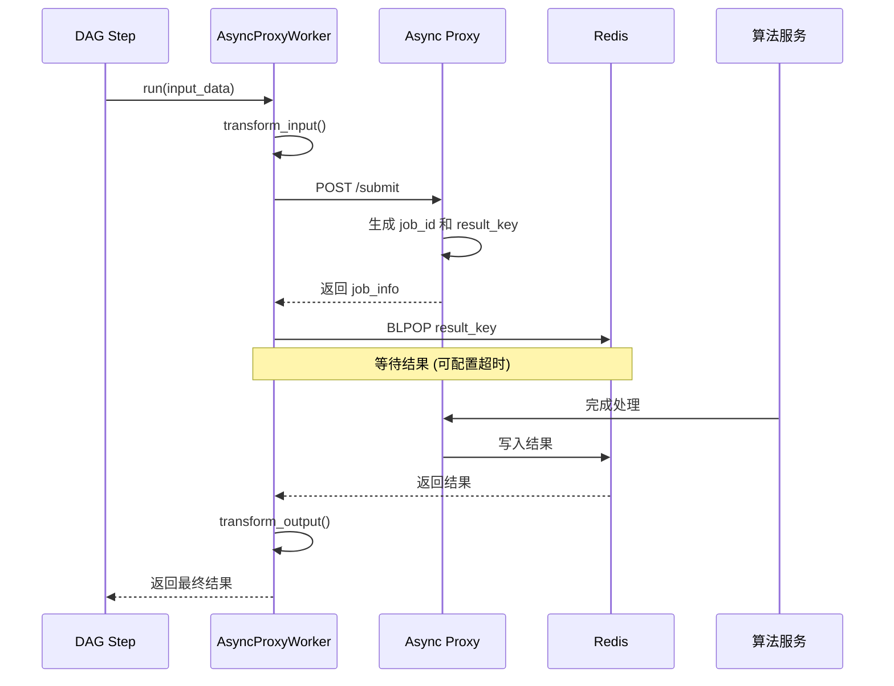
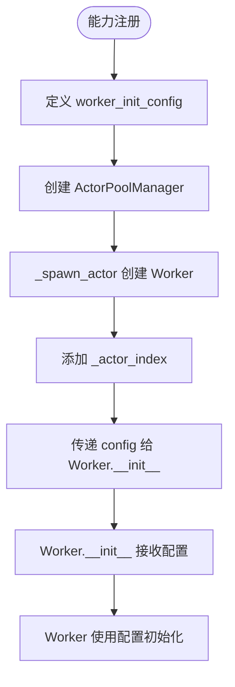
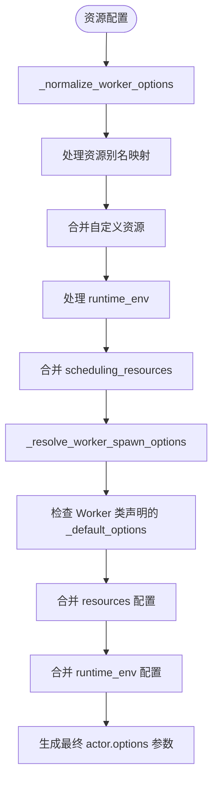
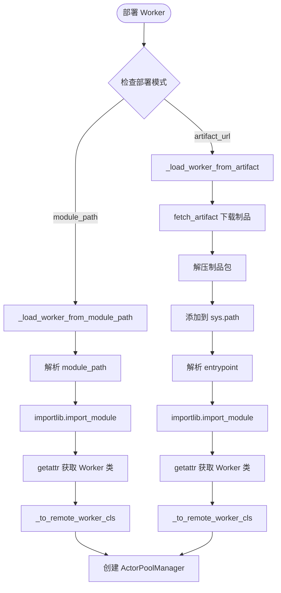

# Worker 开发

```cite
- [src/workload/base_worker_actor.py](src/workload/base_worker_actor.py)
- [src/workload/async_proxy_worker.py](src/workload/async_proxy_worker.py)
- [src/workload/worker_dev_kit.py](src/workload/worker_dev_kit.py)
- [examples/custom_worker_example.py](examples/custom_worker_example.py)
- [examples/async_proxy_worker_example.py](examples/async_proxy_worker_example.py)
- [src/models/capability.py](src/models/capability.py)
- [src/workload/scheduler_actor.py](src/workload/scheduler_actor.py)
- [src/workload/actor_pool_manager.py](src/workload/actor_pool_manager.py)
- [src/platform/remote_code_fetcher.py](src/platform/remote_code_fetcher.py)
- [tests/fixtures/long_running_worker.py](tests/fixtures/long_running_worker.py)
```

## 引言

Worker 开发是构建 Ray Async 平台 AI 能力的核心环节。开发者可以通过两种主要方式创建 Worker：零依赖自定义 Worker 和基于 AsyncProxyWorker 的长耗时服务 Worker。这两种方式都遵循最小合约原则，开发者无需深入了解框架内部实现，只需关注业务逻辑本身。本文档将详细介绍 Worker 的开发模式、配置机制、部署方式以及完整的示例代码。

## 架构概述

Worker 开发架构围绕两个核心维度展开：开发模式和部署模式。开发模式提供零依赖自定义和 AsyncProxyWorker 两种路径，分别适用于不同场景；部署模式支持本地模块路径和远程制品两种方式，满足不同环境下的代码交付需求。配置系统通过 worker_init_config、resources_per_actor 和 scheduling_resources 等参数，为 Worker 提供灵活的初始化配置和资源声明能力。



**图表来源**
- [src/workload/base_worker_actor.py](src/workload/base_worker_actor.py#l1-l60)
- [src/workload/async_proxy_worker.py](src/workload/async_proxy_worker.py#l1-l150)
- [src/models/capability.py](src/models/capability.py#l36-l80)

Worker 的核心设计理念是零依赖和最小合约。零依赖模式允许开发者完全脱离框架依赖，只需实现简单的 `__init__`、`run` 和可选的 `health_check` 方法。AsyncProxyWorker 则为长耗时服务场景提供了即用型基类，自动处理 Redis 和 Proxy 交互细节。Worker Dev Kit 提供本地验证和测试工具，确保 Worker 在部署前符合框架契约。

## BaseWorkerActor 基类

### 三阶段 Hook 模式

BaseWorkerActor 采用模板方法模式，将任务执行流程划分为三个明确的阶段：pre_process、call 和 post_process。这种设计使开发者能够在不同阶段注入自定义逻辑，同时保持整体流程的清晰性和可维护性。

`_BaseWorkerActorImpl` 是未装饰的实现类，采用 "unwrapped impl + ray.remote() wrap" 模式，使子类可以普通 Python 继承，避免直接使用 Ray 的内部 API。`run()` 方法作为模板方法，按顺序调用三个 hook 方法，确保处理流程的一致性。



**图表来源**
- [src/workload/base_worker_actor.py](src/workload/base_worker_actor.py#l18-l60)

### Hook 方法详解

`pre_process()` hook 在核心业务逻辑执行前调用，默认直接透传输入数据。开发者可以覆盖此方法实现输入数据的预处理逻辑，例如图片下载、base64 编码、参数验证等。该方法接收原始输入数据字典，返回处理后的数据字典。

`call()` hook 是核心业务逻辑的执行点，子类必须实现此方法。该方法接收经过 pre_process 处理的数据，执行实际的业务计算或服务调用，并返回原始结果。这是 Worker 最核心的处理逻辑所在。

`post_process()` hook 在核心业务逻辑执行后调用，默认直接透传原始结果。开发者可以覆盖此方法实现结果的后处理逻辑，例如数据格式转换、字段过滤、临时资源清理等。该方法接收 call() 返回的原始结果，返回最终输出。

### 健康检查机制

`health_check()` 方法提供 Worker 的健康状态检查能力，默认返回 `{"status": "healthy"}`。框架会定期调用此方法来监控 Worker 的运行状态，开发者可以覆盖此方法实现自定义的健康检查逻辑，例如检查依赖服务的可达性、资源使用情况等。

## 自定义 Worker 开发

### 零依赖开发模式

零依赖开发模式是 Worker 开发的最灵活方式。开发者不需要继承任何框架类，也不需要导入任何框架模块，只需实现最小合约即可。这种模式特别适合需要完全控制业务逻辑或希望保持代码独立性的场景。

最小合约要求 Worker 类满足以下条件：必须是一个类、`__init__` 方法必须接受 `capability` 参数、必须实现 `run()` 方法。推荐 `__init__` 方法也接受 `config` 参数以接收 worker_init_config，推荐实现 `health_check()` 方法。



**图表来源**
- [src/workload/worker_dev_kit.py](src/workload/worker_dev_kit.py#l20-l70)

### 身份证识别 Worker 示例

`IDCardRecognitionWorker` 展示了零依赖开发模式的完整实现。该 Worker 实现身份证识别功能，通过 `config` 接收服务 URL、超时和重试次数等配置。`run()` 方法处理识别请求，包括模拟下载图片、base64 编码、调用识别服务和后处理结果。`health_check()` 方法检查识别服务的可达性。

```python
class IDCardRecognitionWorker:
    """身份证识别 Worker — 零依赖实现。"""
    
    _default_options = {"num_cpus": 1}
    
    def __init__(self, capability: str, config: dict[str, Any] | None = None):
        self.capability = capability
        self.config = config or {}
        self.service_url = self.config.get("service_url", "http://localhost:8080/recognize")
        self.timeout = int(self.config.get("timeout", 30))
        self.retry_count = int(self.config.get("retry_count", 2))
        self._processed_count = 0
    
    def run(self, input_data: dict[str, Any]) -> dict[str, Any]:
        """处理单个识别请求。"""
        image_url = input_data.get("image_url")
        if not image_url:
            return {"status": "error", "error": "missing image_url in input_data"}
        
        image_bytes = self._download_image(image_url)
        image_b64 = base64.b64encode(image_bytes).decode("utf-8")
        recognition_result = self._call_recognition_service(image_b64)
        
        self._processed_count += 1
        return {
            "status": "success",
            "image_url": image_url,
            "recognition": recognition_result,
            "processed_count": self._processed_count,
        }
    
    def health_check(self) -> dict[str, Any]:
        """检查识别服务可达性。"""
        return {
            "status": "healthy",
            "service_url": self.service_url,
            "processed_count": self._processed_count,
        }
```

**图表来源**
- [examples/custom_worker_example.py](examples/custom_worker_example.py#l20-l80)

### Worker Dev Kit 验证

Worker Dev Kit 提供了 `validate_worker_class()` 静态校验函数和 `WorkerTestHarness` 测试工具，帮助开发者在部署前验证 Worker 类的合约符合性。`validate_worker_class()` 检查类结构、方法签名和属性类型，返回详细的验证结果。`WorkerTestHarness` 可以直接实例化 Worker 类并执行本地测试，包括健康检查和自定义测试用例。



**图表来源**
- [src/workload/worker_dev_kit.py](src/workload/worker_dev_kit.py#l100-l180)

## AsyncProxyWorker 长耗时服务

### 设计原理

AsyncProxyWorker 是专门为长耗时下游服务设计的即用型 Worker 基类。它屏蔽了 Redis 和 Proxy 的交互细节，使开发者能够专注于业务逻辑。AsyncProxyWorker 继承自 `_BaseWorkerActorImpl`，实现了完整的异步回调语义，通过 Proxy 提交请求并使用 BLPOP 等待结果。



**图表来源**
- [src/workload/async_proxy_worker.py](src/workload/async_proxy_worker.py#l90-l160)

### 类属性配置

AsyncProxyWorker 提供多个类属性供子类覆盖，以配置 Worker 的行为。`backend_path` 指定算法服务的 API 路径，这是必填项。`timeout` 设置等待结果的最长秒数，默认为 300 秒。`http_method` 指定转发 HTTP 方法，默认为 "POST"。`_default_options` 声明 Ray actor 的资源需求，如 CPU 和 GPU 数量。

### 配置注入

AsyncProxyWorker 通过 `config` 参数接收平台自动注入的配置，包括 `proxy_url` 或 `proxy_urls`、`redis_url` 和 `timeout`。`proxy_url` 指定单个后端地址，适用于 K8s Service 或 DNS LB 场景。`proxy_urls` 是多后端地址列表，actor 会按 `_actor_index` 取模分配到不同后端，实现负载均衡。`redis_url` 是 Redis 连接地址，与 Proxy 使用同一套 Redis。

### 输入输出转换

`transform_input()` hook 允许开发者将 DAG step 传入的 input_data 转换为算法服务需要的格式。默认直接透传输入数据。`transform_output()` hook 允许开发者从算法服务返回的业务数据中提取需要的字段，转换为 DAG 下游需要的格式。参数 `proxy_result` 是算法服务返回的业务数据（已去掉 proxy 包装层），默认直接透传。

### 异常处理

AsyncProxyWorker 定义了三种自定义异常类型，用于区分不同类型的错误。`ProxyBackendError` 表示下游算法服务返回的业务错误，由上层决定是否重试或走 fallback 路径。`ProxySubmitError` 表示 Proxy 提交失败，通常是网络或 Proxy 服务异常。`ProxyTimeoutError` 表示等待下游结果超时。所有异常都包含 `job_id` 字段，便于追踪和调试。

### 视频生成 Worker 示例

`VideoGenWorker` 展示了 AsyncProxyWorker 的最简用法，只需设置 `backend_path` 即可。`OCRWorker` 展示了带输入输出转换的用法，覆盖了 `transform_input()` 和 `transform_output()` 方法。`ImageUpscaleWorker` 展示了自定义超时和 HTTP 方法的用法，使用 GET 请求和 600 秒超时。

```python
class VideoGenWorker(AsyncProxyWorker):
    """视频生成 Worker — 仅需声明 backend_path。"""
    backend_path = "/generate"


class OCRWorker(AsyncProxyWorker):
    """OCR Worker — 带输入格式转换。"""
    backend_path = "/ocr"
    timeout = 60
    
    def transform_input(self, input_data: dict[str, Any]) -> dict[str, Any]:
        """将平台标准输入转换为算法服务需要的格式。"""
        return {
            "image_url": input_data["url"],
            "lang": input_data.get("lang", "zh"),
            "output_format": "json",
        }
    
    def transform_output(self, proxy_result: dict[str, Any]) -> dict[str, Any]:
        """从算法返回结果中提取需要的字段。"""
        return {
            "text": proxy_result.get("text", ""),
            "confidence": proxy_result.get("confidence", 0.0),
        }
```

**图表来源**
- [examples/async_proxy_worker_example.py](examples/async_proxy_worker_example.py#l20-l70)

## Worker 配置

### worker_init_config 传递

`worker_init_config` 是在能力注册时传递给 Worker 的静态配置字典，通过 `ActorConfig` 的 `worker_init_config` 字段定义。在创建 Worker Actor 时，框架会将此配置传递给 Worker 的 `__init__` 方法的 `config` 参数。对于多 actor 场景，框架会为每个 actor 添加 `_actor_index` 字段，标识 actor 在池中的索引。



**图表来源**
- [src/workload/actor_pool_manager.py](src/workload/actor_pool_manager.py#l340-l360)
- [src/models/capability.py](src/models/capability.py#l56-l57)

### 配置使用示例

在 Worker 的 `__init__` 方法中，开发者可以通过 `self.config.get()` 方法获取配置参数。例如，`IDCardRecognitionWorker` 从 config 中获取 `service_url`、`timeout` 和 `retry_count`。`AsyncProxyWorker` 从 config 中获取 `proxy_url`、`proxy_urls`、`redis_url` 和 `timeout`。这些配置参数在能力注册时由运营或开发者填写，通过框架自动注入到 Worker 实例中。

### 资源声明配置

`resources_per_actor` 声明每个 Worker Actor 的资源需求，包括 CPU、GPU、内存等。框架支持常见资源写法的别名映射，如 `cpu`/`cpus` 映射为 `num_cpus`，`gpu`/`gpus` 映射为 `num_gpus`，`memory_mb`/`mem_mb` 映射为 `memory`（单位转换为字节）。自定义资源会合并到 Ray actor options 的 `resources` 字段中。

`scheduling_resources` 声明 Worker Actor 需要的自定义调度资源，用于节点亲和调度。例如，`{"env_video_gen": 1.0}` 表示每个 Actor 需要 1 单位 `env_video_gen` 资源。ResourceManager 会选择拥有该资源的节点部署 Actor，确保 Worker 运行在合适的环境中。`scheduling_resources` 会被合并到 Ray actor options 的 `resources` 字段中，作为调度约束。



**图表来源**
- [src/workload/scheduler_actor.py](src/workload/scheduler_actor.py#l520-l620)
- [src/models/capability.py](src/models/capability.py#l53-l65)

### 资源优先级

资源配置采用双路径优先级机制：Worker 类声明的 `_default_options` 优先，配置作为缺省兜底。对于 `resources` 字段，声明的资源会覆盖配置中的同名资源。对于 `runtime_env`，Worker 类声明的环境需求作为 base，配置侧作为 override，两者 deep merge，保证 Worker 声明的 pip 依赖不会被配置侧遗漏覆盖。

## 部署方式

### 本地 module_path 模式

本地 module_path 模式适用于 Worker 代码与平台代码在同一代码库中的场景。开发者只需在 `ActorConfig` 中指定 `module_path`，格式为 `module.path:ClassName`。框架会通过 Python 的 import 机制加载 Worker 类，并使用 `ray.remote()` 包装成 Ray actor。



**图表来源**
- [src/workload/scheduler_actor.py](src/workload/scheduler_actor.py#l634-l680)
- [src/platform/remote_code_fetcher.py](src/platform/remote_code_fetcher.py#l80-l150)

### 远程 artifact_url 模式

远程 artifact_url 模式适用于 Worker 代码与平台代码分离的场景。开发者将 Worker 代码打包为 tar.gz 制品，上传到可访问的 HTTP/HTTPS 地址。在 `ActorConfig` 中指定 `artifact_url`、`artifact_sha256` 和 `entrypoint`。框架会通过 `RemoteCodeFetcher` 下载制品、校验 SHA256、解压并缓存，然后从制品中加载 Worker 类。

### 制品下载与缓存

`fetch_artifact()` 函数实现了完整的制品获取管线。首先根据 URL 和 SHA256 计算缓存 key，检查本地缓存是否已存在并标记为 ready。如果缓存未命中，下载制品包到临时目录，校验 SHA256 和文件大小限制，解压到缓存目录，并写入 `.ready` 标记。`gc_artifact_cache()` 函数按目录修改时间做简单缓存淘汰，避免制品缓存无限增长。

### 入口点解析

`extract_entrypoint()` 函数解析入口点字符串，格式为 `module.path:ClassName`。函数会验证格式正确性，提取模块名和类名。在 `_load_worker_from_artifact()` 中，使用 `importlib.import_module()` 导入模块，通过 `getattr()` 获取 Worker 类，最后使用 `_to_remote_worker_cls()` 包装成 Ray actor。

### 配置验证

`ActorConfig` 的 model_validator 会验证 artifact 模式的必填字段。如果设置了 `artifact_url`，则必须同时设置 `entrypoint` 和 `artifact_sha256`。`artifact_sha256` 必须是 64 位十六进制字符串。这些验证确保了制品部署模式的完整性和安全性。

## 示例代码

### 完整自定义 Worker 示例

```python
"""身份证识别零依赖 Wrapper 示例。"""

from __future__ import annotations

import base64
import hashlib
from typing import Any


class IDCardRecognitionWorker:
    """身份证识别 Worker — 零依赖实现。"""
    
    _default_options = {"num_cpus": 1}
    
    def __init__(self, capability: str, config: dict[str, Any] | None = None):
        self.capability = capability
        self.config = config or {}
        self.service_url = self.config.get("service_url", "http://localhost:8080/recognize")
        self.timeout = int(self.config.get("timeout", 30))
        self.retry_count = int(self.config.get("retry_count", 2))
        self._processed_count = 0
    
    def run(self, input_data: dict[str, Any]) -> dict[str, Any]:
        """处理单个识别请求。"""
        image_url = input_data.get("image_url")
        if not image_url:
            return {"status": "error", "error": "missing image_url in input_data"}
        
        image_bytes = self._download_image(image_url)
        image_b64 = base64.b64encode(image_bytes).decode("utf-8")
        recognition_result = self._call_recognition_service(image_b64)
        
        self._processed_count += 1
        return {
            "status": "success",
            "image_url": image_url,
            "recognition": recognition_result,
            "processed_count": self._processed_count,
        }
    
    def health_check(self) -> dict[str, Any]:
        """检查识别服务可达性。"""
        return {
            "status": "healthy",
            "service_url": self.service_url,
            "processed_count": self._processed_count,
        }
    
    def _download_image(self, image_url: str) -> bytes:
        """模拟下载图片。"""
        return f"fake-image-from-{image_url}".encode()
    
    def _call_recognition_service(self, image_b64: str) -> dict[str, Any]:
        """模拟调用识别服务。"""
        digest = hashlib.md5(image_b64.encode()).hexdigest()
        return {
            "name": "张三",
            "id_number": f"110***{digest[:6]}",
            "confidence": 0.97,
        }


if __name__ == "__main__":
    config = {
        "service_url": "http://idcard-service:8080/recognize",
        "timeout": 30,
    }
    worker = IDCardRecognitionWorker(capability="idcard_recognition", config=config)
    
    hc = worker.health_check()
    assert hc["status"] == "healthy"
    print(f"[PASS] health_check: {hc}")
    
    test_cases = [
        {"image_url": "https://oss.example.com/idcard_front_001.jpg"},
        {"image_url": "https://oss.example.com/idcard_front_002.jpg"},
    ]
    for i, tc in enumerate(test_cases):
        result = worker.run(tc)
        assert result["status"] == "success"
        print(f"[PASS] case_{i}: {result['recognition']}")
    
    print(f"\nAll tests passed!")
```

**图表来源**
- [examples/custom_worker_example.py](examples/custom_worker_example.py#l1-l120)

### 完整 AsyncProxyWorker 示例

```python
"""AsyncProxyWorker 使用示例 — 极简长耗时服务 Worker。"""

from __future__ import annotations

from typing import Any

from src.workload.async_proxy_worker import AsyncProxyWorker


class VideoGenWorker(AsyncProxyWorker):
    """视频生成 Worker — 仅需声明 backend_path。"""
    backend_path = "/generate"


class OCRWorker(AsyncProxyWorker):
    """OCR Worker — 带输入格式转换。"""
    backend_path = "/ocr"
    timeout = 60
    
    def transform_input(self, input_data: dict[str, Any]) -> dict[str, Any]:
        """将平台标准输入转换为算法服务需要的格式。"""
        return {
            "image_url": input_data["url"],
            "lang": input_data.get("lang", "zh"),
            "output_format": "json",
        }
    
    def transform_output(self, proxy_result: dict[str, Any]) -> dict[str, Any]:
        """从算法返回结果中提取需要的字段。"""
        return {
            "text": proxy_result.get("text", ""),
            "confidence": proxy_result.get("confidence", 0.0),
        }


class ImageUpscaleWorker(AsyncProxyWorker):
    """图像超分 Worker — GET 请求 + 长超时。"""
    backend_path = "/upscale"
    timeout = 600
    http_method = "GET"
    
    _default_options = {"num_cpus": 1, "num_gpus": 0.5}


if __name__ == "__main__":
    from src.workload.worker_dev_kit import run_local_test
    
    run_local_test(
        VideoGenWorker,
        test_inputs=[{"prompt": "一只猫在弹钢琴", "duration": 10}],
        config={"proxy_url": "http://localhost:5000"},
    )
```

**图表来源**
- [examples/async_proxy_worker_example.py](examples/async_proxy_worker_example.py#l1-l90)

### 长耗时服务 Worker 示例

```python
"""长耗时服务 Worker 示例 — 视频生成（零依赖 + Async Proxy 模式）。"""

from __future__ import annotations

import json
import time
from typing import Any


class VideoGenWorker:
    """视频生成 Worker — 长耗时服务标准模板。"""
    
    _default_options = {"num_cpus": 1}
    
    def __init__(self, capability: str, config: dict[str, Any] | None = None):
        self.capability = capability
        self.config = config or {}
        self.proxy_url = self.config.get("proxy_url", "http://localhost:5000")
        self.backend_path = self.config.get("backend_path", "/")
        self.redis_url = self.config.get("redis_url", "redis://localhost:6379/0")
        self.timeout = int(self.config.get("timeout", 300))
        self._redis = None
        self._processed_count = 0
    
    def _get_redis(self):
        if self._redis is None:
            import redis
            self._redis = redis.from_url(self.redis_url, decode_responses=True)
        return self._redis
    
    def run(self, input_data: dict[str, Any]) -> dict[str, Any]:
        """处理单个视频生成请求。"""
        import requests
        
        submit_payload = {
            "_backend_path": self.backend_path,
            **input_data,
        }
        try:
            resp = requests.post(
                f"{self.proxy_url}/submit",
                json=submit_payload,
                timeout=5,
            )
            resp.raise_for_status()
        except Exception as e:
            return {"status": "error", "error": f"submit failed: {e}"}
        
        job_info = resp.json()
        job_id = job_info["job_id"]
        result_key = job_info["result_key"]
        
        try:
            r = self._get_redis()
            pair = r.blpop(result_key, timeout=self.timeout)
        except Exception as e:
            self._redis = None
            return {
                "status": "error",
                "error": f"redis error during BLPOP: {e}",
                "job_id": job_id,
            }
        
        if pair is None:
            return {
                "status": "error",
                "error": f"timeout waiting for result after {self.timeout}s",
                "job_id": job_id,
            }
        
        result = json.loads(pair[1])
        self._processed_count += 1
        
        if result.get("status") == "success":
            return {
                "status": "success",
                "data": result.get("data"),
                "job_id": job_id,
                "elapsed": result.get("elapsed"),
            }
        
        return {
            "status": "error",
            "error": result.get("error") or result.get("message"),
            "job_id": job_id,
        }
    
    def health_check(self) -> dict[str, Any]:
        """检查 Proxy 和 Redis 可达性。"""
        import requests
        
        proxy_ok = False
        redis_ok = False
        
        try:
            resp = requests.get(f"{self.proxy_url}/health", timeout=5)
            proxy_ok = resp.json().get("healthy", False)
        except Exception:
            pass
        
        try:
            self._get_redis().ping()
            redis_ok = True
        except Exception:
            pass
        
        return {
            "status": "healthy" if proxy_ok and redis_ok else "unhealthy",
            "proxy_ok": proxy_ok,
            "redis_ok": redis_ok,
            "processed_count": self._processed_count,
        }
```

**图表来源**
- [tests/fixtures/long_running_worker.py](tests/fixtures/long_running_worker.py#l20-l130)