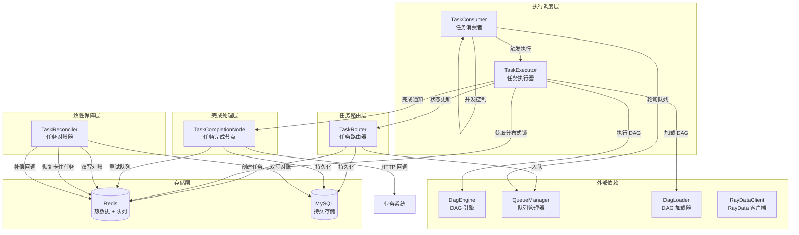
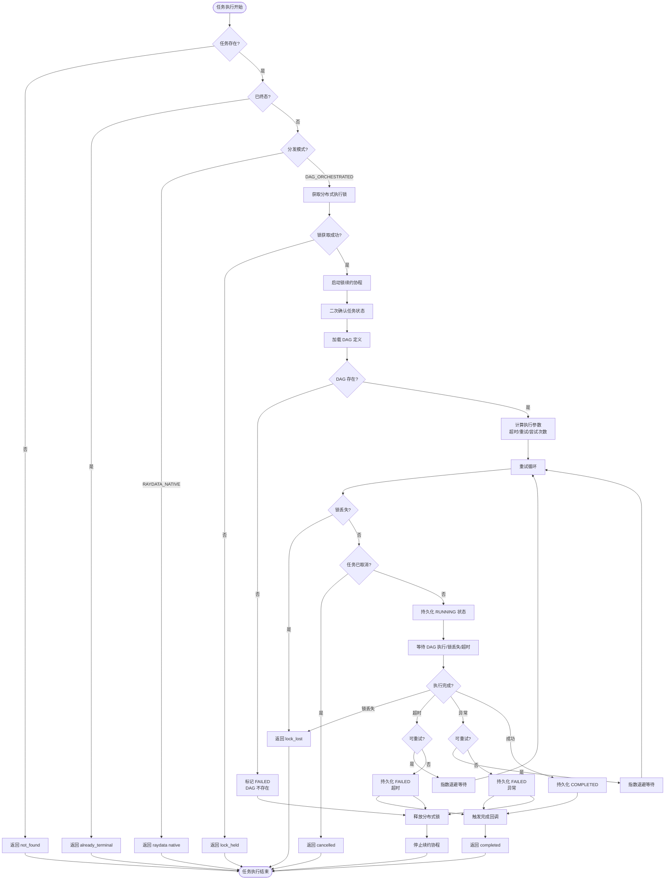
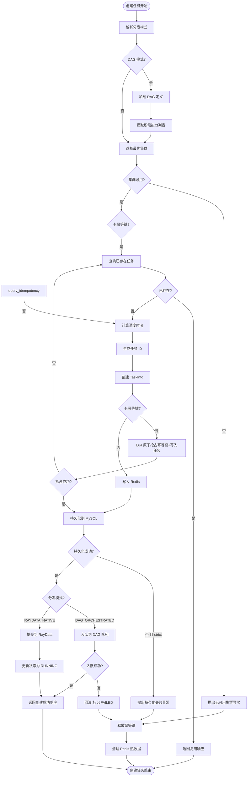
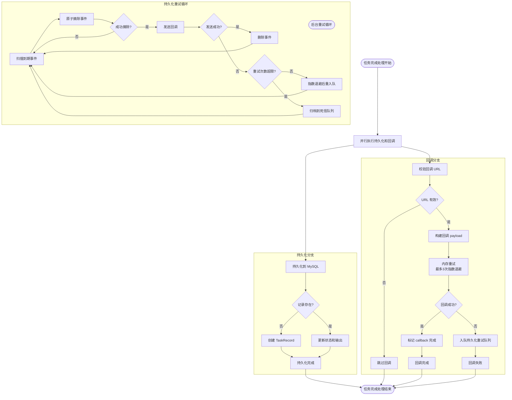
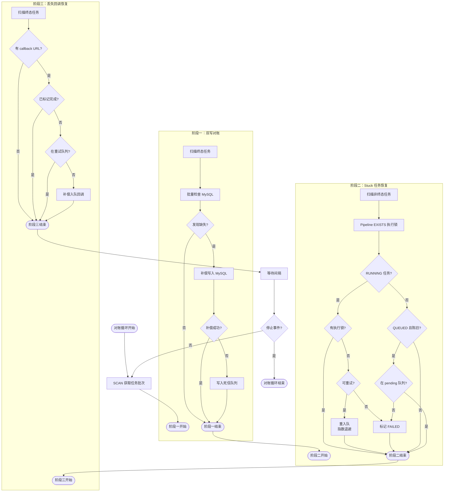
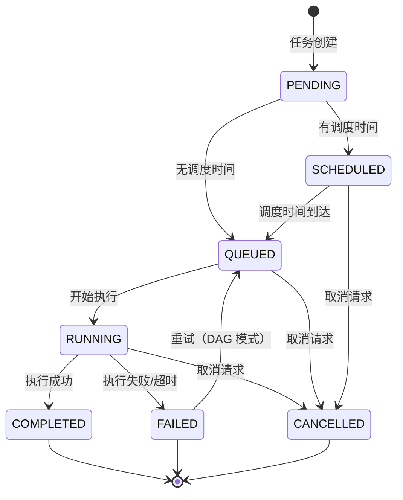
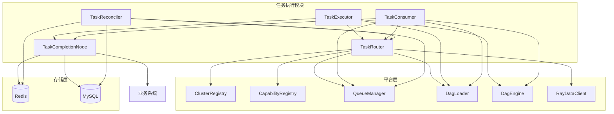

```cite
- [src/platform/task_executor.py](src/platform/task_executor.py)
- [src/platform/task_consumer.py](src/platform/task_consumer.py)
- [src/platform/task_router.py](src/platform/task_router.py)
- [src/platform/task_completion_node.py](src/platform/task_completion_node.py)
- [src/platform/task_reconciler.py](src/platform/task_reconciler.py)
- [src/models/task.py](src/models/task.py)
- [src/platform/dag_engine.py](src/platform/dag_engine.py)
```

# 任务执行

## 引言

任务执行模块是分布式任务编排系统的核心执行引擎，负责从任务创建到最终完成的全生命周期管理。该模块通过分布式锁、状态机、队列调度、重试机制和对账补偿等多层保障机制，确保任务在分布式环境下的可靠执行和最终一致性。本文档将详细阐述任务执行的完整流程、关键组件设计、状态流转机制以及容错策略。

## 架构概述

任务执行模块采用分层架构设计，由任务路由器、任务执行器、任务消费者、任务完成节点和任务对账器五个核心组件构成。任务路由器负责任务的创建、路由和生命周期管理，通过分布式锁和幂等性保证防止重复执行；任务执行器负责单个任务的完整执行流程，包括锁获取、DAG 加载、重试循环和超时控制；任务消费者实现公平的队列调度和并发控制，持续从队列中拉取任务并触发执行；任务完成节点负责终态持久化和 HTTP 回调通知，采用两级重试机制确保回调送达；任务对账器通过三阶段一致性修复循环，保障 Redis 与 MySQL 之间的数据一致性，并恢复卡住的任务和丢失的回调。



**图表来源**
- [task_executor.py](src/platform/task_executor.py#l1-l50)
- [task_consumer.py](src/platform/task_consumer.py#l1-l50)
- [task_router.py](src/platform/task_router.py#l1-l50)
- [task_completion_node.py](src/platform/task_completion_node.py#l1-l50)
- [task_reconciler.py](src/platform/task_reconciler.py#l1-l50)

## 核心组件分析

### 任务执行器

任务执行器（`TaskExecutor`）是单个任务执行的核心服务层，负责从任务开始到结束的完整执行流程。其核心职责包括获取分布式执行锁、加载 DAG 定义、驱动 DAG 引擎执行、处理超时和异常、检测取消信号以及触发完成回调。执行器通过后台协程定期续约锁，防止长时间任务锁过期被其他节点抢占，同时在执行全过程中持续检测锁丢失事件，实现快速响应。

执行流程采用重试循环机制，支持指数退避重试策略。每次尝试执行 DAG 前都会检查锁是否丢失，并验证任务状态是否允许继续执行。DAG 执行采用 `asyncio.wait` 并行等待 DAG 完成、锁丢失事件和超时三种情况，任一条件触发即返回。执行成功后持久化 COMPLETED 状态并触发完成回调，失败时根据剩余重试次数决定继续重试或标记 FAILED。整个流程在 finally 块中释放分布式锁，确保锁资源不会泄漏。



**图表来源**
- [task_executor.py](src/platform/task_executor.py#l60-l300)

#### 分布式锁管理

任务执行器使用 Redis 实现分布式执行锁，确保同一任务在集群中只有一个执行者。锁采用 SET NX 命令获取，设置 TTL（租约时长）防止死锁，并通过后台协程定期续约（`renew_interval_seconds` 必须远小于 `lease_seconds`）避免长时间任务锁过期。续约失败时设置 `lock_lost` 事件，通知主执行流程立即终止，避免在无锁状态下继续执行产生脏数据。锁的释放使用 Lua 脚本实现 compare-and-delete 语义，仅当锁值匹配 token 时才删除，防止误释放他人持有的锁。

#### 超时控制

任务执行支持任务级和 DAG 级两级超时配置。任务级超时（`task.timeout_seconds`）优先于 DAG 级默认超时（`dag.timeout_seconds`）。执行时通过 `asyncio.wait` 的 timeout 参数实现超时控制，超时触发 `asyncio.TimeoutError`。在重试循环中，非最后一次尝试的超时会继续重试，最后一次超时则标记任务为 FAILED。超时控制的实现确保了任务不会无限期阻塞执行槽位，同时为短暂的网络抖动或资源紧张提供重试机会。

#### 取消信号检测

任务执行器在多个关键点检测取消信号：获取锁后二次确认任务状态、每次重试前的退避等待后、以及 DAG 执行期间。如果检测到任务状态已变为 CANCELLED，立即终止执行并返回 cancelled 状态。这种多层次的取消检测机制确保了取消请求能够快速响应，避免无效的计算资源消耗。

### 任务路由器

任务路由器（`TaskRouter`）负责任务的创建、路由、状态管理和生命周期控制。其核心职责包括解析分发模式（DAG 编排或 RayData 直连）、选择最优集群、幂等性保证、任务持久化、入队或提交 RayData 以及错误回滚。路由器通过 Lua 脚本实现原子操作，防止并发覆盖和终态篡改，确保任务状态的一致性。

任务创建采用多步事务流程：首先解析分发模式并加载 DAG 定义提取所需能力列表，然后选择最优集群（静态映射 → 能力匹配 → 队列负载均衡），接着进行幂等性检查（如提供了 `idempotency_key`），计算调度时间（支持 `scheduled_at` 或 `delay_seconds`），通过 Redis SET NX 抢占幂等键，创建 `TaskInfo` 并持久化到 Redis + MySQL，最后根据分发模式入队或提交 RayData。任何步骤失败都会触发回滚，包括释放幂等键、清理 Redis 热数据或回写 FAILED 状态。



**图表来源**
- [task_router.py](src/platform/task_router.py#l100-l300)

#### 幂等性保证

任务路由器通过 Redis SET NX 实现幂等性保证。当客户端提供 `idempotency_key` 时，路由器首先查询是否已存在相同幂等键的任务，如存在则直接返回复用响应。创建新任务时，使用 Lua 脚本 `_lua_reserve_and_write` 原子性地执行幂等键抢占和任务记录写入，避免"先 SET NX 再 SET"的多轮 Redis 往返，同时保证 CAS 失败时零副作用。幂等键的格式为 `task_idempotency:{task_type}:{key}`，设置 TTL 避免永久占用。任何异常都会触发幂等键释放，允许后续重试创建任务。

#### 分布式锁管理

任务路由器提供执行锁的获取、续约和释放操作。`acquire_execution_lock` 使用 Redis SET NX 获取锁，设置租约时长并返回 token；`renew_execution_lock` 使用 Lua 脚本 `_lua_renew_lock` 实现原子 compare-and-expire 续约，仅当锁值匹配 token 时才续期；`release_execution_lock` 使用 Lua 脚本 `_lua_release_lock` 实现原子 compare-and-delete 释放，防止误释放他人持有的锁。这些操作配合任务执行器的后台续约协程，确保了分布式环境下的互斥执行。

#### 状态管理

任务路由器使用 Lua 脚本 `_lua_update_task` 实现原子状态更新，防止并发覆盖和终态篡改。脚本拒绝更新已终态（completed/failed/cancelled）的任务，防止状态回退。对于附加字段（如 attempt、output_data），脚本支持 JSON 反序列化和单调性保护（attempt 只增不减）。`update_task_status_with_lock` 方法增加了锁保护，仅当执行锁仍由当前 token 持有时才允许更新任务状态，简化了 fencing 机制。

### 任务消费者

任务消费者（`TaskConsumer`）是后台队列消费者，负责轮询 Redis 队列并自动取出到时间的任务触发执行。其核心职责包括公平调度、并发控制和陈旧任务修复。公平调度采用轮转（round-robin）策略，每轮每个队列最多出队一个任务，避免热点队列长期占满全局并发槽位。并发控制使用 `asyncio.Semaphore` + 显式计数器（`_available_slots`）双重保障，信号量控制实际并发，计数器用于调度循环中的快速判断。陈旧任务修复通过定期 reconcile running 集合，检测因进程崩溃/抢占导致的"假 running"任务，执行重入队或标记失败。

消费者采用自适应轮询策略：有任务分发时立即重拉并重置退避，空闲时指数退避 + 抖动避免多副本同步打 Redis。多副本部署时，只允许持有 Leader Lease 的副本执行 reconcile，避免并发对同一批 stale task 双重修复导致重复入队或配额放大。优雅停机时等待 in-flight 任务完成，超时后强制取消残留任务。

```mermaid
flowchart TD
    start([轮询循环开始]) --> discover_queues[发现活跃队列]
    discover_queues --> check_slots{有空闲槽位?}
    check_slots -->|否| wait_backoff[退避等待]
    check_slots -->|是| check_empty{队列非空?}
    check_empty -->|否| wait_backoff
    check_empty -->|是| round_robin[轮转调度<br/>每队列最多出队1个]
    
    round_robin --> batch_dequeue[批量并行出队]
    batch_dequeue --> process_results[处理出队结果]
    
    process_results --> task_found{找到任务?}
    task_found -->|否| check_progress{本轮有进展?}
    task_found -->|是| acquire_semaphore[获取信号量槽位]
    
    acquire_semaphore --> create_task[创建执行任务]
    create_task --> add_inflight[加入 in-flight 集合]
    add_inflight --> check_progress
    
    check_progress -->|有| reset_idle[重置空闲计数]
    check_progress -->|无| increment_idle[增加空闲计数]
    
    reset_idle --> discover_queues
    increment_idle --> calc_backoff[计算退避时间<br/>指数退避+抖动]
    calc_backoff --> wait_backoff
    
    wait_backoff --> check_running{仍在运行?}
    check_running -->|否| finish([轮询循环结束])
    check_running -->|是| discover_queues
    
    subgraph "陈旧任务修复"
        reconcile_loop([Reconcile 循环])
        acquire_lease[获取 Leader Lease]
        acquire_lease --> lease_held{持有租约?}
        lease_held -->|否| wait_retry[等待重试]
        lease_held -->|是| reconcile_slots[修复 running 槽位]
        reconcile_slots --> renew_lease[续约租约]
        renew_lease --> still_leader{仍是 Leader?}
        still_leader -->|是| reconcile_slots
        still_leader -->|否| wait_retry
        wait_retry --> acquire_lease
    end
```



**图表来源**
- [task_consumer.py](src/platform/task_consumer.py#l50-l350)

#### 公平调度

任务消费者的公平调度算法采用轮转策略。外层 while 循环在有空闲槽位且队列列表非空时持续调度，内层 for 循环逐个遍历所有 capability 队列，每队列最多出队一个任务。若某轮遍历所有队列后都没有出队（`made_progress=False`），跳出内层循环。这种 round-robin 策略确保了队列间的公平性，避免热点队列长期占满全局并发槽位。消费者还实现自适应退避机制，跳过连续 3 次空 dequeue 的队列（每 5 轮重新探测一次），减少无效扫描。

#### 并发控制

任务消费者使用 `asyncio.Semaphore` + 显式计数器（`_available_slots`）实现双重并发控制。信号量控制实际并发执行数，显式计数器用于调度循环中的快速判断，避免访问 Semaphore 私有属性。出队任务后先获取信号量槽位，同步递减显式计数器，然后创建执行任务并加入 in-flight 集合。任务完成后在 finally 块中释放信号量槽位，同步递增显式计数器。这种设计确保了并发数的精确控制，同时提供了调度循环中的快速判断路径。

#### 陈旧任务修复

任务消费者的陈旧任务修复通过定期 reconcile running 集合实现。修复策略分三层：1）任务记录已丢失 → 直接从 running 集合中移除；2）任务已到终态但 running 槽未释放 → 释放槽位；3）任务仍标记为 RUNNING 但执行锁已丢失 → DAG 任务且未超最大重试次数时指数退避后重入队，否则标记为 FAILED。修复过程使用批量化 Redis IO（MGET 全部任务记录 + pipeline EXISTS 全部执行锁），将 N 次串行往返压缩为 2 次往返，显著降低大规模 running 集合下的 reconcile 延迟。

### 任务完成节点

任务完成节点（`TaskCompletionNode`）负责任务终态收口，包括持久化和回调通知。其核心职责是将任务最终状态写入 MySQL（`TaskRecord`），确保即使 Redis 丢失也有持久记录，以及向业务方发送 HTTP 回调，采用两级重试机制确保最终一致性。节点使用共享的 `httpx.AsyncClient` 实例复用连接池，通过双检锁（double-checked locking）减少高并发回调时的锁竞争，同时校验客户端所属事件循环，检测到 loop 变更时主动重建客户端。

完成处理使用 `asyncio.gather` 并行执行 MySQL 写入和 HTTP 回调，两者互相独立，任一失败不影响另一个。回调通知采用两级重试策略：第一级（内存重试）使用 `async_retry` 进行最多 3 次指数退避重试，适合短暂网络抖动；第二级（持久化重试）在内存重试全部失败后，将回调事件写入 Redis ZSET 持久队列，由后台 `process_due_callbacks` 按到期时间批量拉取重试，支持长时间（数天）的最终一致性保证。



**图表来源**
- [task_completion_node.py](src/platform/task_completion_node.py#l50-l300)

#### 终态持久化

任务完成节点的终态持久化通过 `_persist_task_record` 方法实现，将任务终态写入 MySQL `TaskRecord` 表。若记录不存在则创建（首次持久化），否则更新状态和输出数据。方法采用同步设计，由 `asyncio.to_thread` 在线程池中调用，避免阻塞事件循环。持久化失败时记录错误日志但不影响回调通知，两者互相独立。这种设计确保了即使 Redis 丢失，MySQL 中仍有完整的任务记录，满足审计和追溯需求。

#### HTTP 回调通知

任务完成节点的 HTTP 回调通知通过 `_trigger_callback` 方法实现，采用两级重试策略。第一级使用 `async_retry` 进行最多 3 次指数退避重试，处理短暂网络抖动。回调请求通过 header 透传幂等性（`Idempotency-Key` 默认使用 task_id）和重试信息（`X-Retry-Attempt`），业务方可据此在服务端去重。第二级在内存重试全部失败后，通过 `enqueue_callback_retry` 将事件写入 Redis ZSET 持久队列，score 为下次重试时间戳。后台 `process_due_callbacks` 方法批量处理到期事件，成功后删除事件详情，失败时根据重试次数决定继续重试或归档到死信队列。

#### 两级重试机制

任务完成节点的两级重试机制确保了回调通知的最终一致性。第一级（内存重试）适合短暂的网络抖动或服务暂时不可用，重试间隔短（2s → 4s → 8s），响应快速。第二级（持久化重试）适合长时间的服务中断或大规模故障，重试间隔长（可配置，默认指数退避上限），支持数天的重试窗口。持久化重试队列使用 Redis ZSET 实现，score 为下次重试时间戳，支持按到期时间批量拉取。重试次数耗尽后归档到死信队列（保留 30 天），供人工审计和手动恢复。

### 任务对账器

任务对账器（`TaskReconciler`）实现三阶段一致性修复循环，保障任务系统在分布式环境下的最终一致性。阶段一（双写对账）扫描 Redis 中的终态任务，检查 MySQL 是否已持久化，缺失则补偿写入，解决 Redis→MySQL 双写时进程崩溃导致的数据不一致。阶段二（Stuck 任务恢复）扫描 RUNNING/QUEUED 状态的任务，检测执行锁是否已过期，锁过期说明 Worker 已死亡（如被潮汐集群回收），将任务标记为 FAILED 或重入队，支持节流控制避免大规模抢占时一次性产生过多失败标记导致下游过载。阶段三（丢失回调恢复）扫描终态任务的 callback 是否已发送完成，未完成且不在重试队列中的补偿入队，解决 handle_completion 进程崩溃导致 callback 丢失。

对账器使用统一的 SCAN 游标（`_scan_cursor`）共享给所有三个阶段，每个 reconcile tick 执行一次 SCAN 获取共享的 task 批次，然后依次执行三个阶段的修复，避免三次独立 SCAN 的性能开销。双写对账使用批量 IN 查询替代 N 次逐条 SELECT，提升 MySQL 查询效率。Stuck 任务恢复使用 Lua CAS 脚本原子标记任务状态，防止并发覆盖。丢失回调恢复通过检查 `callback:done:{task_id}` 标记和 `callback:retry:pending` 队列，识别需要补偿的回调事件。



**图表来源**
- [task_reconciler.py](src/platform/task_reconciler.py#l50-l400)

#### 双写对账

双写对账通过 `reconcile_batch` 方法实现，扫描 Redis 中的终态任务，检查 MySQL 是否已持久化，缺失则补偿写入。对账器使用增量游标扫描（`_scan_cursor`），多次调用可遍历全部 Redis 数据。批量检查 MySQL 存在性使用单次 IN 查询替代 N 次逐条 SELECT，提升查询效率。补偿失败的任务写入死信队列（`reconcile:dead_letter`），避免无限重试。DB 连接失败时采用保守策略：假设记录存在，不触发补偿，等待下一轮重试。

#### Stuck 任务恢复

Stuck 任务恢复通过 `reconcile_stuck_tasks` 方法实现，检测并标记卡住的任务为 FAILED。检测算法：RUNNING + 无执行锁 → Worker 已死亡（被潮汐集群回收/崩溃），DAG 任务且仍有重试预算时优先重入队，否则标记为 preemption 类型失败；QUEUED + 超过阈值时间 + 不在待处理队列中 → 任务在队列中丢失，标记为 infrastructure 类型失败。节流机制每个 tick 最多标记 `reconcile_stuck_max_per_tick` 个任务为 FAILED，防止大规模抢占时一次性产生过多失败标记导致下游过载。超出配额的任务计入 throttled，下个 tick 继续处理。

#### 丢失回调恢复

丢失回调恢复通过 `reconcile_lost_callbacks` 方法实现，补偿因 handle_completion 进程崩溃导致的 callback 丢失。扫描终态任务，检查是否有 callback URL 且未标记完成（`callback:done:{task_id}`）且不在重试队列（`callback:retry:pending`）中，满足条件的补偿入队。补偿过程使用 `enqueue_callback_retry` 方法，将事件写入 Redis ZSET 持久队列，score 为下次重试时间戳。这种设计确保了即使完成节点进程崩溃，回调事件也不会丢失，最终能够送达业务方。

### 任务状态机

任务状态机定义了任务生命周期的完整状态流转，包括 PENDING、SCHEDULED、QUEUED、RUNNING、COMPLETED、FAILED、CANCELLED 七个状态。状态转换遵循严格的单向流转规则，终态（COMPLETED、FAILED、CANCELLED）不可逆，通过 Lua 脚本实现原子状态更新，防止并发覆盖和终态篡改。状态转换的触发条件包括任务创建、调度时间到达、队列出队、执行开始/完成/失败、取消请求等。



**图表来源**
- [task.py](src/models/task.py#l20-l30)
- [task_router.py](src/platform/task_router.py#l200-l250)

#### 状态定义

任务状态通过 `TaskStatus` 枚举定义，包含七个状态：PENDING（待处理）、SCHEDULED（已调度）、QUEUED（已入队）、RUNNING（执行中）、COMPLETED（已完成）、FAILED（已失败）、CANCELLED（已取消）。PENDING 是任务的初始状态，在任务创建时设置。SCHEDULED 表示任务已创建但需等待调度时间到达，QUEUED 表示任务已入队等待执行，RUNNING 表示任务正在执行，COMPLETED、FAILED、CANCELLED 是三个终态，表示任务的最终结果。

#### 状态转换规则

状态转换遵循严格的单向流转规则。从 PENDING 可以转换到 SCHEDULED（有调度时间）或 QUEUED（无调度时间）。SCHEDULED 在调度时间到达后转换到 QUEUED。QUEUED 在开始执行时转换到 RUNNING。RUNNING 在执行成功时转换到 COMPLETED，执行失败或超时时转换到 FAILED，收到取消请求时转换到 CANCELLED。QUEUED 和 SCHEDULED 在收到取消请求时也可以直接转换到 CANCELLED。FAILED 在 DAG 模式下且仍有重试预算时可以转换回 QUEUED 进行重试。所有终态（COMPLETED、FAILED、CANCELLED）不可逆，通过 Lua 脚本实现原子状态更新，防止并发覆盖。

#### 终态保护

终态保护通过 Lua 脚本 `_lua_update_task` 实现，拒绝更新已终态的任务，防止状态回退。脚本检查当前状态是否为 COMPLETED、FAILED 或 CANCELLED，如果是则返回 -1 表示拒绝更新。这种设计确保了任务一旦到达终态，其状态就不会被意外修改，保证了数据的一致性和可追溯性。终态保护对于防止并发更新和异常情况下的状态回退至关重要。

### 任务分发模式

任务系统支持两种分发模式：DAG_ORCHESTRATED（DAG 编排）和 RAYDATA_NATIVE（RayData 原生）。两种模式在任务创建、执行流程、状态管理和容错策略上都有显著差异，适用于不同的业务场景。

#### DAG_ORCHESTRATED 模式

DAG_ORCHESTRATED 模式是默认的分发模式，适用于需要复杂编排和依赖管理的任务。任务创建时加载 DAG 定义，提取步骤所需的能力列表，选择最优集群，将任务入队到对应的 capability 队列。任务执行时获取分布式锁，加载 DAG 定义，通过 DagEngine 驱动步骤执行，支持重试、超时、取消等容错机制。任务完成后触发回调通知，由 TaskReconciler 进行双写对账和 stuck 任务恢复。该模式适用于需要多步骤协作、条件分支、Map-Reduce 等复杂编排场景。

#### RAYDATA_NATIVE 模式

RAYDATA_NATIVE 模式适用于直接提交到 RayData 执行的任务，通常由外部系统直接提交，无需通过 DAG 编排。任务创建时选择最优集群，直接通过 RayDataClient 提交任务，不经过队列调度。任务执行时不获取分布式锁，不加载 DAG 定义，直接返回 raydata native 状态。任务状态由 RayData 系统管理，任务系统仅记录状态变化和触发回调。该模式适用于与 RayData 深度集成的场景，如大规模数据处理、机器学习训练等。

#### 模式选择

分发模式通过 `TaskDispatchMode` 枚举定义，包括 DAG_ORCHESTRATED 和 RAYDATA_NATIVE 两个值。任务创建时可以通过 `dispatch_mode` 字段指定模式，如未指定则默认为 DAG_ORCHESTRATED。模式选择影响任务的整个生命周期，包括创建流程、执行路径、状态管理和容错策略。DAG_ORCHESTRATED 模式提供完整的编排能力，RAYDATA_NATIVE 模式提供简化的直连路径，用户可以根据业务需求选择合适的模式。

## 依赖分析

任务执行模块的各组件之间存在明确的依赖关系，形成层次化的架构。任务路由器依赖集群注册表、能力注册表、队列管理器和 DAG 加载器，负责任务的创建和路由。任务执行器依赖任务路由器、DAG 加载器、DAG 引擎和任务完成节点，负责单个任务的执行流程。任务消费者依赖任务路由器、队列管理器、DAG 加载器、DAG 引擎和任务完成节点，负责队列调度和并发控制。任务完成节点相对独立，仅依赖 MySQL 和 Redis，负责终态持久化和回调通知。任务对账器依赖任务路由器和队列管理器，负责一致性修复和 stuck 任务恢复。



**图表来源**
- [task_executor.py](src/platform/task_executor.py#l60-l80)
- [task_consumer.py](src/platform/task_consumer.py#l60-l90)
- [task_router.py](src/platform/task_router.py#l180-l210)
- [task_completion_node.py](src/platform/task_completion_node.py#l40-l60)
- [task_reconciler.py](src/platform/task_reconciler.py#l150-l180)