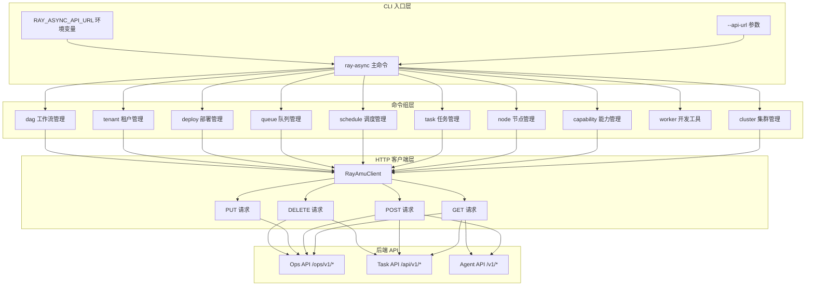

# 命令行工具

```cite
- [src/cli/main.py](src/cli/main.py)
- [src/cli/client.py](src/cli/client.py)
- [src/cli/commands/cluster.py](src/cli/commands/cluster.py)
- [src/cli/commands/capability.py](src/cli/commands/capability.py)
- [src/cli/commands/node.py](src/cli/commands/node.py)
- [src/cli/commands/task.py](src/cli/commands/task.py)
- [src/cli/commands/schedule.py](src/cli/commands/schedule.py)
- [src/cli/commands/queue.py](src/cli/commands/queue.py)
- [src/cli/commands/deploy.py](src/cli/commands/deploy.py)
- [src/cli/commands/tenant.py](src/cli/commands/tenant.py)
- [src/cli/commands/worker.py](src/cli/commands/worker.py)
- [src/cli/commands/dag.py](src/cli/commands/dag.py)
- [setup.py](setup.py)
```

## 引言

Ray Async 提供了一个功能完整的命令行工具（CLI），采用 kubectl 风格的命令结构设计，用于管理 Ray Async 平台的各个方面。该 CLI 工具允许用户通过命令行界面执行集群管理、能力注册、任务提交、节点操作、调度配置、队列监控、租户管理、DAG 工作流编排以及 Worker 开发测试等操作。所有命令都通过统一的 HTTP 客户端与 Ray Async API 服务进行交互，支持 JSON 格式的响应输出，便于与其他工具集成。

## 架构概述

CLI 工具采用模块化的命令组架构，基于 Click 框架构建。主入口点定义了全局配置选项（如 API URL），并注册了 11 个功能命令组。每个命令组负责特定的管理领域，内部包含多个子命令。所有命令共享统一的 HTTP 客户端实现，通过 RESTful API 与后端服务通信，并使用统一的错误处理和 JSON 格式化输出机制。



**图表来源**
- [src/cli/main.py](src/cli/main.py#l23-l43)
- [src/cli/client.py](src/cli/client.py#l20-l54)

## CLI 工具概述

Ray Async CLI 是一个 kubectl 风格的管理工具，通过 `ray-async` 命令提供统一的入口点。该工具支持通过命令行参数 `--api-url` 或环境变量 `RAY_ASYNC_API_URL` 配置 API 服务器地址，默认值为 `http://127.0.0.1:8000`。CLI 使用 Click 框架实现命令分组和参数解析，所有命令的输出都采用 JSON 格式，便于脚本处理和日志记录。

CLI 的核心设计理念包括：
- **模块化命令结构**：采用命令组（group）和子命令（command）的两级结构，便于功能扩展
- **统一错误处理**：所有 HTTP 错误都通过 `handle_api_error` 函数统一处理，提供清晰的错误信息
- **JSON 输出**：所有响应都通过 `print_json` 函数格式化输出，保持一致的输出格式
- **环境变量支持**：关键配置支持通过环境变量设置，便于在不同环境中使用

## 命令分组

CLI 工具包含 11 个主要命令组，每个命令组负责特定的管理领域：

### cluster - 集群管理

集群管理命令组提供 Ray 集群的注册、查询和下线功能。支持查看所有集群列表、获取特定集群详情、注册新集群以及将集群状态设置为 offline。该命令组通过 `/ops/v1/clusters` API 端点与后端交互。

**可用子命令**：
- `list`：列出所有集群
- `get <cluster_id>`：查看集群详情
- `register`：注册新集群
- `remove <cluster_id>`：下线集群

**图表来源**
- [src/cli/commands/cluster.py](src/cli/commands/cluster.py#l14-l66)

### capability - 能力管理

能力管理命令组用于管理平台上的能力配置，包括能力的注册、查询和删除。能力是任务执行的基本单元，每个能力绑定到特定的集群，并配置最大并发数和自动扩缩容参数。该命令组通过 `/ops/v1/capabilities` API 端点与后端交互。

**可用子命令**：
- `list`：列出所有能力
- `get <name>`：查看能力详情
- `register`：注册新能力
- `remove <name>`：删除能力

**图表来源**
- [src/cli/commands/capability.py](src/cli/commands/capability.py#l14-l73)

### node - 节点管理

节点管理命令组提供计算节点的分配、释放和排空操作。支持按状态过滤节点列表、查看节点详情、分配节点到指定集群、优雅或强制释放节点，以及排空节点上的任务。该命令组通过 `/ops/v1/nodes` API 端点与后端交互。

**可用子命令**：
- `list [--state]`：列出所有节点（可选按状态过滤）
- `get <node_id>`：查看节点详情
- `allocate`：分配节点到集群
- `release`：释放节点
- `drain`：排空节点

**图表来源**
- [src/cli/commands/node.py](src/cli/commands/node.py#l15-l105)

### task - 任务管理

任务管理命令组用于创建和管理异步任务。支持创建新任务、查询任务状态、获取任务执行结果以及取消任务。任务支持多种优先级级别，输入数据采用 JSON 格式。该命令组通过 `/api/v1/tasks` API 端点与后端交互。

**可用子命令**：
- `create`：创建新任务
- `get <task_id>`：查看任务详情
- `result <task_id>`：获取任务执行结果
- `cancel <task_id>`：取消任务

**图表来源**
- [src/cli/commands/task.py](src/cli/commands/task.py#l17-l84)

### schedule - 调度管理

调度管理命令组用于管理基于 Cron 表达式的定时任务调度。支持列出所有调度、查看调度详情、创建新调度、启用或禁用调度以及删除调度。调度任务可以配置固定的输入数据，按 Cron 表达式定期触发。该命令组通过 `/ops/v1/schedules` API 端点与后端交互。

**可用子命令**：
- `list`：列出所有调度
- `get <schedule_id>`：查看调度详情
- `create`：创建新调度
- `toggle <schedule_id>`：启用或禁用调度
- `delete <schedule_id>`：删除调度

**图表来源**
- [src/cli/commands/schedule.py](src/cli/commands/schedule.py#l14-l87)

### queue - 队列管理

队列管理命令组提供队列状态监控功能，用于查看所有活跃队列及其深度信息。队列深度反映了当前待处理的任务数量，有助于了解系统负载情况。该命令组通过 `/ops/v1/queues/status` API 端点与后端交互。

**可用子命令**：
- `list`：列出所有活跃队列及深度

**图表来源**
- [src/cli/commands/queue.py](src/cli/commands/queue.py#l14-l26)

### deploy - 部署管理

部署管理命令组通过 Agent 端点管理节点上的能力包部署。该命令组首先查询节点信息获取 Agent 地址，然后直接调用 Agent API 执行部署、列表查询和卸载操作。这种设计允许直接与节点上的 Agent 服务交互，实现能力包的分布式部署管理。

**可用子命令**：
- `push`：向指定节点部署能力包
- `list`：查看节点上已部署的包
- `undeploy`：从节点卸载能力包

**图表来源**
- [src/cli/commands/deploy.py](src/cli/commands/deploy.py#l17-l122)

### tenant - 租户管理

租户管理命令组提供多租户环境下的租户管理功能。支持创建租户、查看租户详情、列出所有租户、删除租户、为租户生成 API Key 以及查看租户资源用量。租户管理通过 `/ops/v1/tenants` API 端点与后端交互。

**可用子命令**：
- `list`：列出所有租户
- `get <tenant_id>`：查看租户详情
- `create`：创建新租户
- `delete <tenant_id>`：删除租户
- `gen-key <tenant_id>`：为租户生成 API Key
- `usage <tenant_id>`：查看租户资源用量

**图表来源**
- [src/cli/commands/tenant.py](src/cli/commands/tenant.py#l14-l93)

### worker - Worker 开发工具

Worker 开发工具命令组专门用于 Worker Actor 的开发和测试。提供静态校验和本地测试功能，支持零依赖纯 Python Worker 和继承 `_BaseWorkerActorImpl` 的 Worker。该命令组通过 `WorkerTestHarness` 和 `validate_worker_class` 实现测试逻辑。

**可用子命令**：
- `test <module_path>`：对 Worker 类进行静态校验和本地测试

**图表来源**
- [src/cli/commands/worker.py](src/cli/commands/worker.py#l17-l76)

### dag - DAG 工作流管理

DAG 工作流管理命令组用于管理 DAG（有向无环图）工作流定义。支持列出已加载的 DAG、查看 DAG 定义、远程注册 DAG YAML 文件、删除远程注册的 DAG、热重载 DAG 配置以及校验本地 DAG YAML 文件。该命令组通过 `/ops/v1/dags` API 端点与后端交互。

**可用子命令**：
- `list`：列出所有已加载的 DAG
- `get <dag_id>`：查看指定 DAG 的完整定义
- `register <yaml_file>`：远程注册 DAG YAML 文件
- `remove <dag_id>`：删除远程注册的 DAG
- `reload`：热重载 DAG 配置
- `validate <yaml_file>`：校验本地 DAG YAML 文件

**图表来源**
- [src/cli/commands/dag.py](src/cli/commands/dag.py#l15-l98)

## 常用命令示例

### 集群管理

注册新的 Ray 集群到平台，指定集群 ID 和 Ray head 节点地址：

```bash
ray-async cluster register \
  --cluster-id cluster-prod-01 \
  --head-address ray-head.example.com:6379 \
  --status active
```

查看所有已注册的集群：

```bash
ray-async cluster list
```

查看特定集群的详细信息：

```bash
ray-async cluster get cluster-prod-01
```

将集群状态设置为 offline（下线）：

```bash
ray-async cluster remove cluster-prod-01
```

### 能力注册

注册新的能力到指定集群，配置最大并发数：

```bash
ray-async capability register \
  --name image-generation \
  --cluster-id cluster-prod-01 \
  --max-concurrent 16
```

查看所有已注册的能力：

```bash
ray-async capability list
```

查看特定能力的配置详情：

```bash
ray-async capability get image-generation
```

删除不再需要的能力：

```bash
ray-async capability remove image-generation
```

### 任务提交

创建新任务并提交执行，指定任务类型、输入数据和优先级：

```bash
ray-async task create \
  --type image-generation \
  --input '{"prompt": "a beautiful sunset", "size": "1024x1024"}' \
  --priority high
```

查看任务执行状态：

```bash
ray-async task get <task_id>
```

获取任务执行结果：

```bash
ray-async task result <task_id>
```

取消正在执行的任务：

```bash
ray-async task cancel <task_id>
```

### 节点管理

查看所有节点，可按状态过滤：

```bash
ray-async node list --state idle
```

为集群分配指定数量的 GPU 节点：

```bash
ray-async node allocate \
  --cluster-id cluster-prod-01 \
  --gpus 4 \
  --gpu-type A100
```

优雅释放集群上的节点：

```bash
ray-async node release \
  --cluster-id cluster-prod-01 \
  --node-ids node-001,node-002 \
  --graceful
```

排空指定节点上的任务：

```bash
ray-async node drain \
  --cluster-id cluster-prod-01 \
  --node-ids node-003,node-004 \
  --deadline 300
```

### 调度管理

创建基于 Cron 表达式的定时调度：

```bash
ray-async schedule create \
  --task-type daily-report \
  --cron "0 2 * * *" \
  --input '{"report_type": "daily"}'
```

查看所有调度：

```bash
ray-async schedule list
```

启用或禁用特定调度：

```bash
ray-async schedule toggle <schedule_id> --enabled
ray-async schedule toggle <schedule_id> --disabled
```

删除调度：

```bash
ray-async schedule delete <schedule_id>
```

### 队列管理

查看所有活跃队列及其深度：

```bash
ray-async queue list
```

### 部署管理

向指定节点部署能力包：

```bash
ray-async deploy push \
  --node node-001 \
  --url http://artifacts.example.com/packages/image-gen-v1.0.0.tar.gz \
  --name image-generation \
  --version v1.0.0
```

查看节点上已部署的包：

```bash
ray-async deploy list --node node-001
```

从节点卸载能力包：

```bash
ray-async deploy undeploy \
  --node node-001 \
  --name image-generation
```

### 租户管理

创建新租户：

```bash
ray-async tenant create \
  --tenant-id tenant-001 \
  --name "Example Tenant" \
  --description "Example tenant for demonstration"
```

查看所有租户：

```bash
ray-async tenant list
```

为租户生成 API Key：

```bash
ray-async tenant gen-key tenant-001
```

查看租户资源用量：

```bash
ray-async tenant usage tenant-001
```

删除租户：

```bash
ray-async tenant delete tenant-001
```

### DAG 工作流管理

校验本地 DAG YAML 文件：

```bash
ray-async dag validate config/dags/01_pipeline_linear.yaml
```

远程注册 DAG YAML 文件：

```bash
ray-async dag register config/dags/01_pipeline_linear.yaml \
  --task-type image-gen \
  --task-type video-gen
```

查看所有已加载的 DAG：

```bash
ray-async dag list
```

查看特定 DAG 的完整定义：

```bash
ray-async dag get pipeline-linear
```

热重载 DAG 配置（重新从磁盘读取 YAML）：

```bash
ray-async dag reload
```

删除远程注册的 DAG：

```bash
ray-async dag remove pipeline-linear
```

### Worker 开发测试

对 Worker 类进行静态校验：

```bash
ray-async worker test examples.custom_worker_example.IDCardRecognitionWorker \
  --validate-only
```

对 Worker 类进行本地测试：

```bash
ray-async worker test examples.custom_worker_example.IDCardRecognitionWorker \
  --input '{"image_url": "http://example.com/id.jpg"}' \
  --capability id-card-recognition \
  --config '{"model_path": "/models/idcard.pth"}'
```

## API URL 配置

CLI 工具支持通过两种方式配置 API 服务器地址：

### 命令行参数

使用 `--api-url` 参数指定 API 服务器地址：

```bash
ray-async --api-url http://api.example.com:8000 cluster list
```

### 环境变量

设置 `RAY_ASYNC_API_URL` 环境变量，所有命令将自动使用该地址：

```bash
export RAY_ASYNC_API_URL=http://api.example.com:8000
ray-async cluster list
```

环境变量的优先级低于命令行参数，即如果同时指定，命令行参数将覆盖环境变量设置。

### 默认值

如果未通过命令行参数或环境变量指定 API URL，CLI 将使用默认值 `http://127.0.0.1:8000`，适用于本地开发环境。

**图表来源**
- [src/cli/main.py](src/cli/main.py#l24-l26)
- [src/cli/client.py](src/cli/client.py#l14-l16)

## HTTP 客户端实现

所有 CLI 命令都通过 `RayAmuClient` 类与后端 API 进行交互。该客户端封装了 HTTP 请求的通用逻辑，包括超时设置、错误处理和 JSON 响应解析。`RayAmuClient` 提供四个核心方法：

- `get(path, **kwargs)`：发送 GET 请求
- `post(path, json, **kwargs)`：发送 POST 请求
- `put(path, json, **kwargs)`：发送 PUT 请求
- `delete(path, **kwargs)`：发送 DELETE 请求

所有方法都默认使用 30 秒的超时时间，并在收到 HTTP 错误响应时抛出异常。错误通过 `handle_api_error` 函数统一处理，提取错误详情并输出到标准错误流，然后以非零状态码退出。

**图表来源**
- [src/cli/client.py](src/cli/client.py#l20-l70)