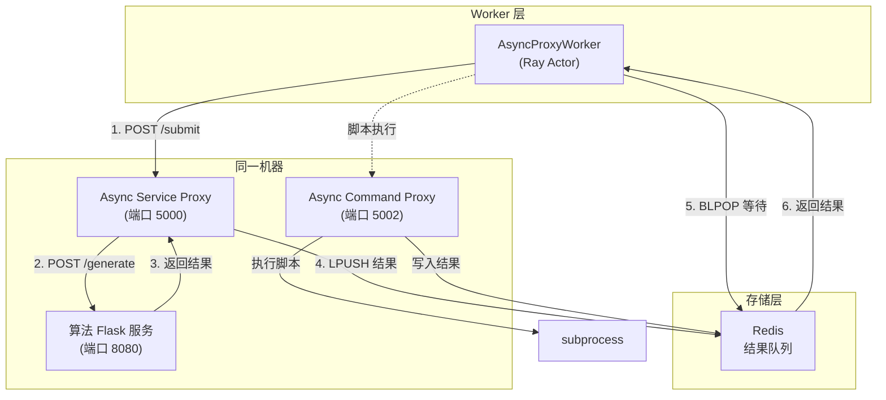
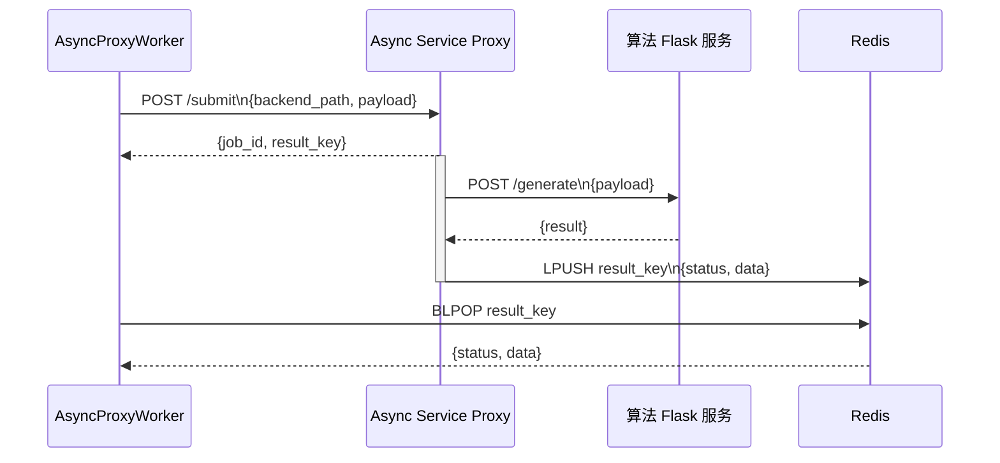
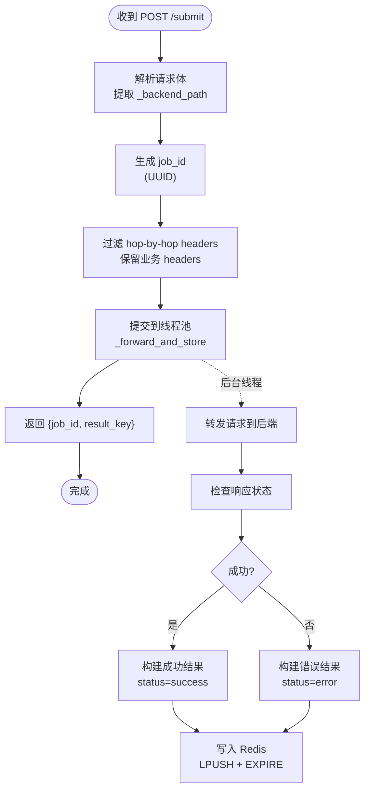
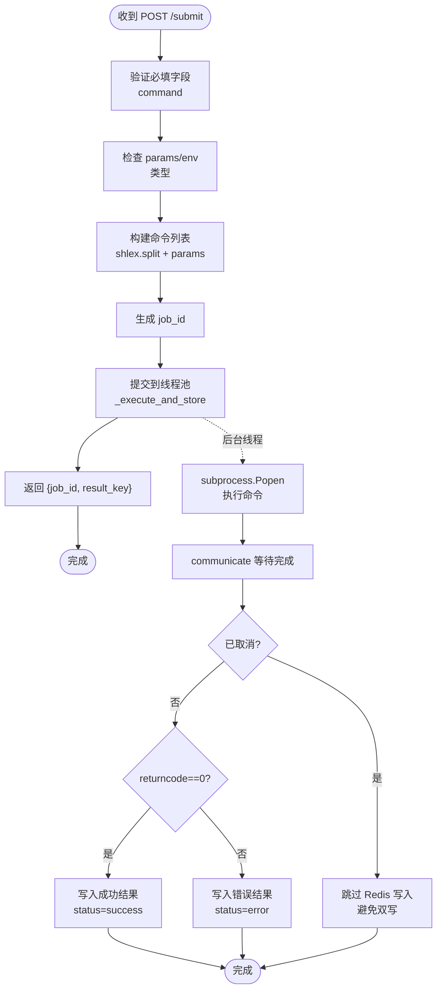
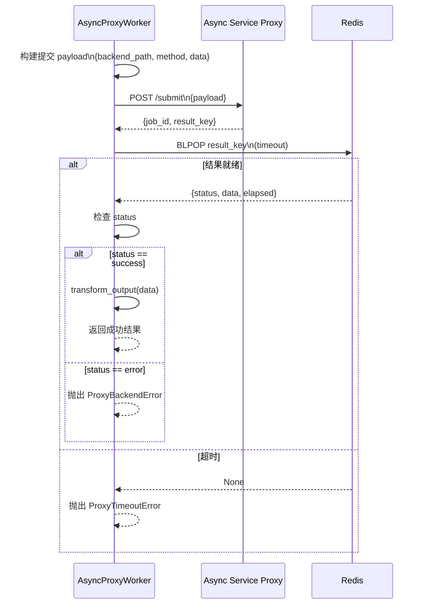

# 异步代理

```cite
- [src/proxy/async_service_proxy.py](src/proxy/async_service_proxy.py)
- [src/proxy/async_command_proxy.py](src/proxy/async_command_proxy.py)
- [src/workload/async_proxy_worker.py](src/workload/async_proxy_worker.py)
- [examples/async_proxy_worker_example.py](examples/async_proxy_worker_example.py)
- [src/workload/base_worker_actor.py](src/workload/base_worker_actor.py)
- [tests/test_async_proxy.py](tests/test_async_proxy.py)
- [tests/test_async_proxy_worker.py](tests/test_async_proxy_worker.py)
```

## 引言

异步代理模块专为解决长耗时服务调用场景中的超时问题而设计。在典型的 AI 算法服务部署架构中，算法团队的 Flask 服务（如视频生成、模型推理等）处理时间通常超过 30 秒，但网关超时限制仅为 5-10 秒，这导致直接调用会失败。异步代理通过 Sidecar 模式部署在算法服务同一台机器上，将同步长耗时调用转换为异步提交+结果等待模式，从而绕过网关超时限制。

该模块提供两种代理实现：`AsyncServiceProxy` 用于转发 HTTP 请求到后端服务，`AsyncCommandProxy` 用于执行本地 shell/Python 脚本。同时，`AsyncProxyWorker` 作为即用型 Worker 基类，屏蔽了 Redis 和 Proxy 的交互细节，使开发者只需关注业务逻辑即可快速集成长耗时服务。

## 架构概述

异步代理模块采用 Sidecar 架构模式，与算法服务部署在同一台机器上，通过本地通信避免网关超时限制。核心组件包括两个独立代理服务和一个 Worker 基类，它们通过 Redis 作为结果队列进行解耦。



**图表来源**
- [src/proxy/async_service_proxy.py](src/proxy/async_service_proxy.py#l1-l50)
- [src/proxy/async_command_proxy.py](src/proxy/async_command_proxy.py#l1-l50)
- [src/workload/async_proxy_worker.py](src/workload/async_proxy_worker.py#l1-l100)

该架构的核心优势在于：Worker 通过 HTTP POST 请求向 Proxy 提交任务（耗时通常 < 1 秒），Proxy 在后台线程中转发请求到算法服务或执行命令，完成后将结果写入 Redis，Worker 通过 Redis BLPOP 阻塞等待结果。整个过程中，Worker 与算法服务之间没有直接的长连接，完全绕过了网关超时限制。

### 组件职责

- **AsyncServiceProxy**：HTTP 请求转发代理，接收 Worker 提交的请求，转发到后端算法 Flask 服务，将结果写入 Redis
- **AsyncCommandProxy**：命令执行代理，接收 Worker 提交的命令，通过 subprocess 执行 shell/Python 脚本，将结果写入 Redis
- **AsyncProxyWorker**：Worker 基类，封装了与 Proxy 和 Redis 的交互逻辑，提供模板方法模式供子类实现业务逻辑
- **Redis**：作为结果队列，存储异步任务执行结果，支持 BLPOP 阻塞等待

### 工作流程

异步代理的典型工作流程包含四个阶段：任务提交、后台处理、结果存储、结果获取。Worker 首先向 Proxy 提交任务并立即获得 job_id，Proxy 在后台线程中执行实际的长耗时操作（转发请求或执行命令），完成后将结果写入 Redis，Worker 通过 BLPOP 阻塞等待结果。



**图表来源**
- [src/proxy/async_service_proxy.py](src/proxy/async_service_proxy.py#l120-l180)
- [src/workload/async_proxy_worker.py](src/workload/async_proxy_worker.py#l100-l160)

## 异步服务代理

`AsyncServiceProxy` 是用于转发 HTTP 请求到后端算法服务的 Sidecar 代理。它部署在算法 Flask 服务同一台机器上，通过本地 HTTP 调用避免网关超时限制。该代理完全独立于算法服务，算法 Flask 服务无需任何代码修改。

### 核心功能

AsyncServiceProxy 提供三个主要 HTTP 端点：`/submit` 用于提交异步请求，`/result/<job_id>` 用于主动查询结果（主要用于调试），`/health` 用于健康检查。所有请求处理均在后台线程池中完成，确保代理本身不会阻塞。

#### 任务提交

`/submit` 端点接收包含 `_backend_path` 和业务数据的 JSON 请求，立即返回 `job_id` 和 `result_key`，实际请求转发在后台线程中异步执行。请求体中必须包含 `_backend_path` 字段指定算法服务的 API 路径，可选的 `_method` 字段指定 HTTP 方法（默认 POST），其他字段会透传给后端服务。



**图表来源**
- [src/proxy/async_service_proxy.py](src/proxy/async_service_proxy.py#l120-l160)

#### 后台转发逻辑

`_forward_and_store` 函数在后台线程中执行实际的 HTTP 转发。它根据请求方法（GET 或 POST）调用相应的 requests 方法，将结果存储到 Redis。如果后端服务返回非 2xx 状态码，也会将错误信息存储到 Redis，确保 Worker 能够感知到业务错误。处理过程中会捕获超时、连接错误等异常，统一转换为错误结果格式。

结果存储格式包含四个字段：`status`（success/error）、`http_status`（HTTP 状态码）、`data`（响应数据）、`elapsed`（耗时秒数）。对于 JSON 响应，`data` 字段包含解析后的 JSON 对象；对于文本响应，`data` 字段包含原始文本内容。

### 配置管理

AsyncServiceProxy 采用三层优先级的配置机制：环境变量优先级最高，其次是 YAML 配置文件，最后是代码默认值。这种设计允许在不同环境（开发、测试、生产）中灵活配置，同时保持代码的简洁性。

#### 配置项说明

- `PROXY_CONFIG_FILE`：YAML 配置文件路径（默认 `proxy_config.yaml`）
- `BACKEND_URL`：算法 Flask 服务地址（默认 `http://localhost:8080`）
- `BACKEND_TIMEOUT`：转发超时秒数（默认 600 秒，本机通信无需担心网关超时）
- `REDIS_BNS`：Redis BNS 名称（百度内网自动解析 IP:Port，优先级最高）
- `REDIS_HOST`/`REDIS_PORT`：Redis 直连地址（次优先级）
- `REDIS_URL`：Redis 完整连接 URL（默认 `redis://localhost:6379/0`）
- `RESULT_TTL`：结果在 Redis 中的保留秒数（默认 3600 秒）
- `MAX_WORKERS`：并发转发线程数（默认 32）
- `PROXY_PORT`：代理监听端口（默认 5000）

#### Redis 地址解析

Redis 地址解析遵循明确的优先级顺序：首先检查 `REDIS_BNS` 环境变量，如果配置了 BNS 名称，通过 BNS 客户端自动解析出 IP:Port；其次检查 `REDIS_HOST` 和 `REDIS_PORT` 显式配置；最后使用 `REDIS_URL` 或 YAML 配置文件中的 `redis_url`，如果都没有则使用默认值 `redis://localhost:6379/0`。这种多层次的解析机制确保了在不同部署环境中的兼容性。

### 启动方式

AsyncServiceProxy 可以通过两种方式启动：使用命令行工具 `ray-async-proxy` 或直接运行 Python 模块。启动时会记录关键配置信息（后端 URL、Redis URL、端口、线程数），便于运维监控。

```bash
# 方式 1：使用命令行工具
ray-async-proxy

# 方式 2：直接运行模块
BACKEND_URL=http://localhost:8080 python -m src.proxy.async_service_proxy
```

## 异步命令代理

`AsyncCommandProxy` 是用于执行本地 shell/Python 脚本的 Sidecar 代理。与 AsyncServiceProxy 不同，它不转发 HTTP 请求，而是直接通过 subprocess 在本地执行命令，适用于需要调用脚本、二进制工具等场景。

### 核心功能

AsyncCommandProxy 提供四个主要 HTTP 端点：`/submit` 用于提交命令执行请求，`/cancel/<job_id>` 用于取消正在执行的命令，`/result/<job_id>` 用于主动查询结果，`/health` 用于健康检查。与 AsyncServiceProxy 类似，所有命令执行均在后台线程池中完成。

#### 命令提交

`/submit` 端点接收包含 `command` 字段的 JSON 请求，立即返回 `job_id` 和 `result_key`。`command` 字段是必填的命令字符串（如 `python script.py` 或 `bash run.sh`），可选的 `params` 字典会被转换为 `--key value` 形式追加到命令末尾，`env` 字典用于注入额外的环境变量，`cwd` 字段指定命令执行的工作目录，`timeout` 字段设置超时秒数（默认使用 `DEFAULT_TIMEOUT`）。



**图表来源**
- [src/proxy/async_command_proxy.py](src/proxy/async_command_proxy.py#l150-l220)

#### 命令构建

`_build_cmd` 函数负责将命令字符串和参数字典构建为 subprocess 可执行的命令列表。对于 `params` 字典中的每一对 key/value，会以 `--key value` 形式追加到命令末尾；如果 value 为空字符串或 None，则只追加 `--key`（布尔 flag，不带值）。这种设计使得命令参数的传递更加灵活和直观。

例如，对于 `command="python infer.py"` 和 `params={"input": "a.jpg", "gpu": "0", "verbose": ""}`，最终执行的命令为 `python infer.py --input a.jpg --gpu 0 --verbose`。

#### 取消机制

AsyncCommandProxy 实现了完善的命令取消机制。当调用 `/cancel/<job_id>` 端点时，系统会执行以下步骤：首先将 `job_id` 加入 `_cancelled` 集合，然后将取消结果写入 Redis（确保 BLPOP 方能感知到取消），最后调用 `proc.terminate()` 发送 SIGTERM 信号终止子进程。后台线程在 `communicate()` 返回后会检查 `_cancelled` 集合，如果发现任务已被取消，则跳过 Redis 写入，避免双写问题。

这种设计确保了取消操作的原子性和一致性：无论后台线程是否已经完成执行，BLPOP 方都能立即感知到取消状态，不会无限等待。

### 配置管理

AsyncCommandProxy 同样采用三层优先级的配置机制，配置项与 AsyncServiceProxy 类似，但增加了命令执行相关的配置。

#### 配置项说明

- `ASYNC_COMMAND_PROXY_CONFIG_FILE`：YAML 配置文件路径
- `ASYNC_COMMAND_PROXY_PORT`：服务监听端口（默认 5002）
- `REDIS_URL`：Redis 连接地址（默认 `redis://localhost:6379/0`）
- `RESULT_TTL`：结果保留秒数（默认 3600 秒）
- `MAX_WORKERS`：后台执行线程数（默认 8，通常小于 AsyncServiceProxy 因为命令执行更耗资源）
- `DEFAULT_TIMEOUT`：命令默认超时秒数（默认 300 秒）

### 启动方式

AsyncCommandProxy 可以通过两种方式启动：使用命令行工具 `ray-async-async-command-proxy` 或直接运行 Python 模块。

```bash
# 方式 1：使用命令行工具
ray-async-async-command-proxy

# 方式 2：直接运行模块
python -m src.proxy.async_command_proxy
```

## AsyncProxyWorker 基类

`AsyncProxyWorker` 是专门为长耗时下游服务设计的即用型 Worker 基类，继承自 `_BaseWorkerActorImpl`。它屏蔽了所有与 Redis 和 Proxy 的交互细节，开发者只需设置 `backend_path` 并可选实现输入输出转换 hook，即可快速集成长耗时服务。

### 设计理念

AsyncProxyWorker 采用了模板方法模式，将 Worker 的执行流程分为三个阶段：`pre_process`（预处理）、`call`（核心调用）、`post_process`（后处理）。基类实现了 `call` 方法中的 Proxy 提交和 Redis BLPOP 逻辑，子类只需覆盖 `transform_input` 和 `transform_output` 两个 hook 方法即可实现业务逻辑转换。

这种设计极大简化了开发工作：开发者无需关心 Redis 连接、BLPOP 等待、错误处理等细节，只需专注于业务数据的转换。与零依赖模式的 `custom_worker_example.py`（约 120 行代码）相比，使用 AsyncProxyWorker 的核心代码仅需 3-20 行。

### 类属性配置

AsyncProxyWorker 提供了三个可在子类中覆盖的类属性：

- `backend_path`：算法服务 API 路径（必填，如 `/generate`）
- `timeout`：等待结果的最长秒数（默认 300 秒）
- `http_method`：转发 HTTP 方法（默认 `POST`）
- `_default_options`：Ray Actor 资源需求（默认 `{"num_cpus": 1}`）

### 配置注入

AsyncProxyWorker 通过 `worker_init_config` 接收运行时配置，这些配置由平台在能力注册时自动注入：

```python
{
    "proxy_url": "http://localhost:5000",        # 单后端（K8s Service / DNS LB）
    "proxy_urls": ["http://10.0.0.1:5000", ...], # 多后端：actor 按 _actor_index 取模分配
    "redis_url": "redis://localhost:6379/0",
    "timeout": 300,  # 可选，覆盖类属性默认值
}
```

当 `proxy_urls` 和 `proxy_url` 同时存在时，`proxy_urls` 优先级更高。多后端模式下，每个 Actor 会根据 `_actor_index` 对后端列表取模，实现负载均衡。

### 核心方法实现

#### call 方法

`call` 方法是 AsyncProxyWorker 的核心，实现了完整的 submit → BLPOP → 返回结果流程。该方法首先构建包含 `_backend_path` 和 `_method` 的提交 payload，通过 HTTP POST 请求向 Proxy 提交任务，获得 `job_id` 和 `result_key`，然后使用 Redis BLPOP 阻塞等待结果，最后解析结果并返回。



**图表来源**
- [src/workload/async_proxy_worker.py](src/workload/async_proxy_worker.py#l80-l150)

错误处理方面，AsyncProxyWorker 不再以 `{"status": "error"}` 方式静默返回错误，而是全部抛出自定义异常（`ProxySubmitError`、`ProxyTimeoutError`、`ProxyBackendError`），确保 DagEngine 和 ActorPoolManager 能正确识别为失败并触发重试或熔断机制。

#### transform_input hook

`transform_input` 方法用于将 DAG step 传入的 input_data 转换为算法服务需要的格式。该方法在 `pre_process` 阶段被调用，默认实现直接透传输入数据。子类可以覆盖此方法实现业务特定的转换逻辑，如字段重命名、数据格式转换、默认值填充等。

#### transform_output hook

`transform_output` 方法用于将算法服务返回的业务数据转换为 DAG 下游需要的格式。该方法在 `call` 方法的最后阶段被调用，接收的参数是算法服务返回的业务数据（已去掉 proxy 包装层），默认实现直接透传。子类可以覆盖此方法实现结果提取、字段过滤、数据聚合等逻辑。

#### health_check 方法

`health_check` 方法检查 Proxy 和 Redis 的可达性，返回健康状态信息。该方法会调用 Proxy 的 `/health` 端点和 Redis 的 `ping` 命令，汇总检查结果并返回包含 `status`（healthy/unhealthy）、`proxy_ok`、`redis_ok`、`assigned_proxy`、`processed_count` 等字段的字典。

### 异常类型

AsyncProxyWorker 定义了三种自定义异常类型，用于区分不同阶段的错误：

- `ProxyBackendError`：下游算法服务返回的业务错误，由上层决定是否重试或走 fallback 路径
- `ProxySubmitError`：Proxy 提交失败（网络/Proxy 服务异常），由上层决定是否重试
- `ProxyTimeoutError`：等待下游结果超时，通常需要重试或告警

这些异常类型携带了详细的错误信息，包括 `job_id`、`detail` 等字段，便于问题排查和监控告警。

## 使用示例

### 最简 Worker

最简单的 AsyncProxyWorker 实现只需一行代码指定 `backend_path`：

```python
from src.workload.async_proxy_worker import AsyncProxyWorker

class VideoGenWorker(AsyncProxyWorker):
    """视频生成 Worker — 仅需声明 backend_path。"""
    backend_path = "/generate"
```

这个 Worker 会将所有输入数据透传给算法服务的 `/generate` 端点，并将返回结果透传给 DAG 下游。

### 带输入输出转换的 Worker

当需要转换输入输出格式时，可以覆盖 `transform_input` 和 `transform_output` 方法：

```python
class OCRWorker(AsyncProxyWorker):
    """OCR Worker — 带输入格式转换。"""
    
    backend_path = "/ocr"
    timeout = 60
    
    def transform_input(self, input_data):
        """将平台标准输入转换为算法服务需要的格式。"""
        return {
            "image_url": input_data["url"],
            "lang": input_data.get("lang", "zh"),
            "output_format": "json",
        }
    
    def transform_output(self, proxy_result):
        """从算法返回结果中提取需要的字段。"""
        return {
            "text": proxy_result.get("text", ""),
            "confidence": proxy_result.get("confidence", 0.0),
        }
```

这个 Worker 将 DAG 传入的 `url` 和 `lang` 字段转换为算法服务期望的 `image_url`、`lang`、`output_format` 格式，并从返回结果中提取 `text` 和 `confidence` 字段。

### 自定义超时和 HTTP 方法

可以通过覆盖类属性自定义超时时间和 HTTP 方法：

```python
class ImageUpscaleWorker(AsyncProxyWorker):
    """图像超分 Worker — GET 请求 + 长超时。"""
    
    backend_path = "/upscale"
    timeout = 600
    http_method = "GET"
    
    _default_options = {"num_cpus": 1, "num_gpus": 0.5}
```

### 多后端负载均衡

在能力注册时使用 `proxy_urls` 配置多个后端地址，Actor Pool 中的每个 Actor 会根据 `_actor_index` 对后端列表取模，实现负载均衡：

```python
# 能力注册配置
worker_init_config = {
    "proxy_urls": ["http://10.0.0.1:5000", "http://10.0.0.2:5000", "http://10.0.0.3:5000"],
    "redis_url": "redis://redis-cluster:6379/0",
    "timeout": 300,
}
```

例如，如果有 5 个 Actor，索引 0 的 Actor 使用第一个后端，索引 1 的使用第二个，索引 2 的使用第三个，索引 3 的回到第一个，索引 4 的回到第二个，以此类推。

## 测试与验证

AsyncProxyWorker 提供了完善的测试支持。可以使用 `worker_dev_kit` 模块中的 `run_local_test` 函数进行本地测试，无需启动 Ray 集群：

```python
from src.workload.worker_dev_kit import run_local_test
from examples.async_proxy_worker_example import VideoGenWorker

# 单后端测试
run_local_test(
    VideoGenWorker,
    test_inputs=[{"prompt": "一只猫在弹钢琴", "duration": 10}],
    config={"proxy_url": "http://localhost:5000"},
)

# 多后端测试
run_local_test(
    VideoGenWorker,
    test_inputs=[{"prompt": "一只猫在弹钢琴", "duration": 10}],
    config={"proxy_urls": ["http://10.0.0.1:5000", "http://10.0.0.2:5000"]},
)
```

测试框架会自动验证 Worker 类的合约（是否实现了必要的方法和参数），执行健康检查，运行测试用例，并生成详细的测试报告。

## 部署建议

### Sidecar 部署

AsyncServiceProxy 和 AsyncCommandProxy 应该与算法服务部署在同一台机器上，确保本地通信的低延迟和高可靠性。在 Kubernetes 环境中，可以将 Proxy 和算法服务部署在同一个 Pod 中，通过 `localhost` 通信。

### 资源配置

- AsyncServiceProxy：默认 32 个并发线程，可根据算法服务的并发能力调整
- AsyncCommandProxy：默认 8 个并发线程，因为命令执行通常更耗资源
- Redis：确保足够的内存和连接数，结果 TTL 根据业务需求调整

### 监控告警

建议监控以下指标：
- Proxy 的 `/health` 端点响应时间和成功率
- Redis 的 BLPOP 超时次数
- Worker 的 `processed_count` 计数
- 各类异常的发生频率（ProxySubmitError、ProxyTimeoutError、ProxyBackendError）

### 容错机制

- Proxy 服务应该配置重启策略，确保异常退出后自动恢复
- Redis 应该配置主从复制或集群模式，避免单点故障
- Worker 应该配置重试策略，对于可重试的错误（如 ProxySubmitError）自动重试