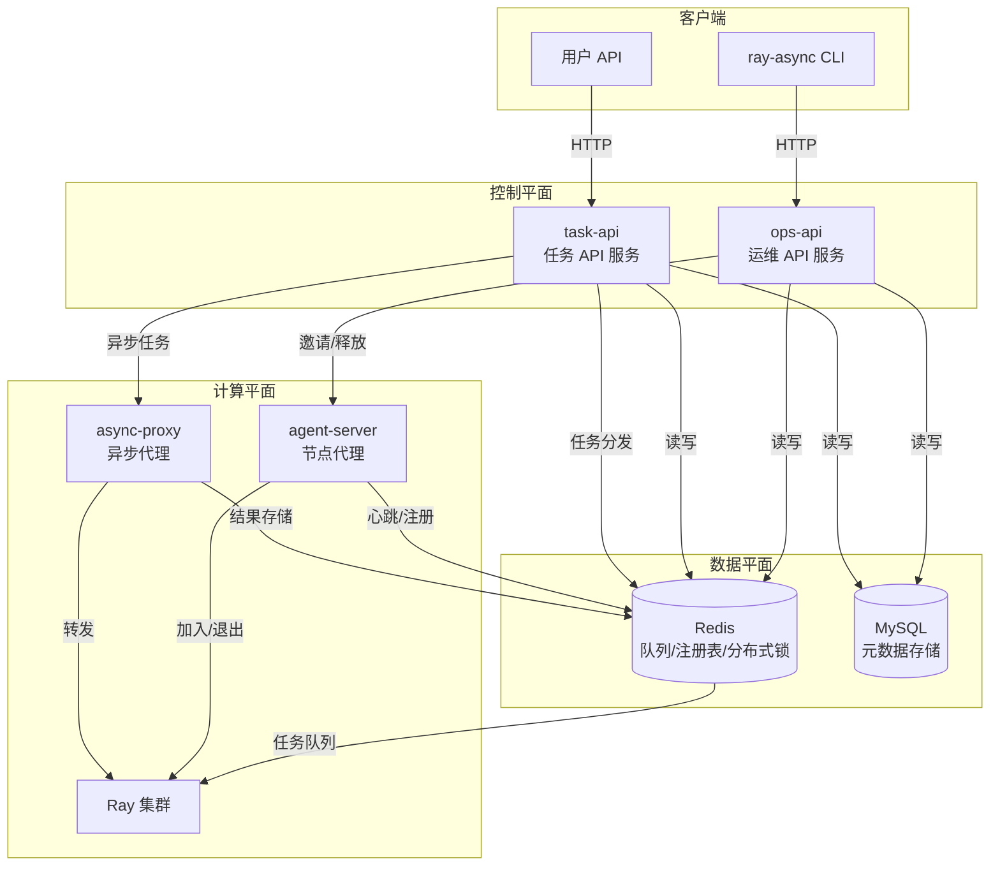
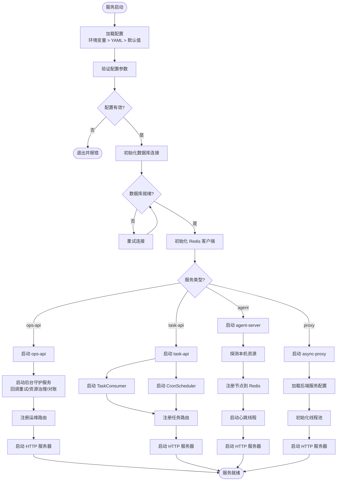

# 快速开始

```cite
- [README.md](README.md)
- [setup.py](setup.py)
- [requirements.txt](requirements.txt)
- [config/service_defaults.yaml](config/service_defaults.yaml)
- [src/main.py](src/main.py)
- [src/main_task_api.py](src/main_task_api.py)
- [src/agent/server.py](src/agent/server.py)
- [src/proxy/async_service_proxy.py](src/proxy/async_service_proxy.py)
- [docker-compose.deploy-test.yml](docker-compose.deploy-test.yml)
- [k8s/ops-api.yaml](k8s/ops-api.yaml)
- [src/cli/main.py](src/cli/main.py)
- [src/agent/agent.yaml.example](src/agent/agent.yaml.example)
```

## 引言

本文档旨在帮助开发者快速部署和运行 Ray Async 异步调度框架。Ray Async 是基于 Ray 构建的 AI 异步调度框架，支持 DAG 编排、任务执行、节点管理、Cron 调度等核心功能。通过本文档，您将了解环境要求、安装步骤、基础配置以及如何启动各个核心服务。

## 环境要求

在开始安装之前，请确保您的系统满足以下最低要求：

### 软件依赖

- **Python**: >= 3.10
- **Ray**: >= 2.54.0（推荐 2.54.1）
- **Redis**: >= 5.0（用于队列管理、节点注册、分布式锁等）
- **MySQL**: >= 8.0（用于元数据存储、任务记录等）

### 核心 Python 依赖

Ray Async 的核心依赖包括：

- `fastapi` >= 0.109.2（Web 框架）
- `uvicorn[standard]` >= 0.27.1（ASGI 服务器）
- `redis` >= 5.0.1（Redis 客户端）
- `sqlalchemy` >= 2.0.25（ORM 框架）
- `pymysql` >= 1.1.0（MySQL 驱动）
- `pydantic` >= 2.6.1（数据验证）
- `pyyaml` >= 6.0.1（配置解析）
- `httpx` >= 0.26.0（HTTP 客户端）
- `croniter` >= 2.0.0（Cron 表达式解析）
- `click` >= 8.1（命令行工具）

## 安装步骤

### 从源码安装

1. **克隆代码仓库**（如果尚未克隆）

```bash
git clone <repository-url>
cd ray-async
```

2. **安装 Ray Async 及其依赖**

使用 pip 安装项目及其所有依赖：

```bash
pip install -e .
```

或者，如果您只需要安装依赖而不安装项目本身：

```bash
pip install -r requirements.txt
```

安装完成后，以下命令行工具将自动注册到您的系统：

- `ray-async-api` - 启动运维 API 服务（ops-api）
- `ray-async-task-api` - 启动任务 API 服务（task-api）
- `ray-async-agent` - 启动节点代理服务
- `ray-async-proxy` - 启动异步代理服务
- `ray-async` - 命令行管理工具

### 验证安装

安装完成后，可以通过以下命令验证：

```bash
ray-async --help
```

如果安装成功，您将看到命令行工具的帮助信息，包括所有可用的子命令。

## 基础配置

Ray Async 的配置采用三层优先级：**环境变量 > 配置文件 > 代码默认值**。最小化配置需要设置 Redis 和 MySQL 连接信息。

### 配置文件位置

默认配置文件位于 `config/service_defaults.yaml`。您可以通过以下方式覆盖配置：

1. **环境变量**（优先级最高）
2. **自定义 YAML 配置文件**
3. **修改默认配置文件**

### 必需配置项

#### Redis 连接配置

Redis 是系统的核心组件，用于队列管理、节点注册、分布式锁等功能。您需要配置以下参数：

```bash
# 方式 1：使用 BNS（百度内部环境）
export REDIS_BNS=group.bdrp-ray-async-proxy.redis.all

# 方式 2：直连 Redis
export REDIS_HOST=127.0.0.1
export REDIS_PORT=6379
export REDIS_PASSWORD=your_password  # 可选
export REDIS_DB=0  # 可选，默认 0
```

#### MySQL 连接配置

MySQL 用于存储元数据、任务记录等。配置方式：

```bash
export MYSQL_HOST=127.0.0.1
export MYSQL_PORT=3306
export MYSQL_USER=root
export MYSQL_PASSWORD=your_password
export MYSQL_DATABASE=ray_async
```

### 可选配置项

#### API 服务配置

```bash
export API_HOST=0.0.0.0  # 监听地址，默认 0.0.0.0
export API_PORT=8000     # 监听端口，默认 8000
```

#### 多租户配置（可选）

如果需要启用多租户功能：

```bash
export MULTI_TENANT_ENABLED=true
export SUPER_ADMIN_API_KEY=your_admin_key
```

#### 数据库表自动创建（开发环境）

在开发环境中，可以启用自动创建数据库表：

```bash
export DB_AUTO_CREATE_TABLES=true
```

### 节点代理配置

节点代理（agent）需要连接到与 ops-api/task-api 相同的 Redis 实例。可以通过环境变量或配置文件进行配置。示例配置文件位于 `src/agent/agent.yaml.example`。

```bash
export AGENT_CONFIG_FILE=/etc/ray-async/agent.yaml
```

配置文件示例：

```yaml
agent:
  host: "0.0.0.0"
  port: 9100
  node_labels: "zone=default,role=worker"
  heartbeat_interval: 15
  heartbeat_timeout: 60
```

## 运行示例

Ray Async 由多个独立的服务组件组成，可以根据需要启动全部或部分服务。

### 启动运维 API 服务（ops-api）

ops-api 提供完整的运维管理 API，包括任务管理、节点管理、内部运维接口，并运行后台守护服务（回调重试、资源治理、对账补偿）。

```bash
# 使用默认配置
ray-async-api

# 或指定配置文件
export SERVICE_ENV=dev
ray-async-api
```

服务启动后，将监听在 `http://0.0.0.0:8000`（或配置的 `API_PORT`）。

健康检查端点：
- `/livez` - 存活检查
- `/readyz` - 就绪检查

### 启动任务 API 服务（task-api）

task-api 面向用户，提供任务提交接口，并运行任务执行侧后台循环（TaskConsumer 和 CronScheduler）。

```bash
# 启用任务消费和 Cron 调度
export TASK_CONSUMER_ENABLED=true
export CRON_SCHEDULER_ENABLED=true
ray-async-task-api
```

服务同样监听在 `http://0.0.0.0:8000`，但仅暴露任务相关接口。

### 启动节点代理服务（agent-server）

节点代理运行在集群的每台机器上，负责资源探测、心跳上报、加入/退出 Ray 集群等。

```bash
# 配置 Redis 连接（必须与 ops-api/task-api 使用相同的 Redis）
export REDIS_HOST=127.0.0.1
export REDIS_PORT=6379

# 启动 agent
ray-async-agent
```

agent 默认监听在端口 9100，可以通过配置文件或环境变量修改。

### 启动异步代理服务（async-proxy）

异步代理用于处理长耗时任务（如视频生成），避免网关超时。它作为 sidecar 部署在算法服务同一台机器上。

```bash
# 配置后端服务地址
export BACKEND_URL=http://localhost:8080
export BACKEND_TIMEOUT=600

# 配置 Redis
export REDIS_HOST=127.0.0.1
export REDIS_PORT=6379

# 启动代理
ray-async-proxy
```

代理默认监听在端口 5000。

### 使用 Docker Compose 快速启动（开发环境）

项目提供了 Docker Compose 配置文件，可以一键启动完整的开发环境（包括 Redis、MySQL、ops-api、task-api）。

```bash
# 启动所有服务
docker compose -f docker-compose.deploy-test.yml up -d --build

# 查看服务状态
docker compose -f docker-compose.deploy-test.yml ps

# 停止并清理
docker compose -f docker-compose.deploy-test.yml down -v
```

服务端口映射：
- Redis: `26379:6379`
- MySQL: `23306:3306`
- ops-api: `28000:8000`
- task-api: `28001:8000`

### 使用命令行工具管理

安装完成后，可以使用 `ray-async` 命令行工具管理集群：

```bash
# 查看所有可用命令
ray-async --help

# 查看集群状态
ray-async cluster list

# 查看节点列表
ray-async node list

# 提交任务
ray-async task submit --dag-id my_dag --input '{"key": "value"}'
```

## 部署架构概览

下图展示了 Ray Async 核心服务组件之间的关系和数据流。系统由 ops-api、task-api、agent-server 和 async-proxy 四个主要服务组成，通过 Redis 和 MySQL 进行协调和数据持久化。



**图表来源**
- [src/main.py](src/main.py#l1-l50)
- [src/main_task_api.py](src/main_task_api.py#l1-l50)
- [src/agent/server.py](src/agent/server.py#l1-l80)
- [src/proxy/async_service_proxy.py](src/proxy/async_service_proxy.py#l1-l80)
- [docker-compose.deploy-test.yml](docker-compose.deploy-test.yml#l1-l100)

该架构图展示了系统的四个核心服务组件及其交互关系。ops-api 和 task-api 构成控制平面，分别负责运维管理和任务执行；agent-server 和 async-proxy 运行在计算节点上，负责资源管理和异步任务处理。Redis 作为协调层，提供队列管理、节点注册和分布式锁功能；MySQL 作为持久化层，存储元数据和任务记录。客户端通过 CLI 或用户 API 与系统交互。

### 服务启动流程

下图描述了从配置加载到服务就绪的完整启动流程，包括配置初始化、数据库连接检查、后台服务启动等关键步骤。



**图表来源**
- [src/main.py](src/main.py#l50-l150)
- [src/main_task_api.py](src/main_task_api.py#l50-l150)
- [src/agent/server.py](src/agent/server.py#l80-l200)
- [src/proxy/async_service_proxy.py](src/proxy/async_service_proxy.py#l80-l150)
- [config/settings.py](config/settings.py#l1-l100)

该流程图详细说明了四种服务类型的启动过程。所有服务首先加载并验证配置，然后初始化基础设施连接（数据库和 Redis）。根据服务类型的不同，后续流程有所差异：ops-api 启动后台守护服务并注册运维路由；task-api 启动任务消费和 Cron 调度器；agent-server 探测资源、注册节点并启动心跳；async-proxy 初始化线程池用于转发请求。最后，所有服务启动 HTTP 服务器并进入就绪状态。