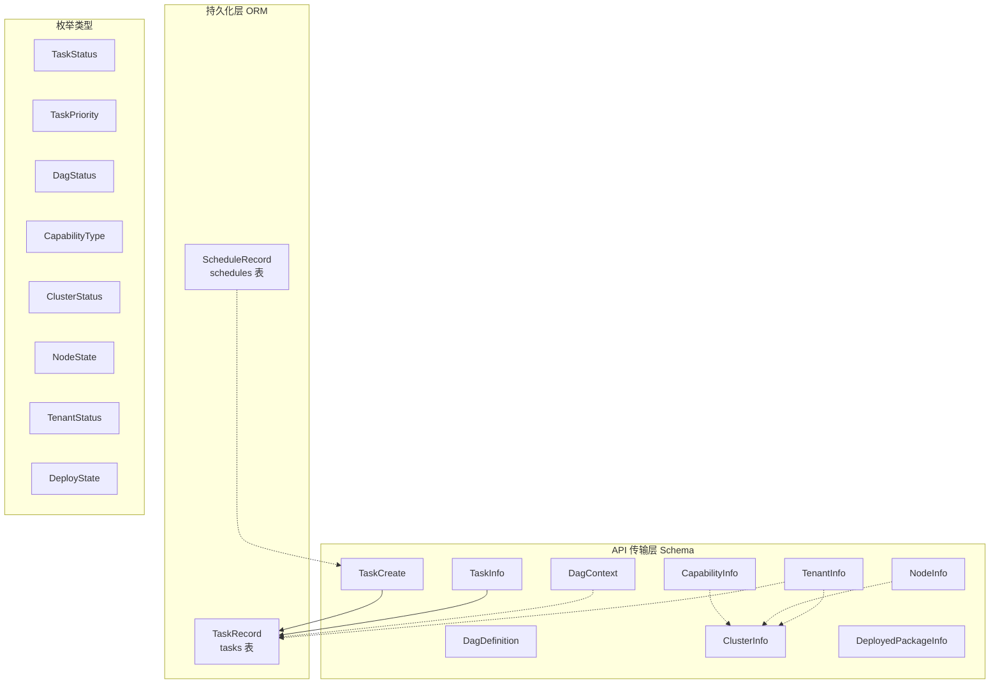

# 数据模型

```cite
- [src/models/task.py](src/models/task.py)
- [src/models/dag.py](src/models/dag.py)
- [src/models/capability.py](src/models/capability.py)
- [src/models/cluster.py](src/models/cluster.py)
- [src/models/node.py](src/models/node.py)
- [src/models/schedule.py](src/models/schedule.py)
- [src/models/tenant.py](src/models/tenant.py)
- [src/models/deploy.py](src/models/deploy.py)
- [src/common/db.py](src/common/db.py)
```

## 引言

本文档详细描述系统中所有核心数据模型的定义、字段含义以及数据库映射关系。数据模型分为两大类：持久化模型（通过 SQLAlchemy ORM 映射到数据库表）和传输模型（通过 Pydantic schema 定义 API 请求和响应格式）。这些模型构成了系统数据流转的基础结构，涵盖了任务执行、DAG 编排、能力管理、集群资源、节点管理、调度控制、租户隔离和部署管理等核心领域。

## 架构概述

数据模型架构采用分层设计，从底层的数据库 ORM 模型到上层的 API 传输模型，形成完整的数据表示体系。ORM 模型负责数据持久化，存储在 MySQL 数据库中；传输模型负责 API 层的数据验证和序列化。各模型之间通过共享字段（如 `task_id`、`tenant_id`、`cluster_id`）建立关联关系，形成以任务为核心、以租户为边界的多租户数据模型体系。



**图表来源**
- [src/models/task.py](src/models/task.py#l1-l200)
- [src/models/dag.py](src/models/dag.py#l1-l200)
- [src/models/capability.py](src/models/capability.py#l1-l200)
- [src/models/cluster.py](src/models/cluster.py#l1-l200)
- [src/models/node.py](src/models/node.py#l1-l200)
- [src/models/schedule.py](src/models/schedule.py#l1-l200)
- [src/models/tenant.py](src/models/tenant.py#l1-l100)
- [src/models/deploy.py](src/models/deploy.py#l1-l100)

## 任务模型

任务模型是系统的核心数据结构，定义了任务的完整生命周期和执行属性。

### 枚举类型

#### TaskStatus
任务生命周期状态枚举，包含以下状态：
- `PENDING`: 任务已创建，等待调度
- `SCHEDULED`: 任务已分配到集群
- `QUEUED`: 任务已进入执行队列
- `RUNNING`: 任务正在执行
- `COMPLETED`: 任务执行成功完成
- `FAILED`: 任务执行失败
- `CANCELLED`: 任务被取消

#### TaskPriority
任务优先级枚举，数值越小优先级越高：
- `VERY_HIGH`: 最高优先级（排序权重 1）
- `HIGH`: 高优先级（排序权重 2）
- `NORMAL`: 普通优先级（排序权重 3，默认值）
- `LOW`: 低优先级（排序权重 4）
- `TIDE`: 潮汐优先级（排序权重 5，最低）

#### TaskDispatchMode
任务分发模式枚举：
- `DAG_ORCHESTRATED`: DAG 编排模式，通过 DAG 引擎执行
- `RAYDATA_NATIVE`: RayData 原生执行模式

### ORM 模型

#### TaskRecord
任务持久化 ORM 模型，映射到数据库 `tasks` 表，包含以下字段：

**标识字段**
- `task_id`: String(64)，主键，任务唯一标识符
- `tenant_id`: String(64)，非空，索引，租户 ID，默认空字符串
- `task_type`: String(128)，非空，索引，任务类型

**DAG 和调度字段**
- `dag_id`: String(128)，可空，关联的 DAG ID
- `status`: SAEnum(TaskStatus)，非空，默认 `PENDING`，索引，任务状态
- `priority`: SAEnum(TaskPriority)，非空，默认 `NORMAL`，任务优先级
- `dispatch_mode`: SAEnum(TaskDispatchMode)，非空，默认 `DAG_ORCHESTRATED`，分发模式
- `cluster_id`: String(128)，可空，索引，分配的集群 ID
- `current_step`: String(128)，可空，当前执行的步骤名称

**数据字段**
- `input_data`: Text，可空，任务输入数据（JSON 序列化）
- `output_data`: Text，可空，任务输出数据（JSON 序列化）
- `metadata_json`: Text，可空，任务元数据（JSON 序列化）

**控制字段**
- `callback_url`: String(512)，可空，任务完成回调 URL
- `idempotency_key`: String(128)，可空，索引，幂等键，用于去重
- `timeout_seconds`: Integer，默认 3600，任务超时时间（秒）
- `max_retries`: Integer，默认 3，最大重试次数
- `scheduled_at`: DateTime，可空，计划执行时间
- `cron_expr`: String(64)，可空，Cron 表达式（用于循环调度）

**时间戳字段**
- `created_at`: DateTime，服务器默认当前时间，索引，创建时间
- `updated_at`: DateTime，服务器默认当前时间，更新时自动刷新，更新时间

### API 传输模型

#### TaskCreate
创建任务的请求体 schema，包含以下字段：

**基础字段**
- `tenant_id`: str，默认空字符串，租户 ID
- `task_type`: str，必填，任务类型（非空且不超过 128 字符）
- `priority`: TaskPriority，默认 `NORMAL`，任务优先级
- `dispatch_mode`: TaskDispatchMode | None，可空，任务分发模式

**数据字段**
- `input_data`: dict[str, Any]，默认空字典，任务输入数据（序列化大小不超过 256KB，嵌套深度不超过 16 层）
- `metadata`: dict[str, Any]，默认空字典，任务元数据（序列化大小不超过 256KB，嵌套深度不超过 16 层）

**控制字段**
- `callback_url`: str | None，可空，回调 URL（必须使用 http/https 协议且包含主机名）
- `idempotency_key`: str | None，可空，幂等键
- `timeout_seconds`: int，默认 3600，超时时间（1~86400 秒）
- `max_retries`: int，默认 3，最大重试次数（0~20）

**调度字段**
- `scheduled_at`: str | None，可空，计划执行时间（ISO 8601 UTC 格式）
- `delay_seconds`: int | None，可空，延迟秒数
- `cron_expr`: str | None，可空，Cron 表达式（5 字段，仅用于创建 ScheduleRecord）

**远程代码字段**
- `artifact_url`: str | None，可空，远程代码包 URL（用于 runtime_env）
- `artifact_sha256`: str | None，可空，代码包 SHA256 校验值（设置 artifact_url 时必须为 64 位十六进制字符串）

#### TaskInfo
任务完整信息 schema，用于查询返回，包含 `TaskRecord` 的所有字段以及以下额外字段：
- `attempt`: int，默认 0，任务执行尝试次数
- `artifact_url`: str，默认空字符串，远程代码包 URL
- `artifact_sha256`: str，默认空字符串，代码包 SHA256 校验值

该模型支持从 ORM 对象反序列化（`from_attributes=True`），并包含 Lua cjson 空表修复逻辑（将空列表转换为空字典）。

#### TaskCreateResponse
任务创建成功的响应体，包含以下字段：
- `task_id`: str，任务 ID
- `tenant_id`: str，默认空字符串，租户 ID
- `status`: TaskStatus，任务状态
- `dispatch_mode`: TaskDispatchMode，默认 `DAG_ORCHESTRATED`，分发模式
- `cluster_id`: str，默认空字符串，分配的集群 ID
- `estimated_wait_seconds`: int，默认 0，预计等待时间
- `queue_position`: int，默认 0，队列位置
- `scheduled_at`: str，默认空字符串，计划执行时间
- `idempotent_reused`: bool，默认 False，是否复用了已有任务

#### TaskResultResponse
任务结果查询的响应体，包含以下字段：
- `task_id`: str，任务 ID
- `status`: TaskStatus，任务状态
- `output_data`: dict[str, Any]，默认空字典，任务输出数据

#### TaskSummary
任务摘要 schema，用于列表接口，省略大字段（`input_data`、`output_data`、`metadata`），包含以下字段：
- `task_id`: str，任务 ID
- `tenant_id`: str，默认空字符串，租户 ID
- `task_type`: str，默认空字符串，任务类型
- `status`: TaskStatus，默认 `PENDING`，任务状态
- `cluster_id`: str，默认空字符串，集群 ID
- `dispatch_mode`: TaskDispatchMode，默认 `DAG_ORCHESTRATED`，分发模式
- `created_at`: str，默认空字符串，创建时间
- `updated_at`: str，默认空字符串，更新时间

#### TaskListResponse
游标分页的任务列表响应体，包含以下字段：
- `items`: list[TaskSummary]，默认空列表，任务摘要列表
- `next_cursor`: str | None，可空，下一页游标

#### TaskCancelResponse
任务取消响应，包含以下字段：
- `task_id`: str，任务 ID
- `cancelled`: bool，是否取消成功
- `prior_status`: TaskStatus，取消前的状态

## DAG 模型

DAG 模型定义了有向无环图（DAG）编排的数据结构，包括步骤定义、执行上下文和状态管理。

### 枚举类型

#### ExecutionMode
步骤执行模式枚举：
- `SYNC`: 同步执行
- `ASYNC`: 异步执行
- `FLASK_WRAPPED`: Flask HTTP 包装执行

#### OnFailureAction
步骤失败时的处理策略枚举：
- `ABORT`: 中止整个 DAG
- `SKIP`: 跳过当前步骤，继续执行
- `FALLBACK`: 使用降级输出

#### MapErrorPolicy
Map 步骤中子项失败时的处理策略枚举：
- `ABORT_ALL`: 中止所有子项
- `CONTINUE`: 继续执行其他子项

#### StepKind
步骤类型枚举：
- `TASK`: 普通任务步骤
- `DISPATCH`: 分发步骤
- `COLLECTOR`: 收集步骤
- `MAP`: Map 并行步骤
- `STREAMING`: 流式步骤

#### DagStatus
DAG 执行状态枚举（与 TaskStatus 语义对齐但独立定义）：
- `PENDING`: 等待执行
- `RUNNING`: 正在执行
- `COMPLETED`: 执行完成
- `FAILED`: 执行失败
- `CANCELLED`: 已取消

### 配置模型

#### RetryPolicy
步骤重试策略，包含以下字段：
- `max_retries`: int，默认 0，最大重试次数
- `retry_delay_seconds`: float，默认 1.0，重试延迟时间（秒）

#### CheckpointConfig
检查点配置，用于 DAG 执行中间状态持久化，包含以下字段：
- `enabled`: bool，默认 False，是否启用检查点
- `interval_steps`: int，默认 10，检查点间隔步数
- `storage_path`: str，默认 "/shared/checkpoints"，存储路径

#### PollingConfig
异步步骤的轮询配置，包含以下字段：
- `interval_seconds`: float，默认 5.0，轮询间隔时间（秒）

#### FlaskStepConfig
Flask HTTP 步骤的配置，包含以下字段：
- `url`: str，默认空字符串，Flask 服务 URL

#### QueueStepConfig
队列步骤的并发与深度限制配置，包含以下字段：
- `max_queue_depth`: int，默认 50，最大队列深度
- `max_concurrent`: int，默认 4，最大并发数
- `qps_limit`: float | None，可空，QPS 限制（None 表示不限流）

#### FallbackConfig
步骤失败后的降级输出映射配置，包含以下字段：
- `output_mapping`: dict[str, str]，默认空字典，输出映射关系

#### StreamingTrigger
流式步骤触发配置，包含以下字段：
- `buffer_key`: str，Redis List key 模板（运行时替换 `{task_id}`）
- `trigger_condition`: str，默认 "chunk_ready"，触发条件（"chunk_ready" 或自定义条件）
- `flush_on_complete`: bool，默认 True，步骤完成后是否冲刷剩余缓冲
- `downstream_steps`: list[str]，默认空列表，增量触发的下游步骤名

### 核心模型

#### DagStep
DAG 中的单个步骤定义，包含以下字段：

**基础字段**
- `step_name`: str，步骤名称
- `capability`: str，绑定的能力名称
- `step_kind`: StepKind，默认 `TASK`，步骤类型

**依赖字段**
- `depends_on`: list[str]，默认空列表，依赖的前置步骤名列表
- `collect_from`: list[str]，默认空列表，收集数据的来源步骤名列表

**执行配置**
- `execution_mode`: ExecutionMode，默认 `SYNC`，执行模式
- `timeout_seconds`: int，默认 60，超时时间（1~86400 秒）
- `retry_policy`: RetryPolicy，默认空 RetryPolicy，重试策略

**数据映射**
- `input_mapping`: dict[str, str]，默认空字典，输入映射关系
- `output_mapping`: dict[str, str]，默认空字典，输出映射关系
- `artifact_output_fields`: dict[str, str]，默认空字典，制品输出字段映射

**条件与容错**
- `condition`: str | None，可空，执行条件表达式
- `on_failure`: OnFailureAction，默认 `ABORT`，失败处理策略
- `fallback`: FallbackConfig | None，可空，降级配置

**特殊配置**
- `checkpoint`: CheckpointConfig | None，可空，检查点配置
- `polling`: PollingConfig | None，可空，轮询配置
- `flask`: FlaskStepConfig | None，可空，Flask 配置
- `queue`: QueueStepConfig | None，可空，队列配置
- `map_over`: str | None，可空，Map 步骤的迭代字段
- `max_concurrency`: int，默认 0，最大并发数（非负）
- `map_error_policy`: MapErrorPolicy，默认 `ABORT_ALL`，Map 失败策略
- `streaming_trigger`: StreamingTrigger | None，可空，流式触发配置

#### DagDefinition
完整的 DAG 定义，包含以下字段：
- `dag_id`: str，DAG 唯一标识
- `tenant_id`: str，默认空字符串，租户 ID
- `name`: str，默认空字符串，DAG 名称
- `version`: str，默认 "1.0"，DAG 版本
- `timeout_seconds`: int，默认 3600，DAG 总超时时间
- `enabled`: bool，默认 True，是否启用
- `steps`: list[DagStep]，默认空列表，步骤列表
- `max_queue_depth`: int | None，可空，任务队列最大深度（None 使用平台默认值）
- `max_concurrent`: int | None，可空，任务最大并发数（None 使用平台默认值）

#### DagContext
DAG 执行上下文，存储在 Redis 中，包含以下字段：
- `task_id`: str，关联的任务 ID
- `dag_id`: str，DAG ID
- `tenant_id`: str，默认空字符串，租户 ID
- `input_data`: dict[str, Any]，默认空字典，任务输入数据
- `metadata`: dict[str, Any]，默认空字典，任务元数据
- `context`: dict[str, Any]，默认空字典，DAG 上下文变量
- `step_results`: dict[str, Any]，默认空字典，各步骤执行结果
- `completed_steps`: list[str]，默认空列表，已完成的步骤名列表
- `status`: DagStatus，默认 `PENDING`，DAG 执行状态

## 能力模型

能力模型定义了 AI 能力的注册信息和配置，支持多种实现类型和资源管理策略。

### 枚举类型

#### CapabilityType
能力实现类型枚举：
- `RAY_ACTOR`: Ray Actor 实现
- `RAY_SERVE`: Ray Serve 实现
- `FLASK_HTTP`: Flask HTTP 服务实现
- `RAY_TASK`: Ray Task 实现

#### HealthStatus
能力健康状态枚举：
- `HEALTHY`: 健康
- `DEGRADED`: 降级
- `UNHEALTHY`: 不健康

### 配置模型

#### ActorConfig
Ray Actor 类型能力的配置，包含以下字段：

**入口与制品**
- `module_path`: str，默认空字符串，本地模块路径
- `artifact_url`: str，默认空字符串，远端 worker 制品地址（.tar.gz）
- `artifact_sha256`: str，默认空字符串，制品 SHA256 校验值
- `entrypoint`: str，默认空字符串，制品内入口（格式：package.module:ClassName）

**池管理**
- `num_actors`: int，默认 1，Actor 实例数量
- `auto_create_pool`: bool，默认 True，是否允许缺池时自动创建（懒加载兜底）
- `elastic_enabled`: bool，默认 True，是否启用自动弹性伸缩
- `warmup_enabled`: bool，默认 False，是否在创建池后主动预热
- `warmup_payload`: dict[str, Any]，默认 {"_warmup": True}，预热请求 payload
- `warmup_timeout_seconds`: int，默认 120，预热超时时间

**资源配置**
- `resources_per_actor`: dict[str, Any]，默认空字典，每个 Actor 的资源需求
- `actor_options`: dict[str, Any]，默认空字典，Ray Actor 选项
- `worker_init_config`: dict[str, Any]，默认空字典，传递给 Worker `__init__` 的静态配置
- `runtime_env`: dict[str, Any]，默认空字典，Ray runtime_env（pip、conda、container 等）
- `scheduling_resources`: dict[str, float]，默认空字典，自定义调度资源（节点亲和调度）

**限流与潮汐**
- `qps_limit`: float | None，可空，全局 QPS 上限（None 不限）
- `max_concurrent`: int | None，可空，全局并发上限（None 由 num_actors 决定）
- `preemptible`: bool，默认 False，是否运行在潮汐/可抢占资源上
- `preemptible_min_size`: int，默认 0，潮汐模式下的最小保留池大小

该模型包含制品字段校验逻辑（设置 artifact_url 时必须提供 entrypoint 和 64 位十六进制 artifact_sha256）以及限流校验逻辑（qps_limit 和 max_concurrent 设置时必须为正数）。

#### FlaskConfig
Flask HTTP 类型能力的配置，包含以下字段：
- `base_url`: str，默认空字符串，Flask 服务基础 URL
- `generate_endpoint`: str，默认空字符串，生成端点
- `health_endpoint`: str，默认 "/health"，健康检查端点

#### HealthCheckConfig
能力健康检查配置，包含以下字段：
- `interval_seconds`: int，默认 30，检查间隔时间（秒）
- `timeout_seconds`: int，默认 10，检查超时时间（秒）
- `unhealthy_threshold`: int，默认 3，不健康阈值
- `healthy_threshold`: int，默认 2，健康阈值

### 核心模型

#### CapabilityInfo
能力完整注册信息，包含以下字段：
- `capability_name`: str，能力名称
- `capability_type`: CapabilityType，默认 `RAY_ACTOR`，能力类型
- `cluster_id`: str，默认空字符串，所属集群 ID
- `version`: str，默认 "1.0.0"，能力版本
- `actor_config`: ActorConfig | None，可空，Actor 配置
- `flask_config`: FlaskConfig | None，可空，Flask 配置
- `health_check`: HealthCheckConfig，默认空 HealthCheckConfig，健康检查配置
- `health_status`: HealthStatus，默认 `HEALTHY`，健康状态
- `tags`: list[str]，默认空列表，能力标签
- `tenant_id`: str，默认空字符串，租户 ID
- `description`: str，默认空字符串，能力描述

## 集群模型

集群模型定义了工作负载集群的注册信息和资源管理，支持规划资源和运行时资源的双层管理。

### 枚举类型

#### ClusterType
集群用途类型枚举：
- `ONLINE_INFERENCE`: 在线推理
- `OFFLINE_GENERATION`: 离线生成
- `TRAINING`: 训练
- `DATA_PROCESSING`: 数据处理

#### ClusterStatus
集群运行状态枚举：
- `ACTIVE`: 活跃
- `DRAINING`: 排空中
- `OFFLINE`: 离线

### 资源模型

#### PlannedResources
集群规划资源（注册时声明），包含以下字段：
- `fixed_gpus`: int，默认 0，固定 GPU 数量
- `tidal_gpus`: int，默认 0，潮汐 GPU 数量
- `gpu_types`: dict[str, int]，默认空字典，GPU 类型及其数量映射
- `total_cpus`: int，默认 0，CPU 总数
- `total_memory_gb`: float，默认 0，内存总量（GB）

#### ObservedResources
集群运行时资源（从已加入节点聚合自动计算），包含以下字段：
- `total_gpus`: int，默认 0，GPU 总数
- `available_gpus`: int，默认 0，可用 GPU 数量
- `available_cpus`: int，默认 0，可用 CPU 数量
- `available_memory_gb`: float，默认 0，可用内存（GB）

#### ClusterResources
集群资源信息（GPU/CPU/内存），分为规划层与运行时层。内部真实字段为 `plan` (PlannedResources) 和 `observed` (ObservedResources)，通过 model_validator 接受扁平字典构造，通过 model_serializer 输出扁平字典，通过 @property 代理属性保持 `resources.xxx` 访问方式不变。

该模型支持以下代理属性访问：
- `fixed_gpus`: 规划资源中的固定 GPU 数量
- `tidal_gpus`: 规划资源中的潮汐 GPU 数量
- `gpu_types`: 规划资源中的 GPU 类型映射
- `total_cpus`: 规划资源中的 CPU 总数
- `total_memory_gb`: 规划资源中的内存总量
- `total_gpus`: 运行时观测到的 GPU 总数
- `available_gpus`: 运行时观测到的可用 GPU 数量
- `available_cpus`: 运行时观测到的可用 CPU 数量
- `available_memory_gb`: 运行时观测到的可用内存

### 核心模型

#### ClusterInfo
集群完整注册信息，包含以下字段：
- `cluster_id`: str，集群唯一标识
- `tenant_id`: str，默认空字符串，租户 ID
- `cluster_type`: ClusterType，默认 `OFFLINE_GENERATION`，集群类型
- `ray_head_address`: str，默认空字符串，Ray Head 地址
- `resources`: ClusterResources，默认空 ClusterResources，集群资源
- `capabilities`: list[str]，默认空列表，支持的能力列表
- `status`: ClusterStatus，默认 `ACTIVE`，集群状态
- `labels`: dict[str, str]，默认空字典，集群标签

## 节点模型

节点模型定义了集群机器节点的注册信息和资源描述，支持 Node-Agent-Server 架构。

### 枚举类型

#### NodeState
节点生命周期状态枚举：
- `IDLE`: 已注册，空闲可用
- `RESERVED`: 已被选中，等待邀请确认
- `JOINING`: 正在加入 Ray 集群
- `JOINED`: 已加入集群，正常工作
- `DRAINING`: 排空中，不再接受新任务
- `OFFLINE`: 离线/不可用

### 资源模型

#### GPUInfo
单张 GPU 信息，包含以下字段：
- `gpu_index`: int，默认 0，GPU 索引
- `gpu_type`: str，默认空字符串，GPU 类型（如 "A100_80G"）
- `memory_total_mb`: int，默认 0，内存总量（MB）
- `memory_used_mb`: int，默认 0，已用内存（MB）

#### NodeResources
节点资源信息（由 Agent 上报），包含以下字段：

**物理资源（本地探测）**
- `total_cpus`: int，默认 0，CPU 总数
- `available_cpus`: int，默认 0，可用 CPU 数量
- `total_memory_mb`: int，默认 0，内存总量（MB）
- `available_memory_mb`: int，默认 0，可用内存（MB）
- `total_gpus`: int，默认 0，GPU 总数
- `available_gpus`: int，默认 0，可用 GPU 数量
- `gpu_list`: list[GPUInfo]，默认空列表，GPU 详细信息列表

**Ray 资源同步（已加入集群时填充）**
- `ray_node_id`: str，默认空字符串，Ray 节点 ID
- `ray_resources_total`: dict[str, float]，默认空字典，Ray 视角的总资源
- `ray_resources_available`: dict[str, float]，默认空字典，Ray 视角的可用资源
- `ray_sync_time`: float，默认 0.0，上次同步时间戳

该模型包含以下计算属性和方法：
- `ray_sync_time_iso`: str，上次同步时间的 ISO 8601 格式字符串
- `is_ray_synced`: bool，是否已与 Ray 资源同步
- `get_effective_cpus()`: int，获取有效 CPU 数量（优先 Ray 数据）
- `get_effective_memory_mb()`: int，获取有效内存 MB（优先 Ray 数据）
- `get_effective_gpus()`: int，获取有效 GPU 数量（优先 Ray 数据）

### 核心模型

#### NodeInfo
节点完整信息，包含以下字段：

**标识与网络**
- `node_id`: str，节点唯一标识（通常为 hostname 或 UUID）
- `host`: str，默认空字符串，IP 地址
- `agent_port`: int，默认 9100，Agent HTTP Server 端口

**状态与资源**
- `state`: NodeState，默认 `IDLE`，节点状态
- `resources`: NodeResources，默认空 NodeResources，节点资源

**标签与调度**
- `labels`: dict[str, str]，默认空字典，自定义标签（机房、机型等）
- `custom_resources`: dict[str, float]，默认空字典，Ray 自定义资源（环境亲和调度）

**集群关联**
- `cluster_id`: str，默认空字符串，当前所属集群 ID
- `ray_head_address`: str，默认空字符串，当前连接的 Ray Head 地址

**时间戳**
- `last_heartbeat`: float，默认 0.0，上次心跳时间戳
- `registered_at`: float，默认 0.0，首次注册时间戳
- `tenant_id`: str，默认空字符串，节点所属租户 ID

该模型包含以下计算属性：
- `last_heartbeat_iso`: str，上次心跳时间的 ISO 8601 格式字符串
- `registered_at_iso`: str，首次注册时间的 ISO 8601 格式字符串
- `agent_url`: str，节点 Agent 的 HTTP 地址（格式：`http://{host}:{agent_port}`）

### 请求响应模型

#### InvitationRequest
Head 发给 Agent 的邀请请求体，包含以下字段：
- `cluster_id`: str，集群 ID
- `ray_head_address`: str，Ray Head 地址
- `labels`: dict[str, str]，默认空字典，标签
- `custom_resources`: dict[str, float]，默认空字典，自定义资源

#### InvitationResponse
Agent 响应邀请的返回体，包含以下字段：
- `node_id`: str，节点 ID
- `accepted`: bool，默认 False，是否接受邀请
- `reason`: str，默认空字符串，拒绝原因
- `ray_node_ip`: str，默认空字符串，加入集群后的 Ray 节点 IP

#### ReleaseRequest
Head 发给 Agent 的释放请求体，包含以下字段：
- `cluster_id`: str，集群 ID
- `reason`: str，默认空字符串，释放原因
- `graceful`: bool，默认 True，是否优雅退出（等待任务完成）

#### DrainRequest
Head 发给 Agent 的排空请求体，包含以下字段：
- `cluster_id`: str，集群 ID
- `deadline_seconds`: int，默认 300，排空截止时间（秒）

#### NodeLease
节点租约信息，记录在 Redis 中，包含以下字段：
- `node_id`: str，节点 ID
- `cluster_id`: str，集群 ID
- `tenant_id`: str，默认空字符串，租户 ID
- `leased_at`: float，默认 0.0，租约开始时间
- `expires_at`: float，默认 0.0，租约过期时间
- `state`: NodeState，默认 `RESERVED`，节点状态

## 调度模型

调度模型定义了 Cron 循环调度的数据结构，支持周期性任务创建。

### ORM 模型

#### ScheduleRecord
Cron 调度记录 ORM，映射到数据库 `schedules` 表，包含以下字段：

**标识字段**
- `schedule_id`: String(64)，主键，调度唯一标识符
- `tenant_id`: String(64)，非空，索引，租户 ID，默认空字符串

**调度配置**
- `cron_expr`: String(64)，非空，Cron 表达式（5 字段）
- `task_template`: Text，非空，任务模板（TaskCreate JSON）
- `enabled`: Boolean，默认 True，是否启用

**执行跟踪**
- `last_triggered_at`: DateTime，可空，上次触发时间
- `next_fire_at`: DateTime，可空，下次触发时间

**时间戳字段**
- `created_at`: DateTime，服务器默认当前时间，创建时间
- `updated_at`: DateTime，服务器默认当前时间，更新时自动刷新，更新时间

### API 传输模型

#### ScheduleCreate
创建 cron 调度的请求体，包含以下字段：
- `tenant_id`: str，默认空字符串，租户 ID
- `cron_expr`: str，Cron 表达式（5 字段）
- `task_type`: str，任务类型
- `input_data`: dict[str, Any]，默认空字典，任务输入数据
- `priority`: str，默认 "normal"，任务优先级
- `callback_url`: str，默认空字符串，回调 URL
- `metadata`: dict[str, Any]，默认空字典，任务元数据
- `timeout_seconds`: int，默认 3600，超时时间
- `max_retries`: int，默认 3，最大重试次数
- `enabled`: bool，默认 True，是否启用

#### ScheduleInfo
调度完整信息，包含 `ScheduleRecord` 的所有字段以及以下额外字段：
- `task_type`: str，默认空字符串，任务类型
- `input_data`: dict[str, Any]，默认空字典，任务输入数据
- `priority`: str，默认 "normal"，任务优先级
- `callback_url`: str，默认空字符串，回调 URL
- `metadata`: dict[str, Any]，默认空字典，任务元数据
- `timeout_seconds`: int，默认 3600，超时时间
- `max_retries`: int，默认 3，最大重试次数

该模型包含 Lua cjson 空表修复逻辑。

## 租户模型

租户模型定义了多租户隔离的核心数据结构，支持租户级别的资源配额管理。

### 枚举类型

#### TenantStatus
租户生命周期状态枚举：
- `ACTIVE`: 活跃
- `SUSPENDED`: 已暂停
- `DELETED`: 已删除

### 配置模型

#### TenantQuota
租户资源配额（0 表示无限制），包含以下字段：
- `max_gpus`: int，默认 0，最大 GPU 数量
- `max_queue_depth`: int，默认 0，最大队列深度
- `max_concurrent_tasks`: int，默认 0，最大并发任务数
- `max_actor_count`: int，默认 0，最大 Actor 数量

### 核心模型

#### TenantInfo
租户完整注册信息，包含以下字段：
- `tenant_id`: str，默认自动生成（格式：`tenant-{12位hex}`），租户唯一标识
- `tenant_name`: str，默认空字符串，租户名称
- `status`: TenantStatus，默认 `ACTIVE`，租户状态
- `quota`: TenantQuota，默认空 TenantQuota，资源配额
- `description`: str，默认空字符串，租户描述
- `created_at`: str，默认空字符串，创建时间
- `updated_at`: str，默认空字符串，更新时间

## 部署模型

部署模型定义了部署包（Capability Package）与 AFS 挂载相关的数据结构，支持远程代码包的部署管理。

### 枚举类型

#### DeployState
部署包生命周期状态枚举：
- `PENDING`: 等待部署
- `DOWNLOADING`: 下载中
- `EXTRACTING`: 解压中
- `SETTING_UP`: 设置中
- `DEPLOYED`: 已部署
- `FAILED`: 部署失败

### 请求响应模型

#### DeployRequest
Head 发给 Agent 的部署请求，包含以下字段：
- `package_url`: str，包 URL
- `package_name`: str，包名称
- `package_version`: str，默认空字符串，包版本
- `force`: bool，默认 False，是否强制重新部署
- `checksum_sha256`: str，默认空字符串，SHA256 校验和
- `setup_timeout_seconds`: int，默认 300，设置超时时间（秒）

#### DeployResult
Agent 返回给 Head 的部署结果，包含以下字段：
- `node_id`: str，节点 ID
- `package_name`: str，包名称
- `package_version`: str，默认空字符串，包版本
- `state`: DeployState，默认 `PENDING`，部署状态
- `success`: bool，默认 False，是否成功
- `message`: str，默认空字符串，结果消息
- `deploy_path`: str，默认空字符串，部署路径
- `deployed_at`: float，默认 0.0，部署时间戳

#### UndeployRequest
Head 发给 Agent 的卸载请求，包含以下字段：
- `package_name`: str，包名称

### 跟踪模型

#### DeployedPackageInfo
Agent 本地已部署包的跟踪信息，包含以下字段：
- `package_name`: str，包名称
- `package_version`: str，包版本
- `package_url`: str，包 URL
- `deploy_path`: str，部署路径
- `state`: DeployState，部署状态
- `deployed_at`: float，默认 0.0，部署时间戳
- `manifest`: dict[str, Any]，默认空字典，包清单

#### MountStatus
AFS 挂载状态，包含以下字段：
- `mounted`: bool，默认 False，是否已挂载
- `mount_point`: str，默认空字符串，挂载点
- `mount_command`: str，默认空字符串，挂载命令
- `mounted_at`: float，默认 0.0，挂载时间戳
- `error`: str，默认空字符串，错误信息

## 数据库映射

### ORM 基类
所有 ORM 模型继承自 `src/common/db.py` 中定义的 `Base` 类（SQLAlchemy `declarative_base()`），使用 SQLAlchemy ORM 进行数据库映射。

### 数据库表映射

#### tasks 表
映射到 `TaskRecord` 模型，存储任务记录。主键为 `task_id`，包含 `tenant_id`、`task_type`、`status` 等索引字段，支持高效查询。

#### schedules 表
映射到 `ScheduleRecord` 模型，存储 Cron 调度记录。主键为 `schedule_id`，包含 `tenant_id` 索引字段。

### 时间戳字段约定
所有 ORM 模型的时间戳字段（`created_at`、`updated_at`）使用以下约定：
- `created_at`: 使用 `server_default=func.now()` 在数据库层面设置创建时间
- `updated_at`: 使用 `server_default=func.now(), onupdate=func.now()` 在数据库层面设置更新时间，每次记录更新时自动刷新

### 数据库连接管理
数据库连接通过 `src/common/db.py` 中的 `get_db()` 上下文管理器获取，支持自动提交、回滚和关闭。引擎采用懒初始化模式（DCL 单例），避免在 import 时创建连接池。

### Redis 存储
除了数据库持久化的模型外，以下模型存储在 Redis 中（通过 Pydantic schema 序列化为 JSON）：
- `DagContext`: DAG 执行上下文
- `ClusterInfo`: 集群注册信息
- `NodeInfo`: 节点注册信息
- `CapabilityInfo`: 能力注册信息
- `TenantInfo`: 租户注册信息
- `NodeLease`: 节点租约信息

这些模型通过 `model_serializer` 输出扁平字典，保持 Redis 存储格式和 API 线格式不变。