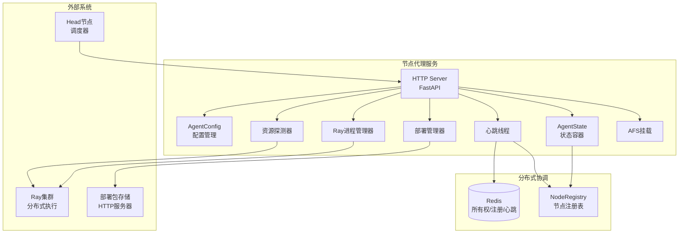
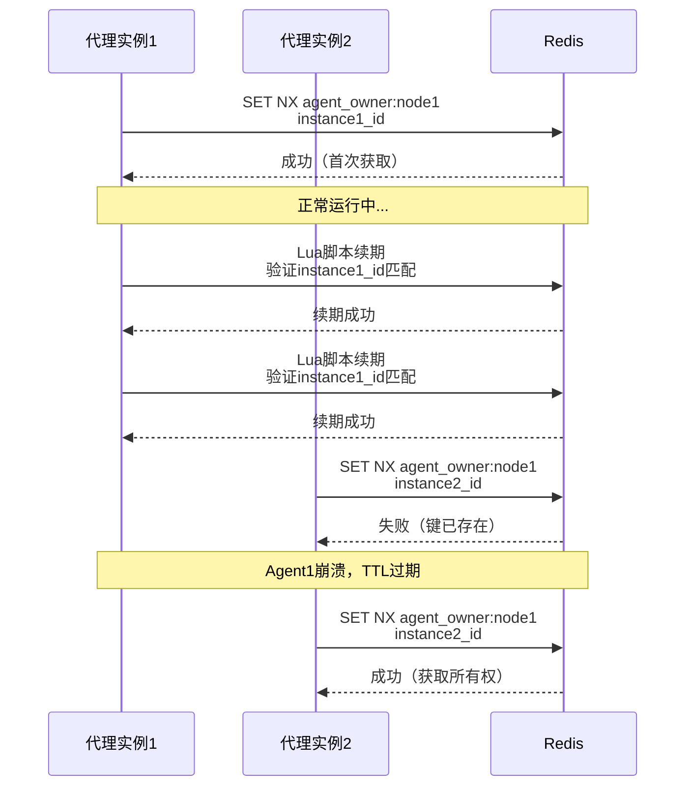
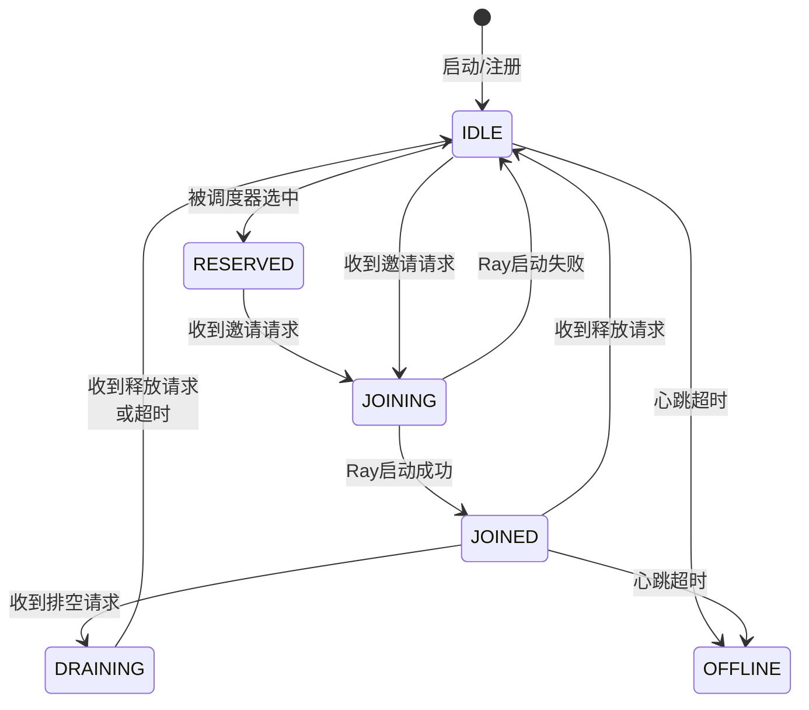
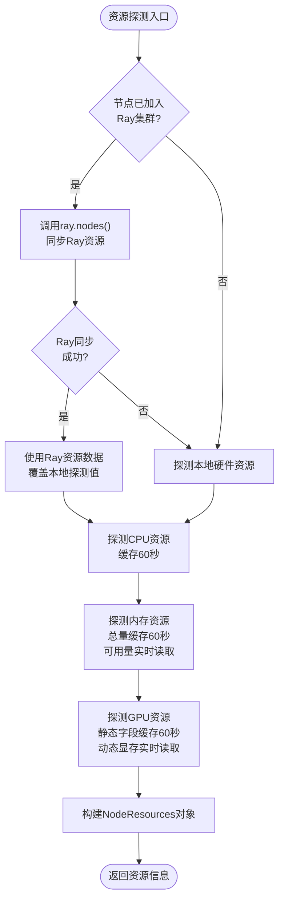
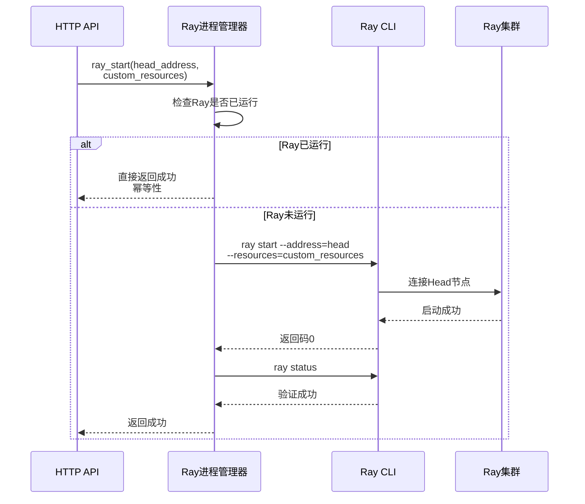
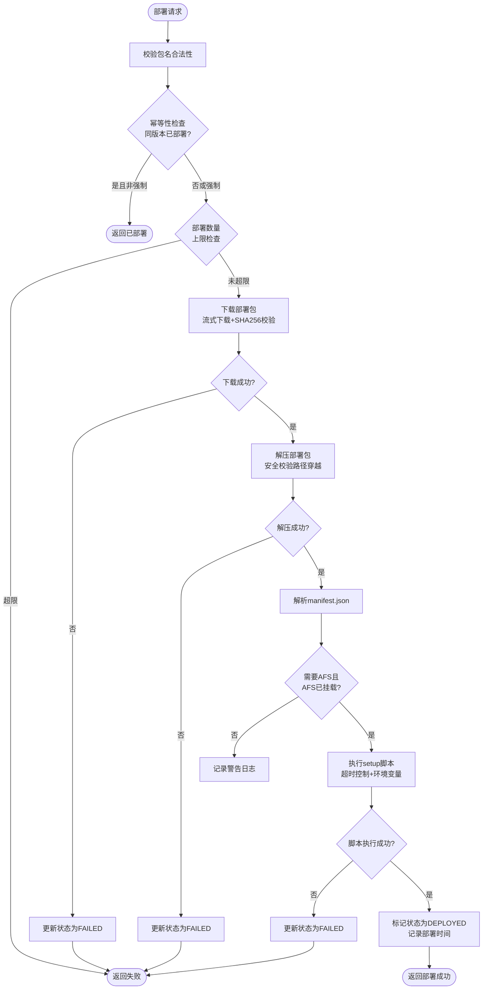
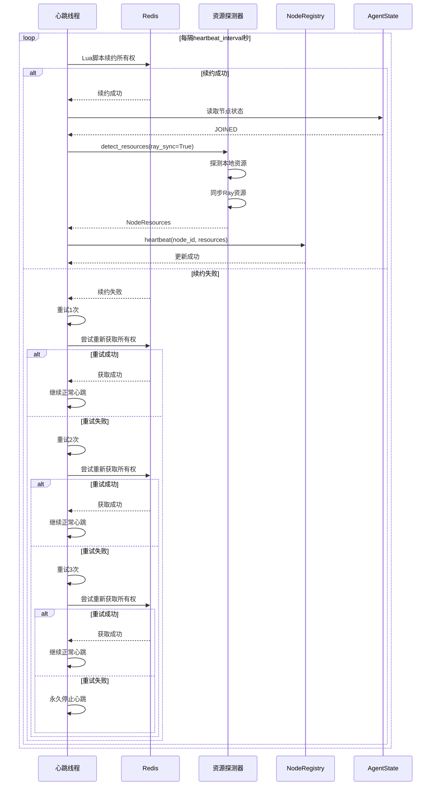
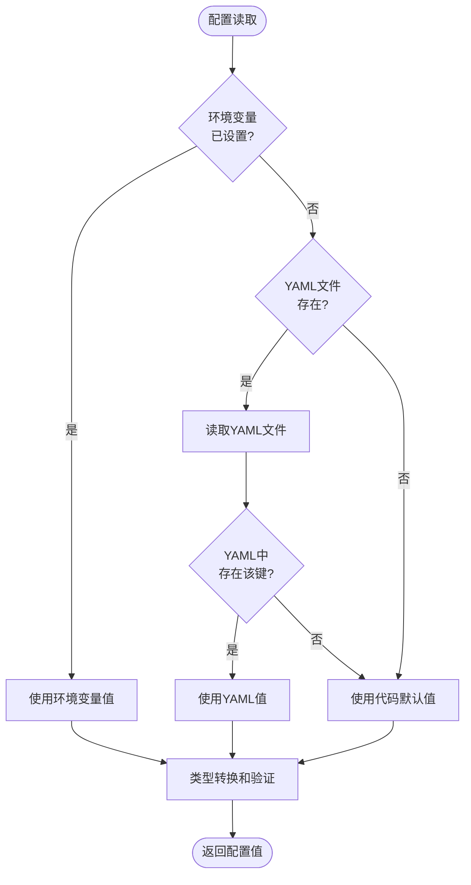
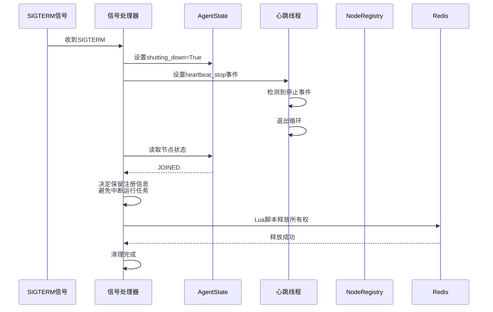
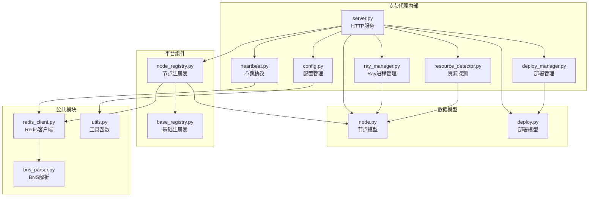

# 节点代理

```cite
- [src/agent/server.py](src/agent/server.py)
- [src/agent/config.py](src/agent/config.py)
- [src/agent/deploy_manager.py](src/agent/deploy_manager.py)
- [src/agent/heartbeat.py](src/agent/heartbeat.py)
- [src/agent/ray_manager.py](src/agent/ray_manager.py)
- [src/agent/resource_detector.py](src/agent/resource_detector.py)
- [src/models/node.py](src/models/node.py)
- [src/models/deploy.py](src/models/deploy.py)
```

## 引言

节点代理（Node Agent）是运行在集群机器上的轻量级 HTTP 服务，作为 Ray Async 系统与底层计算资源之间的桥梁。它负责管理节点的生命周期，包括资源探测、心跳维护、Ray 集群加入/退出以及部署包管理。节点代理通过 Redis 实现分布式协调，确保每个节点在同一时刻只有一个活跃的代理实例，从而避免状态冲突。本文档将深入分析节点代理的架构设计、核心组件实现以及关键工作机制。

## 架构概述

节点代理采用分层架构设计，包含配置管理、心跳所有权协议、资源探测、Ray 进程管理、部署包管理和 HTTP 服务等核心模块。系统通过 Redis 实现分布式协调，利用所有权协议确保节点独占性，通过状态机管理节点生命周期流转。



**图表来源**
- [src/agent/server.py](src/agent/server.py#l1-l100)
- [src/agent/config.py](src/agent/config.py#l1-l50)
- [src/agent/heartbeat.py](src/agent/heartbeat.py#l1-l50)

节点代理的核心设计理念是通过轻量级的 HTTP 服务将集群机器接入 Ray Async 系统。HTTP 服务层提供 RESTful API 接口，接收来自 Head 节点的控制指令；配置管理模块通过环境变量和 YAML 文件实现灵活的参数配置；状态容器封装所有可变状态，通过锁机制保证线程安全；心跳线程定期续约所有权并向 NodeRegistry 上报节点状态；资源探测器负责探测本机硬件资源并与 Ray 集群同步；Ray 进程管理器封装 Ray CLI 命令的生命周期管理；部署管理器处理部署包的下载、解压和生命周期脚本执行；AFS 挂载模块提供可选的共享文件系统挂载功能。

## 核心组件分析

### 所有权协议

所有权协议是节点代理确保节点独占性的核心机制，通过 Redis 原子操作实现分布式锁语义。每个节点在 Redis 中维护一个所有权键，格式为 `agent_owner:{node_id}`，值为当前代理实例的唯一标识。协议采用 CAS（Compare-And-Swap）语义，所有续期和释放操作都通过 Lua 脚本保证原子性。

所有权协议包含四个核心操作：获取所有权、续期所有权、释放所有权和查询所有权状态。获取所有权使用 Redis 的 `SET NX` 命令，仅在键不存在时设置成功，确保首个启动的代理实例获得所有权。续期和释放操作通过 Lua 脚本实现，脚本首先验证当前值是否与实例 ID 匹配，匹配后才执行续期或删除操作，防止非所有者误操作。所有权键设置 TTL 自动过期，防止代理崩溃后永久占用节点资源。



**图表来源**
- [src/agent/heartbeat.py](src/agent/heartbeat.py#l20-l80)

心跳线程在代理启动后持续运行，每隔 `heartbeat_interval` 秒执行一次所有权续期。续期失败时，心跳线程会进行最多 3 次指数间隔重试，尝试重新获取所有权。如果所有重试都失败，心跳线程将永久停止，代理实例进入降级状态。这种设计确保在网络抖动等临时故障场景下能够自动恢复，同时在永久性故障时避免多个代理实例同时操作节点。

### 状态机

节点代理通过状态机管理节点生命周期，定义了 6 种状态：`IDLE`（已注册，空闲可用）、`RESERVED`（已被选中，等待邀请确认）、`JOINING`（正在加入 Ray 集群）、`JOINED`（已加入集群，正常工作）、`DRAINING`（排空中，不再接受新任务）和 `OFFLINE`（离线/不可用）。状态流转遵循严格的转换规则，确保节点状态的语义一致性和可预测性。

状态机转换的主要路径包括：节点启动时从 `IDLE` 状态开始；收到邀请请求后从 `IDLE` 或 `RESERVED` 转为 `JOINING`；Ray 启动成功后转为 `JOINED`；收到排空请求后转为 `DRAINING`；收到释放请求或 Ray 停止后回到 `IDLE`。每个 API 操作在执行前都会校验当前状态是否允许目标转换，防止非法状态流转。状态转换通过 `state_lock` 保护，确保多线程环境下的原子性。



**图表来源**
- [src/models/node.py](src/models/node.py#l15-l30)
- [src/agent/server.py](src/agent/server.py#l400-l450)

状态机设计考虑了节点升级场景的特殊需求。当代理收到 SIGTERM 信号执行优雅关闭时，如果节点处于 `JOINED` 或 `DRAINING` 状态，代理会保留注册信息而不注销节点。这使得新启动的代理实例能够恢复节点的 `JOINED` 状态，避免升级期间中断运行中的 Ray 任务。对于其他状态，代理会注销节点并释放所有权，确保资源能够被重新调度。

### 资源探测器

资源探测器负责探测本机的 CPU、GPU 和内存资源，并在节点已加入 Ray 集群时与 Ray 资源数据同步。探测器采用分层设计，优先使用 Ray 上报的资源数据，因为 Ray 可能因配置限制只暴露部分资源，其视角的资源数据更能反映实际可用情况。

CPU 资源通过 `os.cpu_count()` 获取，内存资源通过读取 `/proc/meminfo` 文件获取 `MemTotal` 和 `MemAvailable` 字段。GPU 资源通过 `nvidia-smi` 命令探测，获取 GPU 索引、型号、显存总量和已用量。为了减少系统调用开销，探测器对静态字段（CPU 核数、内存总量、GPU 索引/型号/显存总量）采用 60 秒 TTL 的缓存机制，仅在缓存过期时重新探测。



**图表来源**
- [src/agent/resource_detector.py](src/agent/resource_detector.py#l100-l250)

Ray 资源同步通过 `ray.nodes()` API 实现，根据本机 IP 在 Ray 集群节点列表中定位自身节点，获取 `resources_total` 和 `resources_available` 字段。为了防止 Ray 集群响应缓慢阻塞心跳线程，同步操作设置了 10 秒超时。同步成功后，探测器以 Ray 上报的 CPU、内存和 GPU 数量覆盖本地探测值，确保资源数据的一致性。同步信息包括 Ray 节点 ID、资源总量和可用量，以及同步时间戳，供上层系统判断资源数据的时效性。

### Ray 进程管理器

Ray 进程管理器封装了 `ray start` 和 `ray stop` 命令的生命周期管理，提供幂等性的进程控制接口。管理器通过 `subprocess` 模块调用 Ray CLI，支持自定义资源声明用于环境亲和调度。

`ray_start` 函数执行 `ray start --address=<head_address>` 命令将本节点加入 Ray 集群。函数首先检查本地是否已有运行中的 Ray 实例，如果已运行则直接返回成功，实现幂等性。命令执行时支持通过 `--resources` 参数传递自定义资源声明，如 `{"env_video_gen": 100}`，用于特定任务的亲和调度。启动成功后，管理器通过 `ray status` 命令二次验证 Ray 进程正常运行，确保启动过程的可靠性。



**图表来源**
- [src/agent/ray_manager.py](src/agent/ray_manager.py#l30-l80)

`ray_stop` 函数执行 `ray stop` 命令使本节点退出 Ray 集群。同样采用幂等性设计，如果本地没有运行中的 Ray 实例则直接返回成功。函数设置 30 秒超时，防止 Ray 进程无响应导致调用阻塞。Ray 进程管理器的幂等性设计确保了在异常场景（如重复调用、网络故障）下的行为可预测，避免了状态不一致问题。

### 部署管理器

部署管理器负责处理部署包的完整生命周期，包括下载、校验、解压和生命周期脚本执行。部署包采用 tar.gz 格式，包含可执行代码、依赖库和 manifest.json 配置文件。管理器支持 SHA256 校验确保包完整性，提供幂等性部署和强制重部署能力。

部署流程分为四个阶段：下载阶段通过 HTTP 流式下载部署包，支持 SHA256 校验；解压阶段使用 Python tarfile 模块解压包，包含安全校验防止路径穿越攻击；设置阶段执行 manifest.json 中定义的 `setup_script`，支持超时控制和环境变量注入；完成阶段标记部署状态为 `DEPLOYED` 并记录部署时间。每个阶段都更新 `deployed_packages` 字典中的状态，支持外部查询部署进度。



**图表来源**
- [src/agent/deploy_manager.py](src/agent/deploy_manager.py#l30-l150)
- [src/agent/server.py](src/agent/server.py#l600-l750)

下载阶段使用 httpx 库实现流式下载，边下载边计算 SHA256 哈希值，下载完成后与期望值比对。解压阶段采用安全措施，使用 `filter='data'` 参数剥离危险属性（setuid/setgid/特殊设备文件），拒绝绝对路径和越界相对路径，防止 tar slip 攻击。对于 Python 3.10/3.11 不支持该参数的情况，管理器手动进行成员校验作为兜底。生命周期脚本执行继承完整环境变量并注入 manifest 中声明的环境变量，支持超时控制，默认 300 秒。

卸载流程首先执行 manifest 中定义的 `teardown_script`，失败仅记录警告不阻断流程。然后删除部署目录并清理空的父目录，最后从 `deployed_packages` 字典中移除记录。部署管理器还支持部署数量上限保护，防止过多部署包占用磁盘空间。

### 心跳线程

心跳线程是节点代理与系统保持连接的核心机制，负责所有权续约、资源探测和节点状态更新。线程在代理启动时创建，以守护线程方式运行，每隔 `heartbeat_interval` 秒执行一次心跳循环。

心跳循环的主要步骤包括：续约所有权租约，失败时进行最多 3 次重试恢复；探测本机资源，`JOINED` 状态下同步 Ray 集群资源数据；向 NodeRegistry 发送心跳，更新节点存活状态和资源信息。所有权续约失败时，心跳线程会记录错误日志并尝试重新获取所有权。如果 3 次重试都失败，心跳线程将永久停止，代理实例失去对节点的控制权。



**图表来源**
- [src/agent/server.py](src/agent/server.py#l120-l180)
- [src/agent/heartbeat.py](src/agent/heartbeat.py#l60-l100)

心跳线程通过 `heartbeat_stop` 事件通知机制实现优雅停止。当代理收到 SIGTERM 信号或调用关闭函数时，会设置该事件，心跳线程检测到事件后退出循环。线程设置了 10 秒的 join 超时，确保关闭流程不会无限期阻塞。对于不支持线程创建的受限运行环境（如某些容器配置），代理会降级为"无后台心跳"模式，避免启动失败。

### 配置管理

配置管理模块提供灵活的参数配置机制，支持环境变量、YAML 文件和代码默认值三级优先级。环境变量优先级最高，适合容器化部署场景；YAML 文件作为次优先级回退，适合传统部署场景；代码默认值确保配置的完整性。

配置项包括服务网络参数（host、port、api_key）、节点标识参数（node_id、node_host、node_labels、node_custom_resources）、心跳与租约参数（heartbeat_interval、owner_ttl、node_lease_ttl）、AFS 挂载参数（mount_enabled、mount_command、mount_point）和部署包参数（deploy_base_dir、deploy_download_timeout、deploy_max_packages）。节点标识字段支持运行时解析，通过 `resolve_node_identity()` 方法在代理启动时重新读取环境变量，确保容器注入的环境变量生效。



**图表来源**
- [src/agent/config.py](src/agent/config.py#l80-l200)

配置模块采用延迟加载策略，仅在首次访问时加载 YAML 文件，后续访问使用缓存。类型转换函数（`_as_int`、`_as_bool`）提供安全的类型转换和默认值处理，转换失败时记录警告日志并使用默认值。标签和自定义资源解析函数支持复杂类型的解析，标签采用 `key=val,key=val` 格式，自定义资源采用 JSON 格式。

### 优雅关闭

优雅关闭机制确保节点代理在终止时能够正确清理资源并保持状态一致性。关闭流程由 SIGTERM 信号触发，适用于容器平台的优雅停机场景。

关闭流程的主要步骤包括：设置 `shutting_down` 标志，拒绝后续写操作请求；停止心跳线程；根据节点状态决定清理策略；释放所有权租约。对于 `JOINED` 或 `DRAINING` 状态的节点，代理保留注册信息而不注销节点，避免升级期间中断运行中的 Ray 任务。新启动的代理实例能够从 NodeRegistry 恢复节点的 `JOINED` 状态，实现无缝升级。对于其他状态的节点，代理会注销节点并释放所有权，确保资源能够被重新调度。



**图表来源**
- [src/agent/server.py](src/agent/server.py#l280-l330)

信号处理器仅在主线程中注册，测试环境中 TestClient 在后台线程运行 lifespan，此时注册会抛出 ValueError，代理会跳过信号注册。关闭流程设置了 10 秒的心跳线程 join 超时，确保关闭不会无限期阻塞。所有权释放前会检查当前实例是否仍是活跃所有者，防止在所有权丢失的情况下执行破坏性清理。

## 依赖分析

节点代理的依赖关系清晰，模块间耦合度低。核心模块（server、config、heartbeat、ray_manager、resource_detector、deploy_manager）相互独立，通过共享的 `AgentState` 对象和 Redis 实现协调。模型模块（node、deploy）定义数据结构，供各模块使用。平台模块（node_registry、base_registry）提供节点注册和基础注册表功能，通过 Redis 实现持久化。



**图表来源**
- [src/agent/server.py](src/agent/server.py#l1-l50)
- [src/agent/config.py](src/agent/config.py#l1-l30)
- [src/agent/heartbeat.py](src/agent/heartbeat.py#l1-l30)

节点代理通过 Redis 客户端与 Redis 交互，实现所有权协议、心跳续约和节点注册。BNS 解析器提供百度内部服务发现支持，通过 BNS 名称自动解析 Redis 地址。工具函数模块提供通用的辅助功能，如 IP 获取、环境变量解析等。整个依赖链简洁清晰，便于维护和扩展。