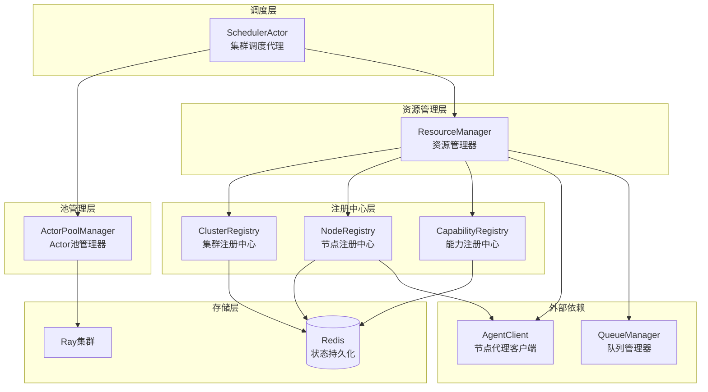
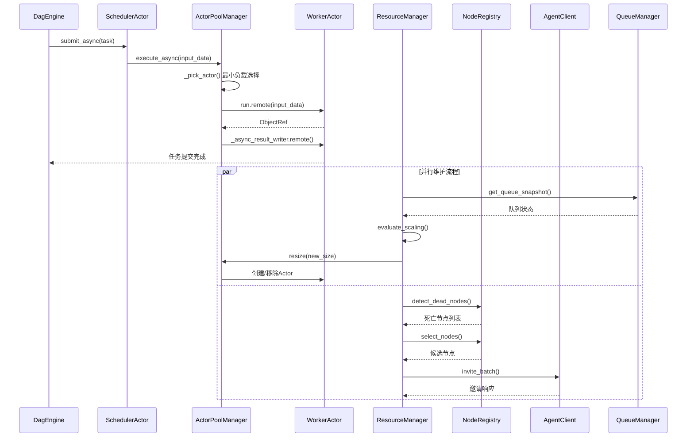
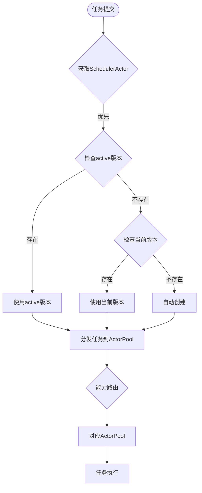
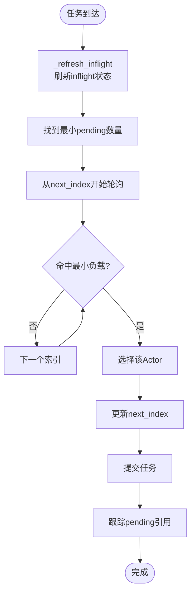
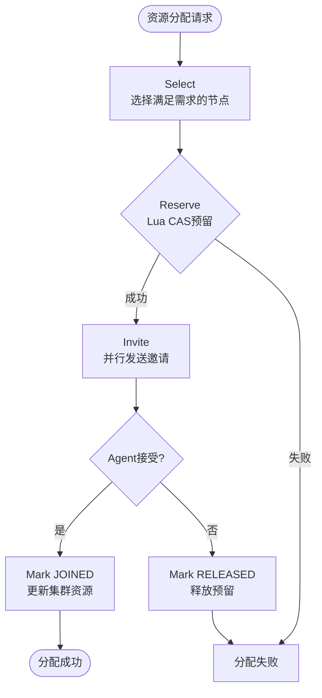
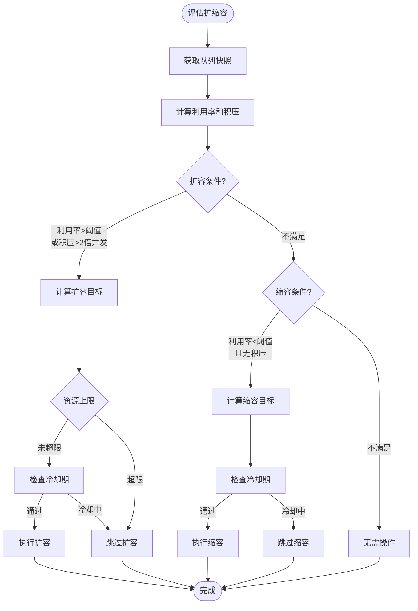
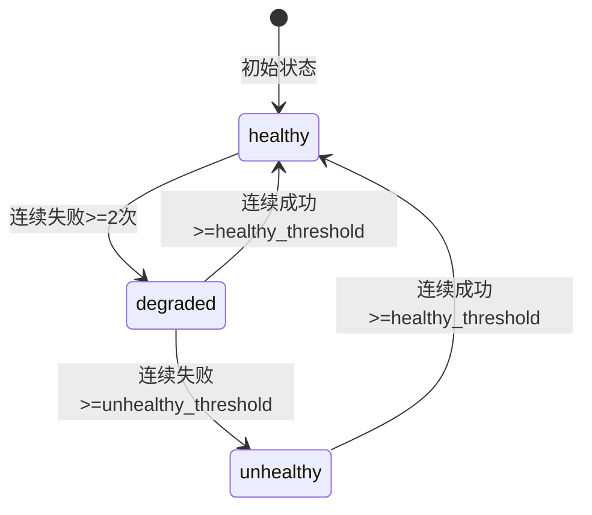
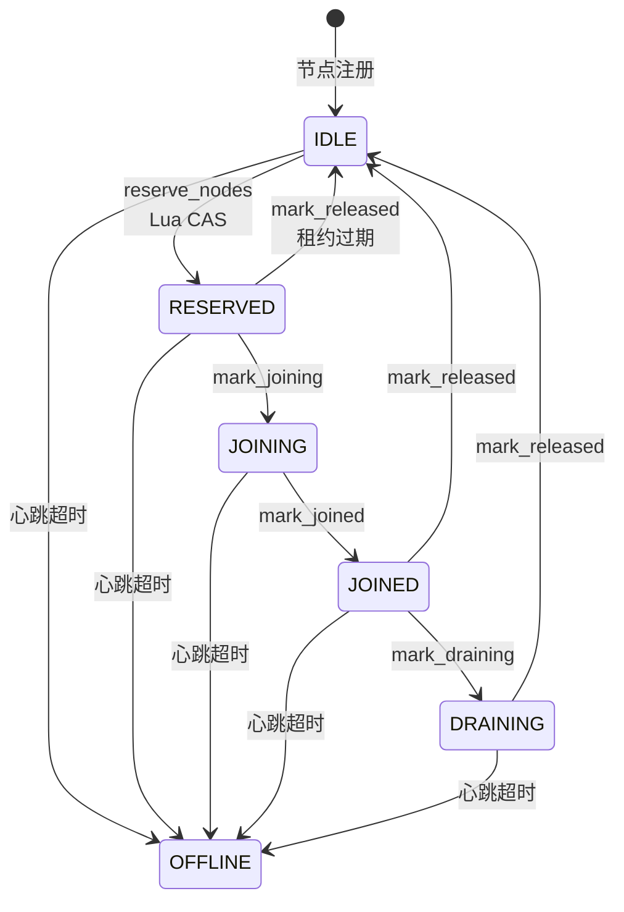

# 调度与资源管理

```cite
- [src/workload/scheduler_actor.py](src/workload/scheduler_actor.py)
- [src/workload/actor_pool_manager.py](src/workload/actor_pool_manager.py)
- [src/platform/resource_manager.py](src/platform/resource_manager.py)
- [src/platform/capability_registry.py](src/platform/capability_registry.py)
- [src/platform/cluster_registry.py](src/platform/cluster_registry.py)
- [src/platform/node_registry.py](src/platform/node_registry.py)
- [src/models/capability.py](src/models/capability.py)
- [src/models/cluster.py](src/models/cluster.py)
- [src/models/node.py](src/models/node.py)
```

## 引言

调度与资源管理模块是整个系统的核心基础设施，负责协调任务分发、资源分配和集群生命周期管理。该模块通过 Ray Actor 框架实现分布式调度，结合 Redis 实现状态持久化和协调，确保系统在分布式环境下的高可用性和弹性伸缩能力。模块包含多个核心组件：`SchedulerActor` 作为集群内调度代理、`ActorPoolManager` 管理 Actor 池、`ResourceManager` 负责节点级资源分配和自动伸缩决策，以及多个注册中心（CapabilityRegistry、ClusterRegistry、NodeRegistry）管理能力、集群和节点的生命周期与健康状态。

## 架构概述

调度与资源管理模块采用分层架构设计，上层为调度入口，中层为资源管理和协调层，下层为基础注册中心。模块通过 Ray 的 Detached Named Actor 机制实现跨进程的调度代理，利用 Redis 作为共享状态存储实现分布式协调。各组件通过明确的职责划分和接口定义，实现了高内聚低耦合的设计。



**图表来源**
- [src/workload/scheduler_actor.py](src/workload/scheduler_actor.py#l60-l130)
- [src/workload/actor_pool_manager.py](src/workload/actor_pool_manager.py#l100-l200)
- [src/platform/resource_manager.py](src/platform/resource_manager.py#l60-l120)
- [src/platform/capability_registry.py](src/platform/capability_registry.py#l80-l120)
- [src/platform/cluster_registry.py](src/platform/cluster_registry.py#l70-l100)
- [src/platform/node_registry.py](src/platform/node_registry.py#l80-l150)

### 核心组件交互流程

调度与资源管理模块的核心交互流程体现了从任务提交到资源分配的完整链路。DagEngine 提交任务到 SchedulerActor，SchedulerActor 根据能力类型将任务路由到对应的 ActorPoolManager，ActorPoolManager 通过最小负载选择算法选择具体的 Worker Actor 执行任务。同时，ResourceManager 监控队列状态和集群资源，根据负载情况动态调整 ActorPool 的大小，并负责节点级资源的分配和释放。



**图表来源**
- [src/workload/scheduler_actor.py](src/workload/scheduler_actor.py#l130-l180)
- [src/workload/actor_pool_manager.py](src/workload/actor_pool_manager.py#l450-l520)
- [src/platform/resource_manager.py](src/workload/resource_manager.py#l380-l450)
- [src/platform/node_registry.py](src/workload/node_registry.py#l335-l380)

## SchedulerActor：集群调度代理

### 核心职责

`SchedulerActor` 作为 Ray Detached Named Actor 运行，是集群内任务调度的统一入口。它负责管理多个 capability 对应的 ActorPool，实现能力到工作池的映射关系。SchedulerActor 提供同步执行（`execute_sync`）和异步提交（`submit_async`）两种调度模式，支持不同场景下的任务分发需求。通过版本化命名方案，SchedulerActor 支持灰度发布和版本切换，实现了平滑的升级能力。

### 版本化命名方案

SchedulerActor 采用版本化命名机制，格式为 `scheduler_{cluster_id}__{release}`。这种设计支持多版本共存，通过 Redis 记录当前激活的 actor 名称，实现运行时版本切换。系统提供 `get_scheduler_actor` 函数，按优先级尝试查找：优先使用 active 版本，其次使用当前版本。这种机制使得系统可以在不中断服务的情况下进行灰度发布和回滚。



**图表来源**
- [src/workload/scheduler_actor.py](src/workload/scheduler_actor.py#l220-l280)

### 故障恢复机制

SchedulerActor 在启动时会自动从 Redis 恢复 pool 注册信息，保证 Actor 重建后不丢失 capability 到 pool 的映射关系。恢复过程通过 `_recover_pools_from_redis` 方法实现，遍历 Redis Hash 中持久化的映射关系，尝试通过 `ray.get_actor` 重新获取 pool handle。对于已死亡的 pool actor，系统会自动清理 Redis 中的残留记录。这种机制确保了 SchedulerActor 在故障重启后能够快速恢复服务状态。

### 调度模式

SchedulerActor 提供三种调度模式，分别适应不同的使用场景：

1. **同步执行（`execute_sync`）**：将任务分发到对应 capability 的 ActorPool 并等待结果，适用于需要立即获取结果的场景。方法内部使用 `ray.get` 等待执行结果，并设置超时机制。

2. **异步提交（`submit_async`）**：将任务分发到 ActorPool，等待提交确认后立即返回。通过 `ray.get` 显式等待提交确认，避免 fire-and-forget 模式掩盖 actor 已死亡等错误。实际执行由 ActorPool 异步完成，返回格式为 `{task_id}:{step_name}` 的任务标识。

3. **流式提交（`submit_streaming`）**：将任务分发到 ActorPool 的流式执行路径，返回 buffer key。适用于需要流式返回结果的场景，如视频生成等长时间运行的任务。

## ActorPoolManager：Actor池管理器

### 核心职责

`ActorPoolManager` 负责管理一组 Worker Actor 实例，提供同步执行和异步提交能力。它通过最小负载选择算法（Least-Loaded + Round-Robin）均匀分配任务，实现负载均衡。ActorPoolManager 具备故障自动恢复能力，当 Worker 执行失败时自动替换并重试一次。同时支持动态扩缩容，缩容时优先移除负载最低的 Actor。

### 最小负载选择算法

ActorPoolManager 实现了智能的任务分发算法，结合最小负载选择和轮询机制，确保任务在池内均匀分布。算法首先刷新 inflight 状态，清除已完成的 ObjectRef，然后找到最小 pending 数量。从 `next_index` 开始轮询，选择第一个命中最小负载的 Actor，最后更新 `next_index` 保证下次轮询的公平性。这种设计既保证了负载均衡，又避免了单点过载。



**图表来源**
- [src/workload/actor_pool_manager.py](src/workload/actor_pool_manager.py#l440-l490)

### 动态扩缩容

ActorPoolManager 支持运行时动态调整池大小，通过 `resize` 方法实现。扩容时直接创建新 Actor 补充到目标数量；缩容时按 inflight 任务数升序排序，优先移除负载最低的 Actor。对于有进行中任务的 Actor，系统会打印警告后强制 kill，并主动取消每个 inflight ObjectRef，让下游 DagEngine 立刻收到 `TaskCancelledError`。缩容完成后，ActorPoolManager 会调用 `_report_observed_size` 将真实池规模上报到扩缩容状态，供 ResourceManager 和 DagEngine 的动态 QPS 收敛器使用。

### 故障自动恢复

ActorPoolManager 实现了完善的故障处理机制，根据异常类型采取不同的恢复策略。系统将异常分为两类：actor 故障（Ray 系异常如 actor 死亡/超时/OwnerDied）和业务异常（RayTaskError 包装的用户代码异常）。对于 actor 故障，系统会自动替换失效 Actor 并重试一次；对于业务异常，池保持不变，异常原样抛给调用方，避免单个坏输入反复烧毁整池 GPU actor。

系统还实现了熔断保护机制，在 `_ACTOR_FAULT_REPLACE_WINDOW_SECONDS`（300秒）窗口内，同一 actor 触发的 actor 级故障超过 `_ACTOR_FAULT_MAX_REPLACES_PER_WINDOW`（3次）时即熔断，避免单个坏 actor 反复 replace 造成雪崩。熔断持续一个窗口周期，到期自动恢复。

### Named Worker 恢复

ActorPoolManager 使用确定性名称创建 Worker Actor，格式为 `worker_{tenant_id}_{cluster_id}_{capability}_{idx}`。这种设计使得 ActorPoolManager 重建后可以通过 `ray.get_actor` 恢复已存活的 worker，避免重复加载模型。初始化时，系统会优先尝试从 Ray 集群中恢复已存在的 worker actor，并行发起所有健康检查，避免串行等待。恢复失败的 worker 会自动从 Redis 中清理，补充创建不足的 worker 到目标池大小。

## 资源管理器

### 核心职责

`ResourceManager` 是资源管理的统一入口，负责节点级资源分配、自动伸缩决策和维护编排。它通过多阶段流程实现节点分配（选择→预留→邀请→确认），通过 Lua CAS 脚本保证预留原子性，通过 AgentClient 与节点 Agent 通信。ResourceManager 基于队列利用率和积压深度评估扩缩容决策，使用 Lua 脚本原子检查冷却期并记录决策，避免并发决策冲突。

### 节点级资源分配

ResourceManager 实现了四阶段节点分配流程，确保资源分配的原子性和一致性：

1. **选择（Select）**：从空闲节点中贪心选取满足 GPU 需求的组合。NodeRegistry 的 `select_nodes` 方法实现贪心算法，按 available_gpus 降序排列候选节点，依次累加 GPU 直到满足需求。

2. **预留（Reserve）**：通过 Lua CAS 原子将节点状态从 IDLE → RESERVED，设置租约 TTL。Lua 脚本 `_lua_reserve_node` 检查节点当前状态是否为 IDLE，若是则原子设置状态为 RESERVED 并绑定 cluster_id，同时创建独立 TTL 的租约 key。

3. **邀请（Invite）**：向节点 Agent 发送加入集群指令。ResourceManager 使用 `AgentClient.invite_batch` 并行发送邀请请求，提高效率。

4. **确认（Confirm）**：Agent 接受后标记 JOINED，拒绝则回滚释放预留。对于接受的节点，系统更新集群资源计数；对于拒绝的节点，调用 `mark_released` 释放预留。



**图表来源**
- [src/platform/resource_manager.py](src/platform/resource_manager.py#l200-l280)
- [src/platform/node_registry.py](src/platform/node_registry.py#l420-l480)

### 自动伸缩策略

ResourceManager 实现了基于队列利用率和积压深度的自动伸缩策略，确保系统能够根据负载动态调整资源。

**扩容条件**：
- 利用率超过阈值（`settings.scaling.up_threshold`）
- 积压量超过最大并发的 2 倍

**缩容条件**：
- 利用率低于阈值（`settings.scaling.down_threshold`）
- 无积压（pending == 0）

**扩容策略**：翻倍但不超过最大增量限制，即 `min(current * 2, current + max_increment)`，当 current=0 时保底至少扩到 1，避免无法从零恢复。

**缩容策略**：减半但不低于最小 actor 数，即 `max(min_actors, current // 2)`。

系统通过 Lua 脚本 `_lua_check_and_record_scaling` 实现冷却机制，原子检查冷却期并记录决策时间戳，避免并发决策冲突。扩容目标还会受到资源上限约束，不超过能力所需资源对应的集群可用容量。



**图表来源**
- [src/platform/resource_manager.py](src/platform/resource_manager.py#l380-l470)

### 维护编排链路

ResourceManager 实现了完整的维护编排流程，构成潮汐容错的核心维护链路：

1. **心跳超时检测**：通过 NodeRegistry 的 `detect_dead_nodes` 方法，使用 Redis Sorted Set（score=心跳时间）快速定位超时节点，将其标记为 OFFLINE。

2. **租约清理**：释放过期预留（RESERVED 状态且租约 TTL 已到期），清理 `node_lease:{node_id}` 键。

3. **集群资源重算**：对受影响的集群重新统计 GPU 总数，调用 `_update_cluster_resources` 更新集群的 `ObservedResources`。

4. **能力健康联动**：若某集群已无存活节点，将其关联的能力标记为不健康；若集群重新有存活节点，将此前不健康的能力恢复为健康。

5. **卡住的 JOINING 节点清理**：租约过期但状态仍为 JOINING 的节点释放回 IDLE。

6. **running 集合超时残留清理**：清理 ops-api 侧 running 集合中的超时残留。

维护任务通过 `run_maintenance` 方法统一编排，预取一次全量节点快照，内存过滤替代多次 `list_all()` Redis 往返，提高效率。

## 能力注册中心

### 核心职责

`CapabilityRegistry` 管理所有 AI 能力的注册、注销、发现与健康检查。它通过 Lua 脚本在 Redis 中原子更新健康状态，实现带去抖逻辑的三态状态机（healthy → degraded → unhealthy）。存储后端为 Redis，能力信息序列化为 JSON，健康状态独立存储于 Hash 结构。CapabilityRegistry 继承 BaseRedisRegistry 泛型基类，复用注册/查询/TTL 管理等通用逻辑。

### 三态状态机

CapabilityRegistry 实现了完善的三态健康状态机，通过 Lua 脚本 `_lua_update_health` 原子更新状态，避免并发竞态：

- **healthy → degraded**：连续失败 >= 2 次
- **degraded → unhealthy**：连续失败 >= `unhealthy_threshold`
- **unhealthy/degraded → healthy**：连续成功 >= `healthy_threshold`（去抖恢复）

去抖机制避免因网络抖动导致状态频繁翻转，需要连续多次相同结果才触发状态迁移。状态变化会同时更新健康 Hash 和能力信息 JSON，确保数据一致性。



**图表来源**
- [src/platform/capability_registry.py](src/platform/capability_registry.py#l30-l80)

### 健康检查更新

CapabilityRegistry 提供 `update_health` 方法，由外部健康检查循环调用。方法通过 Lua 脚本在 Redis 中原子执行状态机转换，避免并发竞态。参数包括能力名称、本次健康检查结果和租户 ID。当状态从 unhealthy 恢复到 healthy 时，系统会记录日志；当状态降级为 unhealthy 时，也会发出警告。

### 能力发现

CapabilityRegistry 提供 `find_capability` 方法，查找指定能力时仅返回健康或降级状态的能力，不健康的直接过滤。方法首先调用 `get` 获取能力信息，然后检查健康状态，若为 `UNHEALTHY` 则返回 None 并记录警告。这种设计确保了调度系统只会路由到可用的能力。

## 集群注册中心

### 核心职责

`ClusterRegistry` 管理所有工作负载 Ray 集群的注册、注销、健康状态和资源信息。它通过 Lua 脚本实现集群字段的原子更新，避免并发读-改-写竞争。提供基于多维评分的集群选择算法，支持负载均衡路由。存储后端为 Redis，继承 BaseRedisRegistry 消除重复代码。

### 资源模型

ClusterRegistry 维护两层资源模型：

- **PlannedResources（规划资源）**：注册时声明的规划值，包括 `fixed_gpus`（固定 GPU）、`tidal_gpus`（潮汐 GPU）、`gpu_types`、`total_cpus`、`total_memory_gb`。这些值不会被运行时自动覆盖。

- **ObservedResources（运行时资源）**：从已加入节点聚合自动计算的派生值，包括 `total_gpus`、`available_gpus`、`available_cpus`、`available_memory_gb`。

`ClusterResources` 通过 `model_validator` 接受扁平字典构造，通过 `model_serializer` 输出扁平字典，通过 `@property` 代理属性保持 `resources.xxx` 访问方式不变，实现向后兼容。

### 集群选择算法

ClusterRegistry 提供 `select_best_cluster` 方法，从候选集群中选择最优集群，实现多维评分排序：

1. **固定资源空闲优先**：`available_gpus > tidal_gpus` 说明有固定资源空闲，优先选择
2. **队列最短优先**：选择当前任务队列最浅的集群（负载均衡）
3. **可用 GPU 最多优先**：资源最充裕的集群

评分元组为 `(-has_fixed_free, q_depth, -available_gpus)`，Python 元组按字段从左到右比较，值越小越优先。

## 节点注册中心

### 核心职责

`NodeRegistry` 管理节点生命周期：注册、心跳、注销，基于 Redis Hash/Set/Sorted Set 存储。实现节点状态机：IDLE → RESERVED → JOINING → JOINED → DRAINING → IDLE，所有状态转换通过 Lua CAS 脚本保证原子性，防止并发竞态。提供节点选择与预留功能，贪心算法按 GPU 降序选取节点，Lua 原子 CAS 预留避免重复分配。基于 Sorted Set（score=心跳时间）实现心跳超时检测。

### 节点状态机

NodeRegistry 实现了完整的节点生命周期状态机，通过 Lua 脚本 `_lua_transition` 实现通用原子状态转换，支持多个期望源状态（CAS）和任意字段批量更新：

- **IDLE**：已注册，空闲可用
- **RESERVED**：已被选中，等待邀请确认
- **JOINING**：正在加入 Ray 集群
- **JOINED**：已加入集群，正常工作
- **DRAINING**：排空中，不再接受新任务
- **OFFLINE**：离线/不可用

任何状态都可以通过心跳超时转换到 OFFLINE。状态转换通过 Lua CAS 保证原子性，避免并发竞态。



**图表来源**
- [src/platform/node_registry.py](src/platform/node_registry.py#l40-l90)

### 节点选择算法

NodeRegistry 提供 `select_nodes` 方法，从空闲节点中选出满足 GPU 需求的节点组合，实现贪心算法：

1. **过滤**：排除指定节点 → GPU 类型过滤 → 标签过滤 → 自定义资源过滤
2. **排序**：按 `available_gpus` 降序（优先选大节点，减少碎片和管理开销）
3. **贪心选取**：依次累加 GPU 直到满足需求
4. **充分性检查**：若累计 GPU 不足则返回空列表（避免下游拿到不完整结果）

对于 CPU-only 分配（`required_gpus=0`），系统选择 1 个最佳候选节点，按可用 CPU 优先。

### 心跳超时检测

NodeRegistry 通过 `detect_dead_nodes` 方法实现心跳超时检测。方法使用 Redis Sorted Set `nodes:heartbeats`（score=最后心跳时间），通过 `ZRANGEBYSCORE` 找到 score < cutoff 的节点。对于每个超时节点，在 CAS 转换前读取 `cluster_id`（转换会清空该字段），然后执行 CAS 转换：从任意非 OFFLINE 状态 → OFFLINE。转换成功后清理租约，返回 `(node_id, cluster_id)` 元组列表，用于后续集群资源重算。

### 节点预留

NodeRegistry 提供 `reserve_nodes` 方法，使用 Lua CAS 脚本保证预留原子性。对每个节点执行 `_lua_reserve_node` 脚本：检查 `state == IDLE`（CAS 条件），原子设置 `state = RESERVED + cluster_id`，创建独立 TTL 的租约 key。并发安全：两个 ResourceManager 同时预留同一节点时，Lua 脚本的 CAS 保证只有先执行的一方成功。返回成功预留的租约列表，部分节点可能 CAS 失败。

## 资源模型

### 固定资源与潮汐资源

系统在资源模型中区分固定资源和潮汐资源，实现灵活的资源管理策略：

- **固定资源（fixed_gpus）**：长期绑定的 GPU，用于保证核心服务的稳定性。这些资源不会被潮汐伸缩影响，始终可用。

- **潮汐资源（tidal_gpus）**：按需弹性分配的 GPU，通过节点邀请/释放动态调整。这些资源可以用于处理突发负载，在资源紧张时可以被回收。

集群选择算法优先使用固定资源空闲的集群（`available_gpus > tidal_gpus`），确保核心服务的稳定性。潮汐资源则用于弹性扩容，提高资源利用率。

### 资源聚合

ResourceManager 通过 `_update_cluster_resources` 方法实现资源聚合，根据已加入的节点重新计算集群运行时资源：

- `total_gpus`：所有已加入节点的 GPU 总数
- `available_gpus`：所有已加入节点的可用 GPU 总数
- `total_cpus`：所有已加入节点的 CPU 总数
- `available_cpus`：所有已加入节点的可用 CPU 总数
- `total_memory_gb`：所有已加入节点的内存总量（GB）
- `available_memory_gb`：所有已加入节点的可用内存（GB）

聚合结果通过 ClusterRegistry 的 `update_resources` 方法更新，使用 Lua 脚本 `_lua_update_observed_resources` 原子批量更新，避免并发覆盖。

## 多租户支持

调度与资源管理模块全面支持多租户隔离，通过租户 ID 实现资源和服务隔离：

- **SchedulerActor**：通过 `tenant_actor_namespace` 函数为租户返回 Ray actor namespace，实现多租户 actor 隔离。空 tenant_id 或默认租户 ID → "ray_async"，其他 tenant_id → "ray_async_{tenant_id}"。

- **ActorPoolManager**：worker 命名和 Redis key 都包含租户前缀，避免跨租户重名冲突。租户感知 namespace 确保跨租户完全隔离。

- **CapabilityRegistry**：Redis 键支持租户隔离，格式为 `capability:{tenant_id}:{name}`。

- **ClusterRegistry**：Redis 键支持租户隔离，格式为 `cluster:{tenant_id}:{cluster_id}`。

- **NodeRegistry**：节点包含 `tenant_id` 字段，`select_nodes` 方法支持按租户过滤，防止跨租户占用。

- **ResourceManager**：所有操作都支持 `tenant_id` 参数，确保资源分配和扩缩容决策在租户范围内执行。

这种设计确保了不同租户之间的资源和服务完全隔离，避免了租户间的干扰和资源争抢。

## 与 DagEngine 和 QueueManager 的交互

调度与资源管理模块与 DagEngine 和 QueueManager 保持明确的交互边界：

- **DagEngine 交互**：DagEngine 通过 SchedulerActor 提交任务，调用 `submit_async`、`submit_streaming` 等方法。DagEngine 可以调用 ResourceManager 的 `try_eager_scale_up` 进行热路径快速扩容检查，使用较短的冷却时间以便在任务密集提交时更快响应。DagEngine 还可以从 ActorPoolManager 的 `get_status` 获取池状态，用于动态 QPS 收敛。

- **QueueManager 交互**：ResourceManager 通过 QueueManager 的 `get_queue_snapshot` 获取队列状态，包括 pending、running、max_concurrent 等指标，用于扩缩容决策。QueueManager 提供队列深度和配置查询，是自动伸缩策略的重要输入。

这种设计保持了模块间的清晰边界，调度与资源管理模块专注于资源分配和调度逻辑，DagEngine 负责任务编排，QueueManager 负责队列管理，各司其职。