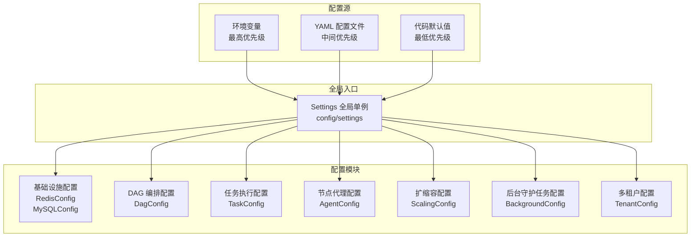

# 配置说明

```cite
- [config/settings.py](config/settings.py)
- [config/_infra.py](config/_infra.py)
- [config/_task.py](config/_task.py)
- [config/_dag.py](config/_dag.py)
- [config/_scaling.py](config/_scaling.py)
- [config/_background.py](config/_background.py)
- [config/_tenant.py](config/_tenant.py)
- [config/service_defaults.yaml](config/service_defaults.yaml)
- [src/agent/config.py](src/agent/config.py)
```

## 引言

本文档详细说明 ray-amu 系统的配置参数体系。系统采用分层配置架构，支持通过环境变量、YAML 配置文件和代码默认值三个层级进行配置管理。配置按功能模块划分为基础设施、DAG 编排、任务执行、节点代理、扩缩容、后台守护任务和多租户等独立子模块，所有配置通过全局单例 `settings` 统一访问。

## 配置架构

配置系统采用三级优先级机制，确保灵活性和可维护性。最高优先级为环境变量，适用于容器化部署和敏感信息注入；中间优先级为 YAML 配置文件，提供结构化的默认配置；最低优先级为代码默认值，确保系统在无外部配置时仍可正常运行。所有配置在初始化时进行合法性校验，防止非法值导致运行时异常。

配置模块化设计将不同功能域的配置隔离到独立的子模块中，每个子模块负责特定领域的配置管理。主配置类 `Settings` 聚合所有子配置，并提供统一的访问入口。这种设计既保证了配置的清晰组织，又便于各模块独立维护和扩展。



**图表来源**
- [config/settings.py](config/settings.py#l1-l100)
- [config/_infra.py](config/_infra.py#l1-l50)
- [config/_task.py](config/_task.py#l1-l30)
- [config/_dag.py](config/_dag.py#l1-l30)
- [config/_scaling.py](config/_scaling.py#l1-l30)
- [config/_background.py](config/_background.py#l1-l30)
- [config/_tenant.py](config/_tenant.py#l1-l30)
- [src/agent/config.py](src/agent/config.py#l1-50)

配置加载流程从最高优先级的环境变量开始查找，若未找到则降级到 YAML 配置文件，最后使用代码默认值。每个配置模块在 `__post_init__` 方法中实现此优先级逻辑，确保配置解析的一致性。系统启动时会进行完整的配置校验，包括数值范围检查和必填项验证，校验失败将抛出异常并阻止系统启动。

## 基础设施配置

基础设施配置包含 Redis 和 MySQL 两个核心存储组件的连接参数，支持通过环境变量动态覆盖配置文件设置。Redis 配置支持 BNS 服务发现和直接连接两种模式，MySQL 配置包含连接池管理和启动检查策略。

### Redis 配置

Redis 配置由 `RedisConfig` 类管理，支持 BNS 服务发现自动解析地址。配置项包括连接地址、认证信息、数据库选择和连接池参数。

**配置项列表**：

- `redis.bns`：BNS 服务名称，用于服务发现。默认值：`group.bdrp-ray-amu-proxy.redis.all`。环境变量：`REDIS_BNS`，配置路径：`redis.bns`
- `redis.host`：Redis 服务器主机地址，BNS 解析失败时的回退地址。默认值：`127.0.0.1`。环境变量：`REDIS_HOST`，配置路径：`redis.host`
- `redis.port`：Redis 服务器端口。默认值：`6379`。环境变量：`REDIS_PORT`，配置路径：`redis.port`
- `redis.password`：Redis 认证密码。默认值：空字符串。环境变量：`REDIS_PASSWORD`，配置路径：`redis.password`
- `redis.db`：Redis 数据库编号。默认值：`0`。环境变量：`REDIS_DB`，配置路径：`redis.db`
- `redis.decode_responses`：是否自动解码响应为字符串。默认值：`true`。环境变量：`REDIS_DECODE_RESPONSES`，配置路径：`redis.decode_responses`
- `redis.max_connections`：连接池最大连接数。默认值：`50`。环境变量：`REDIS_MAX_CONN`，配置路径：`redis.max_connections`

### MySQL 配置

MySQL 配置由 `MySQLConfig` 类管理，包含连接参数和连接池管理策略，支持自动建表和启动时连接检查。

**配置项列表**：

- `mysql.host`：MySQL 服务器主机地址。默认值：`127.0.0.1`。环境变量：`MYSQL_HOST`，配置路径：`mysql.host`
- `mysql.port`：MySQL 服务器端口。默认值：`3306`。环境变量：`MYSQL_PORT`，配置路径：`mysql.port`
- `mysql.user`：MySQL 用户名。默认值：`root`。环境变量：`MYSQL_USER`，配置路径：`mysql.user`
- `mysql.password`：MySQL 密码。默认值：空字符串。环境变量：`MYSQL_PASSWORD`，配置路径：`mysql.password`
- `mysql.database`：数据库名称。默认值：`ray_amu`。环境变量：`MYSQL_DATABASE`，配置路径：`mysql.database`
- `mysql.pool_size`：连接池基础大小。默认值：`20`。环境变量：`DB_POOL_SIZE`，配置路径：`mysql.pool_size`
- `mysql.max_overflow`：连接池最大溢出连接数。默认值：`10`。环境变量：`DB_MAX_OVERFLOW`，配置路径：`mysql.max_overflow`
- `mysql.pool_recycle`：连接回收时间（秒）。默认值：`3600`。环境变量：`DB_POOL_RECYCLE`，配置路径：`mysql.pool_recycle`
- `mysql.auto_create_tables`：是否自动创建数据表。默认值：`false`。环境变量：`DB_AUTO_CREATE_TABLES`，配置路径：`mysql.auto_create_tables`
- `mysql.check_on_startup`：启动时是否检查数据库连接。默认值：`true`。环境变量：`DB_CHECK_ON_STARTUP`，配置路径：`mysql.check_on_startup`

### API 服务配置

API 服务基础配置控制监听地址和端口。

**配置项列表**：

- `server.api_host`：API 服务监听地址。默认值：`0.0.0.0`。环境变量：`API_HOST`，配置路径：`server.api_host`
- `server.api_port`：API 服务监听端口。默认值：`8000`。环境变量：`API_PORT`，配置路径：`server.api_port`

## DAG 编排配置

DAG 编排配置由 `DagConfig` 类管理，控制 DAG 配置目录、上下文生命周期、HTTP 超时、IO 执行器、QPS 限流和 Streaming 执行等关键参数。这些参数直接影响 DAG 引擎的性能和行为特征。

### 配置目录与上下文管理

**配置项列表**：

- `dag.config_dir`：DAG 配置文件目录路径，留空时使用默认路径 `config/dags`。默认值：空字符串。环境变量：`DAG_CONFIG_DIR`，配置路径：`dag.config_dir`
- `dag.context_ttl_seconds`：DAG 上下文过期时间（秒）。默认值：`259200`（3天）。环境变量：`DAG_CONTEXT_TTL_SECONDS`，配置路径：`dag.context_ttl_seconds`
- `dag.http_timeout_seconds`：HTTP 请求超时时间（秒）。默认值：`300`。环境变量：`DAG_HTTP_TIMEOUT_SECONDS`，配置路径：`dag.http_timeout_seconds`
- `dag.ctx_locks_eviction_threshold`：上下文锁驱逐阈值。默认值：`1000`。环境变量：`DAG_CTX_LOCKS_EVICTION_THRESHOLD`，配置路径：`dag.ctx_locks_eviction_threshold`

### IO 执行器与持久化

**配置项列表**：

- `dag.io_executor_max_workers`：IO 执行器最大工作线程数，用于处理阻塞 IO 操作（如 streaming blpop）。默认值：`128`。环境变量：`DAG_IO_EXECUTOR_MAX_WORKERS`，配置路径：`dag.io_executor_max_workers`
- `dag.context_save_throttle_ms`：上下文保存节流间隔（毫秒），避免 N 步 DAG 的 O(N²) 序列化开销。默认值：`500`。环境变量：`DAG_CONTEXT_SAVE_THROTTLE_MS`，配置路径：`dag.context_save_throttle_ms`
- `dag.map_shard_save_interval`：MAP 步骤批量持久化间隔，每处理 N 个 shard 保存一次上下文。默认值：`10`。环境变量：`DAG_MAP_SHARD_SAVE_INTERVAL`，配置路径：`dag.map_shard_save_interval`

### QPS 限流配置

**配置项列表**：

- `dag.qps_limiter_cache_size`：QPS 限流器 LRU 缓存容量，限制令牌桶数量防止内存无限增长。默认值：`1024`。环境变量：`DAG_QPS_LIMITER_CACHE_SIZE`，配置路径：`dag.qps_limiter_cache_size`
- `dag.qps_limiter_backend`：QPS 限流后端类型，可选值为 `redis`（分布式令牌桶）或 `memory`（单进程令牌桶）。默认值：`redis`。环境变量：`DAG_QPS_LIMITER_BACKEND`，配置路径：`dag.qps_limiter_backend`

### Streaming 执行配置

**配置项列表**：

- `dag.streaming_executor_max_workers`：Streaming 专用线程池大小，与通用 IO 执行器隔离。默认值：`64`。环境变量：`DAG_STREAMING_EXECUTOR_MAX_WORKERS`，配置路径：`dag.streaming_executor_max_workers`

## 任务执行配置

任务执行配置由 `TaskConfig` 类管理，涵盖执行锁、任务消费者、RayData 集成、调度器 Actor 和任务记录 TTL 等关键参数。这些参数控制任务的生命周期管理、并发执行和资源调度。

### 执行锁配置

**配置项列表**：

- `task.execution_lock.lease_seconds`：执行锁租约时长（秒）。默认值：`60`。环境变量：`TASK_EXECUTION_LOCK_LEASE_SECONDS`，配置路径：`task.execution_lock.lease_seconds`
- `task.execution_lock.renew_interval_seconds`：执行锁续约间隔（秒）。默认值：`15`。环境变量：`TASK_EXECUTION_LOCK_RENEW_INTERVAL_SECONDS`，配置路径：`task.execution_lock.renew_interval_seconds`
- `task.persist_strict`：是否启用严格持久化模式。默认值：`false`。环境变量：`TASK_PERSIST_STRICT`，配置路径：`task.persist_strict`

### 任务消费者配置

**配置项列表**：

- `task.consumer.enabled`：是否启用任务消费者。默认值：`true`。环境变量：`TASK_CONSUMER_ENABLED`，配置路径：`task.consumer.enabled`
- `task.consumer.poll_interval`：消费者轮询间隔（秒）。默认值：`2.0`。环境变量：`TASK_CONSUMER_POLL_INTERVAL`，配置路径：`task.consumer.poll_interval`
- `task.consumer.max_concurrent`：消费者最大并发任务数。默认值：`16`。环境变量：`TASK_CONSUMER_MAX_CONCURRENT`，配置路径：`task.consumer.max_concurrent`
- `task.consumer.requeue_backoff_base_seconds`：任务重新入队退避基数（秒）。默认值：`5`。环境变量：`TASK_REQUEUE_BACKOFF_BASE_SECONDS`，配置路径：`task.consumer.requeue_backoff_base_seconds`
- `task.consumer.requeue_backoff_max_seconds`：任务重新入队退避最大值（秒）。默认值：`300`。环境变量：`TASK_REQUEUE_BACKOFF_MAX_SECONDS`，配置路径：`task.consumer.requeue_backoff_max_seconds`

### RayData 集成配置

**配置项列表**：

- `task.raydata.task_types`：RayData 任务类型列表。默认值：空列表。环境变量：`RAYDATA_TASK_TYPES`，配置路径：`task.raydata.task_types`
- `task.raydata.task_type_cluster_map`：任务类型到集群的映射关系。默认值：空字典。环境变量：`TASK_TYPE_CLUSTER_MAP`，配置路径：`task.raydata.task_type_cluster_map`
- `task.raydata.submit_path`：RayData 任务提交路径。默认值：`/api/jobs/`。环境变量：`RAYDATA_SUBMIT_PATH`，配置路径：`task.raydata.submit_path`
- `task.raydata.submit_timeout_seconds`：RayData 提交超时时间（秒）。默认值：`15`。环境变量：`RAYDATA_SUBMIT_TIMEOUT_SECONDS`，配置路径：`task.raydata.submit_timeout_seconds`
- `task.raydata.api_token`：RayData API 认证令牌。默认值：空字符串。环境变量：`RAYDATA_API_TOKEN`，配置路径：`task.raydata.api_token`

### 调度器与记录管理

**配置项列表**：

- `task.scheduler_actor_version`：调度器 Actor 版本标识。默认值：`v1`。环境变量：`SCHEDULER_ACTOR_VERSION`，配置路径：`task.scheduler_actor_version`
- `task.scheduler_max_concurrency`：调度器 Actor 最大并发数。默认值：`16`。环境变量：`SCHEDULER_MAX_CONCURRENCY`，配置路径：`task.scheduler_max_concurrency`
- `task.record_ttl_seconds`：任务记录过期时间（秒）。默认值：`2592000`（30天）。环境变量：`TASK_RECORD_TTL_SECONDS`，配置路径：`task.record_ttl_seconds`

## 节点代理配置

节点代理配置由 `AgentConfig` 类管理，作为独立部署的节点服务，配置通过环境变量注入，不依赖全局配置树。Agent 配置涵盖服务网络、节点标识、心跳租约、AFS 挂载和部署包管理等参数。

### 服务网络配置

**配置项列表**：

- `AGENT_HOST`：Agent 服务监听地址。默认值：`0.0.0.0`。配置路径：`host`
- `AGENT_PORT`：Agent 服务监听端口。默认值：`9100`。配置路径：`port`
- `RAY_AMU_API_KEY`：Agent API 认证密钥。默认值：空字符串。配置路径：`api_key`

### 节点标识配置

**配置项列表**：

- `NODE_ID`：节点唯一标识符，默认使用主机名。默认值：平台主机名。配置路径：`node_id`
- `NODE_HOST`：节点主机地址。默认值：空字符串。配置路径：`node_host`
- `NODE_LABELS`：节点标签，格式为 `key=val,key=val`。默认值：空字典。配置路径：`node_labels`
- `NODE_CUSTOM_RESOURCES`：节点自定义资源声明，JSON 格式。默认值：空字典。配置路径：`node_custom_resources`

### 心跳与租约配置

**配置项列表**：

- `AGENT_HEARTBEAT_INTERVAL`：心跳发送间隔（秒）。默认值：`15`。配置路径：`heartbeat_interval`
- `AGENT_HEARTBEAT_TIMEOUT`：心跳超时时间（秒）。默认值：`60`。配置路径：`heartbeat_timeout`
- `AGENT_OWNER_TTL`：所有者租约过期时间（秒）。默认值：`90`。配置路径：`owner_ttl`
- `NODE_LEASE_TTL`：节点租约过期时间（秒）。默认值：`300`。配置路径：`node_lease_ttl`

### AFS 挂载配置

**配置项列表**：

- `AGENT_MOUNT_ENABLED`：是否启用 AFS 挂载。默认值：`false`。配置路径：`mount.enabled`
- `AGENT_MOUNT_COMMAND`：AFS 挂载命令。默认值：空字符串。配置路径：`mount.command`
- `AGENT_MOUNT_POINT`：AFS 挂载点路径。默认值：`/mnt/afs`。配置路径：`mount.point`
- `AGENT_MOUNT_CHECK_COMMAND`：AFS 挂载检查命令。默认值：空字符串。配置路径：`mount.check_command`
- `AGENT_MOUNT_TIMEOUT_SECONDS`：AFS 挂载超时时间（秒）。默认值：`60`。配置路径：`mount.timeout_seconds`

### 部署包配置

**配置项列表**：

- `AGENT_DEPLOY_BASE_DIR`：部署包基础目录。默认值：`/opt/ray-amu/deploys`。配置路径：`deploy.base_dir`
- `AGENT_DEPLOY_DOWNLOAD_TIMEOUT`：部署包下载超时时间（秒）。默认值：`600`。配置路径：`deploy.download_timeout`
- `AGENT_DEPLOY_MAX_PACKAGES`：最大部署包数量。默认值：`20`。配置路径：`deploy.max_packages`

## 扩缩容配置

扩缩容配置由 `ScalingConfig` 类管理，控制队列深度、扩缩容策略、熔断器参数和排空策略。这些参数直接影响系统的资源利用率和容错能力。

### 队列配置

**配置项列表**：

- `scaling.default_max_queue_depth`：默认最大队列深度。默认值：`1000`。环境变量：`DEFAULT_MAX_QUEUE_DEPTH`，配置路径：`scaling.default_max_queue_depth`
- `scaling.default_max_concurrent`：默认最大并发数。默认值：`8`。环境变量：`DEFAULT_MAX_CONCURRENT`，配置路径：`scaling.default_max_concurrent`

### 扩缩容策略配置

**配置项列表**：

- `scaling.up_threshold`：扩容阈值（队列使用率）。默认值：`0.8`。环境变量：`SCALE_UP_THRESHOLD`，配置路径：`scaling.up_threshold`
- `scaling.down_threshold`：缩容阈值（队列使用率）。默认值：``0.2``。环境变量：`SCALE_DOWN_THRESHOLD`，配置路径：`scaling.down_threshold`
- `scaling.cooldown_seconds`：扩缩容冷却时间（秒）。默认值：`300`。环境变量：`SCALE_COOLDOWN_SECONDS`，配置路径：`scaling.cooldown_seconds`
- `scaling.eager_cooldown_seconds`：急切扩容冷却时间（秒）。默认值：`10`。环境变量：`EAGER_SCALE_COOLDOWN_SECONDS`，配置路径：`scaling.eager_cooldown_seconds`
- `scaling.eager_down_cooldown_seconds`：急切缩容冷却时间（秒）。默认值：`10`。环境变量：`EAGER_SCALE_DOWN_COOLDOWN_SECONDS`，配置路径：`scaling.eager_down_cooldown_seconds`

### 扩缩容边界配置

**配置项列表**：

- `scaling.up_max_increment`：单次扩容最大增量。默认值：`8`。环境变量：`SCALE_UP_MAX_INCREMENT`，配置路径：`scaling.up_max_increment`
- `scaling.down_min_actors`：缩容最小 Actor 数量。默认值：`1`。环境变量：`SCALE_DOWN_MIN_ACTORS`，配置路径：`scaling.down_min_actors`

### 排空与熔断器配置

**配置项列表**：

- `scaling.drain_default_deadline_seconds`：排空默认截止时间（秒）。默认值：`300`。环境变量：`DRAIN_DEFAULT_DEADLINE_SECONDS`，配置路径：`scaling.drain_default_deadline_seconds`
- `scaling.circuit.failure_threshold`：熔断器失败阈值。默认值：`10`。环境变量：`CIRCUIT_FAILURE_THRESHOLD`，配置路径：`scaling.circuit.failure_threshold`
- `scaling.circuit.open_duration_seconds`：熔断器打开持续时间（秒）。默认值：`60`。环境变量：`CIRCUIT_OPEN_DURATION_SECONDS`，配置路径：`scaling.circuit.open_duration_seconds`
- `scaling.circuit.half_open_max`：熔断器半开状态最大请求数。默认值：`1`。环境变量：`CIRCUIT_HALF_OPEN_MAX`，配置路径：`scaling.circuit.half_open_max`
- `scaling.dequeue_scan_limit`：出队扫描候选上限。默认值：`50`。环境变量：`DEQUEUE_SCAN_LIMIT`，配置路径：`scaling.dequeue_scan_limit`

## 后台守护任务配置

后台守护任务配置由 `BackgroundConfig` 类管理，包含 Cron 调度器、回调重试、资源治理、对账器、领导锁和 Registry TTL 等后台循环任务的配置参数。

### Cron 调度器配置

**配置项列表**：

- `background.cron.enabled`：是否启用 Cron 调度器。默认值：`true`。环境变量：`CRON_SCHEDULER_ENABLED`，配置路径：`background.cron.enabled`
- `background.cron.check_interval`：Cron 检查间隔（秒）。默认值：`60.0`。环境变量：`CRON_SCHEDULER_CHECK_INTERVAL`，配置路径：`background.cron.check_interval`

### 回调重试配置

**配置项列表**：

- `background.callback_retry.enabled`：是否启用回调重试。默认值：`true`。环境变量：`CALLBACK_RETRY_ENABLED`，配置路径：`background.callback_retry.enabled`
- `background.callback_retry.poll_interval`：回调重试轮询间隔（秒）。默认值：`5.0`。环境变量：`CALLBACK_RETRY_POLL_INTERVAL`，配置路径：`background.callback_retry.poll_interval`
- `background.callback_retry.batch_size`：回调重试批次大小。默认值：`50`。环境变量：`CALLBACK_RETRY_BATCH_SIZE`，配置路径：`background.callback_retry.batch_size`
- `background.callback_retry.base_delay_seconds`：回调重试基础延迟（秒）。默认值：`10`。环境变量：`CALLBACK_RETRY_BASE_DELAY_SECONDS`，配置路径：`background.callback_retry.base_delay_seconds`
- `background.callback_retry.max_delay_seconds`：回调重试最大延迟（秒）。默认值：`600`。环境变量：`CALLBACK_RETRY_MAX_DELAY_SECONDS`，配置路径：`background.callback_retry.max_delay_seconds`
- `background.callback_retry.max_attempts`：回调重试最大尝试次数。默认值：`8`。环境变量：`CALLBACK_RETRY_MAX_ATTEMPTS`，配置路径：`background.callback_retry.max_attempts`

### 资源治理配置

**配置项列表**：

- `background.resource_governance.enabled`：是否启用资源治理。默认值：`true`。环境变量：`RESOURCE_GOVERNANCE_ENABLED`，配置路径：`background.resource_governance.enabled`
- `background.resource_governance.interval`：资源治理检查间隔（秒）。默认值：`30.0`。环境变量：`RESOURCE_GOVERNANCE_INTERVAL`，配置路径：`background.resource_governance.interval`

### 角色领导锁配置

**配置项列表**：

- `background.role_lock.ttl_seconds`：角色锁过期时间（秒）。默认值：`30`。环境变量：`BACKGROUND_ROLE_LOCK_TTL_SECONDS`，配置路径：`background.role_lock.ttl_seconds`
- `background.role_lock.renew_interval_seconds`：角色锁续约间隔（秒）。默认值：`10.0`。环境变量：`BACKGROUND_ROLE_LOCK_RENEW_INTERVAL_SECONDS`，配置路径：`background.role_lock.renew_interval_seconds`

### 对账器配置

**配置项列表**：

- `background.reconcile.enabled`：是否启用对账器。默认值：`true`。环境变量：`RECONCILE_ENABLED`，配置路径：`background.reconcile.enabled`
- `background.reconcile.interval_seconds`：对账检查间隔（秒）。默认值：`15.0`。环境变量：`RECONCILE_INTERVAL_SECONDS`，配置路径：`background.reconcile.interval_seconds`
- `background.reconcile.stuck_max_per_tick`：每次检查最大卡顿任务数。默认值：`20`。环境变量：`RECONCILE_STUCK_MAX_PER_TICK`，配置路径：`background.reconcile.stuck_max_per_tick`
- `background.reconcile.stuck_task_max_age_seconds`：卡顿任务最大年龄（秒）。默认值：`300`。环境变量：`RECONCILE_STUCK_TASK_MAX_AGE_SECONDS`，配置路径：`background.reconcile.stuck_task_max_age_seconds`
- `background.reconcile.dead_letter_capacity`：死信队列最大容量。默认值：`1000`。环境变量：`RECONCILE_DEAD_LETTER_CAPACITY`，配置路径：`background.reconcile.dead_letter_capacity`

### Registry TTL 配置

**配置项列表**：

- `background.registry_ttl.node_seconds`：节点注册表过期时间（秒）。默认值：`604800`（7天）。环境变量：`REGISTRY_NODE_TTL_SECONDS`，配置路径：`background.registry_ttl.node_seconds`
- `background.registry_ttl.schedule_seconds`：调度注册表过期时间（秒）。默认值：`31536000`（365天）。环境变量：`REGISTRY_SCHEDULE_TTL_SECONDS`，配置路径：`background.registry_ttl.schedule_seconds`
- `background.max_schedules_per_tenant`：每租户最大调度数量。默认值：`100`。环境变量：`MAX_SCHEDULES_PER_TENANT`，配置路径：`background.max_schedules_per_tenant`

## 多租户配置

多租户配置由 `TenantConfig` 类管理，控制多租户功能开关、制品存储、默认配额、HTTP 限流和 Worker 制品缓存等参数。这些参数实现租户隔离和资源配额管理。

### 多租户功能配置

**配置项列表**：

- `tenant.multi_tenant_enabled`：是否启用多租户功能。默认值：`false`。环境变量：`MULTI_TENANT_ENABLED`，配置路径：`tenant.multi_tenant_enabled`
- `tenant.super_admin_api_key`：超级管理员 API 密钥。默认值：空字符串。环境变量：`SUPER_ADMIN_API_KEY`，配置路径：`tenant.super_admin_api_key`

### 制品存储配置

**配置项列表**：

- `tenant.artifact_store.type`：制品存储类型。默认值：`local`。环境变量：`ARTIFACT_STORE_TYPE`，配置路径：`tenant.artifact_store.type`
- `tenant.artifact_store.base_dir`：制品存储基础目录。默认值：`/shared/artifacts`。环境变量：`ARTIFACT_STORE_BASE_DIR`，配置路径：`tenant.artifact_store.base_dir`

### 默认配额配置

**配置项列表**：

- `tenant.default_quota.max_tasks`：默认最大任务数配额（0 表示无限制）。默认值：`10000`。环境变量：`DEFAULT_QUOTA_MAX_TASKS`，配置路径：`tenant.default_quota.max_tasks`
- `tenant.default_quota.max_gpus`：默认最大 GPU 配额。默认值：`1000`。环境变量：`DEFAULT_QUOTA_MAX_GPUS`，配置路径：`tenant.default_quota.max_gpus`
- `tenant.default_quota.max_actors`：默认最大 Actor 配额。默认值：`5000`。环境变量：`DEFAULT_QUOTA_MAX_ACTORS`，配置路径：`tenant.default_quota.max_actors`

### HTTP 限流配置

**配置项列表**：

- `tenant.rate_limit.enabled`：是否启用 HTTP 限流。默认值：`true`。环境变量：`RATE_LIMIT_ENABLED`，配置路径：`tenant.rate_limit.enabled`
- `tenant.rate_limit.per_second`：限流速率（每秒请求数）。默认值：`100`。环境变量：`RATE_LIMIT_PER_SECOND`，配置路径：`tenant.rate_limit.per_second`
- `tenant.rate_limit.burst`：限流突发容量。默认值：`200`。环境变量：`RATE_LIMIT_BURST`，配置路径：`tenant.rate_limit.burst`

### Worker 制品缓存配置

**配置项列表**：

- `tenant.worker_artifact.max_size_mb`：Worker 制品最大大小（MB）。默认值：`1024`。环境变量：`WORKER_ARTIFACT_MAX_SIZE_MB`，配置路径：`tenant.worker_artifact.max_size_mb`
- `tenant.worker_artifact.cache_max_entries`：Worker 制品缓存最大条目数。默认值：`50`。环境变量：`WORKER_ARTIFACT_CACHE_MAX_ENTRIES`，配置路径：`tenant.worker_artifact.cache_max_entries`