# 配额与多租户

```cite
- [src/platform/quota_enforcer.py](src/platform/quota_enforcer.py)
- [src/platform/tenant_registry.py](src/platform/tenant_registry.py)
- [src/models/tenant.py](src/models/tenant.py)
- [src/models/tenant_context.py](src/models/tenant_context.py)
- [src/api/dependencies.py](src/api/dependencies.py)
- [config/_tenant.py](config/_tenant.py)
- [src/platform/base_registry.py](src/platform/base_registry.py)
- [src/api/auth.py](src/api/auth.py)
```

## 引言

配额与多租户模块是系统资源隔离和访问控制的核心组件，负责在多租户环境中实现资源配额管理、租户身份认证以及租户间的数据隔离。该模块通过 Redis 存储租户配置和实时使用量，使用 Lua 脚本保证并发安全，并提供灵活的配额策略以支持不同租户的资源需求。

## 架构概述

配额与多租户模块由三个核心组件构成：配额执行器（`QuotaEnforcer`）负责资源配额的原子检查与分配，租户注册中心（`TenantRegistry`）管理租户信息和 API Key 认证，租户上下文（`TenantContext`）在请求生命周期中传递租户身份和配额信息。这三个组件通过依赖注入集成到 API 层和任务执行流程中，形成完整的资源隔离体系。

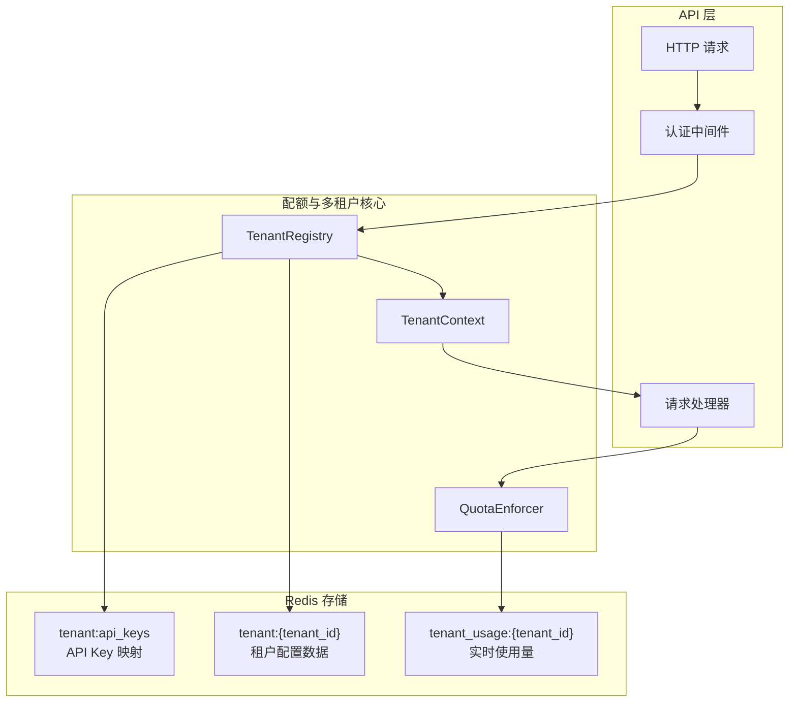

**图表来源**
- [src/api/dependencies.py](src/api/dependencies.py#l38-l78)
- [src/platform/tenant_registry.py](src/platform/tenant_registry.py#l40-l60)
- [src/platform/quota_enforcer.py](src/platform/quota_enforcer.py#l45-l70)

## 核心组件分析

### 配额执行器（QuotaEnforcer）

配额执行器是资源配额管理的核心组件，负责在任务提交、GPU 分配和 Actor 创建前执行原子性的配额检查和资源预留。该组件通过 Redis Hash 存储每个租户的实时使用量，使用 Lua 脚本实现原子性的检查与递增操作，有效避免了 TOCTOU（Time-of-Check to Time-of-Use）竞争条件。

配额执行器维护三个核心计数器：`task_count`（并发任务数）、`gpu_count`（GPU 占用量）和 `actor_count`（Actor 数量）。每个计数器都对应租户配额模型中的一个配额项，配额值为 0 时表示无限制。

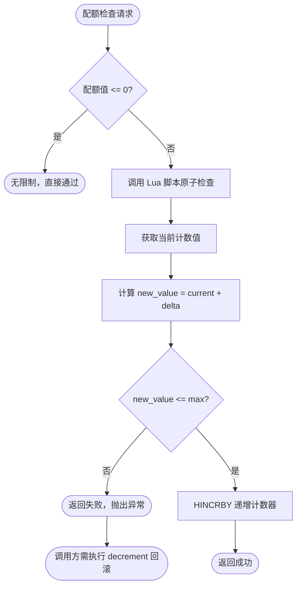

**图表来源**
- [src/platform/quota_enforcer.py](src/platform/quota_enforcer.py#l17-l32)
- [src/platform/quota_enforcer.py](src/platform/quota_enforcer.py#l79-l120)

#### 原子配额预留机制

配额执行器提供三个核心预留方法：`reserve_task_submission()`、`reserve_gpu_allocation()` 和 `reserve_actor_creation()`。这些方法都通过相同的 Lua 脚本模式实现原子操作，确保在高并发场景下不会出现配额超发。

Lua 脚本的执行逻辑包括：首先获取当前计数值，然后计算递增后的新值，最后检查新值是否超过配额上限。如果未超过上限，则执行递增操作并返回成功；否则直接返回失败，不修改计数器。这种设计保证了检查和递增操作的原子性，避免了传统"检查后递增"模式中的竞争条件。

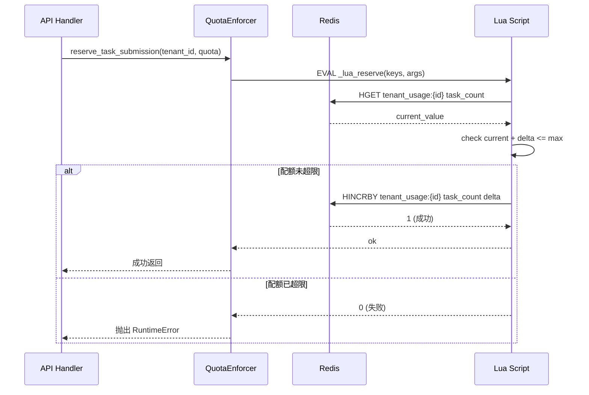

**图表来源**
- [src/platform/quota_enforcer.py](src/platform/quota_enforcer.py#l17-l32)
- [src/platform/quota_enforcer.py](src/platform/quota_enforcer.py#l79-l96)

#### 配额释放与回滚机制

配额释放通过 `decrement_task_count()`、`decrement_gpu_count()` 和 `decrement_actor_count()` 三个方法实现。这些方法同样使用 Lua 脚本保证原子性，并且在递减时将结果钳制到 0，避免因并发失败回滚导致计数器变为负数。

释放脚本的逻辑是：获取当前计数值，减去指定的 delta，如果结果为负则设置为 0，然后更新 Redis Hash。这种设计确保了即使在异常情况下多次调用释放方法，计数器也不会出现负值，保证了系统状态的正确性。

在任务提交流程中，配额预留和回滚形成了完整的资源管理闭环。API Handler 首先调用 `reserve_task_submission()` 预留配额，然后尝试创建任务。如果任务创建失败，必须调用 `decrement_task_count()` 回滚配额，避免配额泄漏。这种模式在节点分配流程中同样适用，确保资源分配失败时能够正确释放已预留的配额。

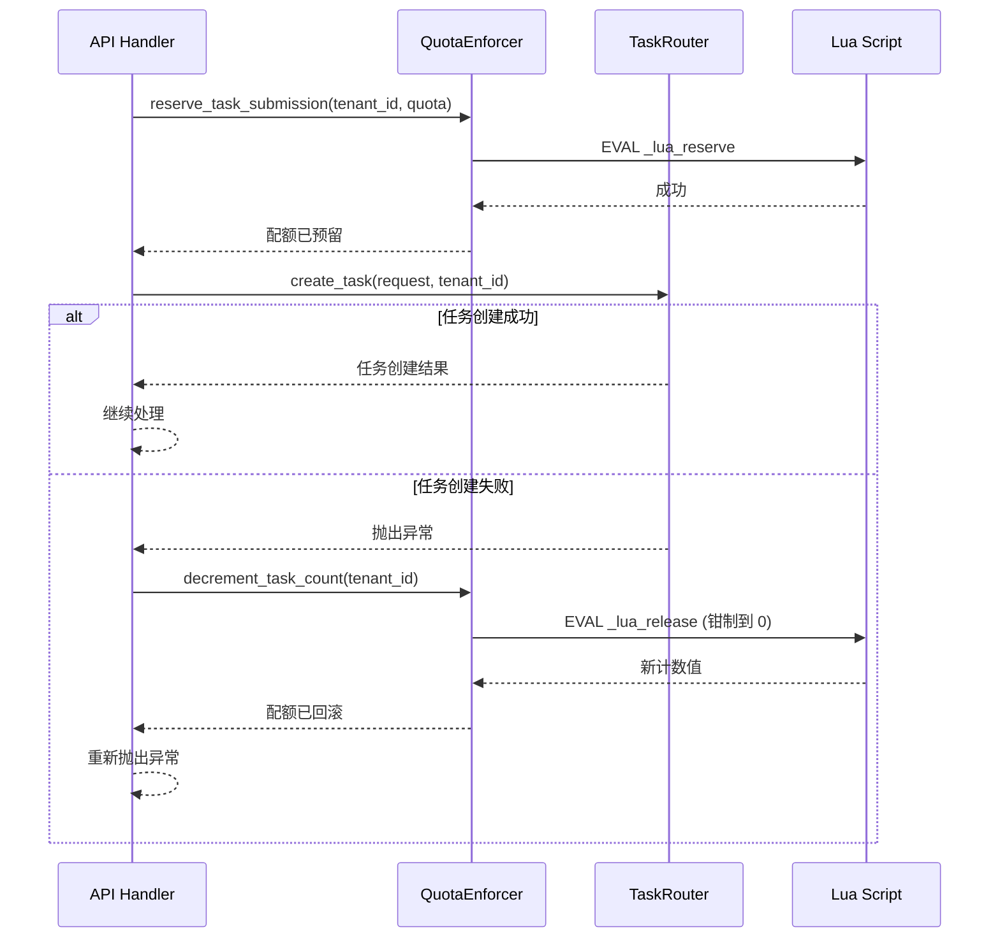

**图表来源**
- [src/api/routes/tasks.py](src/api/routes/tasks.py#l60-l73)
- [src/platform/quota_enforcer.py](src/platform/quota_enforcer.py#l132-l142)

#### 配额对账机制

配额执行器提供 `reconcile_quota_counters()` 方法用于比对 Redis 计数器与实际运行数，修正漂移。该方法读取 `tenant_usage:{tenant_id}` 中的三个计数器，与传入的实际值比对，发现差异时执行修正。

对账过程支持选择性修正：传入 `None` 的字段表示没有可靠的实际数据，跳过对账。返回的漂移字典包含 `task_drift`、`gpu_drift` 和 `actor_drift` 三个字段，值为 `None` 表示该字段未参与对账。这种设计允许系统在部分数据不可靠的情况下仍然进行有效的配额修正。

当前实现中，资源管理器的对账逻辑仅对默认租户执行，因为队列的 running set 不包含租户维度，无法按租户聚合实际运行数。GPU 和 Actor 计数器由于缺少可靠的实际数据源，传 `None` 跳过对账以避免错误归零。

### 租户配额模型（TenantQuota）

租户配额模型定义了租户可使用的资源上限，包含四个核心字段：`max_gpus`（最大 GPU 数量）、`max_queue_depth`（最大队列深度，当前未连接到队列管理器）、`max_concurrent_tasks`（最大并发任务数）和 `max_actor_count`（最大 Actor 数量）。所有配额字段默认值为 0，表示无限制。

配额模型使用 Pydantic 的 `BaseModel` 实现，支持从 JSON 序列化和反序列化，便于在 Redis 中存储和传输。模型包含一个 `model_validator` 用于修复 Lua cjson 空表的问题，确保数据兼容性。

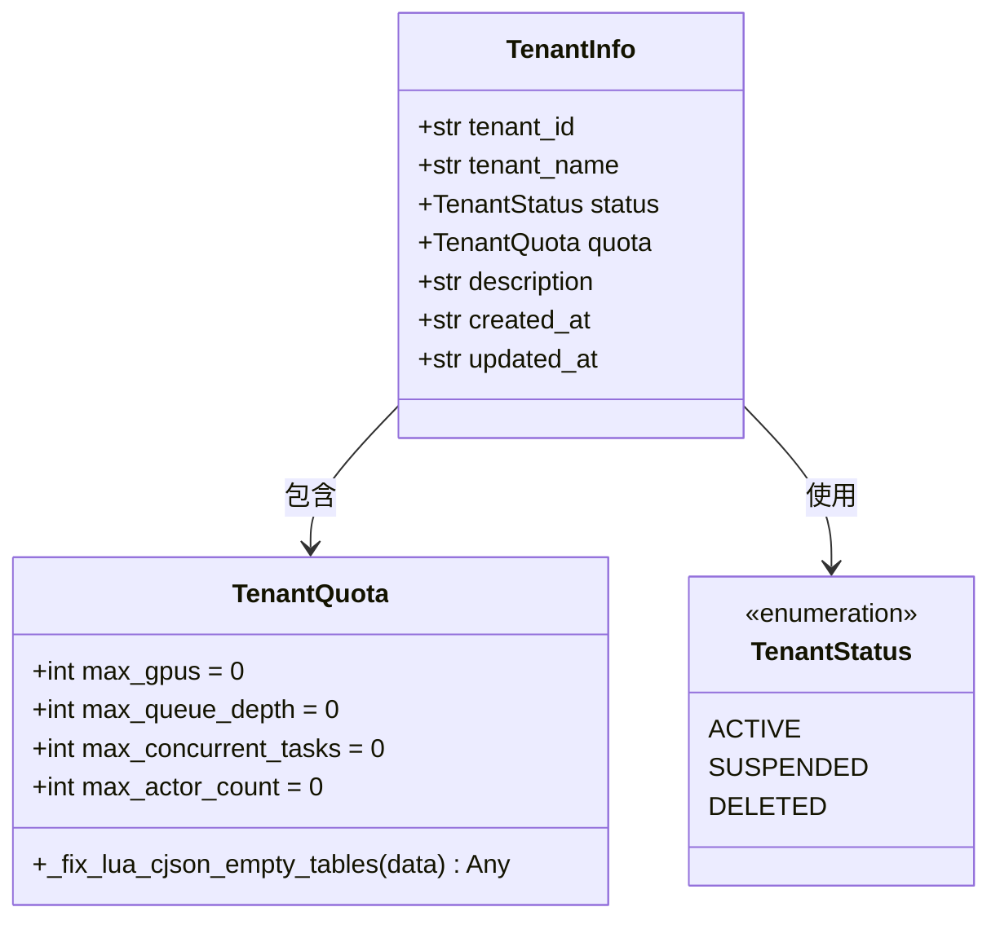

**图表来源**
- [src/models/tenant.py](src/models/tenant.py#l14-l25)
- [src/models/tenant.py](src/models/tenant.py#l28-l42)

### 并发安全与 Lua 脚本

配额执行器使用两个 Lua 脚本实现原子操作：`_lua_reserve` 用于检查和递增，`_lua_release` 用于递减和钳制。这两个脚本通过 `RegisteredScript` 机制注册到 Redis 客户端，确保脚本只加载一次，提高性能。

`_lua_reserve` 脚本接受四个参数：usage hash 键、字段名、delta 值和最大配额值。脚本首先获取当前值，然后检查递增后是否超过上限，如果未超过则执行递增并返回 1（成功），否则返回 0（失败）。这种设计确保了检查和递增的原子性，避免了多线程/多进程环境下的竞争条件。

`_lua_release` 脚本接受三个参数：usage hash 键、字段名和 delta 值。脚本获取当前值，减去 delta，如果结果为负则设置为 0，然后更新 Redis Hash 并返回新值。钳制到 0 的设计确保了即使多次调用释放方法，计数器也不会出现负值。

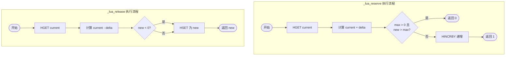

**图表来源**
- [src/platform/quota_enforcer.py](src/platform/quota_enforcer.py#l17-l32)

### 租户注册中心（TenantRegistry）

租户注册中心负责管理租户信息的 CRUD 操作，基于 Redis 实现持久化存储。该组件继承自 `BaseRedisRegistry` 泛型基类，使用统一的键布局约定：`tenant:{tenant_id}` 存储租户 JSON 数据，`tenants:index` 维护所有租户 ID 的集合。

租户注册中心提供核心方法：`register()` 注册或更新租户信息，`unregister()` 注销租户并清理关联的 API Key 映射，`generate_api_key()` 为租户生成新的 API Key，`verify_api_key_hash()` 验证 API Key 并返回对应的 tenant_id，`revoke_api_key()` 撤销指定 API Key。

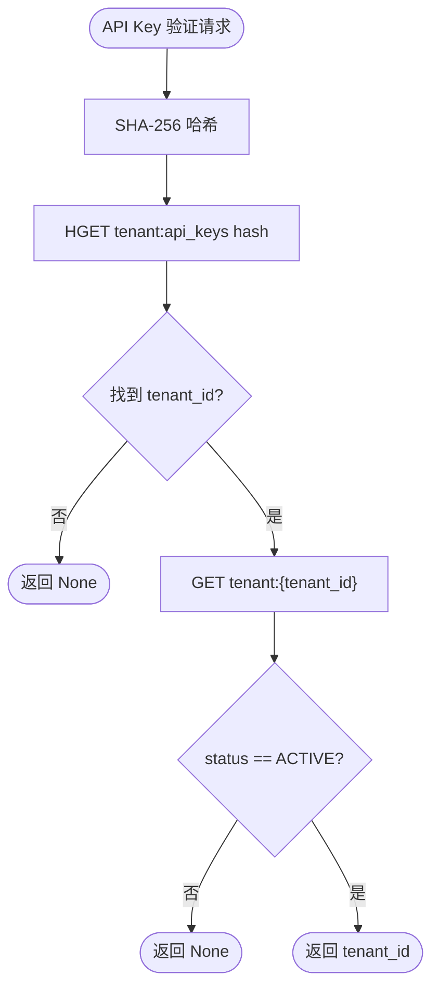

**图表来源**
- [src/platform/tenant_registry.py](src/platform/tenant_registry.py#l40-l95)
- [src/platform/tenant_registry.py](src/platform/tenant_registry.py#l97-l115)

#### API Key 管理机制

API Key 存储使用 SHA-256 哈希，不保存明文，提高安全性。系统维护两个数据结构：`tenant:api_keys` Redis Hash 存储哈希到 tenant_id 的映射，`tenant:api_keys_idx:{tenant_id}` Redis Set 存储反向索引，避免注销租户时需要全局扫描。

生成 API Key 时，系统创建格式为 `ramu_{32位URL安全随机字符}` 的 Key，计算其 SHA-256 哈希，然后在 `tenant:api_keys` 中建立映射，并在反向索引中添加记录。撤销 API Key 时，从正向映射和反向索引中同时删除记录，确保数据一致性。

验证 API Key 时，系统计算请求 Key 的哈希，在 `tenant:api_keys` 中查找对应的 tenant_id。如果找到，则进一步加载租户信息，检查租户状态是否为 ACTIVE，只有状态为 ACTIVE 的租户才能通过验证。

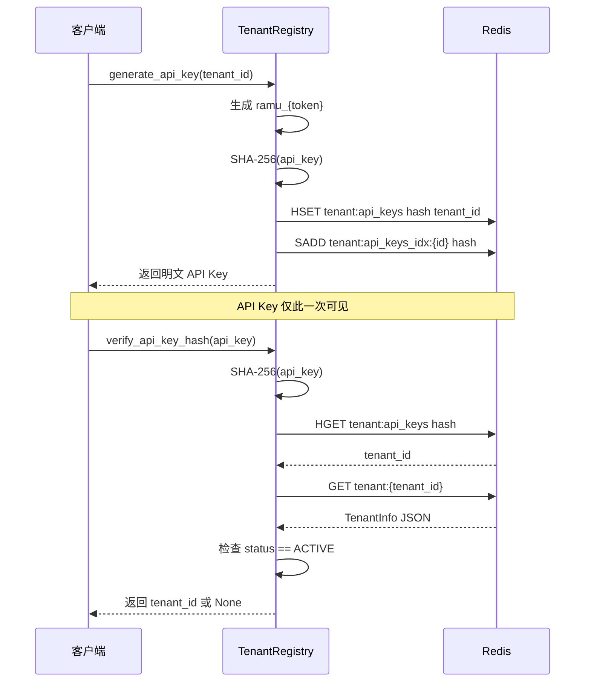

**图表来源**
- [src/platform/tenant_registry.py](src/platform/tenant_registry.py#l60-l95)

#### 租户资源用量查询

租户注册中心提供 `get_usage()` 方法获取租户当前资源使用量。该方法从 `tenant_usage:{tenant_id}` Redis Hash 中读取 `gpu_count`、`task_count` 和 `actor_count` 三个字段，返回包含当前使用量的字典。

资源用量查询需要权限控制：只有租户所有者或超级管理员才能查询。API 层通过检查 `TenantContext.is_super_admin` 属性和 `ctx.tenant_id` 是否匹配请求的 tenant_id 来实现权限验证。

### 租户上下文（TenantContext）

租户上下文是请求级的租户信息容器，使用 Python dataclass 实现，包含 `tenant_id`、`tenant_name`、`quota` 和 `roles` 四个字段。该上下文由认证中间件注入到每个 API handler，贯穿整个请求生命周期。

`TenantContext` 提供 `is_super_admin` 属性，用于判断当前租户是否拥有超级管理员角色。超级管理员可以跨租户操作，不受常规权限限制。默认租户 ID 为 `__default__`，用于单租户模式下的默认租户标识。

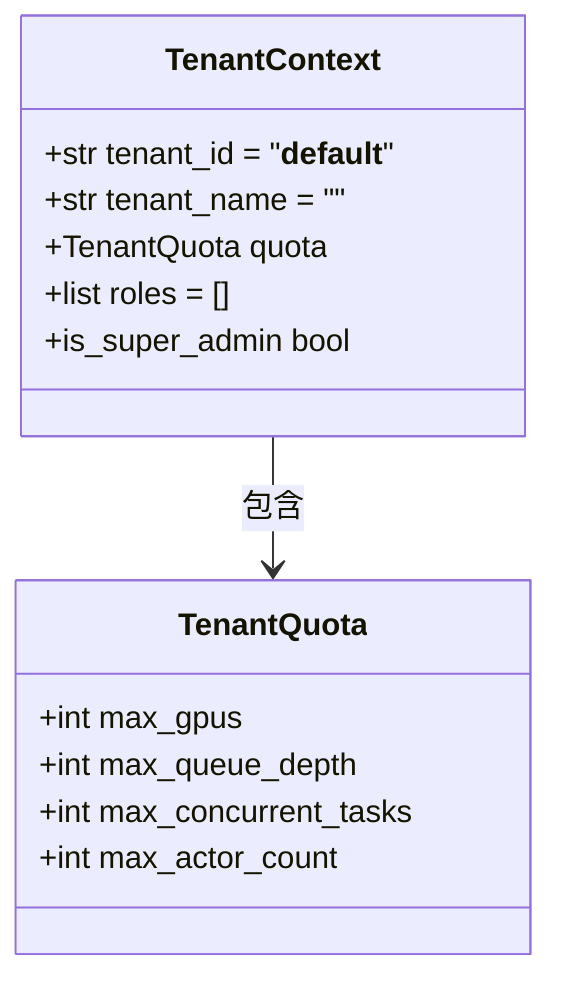

**图表来源**
- [src/models/tenant_context.py](src/models/tenant_context.py#l10-l25)

### 默认租户特殊处理

默认租户（`DEFAULT_TENANT_ID = "__default__"`）在配额执行中有特殊处理。配额执行器的 `_effective_quota()` 方法检测到默认租户时，会忽略传入的配额参数，转而使用系统默认配额。

系统默认配额通过延迟加载机制获取，避免循环导入。默认值在 `TenantConfig` 中定义：`default_quota_max_tasks` 为 10000，`default_quota_max_gpus` 为 1000，`default_quota_max_actors` 为 5000。这些值可以通过环境变量 `DEFAULT_QUOTA_MAX_TASKS`、`DEFAULT_QUOTA_MAX_GPUS` 和 `DEFAULT_QUOTA_MAX_ACTORS` 覆盖。

默认租户不再绕过配额检查，而是使用系统默认配额。这种设计确保了即使在单租户模式下，系统资源使用也受到合理限制，避免资源耗尽。

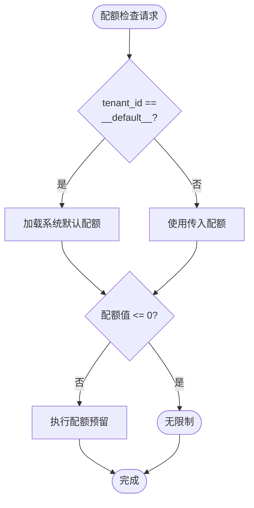

**图表来源**
- [src/platform/quota_enforcer.py](src/platform/quota_enforcer.py#l55-l62)
- [config/_tenant.py](config/_tenant.py#l22-l24)

### 配额为 0 的语义

配额值为 0 在系统中有明确的语义：表示无限制。这个设计适用于 `max_gpus`、`max_concurrent_tasks` 和 `max_actor_count` 三个配额项。

在配额执行器的预留方法中，如果检测到配额值小于等于 0，直接返回成功，不执行任何 Redis 操作。这种设计避免了无限制配额下的不必要 Redis 访问，提高了性能。

测试用例验证了这一语义：当 `max_concurrent_tasks` 为 0 时，连续调用 100 次 `reserve_task_submission()` 都能成功返回，不会抛出配额超限异常。

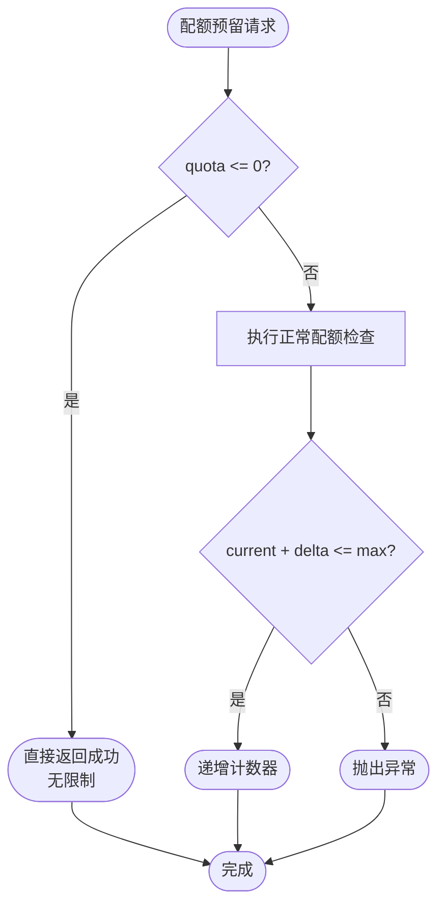

**图表来源**
- [src/platform/quota_enforcer.py](src/platform/quota_enforcer.py#l79-l96)
- [tests/test_quota_enforcer.py](tests/test_quota_enforcer.py#l43-l50)

### 租户隔离机制

租户隔离通过注册中心的租户作用域机制实现。`BaseRedisRegistry` 泛型基类提供 `_tenant_scoped` 类属性，子类设置为 `True` 时启用租户隔离。

启用租户隔离的注册器（`CapabilityRegistry`、`ClusterRegistry`、`ScheduleRegistry`）在生成 Redis 键时会包含租户 ID：`{prefix}:{tenant_id}:{item_id}`。索引键也相应变为 `{prefix}s:index:{tenant_id}`。这种设计确保了不同租户的数据完全隔离，互不可见。

默认租户（`__default__`）的数据存储在 `{prefix}:{item_id}` 键中，保持向后兼容。非默认租户的数据则存储在包含租户 ID 的键中，查询时必须指定租户 ID。

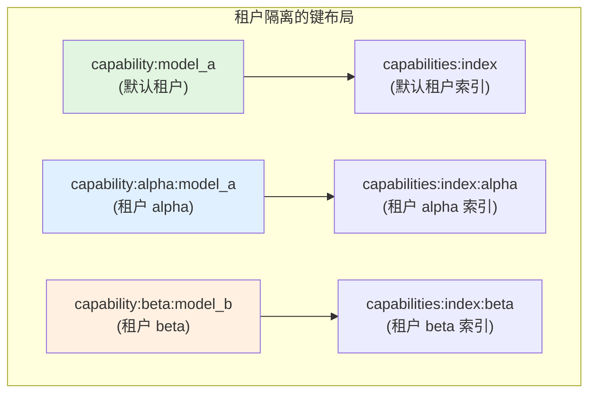

**图表来源**
- [src/platform/base_registry.py](src/platform/base_registry.py#l42-l56)
- [src/platform/capability_registry.py](src/platform/capability_registry.py#l120)
- [src/platform/cluster_registry.py](src/platform/cluster_registry.py#l122)

### 认证流程与租户上下文注入

认证流程通过 FastAPI 的依赖注入机制实现。`get_tenant_context()` 函数作为依赖项，从请求头中提取 `X-API-Key` 和 `X-Tenant-Id`，根据多租户模式开关执行不同的认证逻辑。

在单租户模式下（`multi_tenant_enabled=False`），系统保留旧行为：验证全局 API Key（`RAY_ASYNC_API_KEY`），返回默认租户的 `TenantContext`。

在多租户模式下，系统首先检查超级管理员 Key。如果请求 Key 匹配 `super_admin_api_key`，返回带有 `super_admin` 角色的上下文。否则，调用 `verify_tenant_api_key()` 通过租户注册中心验证 Key 归属，加载租户配额和状态信息。

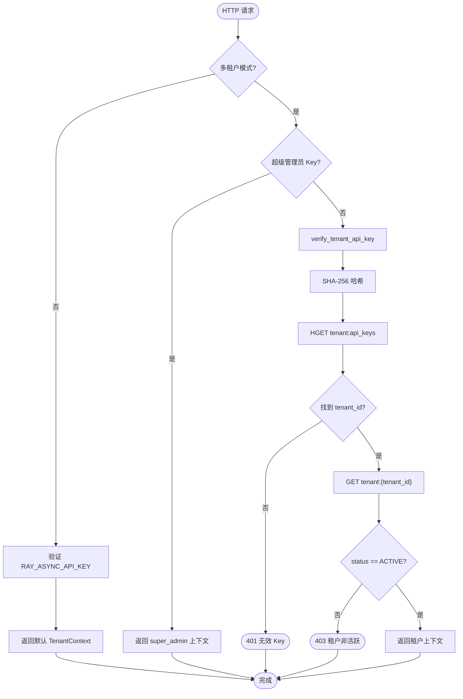

**图表来源**
- [src/api/dependencies.py](src/api/dependencies.py#l38-l78)
- [src/api/auth.py](src/api/auth.py#l15-l60)

### 配额执行集成点

配额执行器在多个关键流程中集成：任务提交流程、节点分配流程和任务执行流程。

在任务提交流程中，API Handler 调用 `reserve_task_submission()` 预留任务槽位，然后创建任务。如果任务创建失败，调用 `decrement_task_count()` 回滚配额。任务执行完成后，`TaskExecutor` 在成功和失败路径都会调用 `decrement_task_count()` 释放配额。

在节点分配流程中，API Handler 先调用 `reserve_gpu_allocation()` 按 `required_gpus` 预留配额，然后调用 `ResourceManager` 分配节点。分配完成后，根据实际分配的 GPU 数量校准配额：如果实际分配量小于请求量，释放差额；如果实际分配量大于请求量，尝试补充预留，失败则回滚整个分配。

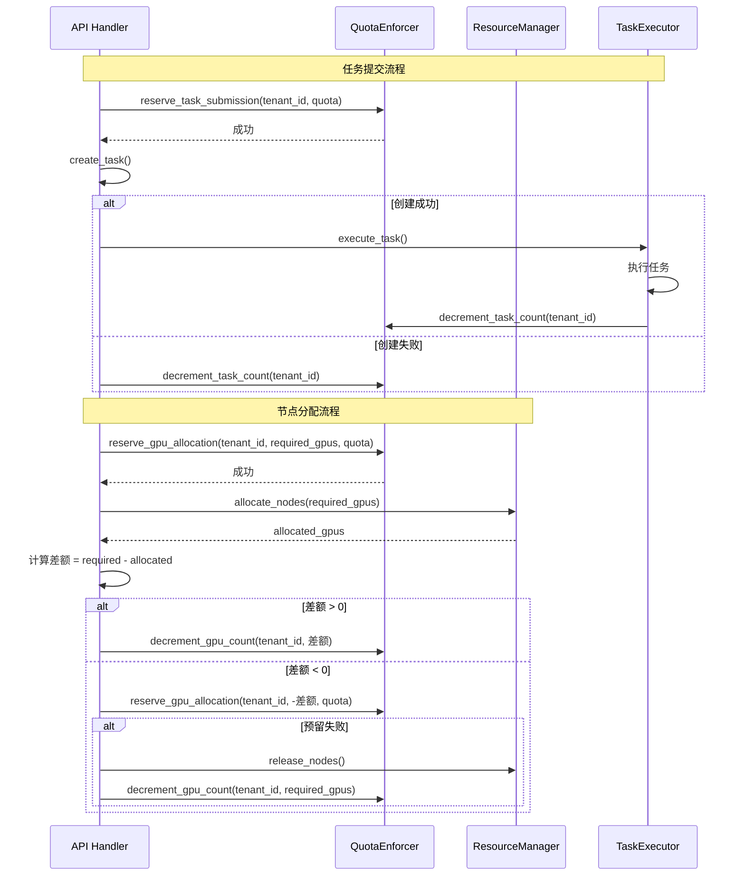

**图表来源**
- [src/api/routes/tasks.py](src/api/routes/tasks.py#l60-l73)
- [src/api/routes/nodes.py](src/api/routes/nodes.py#l111-l179)
- [src/platform/task_executor.py](src/platform/task_executor.py#l289-l372)

### 配额对账集成

配额对账在资源管理器的后台对账流程中集成。`ResourceManager._reconcile_quota_counters()` 方法遍历所有队列的 running 集合，统计实际运行的任务数，然后调用 `QuotaEnforcer.reconcile_quota_counters()` 修正计数器漂移。

当前实现对账仅针对默认租户，因为队列的 running set 不包含租户维度。GPU 和 Actor 计数器由于缺少可靠的实际数据源，传 `None` 跳过对账。未来多租户扩展需要在 running set member 中编码 tenant_id 或维护独立索引。

对账结果包含在资源管理器的健康检查响应中，如果检测到非零漂移，会记录警告日志并返回漂移详情。

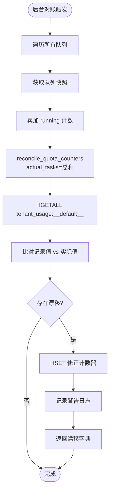

**图表来源**
- [src/platform/resource_manager.py](src/platform/resource_manager.py#l792-l820)
- [src/platform/quota_enforcer.py](src/platform/quota_enforcer.py#l148-l195)

## 依赖分析

配额与多租户模块依赖 Redis 客户端进行数据持久化，依赖 Pydantic 进行数据模型验证，依赖 FastAPI 的依赖注入机制集成到 API 层。模块内部，`QuotaEnforcer` 依赖 `TenantQuota` 模型，`TenantRegistry` 依赖 `TenantInfo` 模型，`TenantContext` 依赖 `TenantQuota` 模型。

注册中心基类 `BaseRedisRegistry` 被多个子类继承：`TenantRegistry`、`CapabilityRegistry`、`ClusterRegistry`、`ScheduleRegistry`。其中后三个子类启用租户隔离（`_tenant_scoped = True`），实现了租户级别的数据隔离。

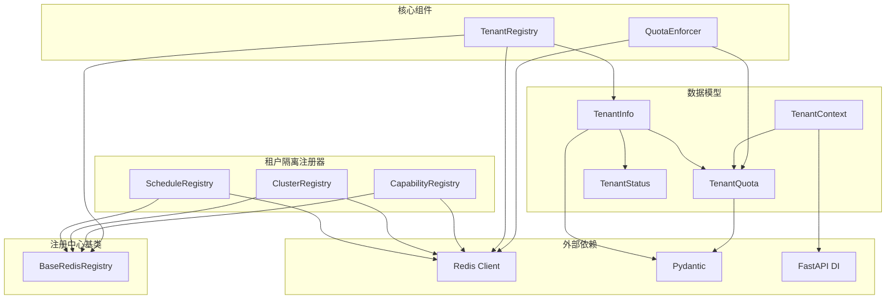

**图表来源**
- [src/models/tenant.py](src/models/tenant.py#l1-l42)
- [src/models/tenant_context.py](src/models/tenant_context.py#l10-l25)
- [src/platform/base_registry.py](src/platform/base_registry.py#l24-l56)
- [src/platform/capability_registry.py](src/platform/capability_registry.py#l120)
- [src/platform/cluster_registry.py](src/platform/cluster_registry.py#l122)