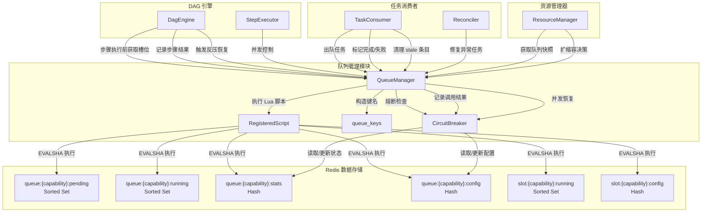
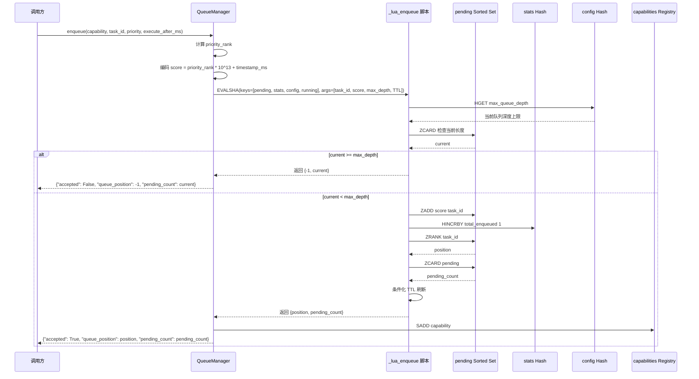
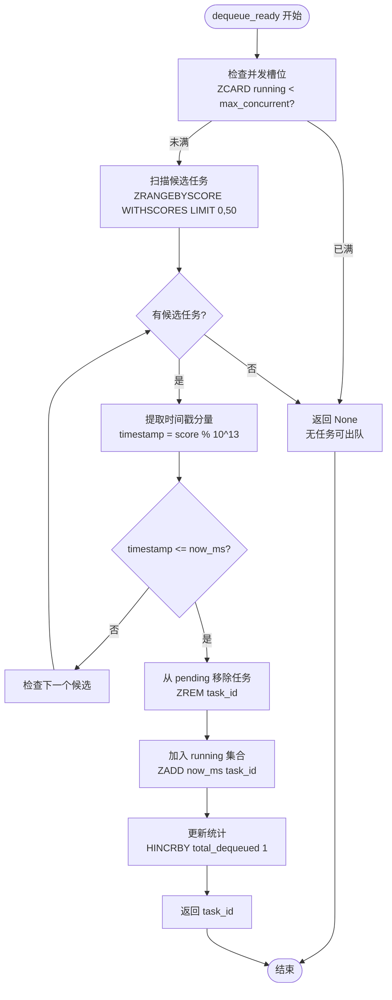
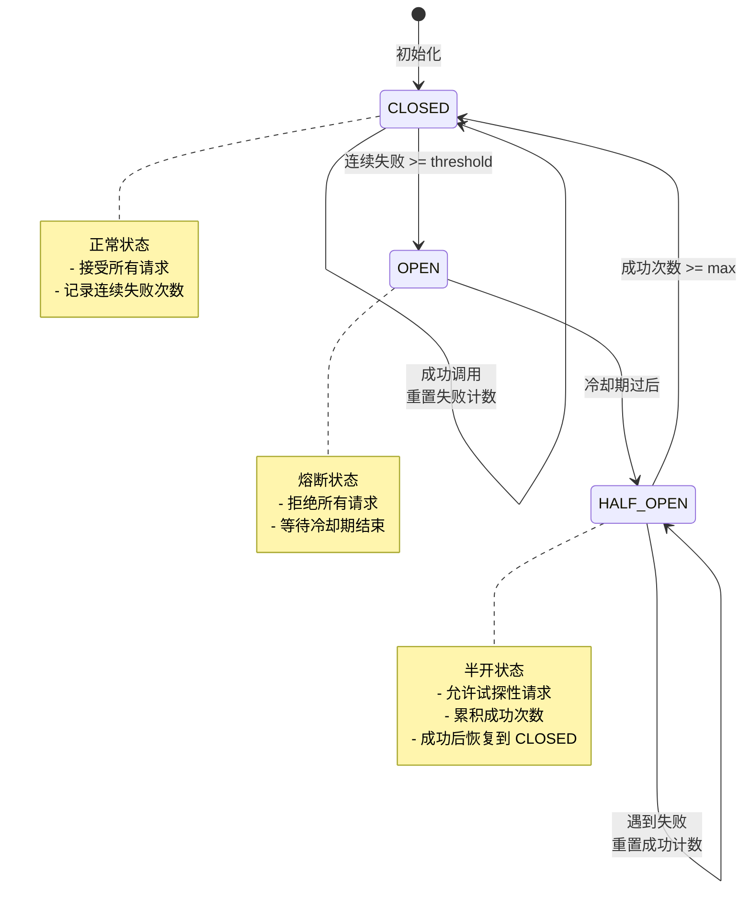
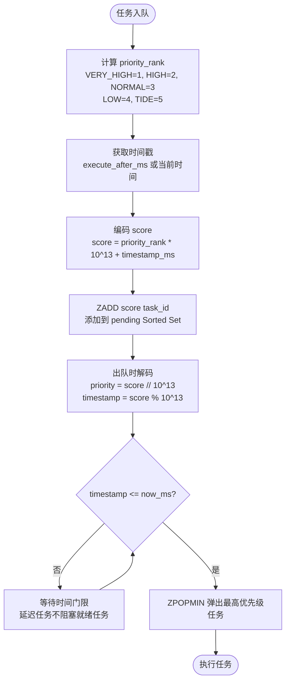

# 队列管理

```cite
- [src/platform/queue_manager.py](src/platform/queue_manager.py)
- [src/platform/circuit_breaker.py](src/platform/circuit_breaker.py)
- [src/platform/queue_keys.py](src/platform/queue_keys.py)
- [src/models/task.py](src/models/task.py)
- [config/_scaling.py](config/_scaling.py)
- [src/common/redis_client.py](src/common/redis_client.py)
```

## 引言

队列管理模块是整个任务编排系统的核心基础设施，负责基于 Redis 实现分布式任务队列的优先级调度、并发控制、反压保护和熔断机制。该模块通过精心设计的 Redis 数据结构和 Lua 脚本确保操作的原子性，同时支持延迟任务调度、步骤级并发槽位管理和潮汐容错恢复。队列管理器与 DAG 引擎、资源管理器、任务消费者等核心组件紧密协作，共同构建了一个高可靠、高性能的任务执行平台。

## 架构概述

队列管理模块采用分层架构设计，核心组件包括 `QueueManager` 队列管理器、`CircuitBreaker` 三态熔断器和 `queue_keys` Redis 键命名工具。`QueueManager` 作为主要接口，封装了任务入队、出队、取消、完成等核心操作，所有原子操作通过 Lua 脚本实现，确保在高并发场景下的数据一致性。`CircuitBreaker` 独立管理熔断状态机，实现 CLOSED → OPEN → HALF_OPEN → CLOSED 的自动状态转换，保护下游服务免受级联故障影响。Redis 数据结构采用 Sorted Set 存储待执行和运行中的任务，Hash 存储配置和统计信息，所有键使用 hash tag 确保在 Redis Cluster 环境下落到同一 slot，支持多 key 原子操作。



**图表来源**
- [src/platform/queue_manager.py](src/platform/queue_manager.py#l259-l275)
- [src/platform/circuit_breaker.py](src/platform/circuit_breaker.py#l125-l196)
- [src/platform/queue_keys.py](src/platform/queue_keys.py#l32-l60)

## 核心组件分析

### 队列管理器

队列管理器 `QueueManager` 是整个队列系统的核心协调者，提供任务入队、出队、取消、完成等完整生命周期管理功能。它通过精心设计的 Lua 脚本确保所有操作的原子性，避免在高并发场景下出现竞态条件。队列管理器支持两种级别的并发控制：任务级并发控制和步骤级并发槽位控制，分别适用于不同的调度场景。任务级并发控制通过 `queue:{capability}:running` Sorted Set 跟踪正在执行的任务，步骤级并发槽位通过独立的 `slot:{capability}:running` Sorted Set 管理，两者互不干扰，可以独立配置并发上限。

队列管理器实现了基于优先级和时间戳的复合调度算法，通过 score 编码 `priority_rank * 10^13 + timestamp_ms` 在 Sorted Set 中实现优先级排序，同优先级任务按 FIFO 顺序执行。支持延迟任务调度，通过 `execute_after_ms` 参数指定任务的最早执行时间，`dequeue_ready` 方法只取出时间戳小于等于当前时间的任务，确保延迟任务不会阻塞就绪任务的执行。队列管理器还集成了三态熔断器，通过 `CircuitBreaker` 组件实现自动故障检测和恢复，当连续失败次数超过阈值时自动熔断，冷却期后进入半开状态试探性放行请求，成功后自动恢复到关闭状态。

#### 任务入队流程

任务入队是队列管理的核心操作之一，通过 `_lua_enqueue` Lua 脚本实现原子性保证。入队流程首先检查队列深度是否超过配置的上限 `max_queue_depth`，如果已满则拒绝入队并返回错误。通过后，将任务 ID 和编码后的 score 添加到 `queue:{capability}:pending` Sorted Set 中，score 编码了优先级和时间戳信息，高优先级任务排在前面，同优先级任务按时间戳 FIFO 顺序排列。入队成功后，更新统计信息中的 `total_enqueued` 计数器，并返回任务在队列中的位置和当前队列深度。为了优化性能，TTL 刷新采用条件化策略，仅当剩余 TTL 低于阈值（TTL/2）或键无 TTL 时才刷新，避免高 QPS 场景下每次入队都执行 EXPIRE 操作带来的额外负载。



**图表来源**
- [src/platform/queue_manager.py](src/platform/queue_manager.py#l363-l414)
- [src/platform/queue_manager.py](src/platform/queue_manager.py#l44-l89)

#### 任务出队流程

任务出队通过 `_lua_dequeue` 和 `_lua_dequeue_ready` 两个 Lua 脚本实现，分别适用于普通出队和带时间门限的出队场景。普通出队脚本首先检查并发槽位是否已满，通过比较 `queue:{capability}:running` Sorted Set 的 cardinality 与 `max_concurrent` 配置值，如果已满则拒绝出队。通过后，使用 `ZPOPMIN` 命令弹出 score 最小的任务（最高优先级 + 最早入队），并将其移入 running 集合，score 设置为当前时间戳用于后续超时检测。带时间门限的出队脚本支持延迟任务调度，按 score 升序扫描候选任务，通过 `score % 10^13` 提取时间戳分量，只取出时间戳小于等于当前时间的任务，确保高优先级的延迟任务不会阻塞低优先级的已就绪任务。



**图表来源**
- [src/platform/queue_manager.py](src/platform/queue_manager.py#l416-l452)
- [src/platform/queue_manager.py](src/platform/queue_manager.py#l91-l129)

#### 任务取消与完成

任务取消通过 `_lua_cancel` Lua 脚本实现原子操作，脚本先尝试从 `queue:{capability}:pending` Sorted Set 中移除任务，如果未找到则尝试从 `queue:{capability}:running` Sorted Set 中移除，确保无论任务处于排队中还是执行中都能被正确取消。任务完成和失败通过 `complete` 和 `fail` 方法实现，两者都从 running 集合中移除任务 ID，释放并发槽位，区别在于 `complete` 更新 `total_completed` 计数器，`fail` 更新 `total_failed` 计数器。`release_running_slot` 方法仅释放 running 槽位，不修改完成/失败计数，适用于某些特殊场景如 reconcile 过程中的槽位释放。

#### 反压控制

反压控制通过 `adjust_concurrent` 方法实现动态调整并发数，当检测到下游服务过载时，可以降低并发上限减少请求压力，服务恢复后通过 `try_recover_concurrent` 方法渐进式地恢复并发数到 baseline 值。反压控制使用 `_lua_adjust_concurrent` Lua 脚本保证原子性，读取当前值并加上 delta，最小值限制为 1，防止并发数被降到 0 导致所有任务被阻塞。反压调整支持任务级和步骤级两种模式，通过 `slot` 参数控制操作 `queue:{capability}:config` 还是 `slot:{capability}:config` Hash，两者独立配置，互不影响。

#### Stale 清理机制

Stale 清理机制用于处理 Worker 被 kill 后的残留条目，通过 `cleanup_stale_running` 和 `cleanup_stale_slots` 两个方法分别清理任务级和步骤级的 stale 条目。清理逻辑基于 running Sorted Set 的 score（入队时间戳），找出所有 score 小于截止时间戳（当前时间 - 最大允许运行时间）的条目，使用 pipeline 批量删除，单次 round-trip 完成所有清理操作。清理完成后记录日志，便于运维监控和故障排查。Stale 清理是潮汐容错的重要组成部分，确保系统在节点故障或进程崩溃后能够自动恢复，避免资源泄漏和任务丢失。

### 三态熔断器

三态熔断器 `CircuitBreaker` 实现了经典的熔断模式，通过 CLOSED → OPEN → HALF_OPEN → CLOSED 的状态转换保护下游服务免受级联故障影响。熔断器状态存储在 `queue:{capability}:stats` Hash 中，包含 `circuit_state`（当前状态）、`consecutive_failures`（连续失败次数）、`half_open_successes`（半开状态成功次数）、`circuit_opened_at`（熔断开启时间）等字段。熔断器通过三个 Lua 脚本实现原子状态转换：`_lua_circuit_check` 检查熔断状态并自动触发状态转换，`_lua_record_result` 记录调用结果驱动状态机，`_lua_try_recover_concurrent` 渐进恢复并发数。

#### 熔断状态转换

熔断器状态转换遵循严格的规则和阈值。CLOSED 状态下，当连续失败次数达到 `circuit_failure_threshold`（默认 10）时，触发熔断转入 OPEN 状态，并记录 `circuit_opened_at` 时间戳。OPEN 状态下，拒绝所有请求，直到经过 `circuit_open_duration_seconds`（默认 60 秒）冷却期后，自动转入 HALF_OPEN 状态，允许试探性请求。HALF_OPEN 状态下，累积成功次数达到 `circuit_half_open_max`（默认 1）后，恢复为 CLOSED 状态，服务已恢复正常；如果遇到失败，则重置 `half_open_successes` 计数器，继续保持在 HALF_OPEN 状态。HALF_OPEN → CLOSED 恢复时，熔断器自动将 `max_concurrent` 重置到 baseline 值，补偿反压降级造成的并发数降低。



**图表来源**
- [src/platform/circuit_breaker.py](src/platform/circuit_breaker.py#l18-l59)
- [src/platform/circuit_breaker.py](src/platform/circuit_breaker.py#l61-l107)

#### 熔断检查与结果记录

`is_circuit_open` 方法通过 `_lua_circuit_check` Lua 脚本检查熔断状态，脚本返回 `{blocked, transition}` 两个值，`blocked` 表示是否阻塞请求，`transition` 表示是否发生了状态转换。如果发生状态转换（如 closed→open 或 open→half_open），Python 侧输出结构化审计日志，便于运维监控熔断器行为。`record_result` 方法通过 `_lua_record_result` Lua 脚本记录调用结果，成功时重置连续失败计数，失败时递增连续失败计数并重置半开成功计数。脚本在 HALF_OPEN → CLOSED 恢复时自动将 `max_concurrent` 重置到 baseline，补偿 `adjust_concurrent(-1)` 的反压降级。

#### 并发数渐进恢复

`try_recover_concurrent` 方法通过 `_lua_try_recover_concurrent` Lua 脚本实现并发数的渐进恢复，供 DagEngine 在步骤执行成功后调用，逐步回补 `adjust_concurrent(-1)` 造成的降级。脚本读取 `max_concurrent_baseline` 和当前 `max_concurrent`，如果当前值小于 baseline，则递增 1，上限为 baseline。渐进恢复机制确保在服务恢复后不会突然增加大量并发请求，避免对下游服务造成二次冲击，实现平滑的容量恢复。

### Redis 数据结构设计

队列管理模块使用精心设计的 Redis 数据结构存储队列状态、配置和统计信息，所有键使用 hash tag `{capability}` 确保在 Redis Cluster 环境下落到同一 slot，支持多 key 原子 Lua 操作。核心数据结构包括四个队列键和两个步骤级槽位键，每个键都有明确的职责和语义。

#### 队列核心数据结构

`queue:{capability}:pending` 是 Sorted Set 类型，存储待执行的任务，score 编码了优先级和时间戳，member 是 task_id。通过 ZPOPMIN 或 ZRANGEBYSCORE 操作可以实现优先级调度和时间门控出队。`queue:{capability}:running` 也是 Sorted Set 类型，存储正在执行的任务，score 是入队时间戳（毫秒），用于超时检测和 stale 清理，member 是 task_id。通过 ZCARD 操作可以获取当前运行中的任务数量，用于并发控制。`queue:{capability}:stats` 是 Hash 类型，存储统计信息和熔断器状态，包括 `total_enqueued`（总入队数）、`total_dequeued`（总出队数）、`total_completed`（总完成数）、`total_failed`（总失败数）、`circuit_state`（熔断状态）、`consecutive_failures`（连续失败次数）、`half_open_successes`（半开成功次数）、`circuit_opened_at`（熔断开启时间）等字段。`queue:{capability}:config` 是 Hash 类型，存储队列配置，包括 `max_queue_depth`（最大队列深度）、`max_concurrent`（最大并发数）、`max_concurrent_baseline`（并发数基准值，用于反压恢复）等字段。

#### 步骤级并发槽位数据结构

`slot:{capability}:running` 是 Sorted Set 类型，存储步骤级并发槽位，score 是获取槽位的时间戳（毫秒），用于超时检测和 stale 清理，member 是 slot_id（格式为 `{task_id}:{step_name}`）。通过 ZCARD 操作可以获取当前占用的槽位数量，用于步骤级并发控制。`slot:{capability}:config` 是 Hash 类型，存储步骤级并发配置，包括 `max_concurrent`（最大并发数）、`max_concurrent_baseline`（并发数基准值）等字段。步骤级配置与任务级配置分离，避免 ZCARD 计数互相干扰，可以独立配置并发上限。

#### 能力注册表

`queue:capabilities:registry` 是 Set 类型，存储所有已注册的能力名称，用于快速发现活跃队列，避免每次都使用 SCAN 全库遍历带来的性能问题。首次入队时，任务 ID 会通过 SADD 命令添加到注册表中，`discover_queue_capabilities` 方法优先从注册表读取，当注册表为空时退化为 SCAN 扫描并写入注册表，便于迁移老数据。

### Lua 脚本详解

队列管理模块使用 8 个预编译的 Lua 脚本实现原子操作，通过 `RegisteredScript` 封装实现 EVALSHA 优化，避免每次执行都传送完整 Lua 脚本文本。所有脚本在首次调用时通过 SCRIPT LOAD 向 Redis 发送并获取 SHA1 哈希，后续调用自动使用 EVALSHA + SHA1 执行，若 Redis 重启导致脚本缓存丢失，redis-py 的 Script 类会自动降级为 EVAL 并重新加载。

#### 入队脚本

`_lua_enqueue` 脚本实现原子入队操作，接受 4 个键参数（pending_key、stats_key、config_key、running_key）和 4 个参数（task_id、score、default_max_queue_depth、TTL）。脚本首先从 config_key 读取 `max_queue_depth`，未配置则使用默认值。然后检查 pending_key 的 ZCARD 是否超过 max_depth，如果已满则返回 {-1, current}。通过后，执行 ZADD 将任务添加到 pending 集合，HINCRBY 更新 total_enqueued 计数器，ZRANK 获取任务在队列中的位置，ZCARD 获取当前队列深度。最后执行条件化 TTL 刷新，仅当剩余 TTL < TTL/2 或键无 TTL 时才刷新，避免高 QPS 场景下每次入队都写 4 次 EXPIRE 带来的额外负载。

#### 出队脚本

`_lua_dequeue` 脚本实现原子出队操作，接受 4 个键参数（pending_key、running_key、stats_key、config_key）和 2 个参数（default_max_concurrent、now_ts）。脚本首先从 config_key 读取 `max_concurrent`，然后检查 running_key 的 ZCARD 是否超过 max_concurrent，如果已满则返回 nil。通过后，使用 ZPOPMIN 弹出 score 最小的任务，将其移入 running 集合（ZADD now_ts task_id），HINCRBY 更新 total_dequeued 计数器，返回 task_id。

`_lua_dequeue_ready` 脚本实现带时间门限的原子出队操作，支持延迟任务调度。脚本接受 4 个键参数和 3 个参数（default_max_concurrent、now_ms、scan_limit）。首先检查并发槽位，然后按 score 升序扫描最多 scan_limit 个候选任务，通过 `score % 10^13` 提取时间戳分量，找到第一个时间戳 <= now_ms 的任务，从 pending 移到 running，更新统计信息并返回 task_id。如果扫描完所有候选任务仍未找到就绪任务，则返回 nil。

#### 取消脚本

`_lua_cancel` 脚本实现原子取消操作，接受 2 个键参数（pending_key、running_key）和 1 个参数（task_id）。脚本先尝试从 pending_key ZREM task_id，如果移除成功（removed == 1）则返回 1，表示从 pending 中成功取消。如果 pending 中未找到，则尝试从 running_key ZREM task_id，返回移除结果。这个设计确保无论任务处于排队中还是执行中都能被正确取消。

#### 并发调整脚本

`_lua_adjust_concurrent` 脚本实现原子调整并发数操作，接受 1 个键参数（config_key）和 2 个参数（delta、default_val）。脚本读取当前 `max_concurrent` 值，未配置则使用 default_val，然后计算 new_val = max(1, current + delta)，确保最小值为 1，防止并发数被降到 0 导致所有任务被阻塞。最后 HSET 更新 `max_concurrent` 字段并返回新值。

#### 槽位获取脚本

`_lua_acquire_slot` 脚本实现原子获取并发槽位操作，供 DagEngine 步骤执行前的能力级并发门限使用。脚本接受 2 个键参数（running_key、config_key）和 4 个参数（slot_id、default_mc、now_ts、TTL）。首先检查 running_key 的 ZCARD 是否超过 max_concurrent，如果已满则返回 -1。通过后，ZADD now_ts slot_id 将槽位加入 running 集合，低频刷新 TTL，避免高 QPS 场景每次 acquire 都写 EXPIRE，返回 1 表示获取成功。

#### 槽位配置初始化脚本

`_lua_init_slot_config` 脚本实现步骤级并发配置初始化，使用 HSETNX 语义，仅在 baseline 不存在时写入，已存在则跳过。脚本接受 1 个键参数（config_key）和 2 个参数（max_concurrent、TTL）。HSETNX 仅当 `max_concurrent_baseline` 字段不存在时初始化（首次注册或 key 过期后重建），首次初始化时同时设置 `max_concurrent`，最后低频刷新 TTL 并返回当前的 `max_concurrent` 值。这个设计防止每次步骤执行都重置 `max_concurrent`，覆盖 `adjust_concurrent(-1)` 的反压效果。

#### 熔断检查脚本

`_lua_circuit_check` 脚本实现熔断器状态检查和自动转换，接受 1 个键参数（stats_key）和 3 个参数（now、half_open_after、failure_threshold）。脚本读取当前 `circuit_state`，默认为 'closed'。如果是 OPEN 状态，检查是否已过冷却期（now - opened_at > half_open_after），是则转入 HALF_OPEN 状态，返回 {0, 'open->half_open'}。如果是 HALF_OPEN 状态，返回 {0, ''}。如果是 CLOSED 状态，检查连续失败次数是否达到阈值，是则触发熔断转入 OPEN 状态并记录触发时间，返回 {1, 'closed->open'}。否则返回 {0, ''}。

#### 结果记录脚本

`_lua_record_result` 脚本实现调用结果记录和状态机驱动，接受 2 个键参数（stats_key、config_key）和 2 个参数（success、max_half_open）。如果 success == 1，重置连续失败计数，读取当前状态，如果是 HALF_OPEN 状态则累积试探成功次数，达到阈值后恢复为 CLOSED 状态，同时将 `max_concurrent` 重置到 baseline（反压降级的自动回补）。如果 success == 0，递增连续失败计数，重置半开成功计数。返回本次调用发生的状态切换字符串，无切换时为空字符串。

#### 并发恢复脚本

`_lua_try_recover_concurrent` 脚本实现并发数渐进恢复，接受 1 个键参数（config_key）和 1 个参数（default_baseline）。脚本读取 `max_concurrent_baseline` 和当前 `max_concurrent`，如果 current < baseline，则 new_val = current + 1，HSET 更新 `max_concurrent` 并返回新值，否则返回当前值。这个脚本用于成功路径上渐进回补 `adjust_concurrent(-1)` 造成的降级。

### 优先级调度算法

队列管理模块实现了基于优先级和时间戳的复合调度算法，通过 score 编码在 Sorted Set 中实现优先级排序。优先级使用 `TaskPriority` 枚举定义，包括 VERY_HIGH（1）、HIGH（2）、NORMAL（3）、LOW（4）、TIDE（5）五个等级，数值越小优先级越高。score 编码公式为 `priority_rank * 10^13 + timestamp_ms`，其中 `priority_rank` 是优先级对应的数值权重（1-5），`timestamp_ms` 是任务入队时间戳或延迟执行时间戳。这种编码方式确保高优先级任务排在前面，同优先级任务按时间戳 FIFO 顺序执行。



**图表来源**
- [src/models/task.py](src/models/task.py#l28-l52)
- [src/platform/queue_manager.py](src/platform/queue_manager.py#l363-l414)

#### 时间门控出队

时间门控出队通过 `dequeue_ready` 方法实现，支持延迟任务调度。`_lua_dequeue_ready` 脚本按 score 升序扫描候选任务，通过 `score % 10^13` 提取时间戳分量，只取出时间戳 <= now_ms 的任务。这个设计确保高优先级的延迟任务不会阻塞低优先级的已就绪任务，因为扫描是按 score 升序进行的，先检查高优先级任务，如果高优先级任务的时间戳未到，会继续检查下一个候选，直到找到已就绪的任务或扫描完所有候选。扫描上限由 `dequeue_scan_limit` 配置（默认 50），避免在大量延迟任务场景下扫描过多候选。

### 与其他模块的集成

队列管理模块与 DAG 引擎、任务消费者、资源管理器等核心模块紧密集成，共同构建完整的任务编排和执行系统。

#### 与 DAG 引擎的集成

DAG 引擎在步骤执行前调用 `acquire_concurrency_slot` 获取步骤级并发槽位，使用指数退避策略等待槽位可用，超时后抛出 RuntimeError。步骤执行完成后，DAG 引擎调用 `record_result` 记录步骤执行结果，驱动熔断器状态转换，成功时额外调用 `try_recover_concurrent` 渐进回补反压降级。DAG 引擎还通过 `_ensure_step_concurrency_config` 确保步骤的能力级并发配置已写入 Redis slot config hash，避免无配置覆盖时用默认值刷掉更高层的设置。DAG 引擎在步骤执行前还会调用 `try_eager_scale_up` 预判性弹性扩容，以 fire-and-forget 方式异步执行，不阻塞步骤执行。

#### 与任务消费者的集成

任务消费者通过轮询 Redis 队列自动取出到时间的任务并触发执行，使用 round-robin 策略轮转各 capability 队列，每轮每队列最多出队 1 个任务，避免热点队列长期占满全局并发槽位。任务消费者使用 `dequeue_ready` 方法出队任务，任务执行完成后调用 `complete` 或 `fail` 方法标记结果并释放并发槽位。任务消费者还定期执行 reconcile，检测因进程崩溃/抢占导致的 "假 running" 任务，执行重入队或标记失败，通过 `cleanup_stale_running` 和 `cleanup_stale_slots` 清理 stale 条目。

#### 与资源管理器的集成

资源管理器通过 `get_queue_snapshot` 方法获取队列深度和配置信息，包括 pending 数量、running 数量、max_queue_depth、max_concurrent，用于扩缩容决策。资源管理器评估扩缩容条件时，使用利用率（running / max_concurrent）和积压量（pending）作为决策依据，扩容条件为利用率超过阈值或积压量超过最大并发的 2 倍，缩容条件为利用率低于阈值且无积压。资源管理器还通过 `try_eager_scale_up` 实现热路径快速扩容检查，使用较短的冷却时间，以便在任务密集提交时更快响应。

### 配置参数

队列管理模块的配置参数集中在 `config/_scaling.py` 中的 `ScalingConfig` 类，包括队列配置、扩缩容阈值、熔断器参数等。

#### 队列配置

`default_max_queue_depth` 默认最大队列深度（1000），未单独配置的能力使用此值。`default_max_concurrent` 默认最大并发数（8），未单独配置的能力使用此值。这两个参数可以通过环境变量 `DEFAULT_MAX_QUEUE_DEPTH` 和 `DEFAULT_MAX_CONCURRENT` 覆盖。

#### 扩缩容配置

`up_threshold` 扩容阈值（0.8），利用率超过此值或积压量超过最大并发的 2 倍时触发扩容。`down_threshold` 缩容阈值（0.2），利用率低于此值且无积压时触发缩容。`cooldown_seconds` 冷却时间（300 秒），两次决策之间必须间隔此时间，避免振荡。`eager_cooldown_seconds` 热路径扩容冷却时间（10 秒），用于 `try_eager_scale_up` 快速扩容。`up_max_increment` 扩容最大增量（8），扩容目标不超过当前值 + 此增量。`down_min_actors` 缩容最小 actor 数（1），缩容目标不低于此值。

#### 熔断器配置

`circuit_failure_threshold` 失败阈值（10），连续失败次数达到此值时触发熔断。`circuit_open_duration_seconds` 熔断开启持续时间（60 秒），OPEN 状态下拒绝请求的冷却期。`circuit_half_open_max` 半开状态最大成功次数（1），达到此次数后恢复为 CLOSED 状态。这些参数可以通过环境变量 `CIRCUIT_FAILURE_THRESHOLD`、`CIRCUIT_OPEN_DURATION_SECONDS`、`CIRCUIT_HALF_OPEN_MAX` 覆盖。

#### 其他配置

`dequeue_scan_limit` 出队扫描上限（50），`dequeue_ready` 脚本扫描候选任务的最大数量，过低可能导致延迟任务阻塞就绪任务，过高会增加 Redis 负载。`drain_default_deadline_seconds` 排空默认截止时间（300 秒），节点排空操作的默认超时时间。

### 性能优化

队列管理模块通过多种技术手段实现性能优化，确保在高并发场景下仍能保持高效稳定的运行。

#### EVALSHA 优化

所有 Lua 脚本通过 `RegisteredScript` 封装实现 EVALSHA 优化，首次调用时通过 SCRIPT LOAD 向 Redis 发送并获取 SHA1 哈希，后续调用自动使用 EVALSHA + SHA1 执行，避免每次执行都传送完整 Lua 脚本文本（通常几百到几千字节），显著减少网络传输和解析开销。当 Redis 重启导致脚本缓存丢失时，redis-py 的 Script 类会自动降级为 EVAL 并重新加载，确保功能正确性。

#### 条件化 TTL 刷新

入队脚本和槽位获取脚本采用条件化 TTL 刷新策略，仅当剩余 TTL < TTL/2 或键无 TTL 时才执行 EXPIRE 操作，避免高 QPS 场景下每次入队或获取槽位都写 EXPIRE 带来的额外负载。这个优化在高吞吐场景下可以减少 50% 以上的 Redis 写操作。

#### Pipeline 批量操作

队列管理器在多个场景下使用 Redis pipeline 批量操作，将多次 Redis 请求合并为一次网络往返，显著降低延迟。`get_queue_depths_batch` 方法使用 pipeline 批量获取多个队列的 pending 和 running 数量，`cleanup_stale_running` 和 `cleanup_stale_slots` 方法使用 pipeline 批量删除 stale 条目，TaskConsumer 的 reconcile 逻辑使用 pipeline 批量 EXISTS 检查执行锁，将 N 次串行往返压缩为 2 次往返。

#### 能力注册表优化

`discover_queue_capabilities` 方法优先从 `queue:capabilities:registry` Set 读取所有已注册的能力名称，避免每次都使用 SCAN 全库遍历带来的性能问题。首次入队时通过 SADD 将能力名称添加到注册表，注册表为空时退化为 SCAN 扫描并写入注册表，便于迁移老数据。这个优化在大量能力场景下可以将发现时间从秒级降低到毫秒级。

#### 空闲退避策略

TaskConsumer 实现空闲退避策略，当连续多轮 dequeue 都返回空时，指数退避增加轮询间隔，避免无任务时全队列高频 SCAN/dequeue。退避区间从 poll_interval 开始，指数增长到 poll_interval * 8（最长等待时间），一旦有任务出队立即重置为 poll_interval。这个优化在低负载场景下可以显著减少 Redis 访问次数和 CPU 消耗。

### 容错与恢复

队列管理模块实现了多层容错机制，确保在节点故障、进程崩溃、网络分区等异常场景下仍能保持系统稳定性和数据一致性。

#### Stale 清理机制

Stale 清理机制通过 `cleanup_stale_running` 和 `cleanup_stale_slots` 方法实现，定期清理 running 集合中超时的残留条目。清理逻辑基于 running Sorted Set 的 score（入队时间戳），找出所有 score 小于截止时间戳（当前时间 - 最大允许运行时间）的条目，使用 pipeline 批量删除。TaskConsumer 的 reconcile 逻辑会定期调用 stale 清理，默认间隔 30 秒，确保 Worker 被 kill 后的残留条目能够及时清理，避免资源泄漏和并发槽位耗尽。

#### 任务重入队机制

TaskConsumer 的 reconcile 逻辑实现了任务重入队机制，当检测到任务仍标记为 RUNNING 但执行锁已丢失（进程崩溃/抢占）时，如果任务是 DAG 编排模式且未超最大重试次数，会指数退避后重入队。重入队使用去重机制，通过 `requeue_dedup:{task_id}` 键的 SET NX 操作防止 TaskConsumer 和 TaskReconciler 同时重入队同一任务。重入队时使用 `enqueue` 方法的 `execute_after_ms` 参数实现延迟重试，延迟时间采用指数退避策略：`delay = min(max_delay, base * 2^(attempt-1))`，避免故障任务立即重入队导致雪崩。

#### 熔断器自动恢复

三态熔断器实现了自动恢复机制，OPEN 状态下经过冷却期后自动转入 HALF_OPEN 状态，允许试探性请求。HALF_OPEN 状态下累积成功次数达到阈值后自动恢复为 CLOSED 状态，服务已恢复正常。HALF_OPEN → CLOSED 恢复时，熔断器自动将 `max_concurrent` 重置到 baseline 值，补偿反压降级造成的并发数降低，实现平滑的容量恢复。

#### 并发数渐进恢复

`try_recover_concurrent` 方法实现并发数的渐进恢复，每次成功调用递增 1，上限为 baseline，避免服务恢复后突然增加大量并发请求对下游服务造成二次冲击。这个机制由 DagEngine 在步骤执行成功后调用，逐步回补 `adjust_concurrent(-1)` 造成的降级，实现平滑的容量恢复。

#### Redis Cluster 兼容

所有 Redis 键使用 hash tag `{capability}` 确保在 Redis Cluster 环境下落到同一 slot，支持多 key 原子 Lua 操作。`queue_keys` 模块提供了统一的键构造函数，确保 TaskRouter、TaskReconciler、TaskConsumer、QueueManager 使用一致的键命名约定，避免 CROSSSLOT 错误。