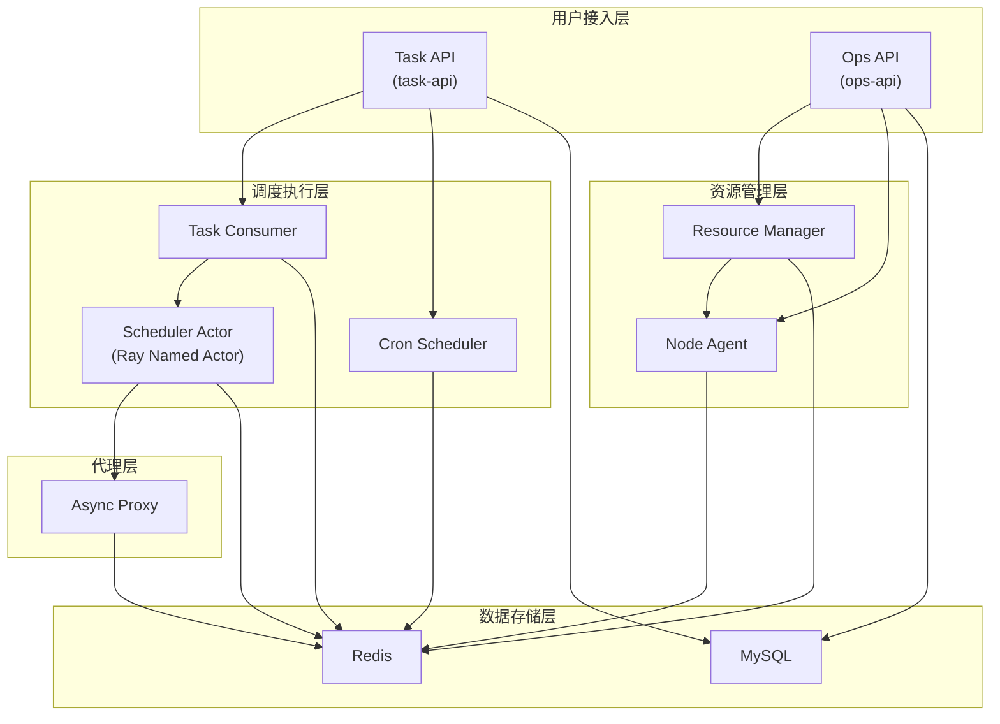

# 项目概述

```cite
- [README.md](README.md)
- [setup.py](setup.py)
- [requirements.txt](requirements.txt)
- [src/main.py](src/main.py)
- [src/main_task_api.py](src/main_task_api.py)
- [config/settings.py](config/settings.py)
- [src/platform/dag_engine.py](src/platform/dag_engine.py)
- [src/platform/task_consumer.py](src/platform/task_consumer.py)
- [src/platform/cron_scheduler.py](src/platform/cron_scheduler.py)
- [src/platform/queue_manager.py](src/platform/queue_manager.py)
- [src/platform/resource_manager.py](src/platform/resource_manager.py)
- [src/platform/quota_enforcer.py](src/platform/quota_enforcer.py)
- [src/agent/server.py](src/agent/server.py)
- [src/proxy/async_service_proxy.py](src/proxy/async_service_proxy.py)
- [src/workload/scheduler_actor.py](src/workload/scheduler_actor.py)
- [src/platform/task_executor.py](src/platform/task_executor.py)
- [src/platform/task_reconciler.py](src/platform/task_reconciler.py)
- [src/cli/main.py](src/cli/main.py)
```

## 引言

Ray AMU（Asynchronous Management Unit）是一个基于 Ray 的 AI 异步调度框架，旨在提供企业级的分布式任务编排和执行能力。该框架通过解耦任务提交与执行，支持复杂的 DAG 工作流编排，并提供多租户隔离、潮汐资源管理和长耗时服务代理等核心能力，适用于大规模 AI 计算任务的自动化调度与管理场景。

## 项目介绍

Ray AMU 构建在 Ray 分布式计算框架之上，结合 FastAPI、Redis 和 MySQL 等技术栈，提供了一个完整的异步任务调度解决方案。框架的核心价值体现在以下几个方面：

- **分布式任务编排**：支持复杂的 DAG（有向无环图）工作流定义，能够处理包含条件分支、并行执行、Map-Reduce 等多种模式的任务编排需求。DAG 引擎按拓扑序调度步骤，并通过 `asyncio.gather()` 实现并行扇出，支持 SYNC、ASYNC、FLASK_WRAPPED 三种执行模式以适应不同场景。

- **多租户隔离**：通过租户配额管理实现资源隔离，支持对并发任务数、GPU 数量、Actor 数量等多维度的配额控制。配额执行器使用 Redis Lua 脚本保证原子性，避免并发竞争导致的资源超限。

- **潮汐资源管理**：针对云环境的弹性资源特性，框架提供潮汐容错机制。节点代理支持动态加入和退出集群，资源管理器基于队列利用率和积压深度自动决策扩缩容，并通过心跳超时检测、租约清理、资源重算等维护链路保障系统稳定性。

- **长耗时服务代理**：针对算法团队 Flask 服务等长耗时场景，提供异步服务代理作为 Sidecar。代理接收任务提交后通过 Redis Pub/Sub 机制异步通知结果，避免网关超时问题，同时保持后端服务代码无需改动。

## 核心模块概览

Ray AMU 采用分层模块化架构，主要包含以下核心功能模块：

- **DAG 编排引擎**（`dag_engine.py`）：负责解析 DAG 定义并按拓扑序调度各步骤执行。支持条件表达式求值、MAP scatter-gather 模式、步骤级容错（重试、fallback、on_failure）以及增量持久化（每完成一步立即保存上下文）。

- **任务执行引擎**（`task_executor.py`）：提供任务执行的服务层逻辑，包括获取分布式执行锁、后台锁续约、驱动 DAG 引擎执行、检测取消信号和锁丢失事件，以及触发完成回调。

- **调度代理**（`scheduler_actor.py`）：作为 Ray Detached Named Actor 运行，是集群内任务调度的入口。管理多个 capability 对应的 ActorPool，支持同步执行和异步提交两种调度模式，并提供版本化命名方案支持灰度发布。

- **队列管理器**（`queue_manager.py`）：基于 Redis 的分布式任务队列，提供优先级调度、时间门控出队、三态熔断器（CLOSED → OPEN → HALF_OPEN → CLOSED）、反压控制和 Stale 清理等功能。使用 Lua 脚本保证原子性。

- **资源管理器**（`resource_manager.py`）：负责节点级资源分配（选择 → 预留 → 邀请 → 确认）和自动伸缩决策。维护编排链路包括心跳超时检测、租约清理、集群资源重算和能力健康联动。

- **Cron 调度器**（`cron_scheduler.py`）：后台循环调度器，周期性检查调度表并创建到期任务。通过 Redis 分布式锁实现 Leader 选举，使用幂等键防止同一触发窗口重复创建任务。

- **配额执行器**（`quota_enforcer.py`）：在任务提交、GPU 分配、Actor 创建前检查租户配额。通过 Redis Hash 跟踪租户实时用量，使用 Lua 脚本实现原子 check + increment 和 decrement + 钳制操作。

- **异步代理**（`async_service_proxy.py`）：长耗时服务的标准 Sidecar，解决网关超时问题。代理接收任务提交后转发到后端 Flask 服务，通过 Redis Pub/Sub 异步通知结果。

- **节点代理**（`server.py`）：运行在集群机器上的轻量 HTTP 服务，负责资源探测、心跳更新、接收邀请/释放/排空请求，以及执行 Ray 集群的加入和退出操作。通过所有权协议实现 agent 实例独占节点。

- **任务消费者**（`task_consumer.py`）：后台队列消费者，轮询 Redis 队列并触发任务执行。实现公平调度（round-robin）、并发控制（Semaphore + 显式计数器）和陈旧任务修复（reconcile running 集合）。

- **任务对账器**（`task_reconciler.py`）：实现三阶段一致性修复循环，包括 Redis-MySQL 双写对账、Stuck 任务恢复和丢失回调恢复，保障分布式环境下的最终一致性。

## 技术栈

Ray AMU 项目使用以下主要技术栈：

- **Ray**（版本 ≥ 2.54）：分布式计算框架，提供 Actor 模型、远程调用、集群管理等功能，是整个系统的执行基础。

- **FastAPI**（版本 ≥ 0.109）：高性能 Web 框架，用于构建 ops-api 和 task-api 两个核心服务，提供异步请求处理和自动 API 文档生成。

- **Redis**（版本 ≥ 5.0）：分布式缓存和消息队列，用于任务队列存储、分布式锁、Pub/Sub 通信、熔断器状态管理等核心功能。

- **MySQL**：持久化存储，通过 SQLAlchemy ORM 访问，存储任务记录、调度配置、租户信息等结构化数据。

- **Pydantic**（版本 ≥ 2.6）：数据验证和序列化框架，用于定义请求/响应模型和配置对象，提供类型安全和运行时验证。

- **SQLAlchemy**（版本 ≥ 2.0）：Python SQL 工具包和 ORM，提供数据库抽象层，支持异步操作和连接池管理。

- **Click**（版本 ≥ 8.1）：命令行界面构建库，用于开发 kubectl 风格的 CLI 工具，提供集群、能力、节点、任务、调度等管理命令。

- **croniter**（版本 ≥ 2.0）：Cron 表达式解析库，用于 Cron 调度器的周期性任务触发。

- **PyYAML**（版本 ≥ 6.0）：YAML 配置文件解析，用于 DAG 定义、服务配置等。

- **httpx**（版本 ≥ 0.26）：异步 HTTP 客户端，用于 FLASK_WRAPPED 步骤执行和外部服务调用。

## 架构概览

Ray AMU 采用微服务架构，由四个核心服务组成，各司其职又紧密协作：



**图表来源**
- [src/main.py](src/main.py#l1-l100)
- [src/main_task_api.py](src/main_task_api.py#l1-l100)
- [src/platform/task_consumer.py](src/platform/task_consumer.py#l1-l100)
- [src/platform/cron_scheduler.py](src/platform/cron_scheduler.py#l1-l80)
- [src/workload/scheduler_actor.py](src/workload/scheduler_actor.py#l1-l80)
- [src/platform/resource_manager.py](src/platform/resource_manager.py#l1-l80)
- [src/agent/server.py](src/agent/server.py#l1-l80)
- [src/proxy/async_service_proxy.py](src/proxy/async_service_proxy.py#l1-l80)

### 四个核心服务的职责与协作关系

**ops-api（运维 API 服务）**

ops-api 是完整的运维管理 API 服务，入口文件为 `src/main.py`。该服务提供任务管理、节点管理、集群管理、能力管理、调度管理、租户管理等全面的运维接口，并管理多个后台守护服务的生命周期，包括回调重试、资源治理、对账补偿等。每个后台服务通过独立的领导者租约（LeaderLease）实现分布式互斥，确保多实例部署时每个守护任务仅在一个实例上运行。ops-api 还提供健康检查端点（livez/readyz），报告各子系统状态。

**task-api（任务 API 服务）**

task-api 是轻量级的任务接入服务，入口文件为 `src/main_task_api.py`。该服务挂载面向用户的任务路由（`/api/v1/tasks`），不加载内部运维路由。task-api 承载任务执行侧的后台循环，包括 TaskConsumer（任务消费者）和 CronScheduler（Cron 调度器）。与 ops-api 的区别在于：task-api 不承载回调重试、资源治理、对账补偿等运维守护循环，也不暴露 `/ops/v1/*` 运维接口，路由更精简，仅暴露任务相关接口，适合独立部署为面向用户的任务接入和调度执行入口。

**agent-server（节点代理服务）**

agent-server 是运行在集群机器上的轻量 HTTP 服务，入口文件为 `src/agent/server.py`。该服务在启动时探测本机资源（CPU/GPU/内存）并注册到 Redis，定时发送心跳更新资源信息。节点代理接收来自资源管理器的邀请请求，执行 `ray start --address=<head>` 加入集群，也接收释放和排空请求，执行 `ray stop` 退出集群。通过所有权协议实现 agent 实例独占节点，心跳线程定期续约所有权租约，续约失败时尝试重新获取，三次失败后放弃并停止心跳。节点状态流转为 IDLE → JOINING → JOINED → DRAINING → IDLE，每个 API 操作前校验当前状态是否允许转换。

**async-proxy（异步代理服务）**

async-proxy 是长耗时服务的标准 Sidecar，入口文件为 `src/proxy/async_service_proxy.py`。该服务解决算法团队 Flask 服务（如视频生成）处理时间 30s+ 但网关超时 5-10s 的问题。代理部署在算法 Flask 服务同一台机器上，作为 sidecar 运行：Worker（Ray Actor）向代理提交任务，代理转发到后端 Flask 服务（通过 localhost 无网关超时限制），然后通过 Redis Pub/Sub 机制异步通知结果。算法 Flask 服务代码完全不需要改动。代理支持三层优先级配置（环境变量 > YAML 配置文件 > 代码默认值），可配置后端 URL、转发超时、Redis 连接、结果 TTL、并发转发线程数和代理监听端口等参数。

### 服务间的协作关系

四个核心服务通过 Redis 和 MySQL 实现松耦合协作：

- **任务提交流程**：用户通过 task-api 的 `/api/v1/tasks` 接口提交任务，TaskRouter 解析分发模式（DAG 编排或 RayData 直连），选择最优集群，通过幂等键保证幂等性，持久化到 Redis 和 MySQL，然后入队或提交 RayData。

- **任务调度流程**：TaskConsumer 后台循环轮询 Redis 队列，使用 round-robin 公平调度各 capability 队列，出队到时间的任务并触发执行。执行时获取分布式执行锁，后台协程定期续约锁，加载 DAG 并驱动 DAG 引擎执行。

- **Cron 调度流程**：CronScheduler 后台循环每分钟检查调度表，通过 Redis 分布式锁实现 Leader 选举，只有持锁实例执行调度。使用幂等键防止同一触发窗口重复创建任务。

- **资源管理流程**：ResourceManager 基于队列利用率和积压深度评估扩缩容，使用 Lua 脚本原子检查冷却期并记录决策时间戳。节点级资源分配通过多阶段流程（选择 → 预留 → 邀请 → 确认），通过 NodeRegistry 的 Lua CAS 保证预留原子性，通过 AgentClient 与节点 Agent 通信。

- **节点管理流程**：NodeAgent 定时发送心跳更新资源信息，接收邀请请求执行 `ray start` 加入集群，接收释放/排空请求执行 `ray stop` 退出集群。通过所有权协议实现 agent 实例独占节点。

- **异步代理流程**：AsyncProxy 接收 Worker 提交的任务，转发到后端 Flask 服务，通过 Redis Pub/Sub 异步通知结果，避免网关超时问题。

- **数据一致性保障**：TaskReconciler 实现三阶段一致性修复循环，包括 Redis-MySQL 双写对账、Stuck 任务恢复和丢失回调恢复，保障分布式环境下的最终一致性。

整个架构通过 Redis 作为中央协调枢纽，实现任务队列、分布式锁、Pub/Sub 通信、熔断器状态管理、心跳维护等核心功能，MySQL 提供持久化存储，Ray 提供分布式执行能力，FastAPI 提供 HTTP API 接口，Click 提供 CLI 管理工具，共同构成一个完整的异步任务调度系统。